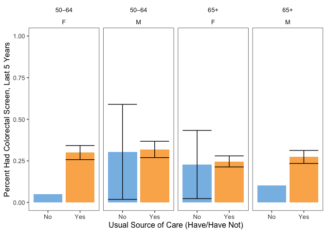
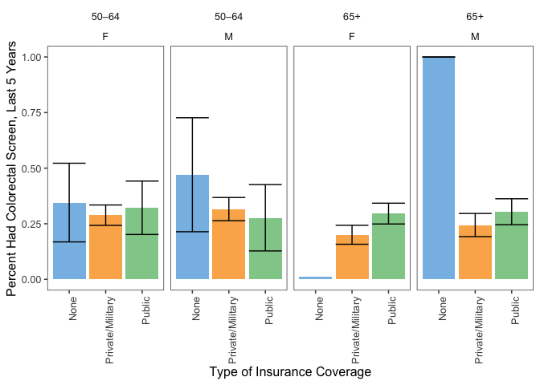
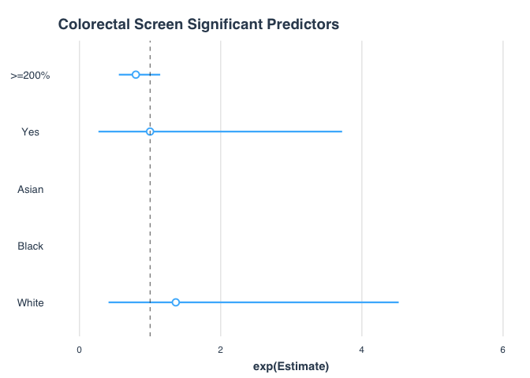

Colorectal Screening
================
Justin Hsie
11/25/2019

``` r
library(tidyverse)
library(survey)
library(car)
library(jtools)
library(ggthemes)
```

Data Import

``` r
cancer = read_csv("./data/cancerxx.csv") %>% 
  janitor::clean_names() %>% 
  select(hhx, fmx, fpx, wtfa_sa, strat_p, psu_p, region, hfobhad1, 
         rhfo2_mt, rhfo2yr, rhfo2n, rhfo2t, rhfo2, rhfob3a,
         rhfob3b, hfobrea2, fobhad1, rfob2_mt, rfob2yr,
         rfob2n, rfob2t, rofob3a, rofob3b, rfobres1)

adult = read_csv("./data/samadult.csv") %>%
  janitor::clean_names() %>% 
  select(hhx, fmx, fpx, ausualpl, ahcplrou, ahcplknd, fla1ar)

family = read_csv("./data/familyxx.csv") %>%
  janitor::clean_names() %>% 
  select(hhx, fmx, rat_cat4, rat_cat5)

person = read_csv("./data/personsx.csv") %>%
  janitor::clean_names() %>% 
  select(hhx, fmx, fpx, age_p, educ1, sex, notcov, cover65, cover65o, 
         la1ar, lcondrt, lachronr, hiscodi3, racreci3, cover, yrsinus, plborn)

col_dat = cancer %>%
  left_join(adult, by = c("hhx", "fmx", "fpx")) %>%
  left_join(person, by = c("hhx", "fmx", "fpx")) %>%
  left_join(family, by = c("hhx", "fmx"))
```

Data Manipulation

``` r
#home stool test within last year
col_dat = col_dat %>%
  mutate(col_2 = if_else(rhfob3a <= 1, 1, 0),
         imm_stat = case_when(yrsinus < 4 ~ "In U.S. < 10 yrs",
                              yrsinus == 4 | yrsinus == 5 ~ "In U.S. >= 10 yrs",
                              plborn == 1 ~ "Born in U.S."))

# create the age category
col_dat = col_dat %>% 
  mutate(age_cat = case_when(age_p >= 25 & age_p < 40 ~ "25–39",
                             age_p >= 40 & age_p < 50 ~ "40–49",
                             age_p >= 50 & age_p < 65 ~ "50–64",
                             age_p >= 65 ~ "65+"))
# create educ category
col_dat = col_dat %>% 
  mutate(educ_cat = case_when(educ1 < 13 ~ "Less than high school",
                              educ1 >= 13 & educ1 < 15 ~ "High school",
                              educ1 >= 15 & educ1 < 18 ~ "Some college",
                              educ1 >= 18 & educ1 <= 21 ~ "College graduate"))

# create financial category
col_dat = col_dat %>% 
  mutate(finc_cat = case_when(rat_cat5 <= 7 |  rat_cat5 %in% c(15, 16) ~ "<200%",
                              rat_cat5 %in% c(8, 9) ~ "200–299%", 
                              rat_cat5 %in% c(10, 11) ~ "300–399%",
                              rat_cat5 >= 18 & educ1 <= 21 ~ "400–499%",
                              rat_cat5 == 14  ~">=500%",
                              rat_cat5 == 17  ~">=200%, no further detail",
                              rat_cat5 %in% c(96, 99) ~ "Unknown"))

# create as usual category
col_dat = col_dat %>% 
  mutate(ausualpl_cat  = case_when(ausualpl == 2 ~ "No",
                                   ausualpl %in% c(1, 3) ~ "Yes",
                                   ausualpl %in% c(7, 8, 9) ~ "Other"))
# coverage status
col_dat = col_dat %>% 
  mutate(cover_cat  = case_when(notcov == 1 | cover == 4 | cover65 == 6 ~ "None",
                                cover == 2 | cover65 %in% 2:4 ~ "Public",
                                cover %in% c(1, 3) | cover65 %in% c(1, 5) ~
                                  "Private/Military"))

# disability
col_dat = col_dat %>% 
  mutate(lcond_chronic_cat = if_else(lcondrt == 1, "Yes", "No"))

# race
col_dat = col_dat %>% 
  mutate(race_cat = case_when(racreci3 == 1 ~ "White",
                              racreci3 == 2 ~ "Black",
                              racreci3 == 3 ~ "Asian",
                              racreci3 == 4 ~ "AN/AI"),
         eth_cat = case_when(hiscodi3 == 1 ~ "Hispanic",
                             hiscodi3 == 2 ~ "Non-Hispanic White",
                             hiscodi3 == 3 ~ "Non-Hispanic Black",
                             hiscodi3 == 4 ~ "Non-Hispanic Asian",
                             hiscodi3 == 5 ~ "Non-Hispanic AN/AI"))
```

Survey Design

``` r
col_dat = col_dat %>%
  mutate(domain = if_else(age_p >= 50, 1, 0))

des = svydesign(ids = ~ psu_p, strata = ~ strat_p, 
                weights = ~ wtfa_sa, nest = TRUE, data = col_dat)
```

Tables

``` r
#age percentage
age_pct = svyby(~col_2, by = ~domain + age_cat + sex, svymean, na.rm = TRUE, 
                design = des, vartype = c("ci", "se"))
age_pct %>% 
  filter(domain == 1) %>% select(-domain) %>% knitr::kable()
```

| age\_cat | sex |    col\_2 |        se |     ci\_l |     ci\_u |
| :------- | --: | --------: | --------: | --------: | --------: |
| 50–64    |   1 | 0.3182779 | 0.0248734 | 0.2695269 | 0.3670290 |
| 65+      |   1 | 0.2715899 | 0.0197757 | 0.2328304 | 0.3103495 |
| 50–64    |   2 | 0.2927010 | 0.0210953 | 0.2513550 | 0.3340471 |
| 65+      |   2 | 0.2462065 | 0.0166088 | 0.2136538 | 0.2787591 |

``` r
#education
edu_pct = svyby(~col_2, by = ~domain + educ_cat + sex, svymean, na.rm = TRUE, 
                design = des, vartype = c("se", "ci")) %>% 
  filter(domain == 1) %>%
  select(-domain, -se)

edu_counts = filter(col_dat, domain == 1) %>%
  group_by(educ_cat) %>%
  summarise(count = n())

edu_pct = left_join(edu_pct, edu_counts, by = "educ_cat")

edu_pct %>% 
  knitr::kable()
```

| educ\_cat             | sex |    col\_2 |     ci\_l |     ci\_u | count |
| :-------------------- | --: | --------: | --------: | --------: | ----: |
| College graduate      |   1 | 0.2646712 | 0.2158128 | 0.3135295 |  4731 |
| High school           |   1 | 0.3473484 | 0.2861773 | 0.4085194 |  4642 |
| Less than high school |   1 | 0.3398048 | 0.2468565 | 0.4327530 |  2646 |
| Some college          |   1 | 0.2698518 | 0.2130050 | 0.3266987 |  4939 |
| College graduate      |   2 | 0.2717708 | 0.2304056 | 0.3131360 |  4731 |
| High school           |   2 | 0.2587746 | 0.2138664 | 0.3036828 |  4642 |
| Less than high school |   2 | 0.2898417 | 0.2189860 | 0.3606974 |  2646 |
| Some college          |   2 | 0.2619221 | 0.2111843 | 0.3126600 |  4939 |

``` r
#finc
finc_pct = svyby(~col_2, by = ~domain + finc_cat + sex, svymean, na.rm = TRUE, 
                 design = des, vartype = c("se", "ci")) %>% 
  filter(domain == 1) %>%
  select(-domain, -se)

finc_counts = filter(col_dat, domain == 1) %>%
  group_by(finc_cat) %>%
  summarise(count = n())

finc_pct = left_join(finc_pct, finc_counts, by = "finc_cat")

finc_pct %>% knitr::kable()
```

| finc\_cat                  | sex |    col\_2 |       ci\_l |     ci\_u | count |
| :------------------------- | --: | --------: | ----------: | --------: | ----: |
| \<200%                     |   1 | 0.3480108 |   0.2811567 | 0.4148649 |  5431 |
| \>=200%, no further detail |   1 | 0.1751793 |   0.0303663 | 0.3199924 |   564 |
| \>=500%                    |   1 | 0.3106846 |   0.2531369 | 0.3682323 |  3717 |
| 200–299%                   |   1 | 0.2632839 |   0.1876997 | 0.3388681 |  2205 |
| 300–399%                   |   1 | 0.2051748 |   0.1239285 | 0.2864211 |  1667 |
| 400–499%                   |   1 | 0.3006899 |   0.2126085 | 0.3887713 |  2174 |
| Unknown                    |   1 | 0.0000000 |   0.0000000 | 0.0000000 |    35 |
| \<200%                     |   2 | 0.2921319 |   0.2462205 | 0.3380433 |  5431 |
| \>=200%, no further detail |   2 | 0.2690137 |   0.1551583 | 0.3828692 |   564 |
| \>=500%                    |   2 | 0.2611537 |   0.2048462 | 0.3174613 |  3717 |
| 200–299%                   |   2 | 0.2299942 |   0.1668537 | 0.2931348 |  2205 |
| 300–399%                   |   2 | 0.2035678 |   0.1276874 | 0.2794481 |  1667 |
| 400–499%                   |   2 | 0.2780802 |   0.2100563 | 0.3461041 |  2174 |
| Unknown                    |   2 | 0.3159234 | \-0.1659777 | 0.7978245 |    35 |

``` r
#usual care
ausualp_pct = svyby(~col_2, by = ~domain + ausualpl_cat + sex, svymean, 
                    na.rm = TRUE, design = des, vartype = c("se", "ci")) %>% 
  filter(domain == 1) %>%
  select(-domain, -se)

usual_counts = filter(col_dat, domain == 1) %>%
  group_by(ausualpl_cat) %>%
  summarise(count = n())
ausualp_pct = left_join(ausualp_pct, usual_counts, by = "ausualpl_cat")

ausualp_pct %>% knitr::kable()
```

| ausualpl\_cat | sex |    col\_2 |     ci\_l |     ci\_u | count |
| :------------ | --: | --------: | --------: | --------: | ----: |
| No            |   1 | 0.2384056 | 0.0304807 | 0.4463304 |  1092 |
| Other         |   1 | 0.0000000 | 0.0000000 | 0.0000000 |   131 |
| Yes           |   1 | 0.2941177 | 0.2629030 | 0.3253323 | 15833 |
| No            |   2 | 0.1469170 | 0.0221549 | 0.2716791 |  1092 |
| Other         |   2 | 0.0000000 | 0.0000000 | 0.0000000 |   131 |
| Yes           |   2 | 0.2692905 | 0.2421668 | 0.2964142 | 15833 |

``` r
#health coverage
cover_pct = svyby(~col_2, by = ~domain + cover_cat + sex, svymean, na.rm = TRUE, 
                  design = des, vartype = c("se", "ci")) %>% 
  filter(domain == 1) %>%
  select(-domain, -se)

cover_counts = filter(col_dat, domain == 1) %>%
  group_by(cover_cat) %>%
  summarise(count = n())
cover_pct = left_join(cover_pct, cover_counts, by = "cover_cat")

cover_pct %>% knitr::kable()
```

| cover\_cat       | sex |    col\_2 |     ci\_l |     ci\_u | count |
| :--------------- | --: | --------: | --------: | --------: | ----: |
| None             |   1 | 0.4863323 | 0.2370963 | 0.7355683 |   867 |
| Private/Military |   1 | 0.2851092 | 0.2482065 | 0.3220120 | 10914 |
| Public           |   1 | 0.3004717 | 0.2457112 | 0.3552321 |  5214 |
| None             |   2 | 0.3082222 | 0.1461641 | 0.4702803 |   867 |
| Private/Military |   2 | 0.2498385 | 0.2171444 | 0.2825326 | 10914 |
| Public           |   2 | 0.2989520 | 0.2545209 | 0.3433830 |  5214 |

``` r
#chronic conditions
lcond_chronic_pct = svyby(~col_2, by = ~domain + lcond_chronic_cat + sex, svymean, 
                          na.rm = TRUE, design = des, vartype = c("se", "ci")) %>% 
  filter(domain == 1) %>%
  select(-domain, -se)

chronic_counts = filter(col_dat, domain == 1) %>%
  group_by(lcond_chronic_cat) %>%
  summarise(count = n())

lcond_chronic_pct = left_join(lcond_chronic_pct, chronic_counts, by = "lcond_chronic_cat")

lcond_chronic_pct %>% knitr::kable()
```

| lcond\_chronic\_cat | sex |    col\_2 |       ci\_l |     ci\_u | count |
| :------------------ | --: | --------: | ----------: | --------: | ----: |
| No                  |   1 | 0.4367342 |   0.0335440 | 0.8399244 |   102 |
| Yes                 |   1 | 0.2559718 |   0.2032853 | 0.3086583 |  4991 |
| No                  |   2 | 0.2043795 | \-0.0355753 | 0.4443342 |   102 |
| Yes                 |   2 | 0.2518561 |   0.2122892 | 0.2914231 |  4991 |

``` r
#race
race_pct = svyby(~col_2, by = ~domain + race_cat + sex, svymean, na.rm = TRUE, 
                 design = des, vartype = c("se", "ci")) %>% 
  filter(domain == 1) %>%
  select(-domain, -se)


race_counts = filter(col_dat, domain == 1) %>%
  group_by(race_cat) %>%
  summarise(count = n())
race_pct = left_join(race_pct, race_counts, by = "race_cat")

race_pct %>% knitr::kable()
```

| race\_cat | sex |    col\_2 |     ci\_l |     ci\_u | count |
| :-------- | --: | --------: | --------: | --------: | ----: |
| AN/AI     |   1 | 0.3084385 | 0.0822501 | 0.5346269 |   240 |
| Asian     |   1 | 0.4688890 | 0.3249195 | 0.6128585 |   795 |
| Black     |   1 | 0.4122389 | 0.3186199 | 0.5058579 |  2373 |
| White     |   1 | 0.2723752 | 0.2391214 | 0.3056290 | 13648 |
| AN/AI     |   2 | 0.1762195 | 0.0129636 | 0.3394755 |   240 |
| Asian     |   2 | 0.5031264 | 0.3468495 | 0.6594034 |   795 |
| Black     |   2 | 0.2904902 | 0.2176051 | 0.3633752 |  2373 |
| White     |   2 | 0.2552059 | 0.2265069 | 0.2839049 | 13648 |

``` r
#ethnicity
eth_pct = svyby(~col_2, by = ~domain + eth_cat + sex, svymean, na.rm = TRUE,
                design = des, vartype = c("se", "ci")) %>% 
  filter(domain == 1) %>%
  select(-domain, -se)


eth_counts = filter(col_dat, domain == 1) %>%
  group_by(eth_cat) %>%
  summarise(count = n())
eth_pct = left_join(eth_pct, eth_counts, by = "eth_cat")

eth_pct %>% knitr::kable()
```

| eth\_cat           | sex |    col\_2 |       ci\_l |     ci\_u | count |
| :----------------- | --: | --------: | ----------: | --------: | ----: |
| Hispanic           |   1 | 0.3579940 |   0.2569288 | 0.4590593 |  1882 |
| Non-Hispanic AN/AI |   1 | 0.2545663 |   0.0110485 | 0.4980841 |   179 |
| Non-Hispanic Asian |   1 | 0.5010986 |   0.3463966 | 0.6558006 |   762 |
| Non-Hispanic Black |   1 | 0.4148067 |   0.3207858 | 0.5088275 |  2307 |
| Non-Hispanic White |   1 | 0.2643000 |   0.2299197 | 0.2986804 | 11926 |
| Hispanic           |   2 | 0.3719601 |   0.2865942 | 0.4573260 |  1882 |
| Non-Hispanic AN/AI |   2 | 0.1556916 | \-0.0155723 | 0.3269555 |   179 |
| Non-Hispanic Asian |   2 | 0.5048098 |   0.3476417 | 0.6619779 |   762 |
| Non-Hispanic Black |   2 | 0.3022233 |   0.2277217 | 0.3767249 |  2307 |
| Non-Hispanic White |   2 | 0.2437031 |   0.2138307 | 0.2735754 | 11926 |

``` r
#immigration
imm_pct = svyby(~col_2, by = ~domain + imm_stat + sex, svymean, na.rm = TRUE,
                design = des, vartype = c("se", "ci")) %>%
  filter(domain == 1) %>%
  select(-domain, -se)

imm_counts = filter(col_dat, domain == 1) %>%
  group_by(imm_stat) %>%
  summarise(count = n())
imm_pct = left_join(imm_pct, imm_counts, by = "imm_stat")

imm_pct %>% knitr::kable()
```

| imm\_stat          | sex |    col\_2 |     ci\_l |     ci\_u | count |
| :----------------- | --: | --------: | --------: | --------: | ----: |
| Born in U.S.       |   1 | 0.2795109 | 0.2464442 | 0.3125776 | 14502 |
| In U.S. \< 10 yrs  |   1 | 0.8987319 | 0.7277576 | 1.0697062 |   153 |
| In U.S. \>= 10 yrs |   1 | 0.3794907 | 0.2917025 | 0.4672788 |  2366 |
| Born in U.S.       |   2 | 0.2455390 | 0.2184926 | 0.2725854 | 14502 |
| In U.S. \< 10 yrs  |   2 | 0.7624908 | 0.4719310 | 1.0530506 |   153 |
| In U.S. \>= 10 yrs |   2 | 0.4286314 | 0.3449775 | 0.5122853 |  2366 |

Tables by Age

``` r
#education
edu_pct_strat = svyby(~col_2, by = ~domain + age_cat + educ_cat + sex, svymean, 
                      na.rm = TRUE, design = des, vartype = c("se", "ci"))
edu_tab = edu_pct_strat %>% 
  filter(domain == 1) %>% 
  select(-domain, -se)

edu_counts2 = filter(col_dat, domain == 1) %>%
  group_by(age_cat, educ_cat) %>%
  summarise(count = n())
edu_tab = left_join(edu_tab, edu_counts2, by = c("age_cat", "educ_cat"))

edu_tab %>% knitr::kable()
```

| age\_cat | educ\_cat             | sex |    col\_2 |     ci\_l |     ci\_u | count |
| :------- | :-------------------- | --: | --------: | --------: | --------: | ----: |
| 50–64    | College graduate      |   1 | 0.3093551 | 0.2338067 | 0.3849035 |  2601 |
| 65+      | College graduate      |   1 | 0.2216779 | 0.1614394 | 0.2819164 |  2130 |
| 50–64    | High school           |   1 | 0.3797591 | 0.2796969 | 0.4798212 |  2243 |
| 65+      | High school           |   1 | 0.3214531 | 0.2455225 | 0.3973838 |  2399 |
| 50–64    | Less than high school |   1 | 0.3099232 | 0.1377101 | 0.4821362 |  1085 |
| 65+      | Less than high school |   1 | 0.3579265 | 0.2640090 | 0.4518440 |  1561 |
| 50–64    | Some college          |   1 | 0.2872257 | 0.2024365 | 0.3720150 |  2715 |
| 65+      | Some college          |   1 | 0.2549195 | 0.1841993 | 0.3256398 |  2224 |
| 50–64    | College graduate      |   2 | 0.2926289 | 0.2216702 | 0.3635877 |  2601 |
| 65+      | College graduate      |   2 | 0.2526323 | 0.1984237 | 0.3068409 |  2130 |
| 50–64    | High school           |   2 | 0.2865447 | 0.2071094 | 0.3659801 |  2243 |
| 65+      | High school           |   2 | 0.2428318 | 0.1893470 | 0.2963167 |  2399 |
| 50–64    | Less than high school |   2 | 0.3687561 | 0.2424295 | 0.4950827 |  1085 |
| 65+      | Less than high school |   2 | 0.2503043 | 0.1616479 | 0.3389608 |  1561 |
| 50–64    | Some college          |   2 | 0.2780920 | 0.2052010 | 0.3509830 |  2715 |
| 65+      | Some college          |   2 | 0.2479558 | 0.1830437 | 0.3128680 |  2224 |

``` r
#finc
finc_pct_strat = svyby(~col_2, by = ~domain + age_cat + finc_cat + sex, svymean, 
                       na.rm = TRUE, design = des, vartype = c("se", "ci"))

finc_tab = finc_pct_strat %>% 
  filter(domain == 1) %>% 
  select(-domain, -se) 

finc_counts2 = filter(col_dat, domain == 1) %>%
  group_by(age_cat, finc_cat) %>%
  summarise(count = n())
finc_tab = left_join(finc_tab, finc_counts2, by = c("age_cat", "finc_cat"))

finc_tab %>% knitr::kable()
```

| age\_cat | finc\_cat                  | sex |    col\_2 |       ci\_l |     ci\_u | count |
| :------- | :------------------------- | --: | --------: | ----------: | --------: | ----: |
| 50–64    | \<200%                     |   1 | 0.3210603 |   0.2222157 | 0.4199050 |  2651 |
| 65+      | \<200%                     |   1 | 0.3767658 |   0.2945001 | 0.4590315 |  2780 |
| 50–64    | \>=200%, no further detail |   1 | 0.2949177 | \-0.1041417 | 0.6939772 |   204 |
| 65+      | \>=200%, no further detail |   1 | 0.1486000 | \-0.0116239 | 0.3088238 |   360 |
| 50–64    | \>=500%                    |   1 | 0.3376123 |   0.2560278 | 0.4191969 |  2351 |
| 65+      | \>=500%                    |   1 | 0.2813087 |   0.2040022 | 0.3586152 |  1366 |
| 50–64    | 200–299%                   |   1 | 0.3038759 |   0.1551097 | 0.4526422 |   973 |
| 65+      | 200–299%                   |   1 | 0.2388720 |   0.1577152 | 0.3200288 |  1232 |
| 50–64    | 300–399%                   |   1 | 0.2508046 |   0.0989256 | 0.4026835 |   845 |
| 65+      | 300–399%                   |   1 | 0.1735762 |   0.0846764 | 0.2624760 |   822 |
| 50–64    | 400–499%                   |   1 | 0.3159067 |   0.1613380 | 0.4704753 |   932 |
| 65+      | 400–499%                   |   1 | 0.2917527 |   0.1876179 | 0.3958875 |  1242 |
| 50–64    | Unknown                    |   1 | 0.0000000 |   0.0000000 | 0.0000000 |    12 |
| 65+      | Unknown                    |   1 | 0.0000000 |   0.0000000 | 0.0000000 |    23 |
| 50–64    | \<200%                     |   2 | 0.3354345 |   0.2603098 | 0.4105593 |  2651 |
| 65+      | \<200%                     |   2 | 0.2617112 |   0.2037533 | 0.3196692 |  2780 |
| 50–64    | \>=200%, no further detail |   2 | 0.2019780 |   0.0248399 | 0.3791161 |   204 |
| 65+      | \>=200%, no further detail |   2 | 0.2895555 |   0.1519002 | 0.4272108 |   360 |
| 50–64    | \>=500%                    |   2 | 0.2743470 |   0.1974360 | 0.3512581 |  2351 |
| 65+      | \>=500%                    |   2 | 0.2461315 |   0.1699097 | 0.3223532 |  1366 |
| 50–64    | 200–299%                   |   2 | 0.2607126 |   0.1492885 | 0.3721367 |   973 |
| 65+      | 200–299%                   |   2 | 0.2172024 |   0.1420154 | 0.2923893 |  1232 |
| 50–64    | 300–399%                   |   2 | 0.2722432 |   0.1460283 | 0.3984581 |   845 |
| 65+      | 300–399%                   |   2 | 0.1672526 |   0.0805817 | 0.2539235 |   822 |
| 50–64    | 400–499%                   |   2 | 0.2577215 |   0.1385026 | 0.3769405 |   932 |
| 65+      | 400–499%                   |   2 | 0.2935982 |   0.2102423 | 0.3769542 |  1242 |
| 50–64    | Unknown                    |   2 | 0.8538930 |   0.5195293 | 1.1882566 |    12 |
| 65+      | Unknown                    |   2 | 0.0000000 |   0.0000000 | 0.0000000 |    23 |

``` r
#usual care
ausualp_pct_strat = svyby(~col_2, by = ~domain + age_cat + ausualpl_cat + sex, 
                          svymean, na.rm = TRUE, 
                          design = des, vartype = c("se", "ci"))
usual_tab = ausualp_pct_strat %>% 
  filter(domain == 1) %>% 
  select(-domain, -se) 

usual_counts2 = filter(col_dat, domain == 1) %>%
  group_by(age_cat, ausualpl_cat) %>%
  summarise(count = n())
usual_tab = left_join(usual_tab, usual_counts2, by = c("age_cat", "ausualpl_cat"))

usual_tab %>% knitr::kable()
```

| age\_cat | ausualpl\_cat | sex |    col\_2 |       ci\_l |     ci\_u | count |
| :------- | :------------ | --: | --------: | ----------: | --------: | ----: |
| 50–64    | No            |   1 | 0.3041349 |   0.0185423 | 0.5897274 |   786 |
| 65+      | No            |   1 | 0.1033082 | \-0.0810291 | 0.2876456 |   306 |
| 50–64    | Other         |   1 | 0.0000000 |   0.0000000 | 0.0000000 |    71 |
| 65+      | Other         |   1 | 0.0000000 |   0.0000000 | 0.0000000 |    60 |
| 50–64    | Yes           |   1 | 0.3186976 |   0.2695722 | 0.3678230 |  7821 |
| 65+      | Yes           |   1 | 0.2736163 |   0.2345443 | 0.3126883 |  8012 |
| 50–64    | No            |   2 | 0.0503862 | \-0.0396119 | 0.1403843 |   786 |
| 65+      | No            |   2 | 0.2279831 |   0.0228558 | 0.4331105 |   306 |
| 50–64    | Other         |   2 | 0.0000000 |   0.0000000 | 0.0000000 |    71 |
| 65+      | Other         |   2 | 0.0000000 |   0.0000000 | 0.0000000 |    60 |
| 50–64    | Yes           |   2 | 0.2998242 |   0.2575565 | 0.3420918 |  7821 |
| 65+      | Yes           |   2 | 0.2466416 |   0.2135417 | 0.2797415 |  8012 |

``` r
#health coverage
cover_pct_strat = svyby(~col_2, by = ~domain + age_cat + cover_cat + sex, svymean, 
                        na.rm = TRUE, design = des, vartype = c("se", "ci"))
ins_tab = cover_pct_strat %>% 
  filter(domain == 1) %>% 
  select(-domain, -se)

ins_counts2 = filter(col_dat, domain == 1) %>%
  group_by(age_cat, cover_cat) %>%
  summarise(count = n())
ins_tab = left_join(ins_tab, ins_counts2, by = c("age_cat", "cover_cat"))

ins_tab %>% knitr::kable()
```

| age\_cat | cover\_cat       | sex |    col\_2 |       ci\_l |     ci\_u | count |
| :------- | :--------------- | --: | --------: | ----------: | --------: | ----: |
| 50–64    | None             |   1 | 0.4703798 |   0.2140706 | 0.7266891 |   814 |
| 65+      | None             |   1 | 1.0000000 |   1.0000000 | 1.0000000 |    53 |
| 50–64    | Private/Military |   1 | 0.3158562 |   0.2636540 | 0.3680583 |  6631 |
| 65+      | Private/Military |   1 | 0.2441347 |   0.1920119 | 0.2962575 |  4283 |
| 50–64    | Public           |   1 | 0.2768991 |   0.1277833 | 0.4260149 |  1191 |
| 65+      | Public           |   1 | 0.3039875 |   0.2456163 | 0.3623587 |  4023 |
| 50–64    | None             |   2 | 0.3452920 |   0.1683573 | 0.5222266 |   814 |
| 65+      | None             |   2 | 0.0124315 | \-0.0152290 | 0.0400920 |    53 |
| 50–64    | Private/Military |   2 | 0.2885654 |   0.2427625 | 0.3343682 |  6631 |
| 65+      | Private/Military |   2 | 0.2004231 |   0.1577835 | 0.2430628 |  4283 |
| 50–64    | Public           |   2 | 0.3218907 |   0.2017593 | 0.4420221 |  1191 |
| 65+      | Public           |   2 | 0.2957456 |   0.2489771 | 0.3425142 |  4023 |

``` r
#chronic conditions
lcond_chronic_pct_strat = svyby(~col_2, by = ~domain + age_cat + 
                                  lcond_chronic_cat + sex,
                                svymean, na.rm = TRUE, design = des,
                                vartype = c("se", "ci"))
dis_tab = lcond_chronic_pct_strat %>% 
  filter(domain == 1) %>% 
  select(-domain, -se) 

dis_counts2 = filter(col_dat, domain == 1) %>%
  group_by(age_cat, lcond_chronic_cat) %>%
  summarise(count = n())
dis_tab = left_join(dis_tab, dis_counts2, by = c("age_cat", "lcond_chronic_cat"))

dis_tab %>% knitr::kable()
```

| age\_cat | lcond\_chronic\_cat | sex |    col\_2 |       ci\_l |     ci\_u | count |
| :------- | :------------------ | --: | --------: | ----------: | --------: | ----: |
| 50–64    | No                  |   1 | 0.3523465 | \-0.1623829 | 0.8670759 |    41 |
| 65+      | No                  |   1 | 0.5348602 | \-0.0535866 | 1.1233069 |    61 |
| 50–64    | Yes                 |   1 | 0.2549203 |   0.1688474 | 0.3409932 |  2046 |
| 65+      | Yes                 |   1 | 0.2566963 |   0.1896963 | 0.3236962 |  2945 |
| 50–64    | No                  |   2 | 0.0000000 |   0.0000000 | 0.0000000 |    41 |
| 65+      | No                  |   2 | 0.4003621 | \-0.0513437 | 0.8520680 |    61 |
| 50–64    | Yes                 |   2 | 0.3302476 |   0.2651111 | 0.3953841 |  2046 |
| 65+      | Yes                 |   2 | 0.2056220 |   0.1558094 | 0.2554345 |  2945 |

``` r
#race
race_pct_strat = svyby(~col_2, by = ~domain + age_cat + race_cat + sex, svymean, 
                       na.rm = TRUE, design = des, vartype = c("se", "ci"))
race_tab = race_pct_strat %>% 
  filter(domain == 1) %>% 
  select(-domain, -se) 

race_counts2 = filter(col_dat, domain == 1) %>%
  group_by(age_cat, race_cat) %>%
  summarise(count = n())
race_tab = left_join(race_tab, race_counts2, by = c("age_cat", "race_cat"))

race_tab %>% knitr::kable()
```

| age\_cat | race\_cat | sex |    col\_2 |       ci\_l |     ci\_u | count |
| :------- | :-------- | --: | --------: | ----------: | --------: | ----: |
| 50–64    | AN/AI     |   1 | 0.4734951 |   0.1002313 | 0.8467589 |   152 |
| 65+      | AN/AI     |   1 | 0.1791832 | \-0.0379228 | 0.3962892 |    88 |
| 50–64    | Asian     |   1 | 0.6415898 |   0.4530406 | 0.8301390 |   442 |
| 65+      | Asian     |   1 | 0.2662080 |   0.1193454 | 0.4130706 |   353 |
| 50–64    | Black     |   1 | 0.4642932 |   0.3306169 | 0.5979696 |  1328 |
| 65+      | Black     |   1 | 0.3338563 |   0.2150908 | 0.4526217 |  1045 |
| 50–64    | White     |   1 | 0.2768226 |   0.2246735 | 0.3289716 |  6756 |
| 65+      | White     |   1 | 0.2688683 |   0.2265818 | 0.3111548 |  6892 |
| 50–64    | AN/AI     |   2 | 0.2350830 | \-0.0198519 | 0.4900180 |   152 |
| 65+      | AN/AI     |   2 | 0.1190422 | \-0.0538181 | 0.2919025 |    88 |
| 50–64    | Asian     |   2 | 0.6104813 |   0.3707700 | 0.8501927 |   442 |
| 65+      | Asian     |   2 | 0.3926798 |   0.2313451 | 0.5540146 |   353 |
| 50–64    | Black     |   2 | 0.2770197 |   0.1835546 | 0.3704849 |  1328 |
| 65+      | Black     |   2 | 0.3041289 |   0.1998962 | 0.4083617 |  1045 |
| 50–64    | White     |   2 | 0.2803230 |   0.2342900 | 0.3263560 |  6756 |
| 65+      | White     |   2 | 0.2374011 |   0.2022724 | 0.2725298 |  6892 |

``` r
#ethnicity
eth_pct_strat = svyby(~col_2, by = ~domain + age_cat + eth_cat + sex, svymean, 
                      na.rm = TRUE, design = des, vartype = c("se", "ci"))
eth_tab = eth_pct_strat %>% 
  filter(domain == 1) %>% 
  select(-domain, -se) 

eth_counts2 = filter(col_dat, domain == 1) %>%
  group_by(age_cat, eth_cat) %>%
  summarise(count = n())
eth_tab = left_join(eth_tab, eth_counts2, by = c("age_cat", "eth_cat"))

eth_tab %>% knitr::kable()
```

| age\_cat | eth\_cat           | sex |    col\_2 |       ci\_l |     ci\_u | count |
| :------- | :----------------- | --: | --------: | ----------: | --------: | ----: |
| 50–64    | Hispanic           |   1 | 0.3403261 |   0.1976905 | 0.4829617 |  1082 |
| 65+      | Hispanic           |   1 | 0.3751849 |   0.2497860 | 0.5005838 |   800 |
| 50–64    | Non-Hispanic AN/AI |   1 | 0.4774365 |   0.0629850 | 0.8918880 |   112 |
| 65+      | Non-Hispanic AN/AI |   1 | 0.1420174 | \-0.0733489 | 0.3573838 |    67 |
| 50–64    | Non-Hispanic Asian |   1 | 0.6864800 |   0.5007690 | 0.8721910 |   418 |
| 65+      | Non-Hispanic Asian |   1 | 0.2674510 |   0.1045093 | 0.4303928 |   344 |
| 50–64    | Non-Hispanic Black |   1 | 0.4691258 |   0.3344150 | 0.6038367 |  1285 |
| 65+      | Non-Hispanic Black |   1 | 0.3338563 |   0.2150908 | 0.4526217 |  1022 |
| 50–64    | Non-Hispanic White |   1 | 0.2702625 |   0.2154938 | 0.3250312 |  5781 |
| 65+      | Non-Hispanic White |   1 | 0.2596668 |   0.2153522 | 0.3039813 |  6145 |
| 50–64    | Hispanic           |   2 | 0.3719200 |   0.2476902 | 0.4961499 |  1082 |
| 65+      | Hispanic           |   2 | 0.3720216 |   0.2681472 | 0.4758960 |   800 |
| 50–64    | Non-Hispanic AN/AI |   2 | 0.2344777 | \-0.0554022 | 0.5243575 |   112 |
| 65+      | Non-Hispanic AN/AI |   2 | 0.0877230 | \-0.0639075 | 0.2393534 |    67 |
| 50–64    | Non-Hispanic Asian |   2 | 0.6139774 |   0.3716157 | 0.8563391 |   418 |
| 65+      | Non-Hispanic Asian |   2 | 0.3930364 |   0.2316619 | 0.5544108 |   344 |
| 50–64    | Non-Hispanic Black |   2 | 0.2946725 |   0.1996042 | 0.3897408 |  1285 |
| 65+      | Non-Hispanic Black |   2 | 0.3095383 |   0.2039932 | 0.4150834 |  1022 |
| 50–64    | Non-Hispanic White |   2 | 0.2652179 |   0.2171300 | 0.3133059 |  5781 |
| 65+      | Non-Hispanic White |   2 | 0.2293644 |   0.1925061 | 0.2662227 |  6145 |

``` r
#immigration
imm_pct_strat = svyby(~col_2, by = ~domain + age_cat + imm_stat + sex, svymean,
                      na.rm = TRUE, design = des, vartype = c("se", "ci"))
imm_tab = imm_pct_strat %>%
  filter(domain == 1) %>%
  select(-domain, -se)

imm_counts2 = filter(col_dat, domain == 1) %>%
  group_by(age_cat, imm_stat) %>%
  summarise(count = n())
imm_tab = left_join(imm_tab, imm_counts2, by = c("age_cat", "imm_stat"))

imm_tab %>% knitr::kable()
```

| age\_cat | imm\_stat          | sex |    col\_2 |       ci\_l |     ci\_u | count |
| :------- | :----------------- | --: | --------: | ----------: | --------: | ----: |
| 50–64    | Born in U.S.       |   1 | 0.2940971 |   0.2424426 | 0.3457517 |  7265 |
| 65+      | Born in U.S.       |   1 | 0.2673139 |   0.2252556 | 0.3093722 |  7237 |
| 50–64    | In U.S. \< 10 yrs  |   1 | 1.0000000 |   1.0000000 | 1.0000000 |    96 |
| 65+      | In U.S. \< 10 yrs  |   1 | 0.8657715 |   0.6299231 | 1.1016199 |    57 |
| 50–64    | In U.S. \>= 10 yrs |   1 | 0.4937811 |   0.3681983 | 0.6193639 |  1299 |
| 65+      | In U.S. \>= 10 yrs |   1 | 0.2708378 |   0.1679773 | 0.3736983 |  1067 |
| 50–64    | Born in U.S.       |   2 | 0.2637543 |   0.2226754 | 0.3048331 |  7265 |
| 65+      | Born in U.S.       |   2 | 0.2324973 |   0.1981342 | 0.2668603 |  7237 |
| 50–64    | In U.S. \< 10 yrs  |   2 | 0.8667456 |   0.6679379 | 1.0655533 |    96 |
| 65+      | In U.S. \< 10 yrs  |   2 | 0.5472939 | \-0.1269002 | 1.2214880 |    57 |
| 50–64    | In U.S. \>= 10 yrs |   2 | 0.4717880 |   0.3459445 | 0.5976316 |  1299 |
| 65+      | In U.S. \>= 10 yrs |   2 | 0.3841607 |   0.2819519 | 0.4863696 |  1067 |

``` r
#total gotten colorectal
total = svyby(~col_2, by = ~domain + age_cat + sex, svymean, na.rm = TRUE, 
              design = des, vartype = c("se", "ci"))

tot_tab = total %>% 
  filter(domain == 1) %>% 
  select(-domain, -se) 

tot_counts = filter(col_dat, domain == 1) %>%
  group_by(age_cat) %>%
  summarise(count = n())
tot_tab = left_join(tot_tab, tot_counts, by = "age_cat")

tot_tab %>% knitr::kable()
```

| age\_cat | sex |    col\_2 |     ci\_l |     ci\_u | count |
| :------- | --: | --------: | --------: | --------: | ----: |
| 50–64    |   1 | 0.3182779 | 0.2695269 | 0.3670290 |  8678 |
| 65+      |   1 | 0.2715899 | 0.2328304 | 0.3103495 |  8378 |
| 50–64    |   2 | 0.2927010 | 0.2513550 | 0.3340471 |  8678 |
| 65+      |   2 | 0.2462065 | 0.2136538 | 0.2787591 |  8378 |

``` r
all_counts = filter(col_dat, domain == 1)

tot_pct = svyby(~col_2, by = ~domain + sex, svymean, na.rm = TRUE, 
                design = des, vartype = c("se", "ci")) %>%
  filter(domain == 1) %>%
  select(-domain, -se) %>%
  mutate(age_cat = "50+",
         count = 17056)
```

Combine all tables

``` r
tot_tab = rbind(tot_pct, tot_tab)

tot_tab2 = tot_tab %>%
  mutate(type = "Total",
         level = "-")

edu_pct2 = edu_pct %>%
  mutate(age_cat = "50+")

edu_tab = rbind(edu_pct2, edu_tab)

edu_tab2 = edu_tab %>%
  mutate(type = "Education") %>%
  rename(level = educ_cat) %>%
  mutate(level = factor(level, 
                        levels = c("Less than high school", "High school", 
                                   "Some college", "College graduate"))) %>%
  arrange(level)

finc_pct2 = finc_pct %>%
  mutate(age_cat = "50+")

finc_tab = rbind(finc_pct2, finc_tab)

finc_tab2 = finc_tab %>%
  mutate(type = "Family Income Poverty Ratio") %>%
  rename(level = finc_cat) %>%
  mutate(level = factor(level, levels = c("<200%", ">=200%, no further detail", "200–299%", "300–399%", "400–499%", ">=500%", "Unknown"))) %>%
  arrange(level)

ausualp_pct2 = ausualp_pct %>%
  mutate(age_cat = "50+")

usual_tab = rbind(ausualp_pct2, usual_tab)

usual_tab2 = usual_tab %>%
  mutate(type = "Usual Source of Care") %>%
  rename(level = ausualpl_cat) %>%
  mutate(level = factor(level, levels = c("No", "Yes", "Other"))) %>%
  arrange(level)

cover_pct2 = cover_pct %>%
  mutate(age_cat = "50+")

ins_tab = rbind(cover_pct2, ins_tab)

ins_tab2 = ins_tab %>%
  mutate(type = "Insurance Type") %>%
  rename(level = cover_cat) %>%
  mutate(level = factor(level, levels = c("None", "Public", "Private/Military"))) %>%
  arrange(level)

lcond_chronic_pct2 = lcond_chronic_pct %>%
  mutate(age_cat = "50+")

dis_tab = rbind(lcond_chronic_pct2, dis_tab)

dis_tab2 = dis_tab %>%
  mutate(type = "Chronic Disability") %>%
  rename(level = lcond_chronic_cat) %>%
  mutate(level = factor(level, levels = c("Yes", "No"))) %>%
  arrange(level)

eth_pct2 = eth_pct %>%
  mutate(age_cat = "50+")

eth_tab = rbind(eth_pct2, eth_tab)

eth_tab2 = eth_tab %>%
  mutate(type = "Ethnicity") %>%
  rename(level = eth_cat) %>%
  mutate(level = factor(level, levels = c("Hispanic", "Non-Hispanic White", "Non-Hispanic Black", "Non-Hispanic AN/AI", "Non-Hispanic Asian"))) %>%
  arrange(level)

race_pct2 = race_pct %>%
  mutate(age_cat = "50+")

race_tab = rbind(race_pct2, race_tab)

race_tab2 = race_tab %>%
  mutate(type = "Race") %>%
  rename(level = race_cat) %>%
  mutate(level = factor(level, levels = c("White", "Black", "AN/AI", "Asian"))) %>%
  arrange(level)

imm_pct2 = imm_pct %>%
  mutate(age_cat = "50+")

imm_tab = rbind(imm_pct2, imm_tab)

imm_tab2 = imm_tab %>%
  mutate(type = "Immigration") %>%
  rename(level = imm_stat) %>%
  mutate(level = factor(level, levels = c("In U.S. < 10 yrs", "In U.S. >= 10 yrs", "Born in U.S."))) %>%
  arrange(level)

# create table of percentages of people who have gotten fobts within the last year
tab_one = rbind(tot_tab2, edu_tab2, finc_tab2, usual_tab2, ins_tab2, dis_tab2, eth_tab2, race_tab2, imm_tab2) %>%
  mutate(col_2 = round(col_2*100, 1),
         ci_l = round(ci_l*100, 1),
         ci_u = round(ci_u*100, 1),
         CI = str_c(ci_l, ", ", ci_u)) %>%
  rename(Percent = col_2,
         N = count) %>%
  select(-ci_l, -ci_u) %>%
  pivot_wider(names_from = c(sex, age_cat), values_from = c(N, Percent, CI)) %>%
  janitor::clean_names() %>%
  select(Type = type, Level = level, 
         "Number Men Age 50-64" = n_1_50_64,
         "Percent Men Age 50-64" = percent_1_50_64, 
         "CI Men Age 50-64" = ci_1_50_64, 
         "Number Men Age 65+" = n_1_65,
         "Percent Men Age 65+" = percent_1_65, 
         "CI Men Age 65+" = ci_1_65,
         "Number Women Age 50-64" = n_2_50_64,
         "Percent Women Age 50-64" = percent_2_50_64, 
         "CI Women Age 50-64" = ci_2_50_64, 
         "Number Women Age 65+" = n_2_65,
         "Percent Women Age 65+" = percent_2_65, 
         "CI Women Age 65+" = ci_2_65)

# print percentages
tab_one %>% knitr::kable()
```

| Type                        | Level                      | Number Men Age 50-64 | Percent Men Age 50-64 | CI Men Age 50-64 | Number Men Age 65+ | Percent Men Age 65+ | CI Men Age 65+ | Number Women Age 50-64 | Percent Women Age 50-64 | CI Women Age 50-64 | Number Women Age 65+ | Percent Women Age 65+ | CI Women Age 65+ |
| :-------------------------- | :------------------------- | -------------------: | --------------------: | :--------------- | -----------------: | ------------------: | :------------- | ---------------------: | ----------------------: | :----------------- | -------------------: | --------------------: | :--------------- |
| Total                       | \-                         |                 8678 |                  31.8 | 27, 36.7         |               8378 |                27.2 | 23.3, 31       |                   8678 |                    29.3 | 25.1, 33.4         |                 8378 |                  24.6 | 21.4, 27.9       |
| Education                   | Less than high school      |                 1085 |                  31.0 | 13.8, 48.2       |               1561 |                35.8 | 26.4, 45.2     |                   1085 |                    36.9 | 24.2, 49.5         |                 1561 |                  25.0 | 16.2, 33.9       |
| Education                   | High school                |                 2243 |                  38.0 | 28, 48           |               2399 |                32.1 | 24.6, 39.7     |                   2243 |                    28.7 | 20.7, 36.6         |                 2399 |                  24.3 | 18.9, 29.6       |
| Education                   | Some college               |                 2715 |                  28.7 | 20.2, 37.2       |               2224 |                25.5 | 18.4, 32.6     |                   2715 |                    27.8 | 20.5, 35.1         |                 2224 |                  24.8 | 18.3, 31.3       |
| Education                   | College graduate           |                 2601 |                  30.9 | 23.4, 38.5       |               2130 |                22.2 | 16.1, 28.2     |                   2601 |                    29.3 | 22.2, 36.4         |                 2130 |                  25.3 | 19.8, 30.7       |
| Family Income Poverty Ratio | \<200%                     |                 2651 |                  32.1 | 22.2, 42         |               2780 |                37.7 | 29.5, 45.9     |                   2651 |                    33.5 | 26, 41.1           |                 2780 |                  26.2 | 20.4, 32         |
| Family Income Poverty Ratio | \>=200%, no further detail |                  204 |                  29.5 | \-10.4, 69.4     |                360 |                14.9 | \-1.2, 30.9    |                    204 |                    20.2 | 2.5, 37.9          |                  360 |                  29.0 | 15.2, 42.7       |
| Family Income Poverty Ratio | 200–299%                   |                  973 |                  30.4 | 15.5, 45.3       |               1232 |                23.9 | 15.8, 32       |                    973 |                    26.1 | 14.9, 37.2         |                 1232 |                  21.7 | 14.2, 29.2       |
| Family Income Poverty Ratio | 300–399%                   |                  845 |                  25.1 | 9.9, 40.3        |                822 |                17.4 | 8.5, 26.2      |                    845 |                    27.2 | 14.6, 39.8         |                  822 |                  16.7 | 8.1, 25.4        |
| Family Income Poverty Ratio | 400–499%                   |                  932 |                  31.6 | 16.1, 47         |               1242 |                29.2 | 18.8, 39.6     |                    932 |                    25.8 | 13.9, 37.7         |                 1242 |                  29.4 | 21, 37.7         |
| Family Income Poverty Ratio | \>=500%                    |                 2351 |                  33.8 | 25.6, 41.9       |               1366 |                28.1 | 20.4, 35.9     |                   2351 |                    27.4 | 19.7, 35.1         |                 1366 |                  24.6 | 17, 32.2         |
| Family Income Poverty Ratio | Unknown                    |                   12 |                   0.0 | 0, 0             |                 23 |                 0.0 | 0, 0           |                     12 |                    85.4 | 52, 118.8          |                   23 |                   0.0 | 0, 0             |
| Usual Source of Care        | No                         |                  786 |                  30.4 | 1.9, 59          |                306 |                10.3 | \-8.1, 28.8    |                    786 |                     5.0 | \-4, 14            |                  306 |                  22.8 | 2.3, 43.3        |
| Usual Source of Care        | Yes                        |                 7821 |                  31.9 | 27, 36.8         |               8012 |                27.4 | 23.5, 31.3     |                   7821 |                    30.0 | 25.8, 34.2         |                 8012 |                  24.7 | 21.4, 28         |
| Usual Source of Care        | Other                      |                   71 |                   0.0 | 0, 0             |                 60 |                 0.0 | 0, 0           |                     71 |                     0.0 | 0, 0               |                   60 |                   0.0 | 0, 0             |
| Insurance Type              | None                       |                  814 |                  47.0 | 21.4, 72.7       |                 53 |               100.0 | 100, 100       |                    814 |                    34.5 | 16.8, 52.2         |                   53 |                   1.2 | \-1.5, 4         |
| Insurance Type              | Public                     |                 1191 |                  27.7 | 12.8, 42.6       |               4023 |                30.4 | 24.6, 36.2     |                   1191 |                    32.2 | 20.2, 44.2         |                 4023 |                  29.6 | 24.9, 34.3       |
| Insurance Type              | Private/Military           |                 6631 |                  31.6 | 26.4, 36.8       |               4283 |                24.4 | 19.2, 29.6     |                   6631 |                    28.9 | 24.3, 33.4         |                 4283 |                  20.0 | 15.8, 24.3       |
| Chronic Disability          | Yes                        |                 2046 |                  25.5 | 16.9, 34.1       |               2945 |                25.7 | 19, 32.4       |                   2046 |                    33.0 | 26.5, 39.5         |                 2945 |                  20.6 | 15.6, 25.5       |
| Chronic Disability          | No                         |                   41 |                  35.2 | \-16.2, 86.7     |                 61 |                53.5 | \-5.4, 112.3   |                     41 |                     0.0 | 0, 0               |                   61 |                  40.0 | \-5.1, 85.2      |
| Ethnicity                   | Hispanic                   |                 1082 |                  34.0 | 19.8, 48.3       |                800 |                37.5 | 25, 50.1       |                   1082 |                    37.2 | 24.8, 49.6         |                  800 |                  37.2 | 26.8, 47.6       |
| Ethnicity                   | Non-Hispanic White         |                 5781 |                  27.0 | 21.5, 32.5       |               6145 |                26.0 | 21.5, 30.4     |                   5781 |                    26.5 | 21.7, 31.3         |                 6145 |                  22.9 | 19.3, 26.6       |
| Ethnicity                   | Non-Hispanic Black         |                 1285 |                  46.9 | 33.4, 60.4       |               1022 |                33.4 | 21.5, 45.3     |                   1285 |                    29.5 | 20, 39             |                 1022 |                  31.0 | 20.4, 41.5       |
| Ethnicity                   | Non-Hispanic AN/AI         |                  112 |                  47.7 | 6.3, 89.2        |                 67 |                14.2 | \-7.3, 35.7    |                    112 |                    23.4 | \-5.5, 52.4        |                   67 |                   8.8 | \-6.4, 23.9      |
| Ethnicity                   | Non-Hispanic Asian         |                  418 |                  68.6 | 50.1, 87.2       |                344 |                26.7 | 10.5, 43       |                    418 |                    61.4 | 37.2, 85.6         |                  344 |                  39.3 | 23.2, 55.4       |
| Race                        | White                      |                 6756 |                  27.7 | 22.5, 32.9       |               6892 |                26.9 | 22.7, 31.1     |                   6756 |                    28.0 | 23.4, 32.6         |                 6892 |                  23.7 | 20.2, 27.3       |
| Race                        | Black                      |                 1328 |                  46.4 | 33.1, 59.8       |               1045 |                33.4 | 21.5, 45.3     |                   1328 |                    27.7 | 18.4, 37           |                 1045 |                  30.4 | 20, 40.8         |
| Race                        | AN/AI                      |                  152 |                  47.3 | 10, 84.7         |                 88 |                17.9 | \-3.8, 39.6    |                    152 |                    23.5 | \-2, 49            |                   88 |                  11.9 | \-5.4, 29.2      |
| Race                        | Asian                      |                  442 |                  64.2 | 45.3, 83         |                353 |                26.6 | 11.9, 41.3     |                    442 |                    61.0 | 37.1, 85           |                  353 |                  39.3 | 23.1, 55.4       |
| Immigration                 | In U.S. \< 10 yrs          |                   96 |                 100.0 | 100, 100         |                 57 |                86.6 | 63, 110.2      |                     96 |                    86.7 | 66.8, 106.6        |                   57 |                  54.7 | \-12.7, 122.1    |
| Immigration                 | In U.S. \>= 10 yrs         |                 1299 |                  49.4 | 36.8, 61.9       |               1067 |                27.1 | 16.8, 37.4     |                   1299 |                    47.2 | 34.6, 59.8         |                 1067 |                  38.4 | 28.2, 48.6       |
| Immigration                 | Born in U.S.               |                 7265 |                  29.4 | 24.2, 34.6       |               7237 |                26.7 | 22.5, 30.9     |                   7265 |                    26.4 | 22.3, 30.5         |                 7237 |                  23.2 | 19.8, 26.7       |

Barplots of Usual Care and Insurance Coverage

``` r
# usual source of care barchart
usual_tab %>%
  mutate(sex = if_else(sex == 1, "M", "F")) %>% 
  filter(age_cat != "50+" & ausualpl_cat != "Other") %>%
  ggplot(aes(x = ausualpl_cat, y = col_2, fill = ausualpl_cat)) +
  geom_col() +
  scale_y_continuous(limits = c(0,1), breaks = c(0, 0.25, 0.5, 0.75, 1)) +
  geom_errorbar(aes(ymin = ci_l, ymax = ci_u)) +
  facet_grid(~age_cat + sex) + ggthemes::theme_few() + ggthemes::scale_fill_few() + theme(legend.position = "none") +
  labs(y = "Percent Had Colorectal Screen, Last 5 Years", x = "Usual Source of Care (Have/Have Not)")
```

    ## Warning: Removed 2 rows containing missing values (geom_errorbar).

<!-- -->

``` r
# insurance type barchart
ins_tab %>%
  mutate(sex = if_else(sex == 1, "M", "F")) %>%
  filter(age_cat != "50+") %>%
  ggplot(aes(x = cover_cat, y = col_2, fill = cover_cat)) +
  geom_col() + 
  scale_y_continuous(limits = c(0,1), breaks = c(0, 0.25, 0.5, 0.75, 1)) +
  geom_errorbar(aes(ymin = ci_l, ymax = ci_u)) +
  facet_grid(~age_cat + sex) + ggthemes::theme_few() + ggthemes::scale_fill_few() + theme(legend.position = "none", axis.text.x = element_text(angle = 90, hjust = 1)) +
  labs(y = "Percent Had Colorectal Screen, Last 5 Years", x = "Type of Insurance Coverage")
```

    ## Warning: Removed 1 rows containing missing values (geom_errorbar).

<!-- -->

Models

``` r
# get sample sizes
# 17056
col_temp = col_dat %>%
  filter(domain == 1)

#7436
col_tempm = col_temp %>% 
  filter(sex == 1)

#9620
col_tempf = col_temp %>% 
  filter(sex == 2)

# 8678
col_temp50 = col_temp %>%
  filter(age_cat == "50–64")

# 8378
col_temp65 = col_temp %>%
  filter(age_cat == "65+")
```

``` r
#models

col_dat2 = col_dat %>%
  mutate(finc_cat2 = if_else(finc_cat == "<200%", finc_cat,
                             if_else(finc_cat == "Unknown", finc_cat, ">=200%")),
         eth_cat2 = if_else(eth_cat == "Hispanic", eth_cat, "Non-Hispanic"),
         sex = if_else(sex == 1, "M", "F"))

des2 = svydesign(ids = ~psu_p, strata = ~strat_p, weights = ~wtfa_sa, nest = TRUE,
                 data = col_dat2)

col2_fit = svyglm(col_2 ~ as.factor(age_cat) + as.factor(sex) + as.factor(educ_cat) + as.factor(finc_cat2) + as.factor(ausualpl_cat) + as.factor(cover_cat) + as.factor(lcond_chronic_cat) + as.factor(race_cat) + as.factor(eth_cat2) + as.factor(imm_stat),
       design = des2, subset = domain == 1, 
       family = binomial(link = "logit"))

summary(col2_fit)
```

    ## 
    ## Call:
    ## svyglm(formula = col_2 ~ as.factor(age_cat) + as.factor(sex) + 
    ##     as.factor(educ_cat) + as.factor(finc_cat2) + as.factor(ausualpl_cat) + 
    ##     as.factor(cover_cat) + as.factor(lcond_chronic_cat) + as.factor(race_cat) + 
    ##     as.factor(eth_cat2) + as.factor(imm_stat), design = des2, 
    ##     subset = domain == 1, family = binomial(link = "logit"))
    ## 
    ## Survey design:
    ## svydesign(ids = ~psu_p, strata = ~strat_p, weights = ~wtfa_sa, 
    ##     nest = TRUE, data = col_dat2)
    ## 
    ## Coefficients:
    ##                                           Estimate Std. Error t value
    ## (Intercept)                                0.11364    1.37689   0.083
    ## as.factor(age_cat)65+                     -0.16299    0.20432  -0.798
    ## as.factor(sex)M                            0.09579    0.18201   0.526
    ## as.factor(educ_cat)High school             0.17440    0.25882   0.674
    ## as.factor(educ_cat)Less than high school  -0.26211    0.28013  -0.936
    ## as.factor(educ_cat)Some college            0.01047    0.28128   0.037
    ## as.factor(finc_cat2)>=200%                -0.16556    0.20480  -0.808
    ## as.factor(ausualpl_cat)Yes                 0.13224    1.16329   0.114
    ## as.factor(cover_cat)Private/Military      -1.04033    0.61709  -1.686
    ## as.factor(cover_cat)Public                -0.97338    0.59958  -1.623
    ## as.factor(lcond_chronic_cat)Yes            0.02257    0.73710   0.031
    ## as.factor(race_cat)Asian                   0.89037    0.75719   1.176
    ## as.factor(race_cat)Black                   1.16280    0.63497   1.831
    ## as.factor(race_cat)White                   0.38476    0.63126   0.610
    ## as.factor(eth_cat2)Non-Hispanic           -0.73553    0.39299  -1.872
    ## as.factor(imm_stat)In U.S. < 10 yrs      -12.79876    0.91617 -13.970
    ## as.factor(imm_stat)In U.S. >= 10 yrs       0.00150    0.36527   0.004
    ##                                          Pr(>|t|)    
    ## (Intercept)                                0.9343    
    ## as.factor(age_cat)65+                      0.4263    
    ## as.factor(sex)M                            0.5995    
    ## as.factor(educ_cat)High school             0.5015    
    ## as.factor(educ_cat)Less than high school   0.3510    
    ## as.factor(educ_cat)Some college            0.9704    
    ## as.factor(finc_cat2)>=200%                 0.4202    
    ## as.factor(ausualpl_cat)Yes                 0.9097    
    ## as.factor(cover_cat)Private/Military       0.0940 .  
    ## as.factor(cover_cat)Public                 0.1067    
    ## as.factor(lcond_chronic_cat)Yes            0.9756    
    ## as.factor(race_cat)Asian                   0.2416    
    ## as.factor(race_cat)Black                   0.0691 .  
    ## as.factor(race_cat)White                   0.5431    
    ## as.factor(eth_cat2)Non-Hispanic            0.0633 .  
    ## as.factor(imm_stat)In U.S. < 10 yrs        <2e-16 ***
    ## as.factor(imm_stat)In U.S. >= 10 yrs       0.9967    
    ## ---
    ## Signif. codes:  0 '***' 0.001 '**' 0.01 '*' 0.05 '.' 0.1 ' ' 1
    ## 
    ## (Dispersion parameter for binomial family taken to be 0.8890662)
    ## 
    ## Number of Fisher Scoring iterations: 12

``` r
summ(col2_fit)
```

<table class="table table-striped table-hover table-condensed table-responsive" style="width: auto !important; margin-left: auto; margin-right: auto;">

<tbody>

<tr>

<td style="text-align:left;font-weight: bold;">

Observations

</td>

<td style="text-align:right;">

1186

</td>

</tr>

<tr>

<td style="text-align:left;font-weight: bold;">

Dependent variable

</td>

<td style="text-align:right;">

col\_2

</td>

</tr>

<tr>

<td style="text-align:left;font-weight: bold;">

Type

</td>

<td style="text-align:right;">

Survey-weighted generalized linear
model

</td>

</tr>

<tr>

<td style="text-align:left;font-weight: bold;">

Family

</td>

<td style="text-align:right;">

binomial

</td>

</tr>

<tr>

<td style="text-align:left;font-weight: bold;">

Link

</td>

<td style="text-align:right;">

logit

</td>

</tr>

</tbody>

</table>

<table class="table table-striped table-hover table-condensed table-responsive" style="width: auto !important; margin-left: auto; margin-right: auto;">

<tbody>

<tr>

<td style="text-align:left;font-weight: bold;">

Pseudo-R² (Cragg-Uhler)

</td>

<td style="text-align:right;">

0.04

</td>

</tr>

<tr>

<td style="text-align:left;font-weight: bold;">

Pseudo-R²
(McFadden)

</td>

<td style="text-align:right;">

0.13

</td>

</tr>

<tr>

<td style="text-align:left;font-weight: bold;">

AIC

</td>

<td style="text-align:right;">

1167.41

</td>

</tr>

</tbody>

</table>

<table class="table table-striped table-hover table-condensed table-responsive" style="width: auto !important; margin-left: auto; margin-right: auto;">

<thead>

<tr>

<th style="text-align:left;">

</th>

<th style="text-align:right;">

Est.

</th>

<th style="text-align:right;">

S.E.

</th>

<th style="text-align:right;">

t val.

</th>

<th style="text-align:right;">

p

</th>

</tr>

</thead>

<tbody>

<tr>

<td style="text-align:left;font-weight: bold;">

(Intercept)

</td>

<td style="text-align:right;">

0.11

</td>

<td style="text-align:right;">

1.38

</td>

<td style="text-align:right;">

0.08

</td>

<td style="text-align:right;">

0.93

</td>

</tr>

<tr>

<td style="text-align:left;font-weight: bold;">

as.factor(age\_cat)65+

</td>

<td style="text-align:right;">

\-0.16

</td>

<td style="text-align:right;">

0.20

</td>

<td style="text-align:right;">

\-0.80

</td>

<td style="text-align:right;">

0.43

</td>

</tr>

<tr>

<td style="text-align:left;font-weight: bold;">

as.factor(sex)M

</td>

<td style="text-align:right;">

0.10

</td>

<td style="text-align:right;">

0.18

</td>

<td style="text-align:right;">

0.53

</td>

<td style="text-align:right;">

0.60

</td>

</tr>

<tr>

<td style="text-align:left;font-weight: bold;">

as.factor(educ\_cat)High school

</td>

<td style="text-align:right;">

0.17

</td>

<td style="text-align:right;">

0.26

</td>

<td style="text-align:right;">

0.67

</td>

<td style="text-align:right;">

0.50

</td>

</tr>

<tr>

<td style="text-align:left;font-weight: bold;">

as.factor(educ\_cat)Less than high school

</td>

<td style="text-align:right;">

\-0.26

</td>

<td style="text-align:right;">

0.28

</td>

<td style="text-align:right;">

\-0.94

</td>

<td style="text-align:right;">

0.35

</td>

</tr>

<tr>

<td style="text-align:left;font-weight: bold;">

as.factor(educ\_cat)Some college

</td>

<td style="text-align:right;">

0.01

</td>

<td style="text-align:right;">

0.28

</td>

<td style="text-align:right;">

0.04

</td>

<td style="text-align:right;">

0.97

</td>

</tr>

<tr>

<td style="text-align:left;font-weight: bold;">

as.factor(finc\_cat2)\>=200%

</td>

<td style="text-align:right;">

\-0.17

</td>

<td style="text-align:right;">

0.20

</td>

<td style="text-align:right;">

\-0.81

</td>

<td style="text-align:right;">

0.42

</td>

</tr>

<tr>

<td style="text-align:left;font-weight: bold;">

as.factor(ausualpl\_cat)Yes

</td>

<td style="text-align:right;">

0.13

</td>

<td style="text-align:right;">

1.16

</td>

<td style="text-align:right;">

0.11

</td>

<td style="text-align:right;">

0.91

</td>

</tr>

<tr>

<td style="text-align:left;font-weight: bold;">

as.factor(cover\_cat)Private/Military

</td>

<td style="text-align:right;">

\-1.04

</td>

<td style="text-align:right;">

0.62

</td>

<td style="text-align:right;">

\-1.69

</td>

<td style="text-align:right;">

0.09

</td>

</tr>

<tr>

<td style="text-align:left;font-weight: bold;">

as.factor(cover\_cat)Public

</td>

<td style="text-align:right;">

\-0.97

</td>

<td style="text-align:right;">

0.60

</td>

<td style="text-align:right;">

\-1.62

</td>

<td style="text-align:right;">

0.11

</td>

</tr>

<tr>

<td style="text-align:left;font-weight: bold;">

as.factor(lcond\_chronic\_cat)Yes

</td>

<td style="text-align:right;">

0.02

</td>

<td style="text-align:right;">

0.74

</td>

<td style="text-align:right;">

0.03

</td>

<td style="text-align:right;">

0.98

</td>

</tr>

<tr>

<td style="text-align:left;font-weight: bold;">

as.factor(race\_cat)Asian

</td>

<td style="text-align:right;">

0.89

</td>

<td style="text-align:right;">

0.76

</td>

<td style="text-align:right;">

1.18

</td>

<td style="text-align:right;">

0.24

</td>

</tr>

<tr>

<td style="text-align:left;font-weight: bold;">

as.factor(race\_cat)Black

</td>

<td style="text-align:right;">

1.16

</td>

<td style="text-align:right;">

0.63

</td>

<td style="text-align:right;">

1.83

</td>

<td style="text-align:right;">

0.07

</td>

</tr>

<tr>

<td style="text-align:left;font-weight: bold;">

as.factor(race\_cat)White

</td>

<td style="text-align:right;">

0.38

</td>

<td style="text-align:right;">

0.63

</td>

<td style="text-align:right;">

0.61

</td>

<td style="text-align:right;">

0.54

</td>

</tr>

<tr>

<td style="text-align:left;font-weight: bold;">

as.factor(eth\_cat2)Non-Hispanic

</td>

<td style="text-align:right;">

\-0.74

</td>

<td style="text-align:right;">

0.39

</td>

<td style="text-align:right;">

\-1.87

</td>

<td style="text-align:right;">

0.06

</td>

</tr>

<tr>

<td style="text-align:left;font-weight: bold;">

as.factor(imm\_stat)In U.S. \< 10 yrs

</td>

<td style="text-align:right;">

\-12.80

</td>

<td style="text-align:right;">

0.92

</td>

<td style="text-align:right;">

\-13.97

</td>

<td style="text-align:right;">

0.00

</td>

</tr>

<tr>

<td style="text-align:left;font-weight: bold;">

as.factor(imm\_stat)In U.S. \>= 10 yrs

</td>

<td style="text-align:right;">

0.00

</td>

<td style="text-align:right;">

0.37

</td>

<td style="text-align:right;">

0.00

</td>

<td style="text-align:right;">

1.00

</td>

</tr>

</tbody>

<tfoot>

<tr>

<td style="padding: 0; border: 0;" colspan="100%">

<sup></sup> Standard errors: Robust

</td>

</tr>

</tfoot>

</table>

``` r
# Rao-scott LRT ANOVA
# test significance of full model

regTermTest(col2_fit, ~ as.factor(age_cat) + as.factor(sex) + as.factor(educ_cat) +
              as.factor(finc_cat2) + as.factor(ausualpl_cat) + as.factor(cover_cat) +
              as.factor(lcond_chronic_cat) + as.factor(race_cat) +
              as.factor(eth_cat2) + as.factor(imm_stat), method = "LRT")
```

    ## Working (Rao-Scott+F) LRT for as.factor(age_cat) as.factor(sex) as.factor(educ_cat) as.factor(finc_cat2) as.factor(ausualpl_cat) as.factor(cover_cat) as.factor(lcond_chronic_cat) as.factor(race_cat) as.factor(eth_cat2) as.factor(imm_stat)
    ##  in svyglm(formula = col_2 ~ as.factor(age_cat) + as.factor(sex) + 
    ##     as.factor(educ_cat) + as.factor(finc_cat2) + as.factor(ausualpl_cat) + 
    ##     as.factor(cover_cat) + as.factor(lcond_chronic_cat) + as.factor(race_cat) + 
    ##     as.factor(eth_cat2) + as.factor(imm_stat), design = des2, 
    ##     subset = domain == 1, family = binomial(link = "logit"))
    ## Working 2logLR =  2525.396 p= < 2.22e-16 
    ## (scale factors:  2.1 1.7 1.4 1.4 1.2 1.1 1 0.97 0.94 0.88 0.84 0.72 0.66 0.56 0.52 1.8e-06 );  denominator df= 146

``` r
# test significance of individual terms/term groups
regTermTest(col2_fit, "as.factor(age_cat)", 
            method = "LRT") # not sig
```

    ## Working (Rao-Scott+F) LRT for as.factor(age_cat)
    ##  in svyglm(formula = col_2 ~ as.factor(age_cat) + as.factor(sex) + 
    ##     as.factor(educ_cat) + as.factor(finc_cat2) + as.factor(ausualpl_cat) + 
    ##     as.factor(cover_cat) + as.factor(lcond_chronic_cat) + as.factor(race_cat) + 
    ##     as.factor(eth_cat2) + as.factor(imm_stat), design = des2, 
    ##     subset = domain == 1, family = binomial(link = "logit"))
    ## Working 2logLR =  0.6346061 p= 0.42648 
    ## df=1;  denominator df= 146

``` r
regTermTest(col2_fit, "as.factor(sex)", 
            method = "LRT") # not sig
```

    ## Working (Rao-Scott+F) LRT for as.factor(sex)
    ##  in svyglm(formula = col_2 ~ as.factor(age_cat) + as.factor(sex) + 
    ##     as.factor(educ_cat) + as.factor(finc_cat2) + as.factor(ausualpl_cat) + 
    ##     as.factor(cover_cat) + as.factor(lcond_chronic_cat) + as.factor(race_cat) + 
    ##     as.factor(eth_cat2) + as.factor(imm_stat), design = des2, 
    ##     subset = domain == 1, family = binomial(link = "logit"))
    ## Working 2logLR =  0.2767848 p= 0.59547 
    ## df=1;  denominator df= 146

``` r
regTermTest(col2_fit, "as.factor(educ_cat)",
            method = "LRT") # not sig
```

    ## Working (Rao-Scott+F) LRT for as.factor(educ_cat)
    ##  in svyglm(formula = col_2 ~ as.factor(age_cat) + as.factor(sex) + 
    ##     as.factor(educ_cat) + as.factor(finc_cat2) + as.factor(ausualpl_cat) + 
    ##     as.factor(cover_cat) + as.factor(lcond_chronic_cat) + as.factor(race_cat) + 
    ##     as.factor(eth_cat2) + as.factor(imm_stat), design = des2, 
    ##     subset = domain == 1, family = binomial(link = "logit"))
    ## Working 2logLR =  5.594614 p= 0.13747 
    ## (scale factors:  1.2 0.98 0.8 );  denominator df= 146

``` r
regTermTest(col2_fit, "as.factor(finc_cat2)",
            method = "LRT") # sig
```

    ## Working (Rao-Scott+F) LRT for as.factor(finc_cat2)
    ##  in svyglm(formula = col_2 ~ as.factor(age_cat) + as.factor(sex) + 
    ##     as.factor(educ_cat) + as.factor(finc_cat2) + as.factor(ausualpl_cat) + 
    ##     as.factor(cover_cat) + as.factor(lcond_chronic_cat) + as.factor(race_cat) + 
    ##     as.factor(eth_cat2) + as.factor(imm_stat), design = des2, 
    ##     subset = domain == 1, family = binomial(link = "logit"))
    ## Working 2logLR =  60.50919 p= 1.3612e-12 
    ## df=1;  denominator df= 146

``` r
regTermTest(col2_fit, "as.factor(ausualpl_cat)",
            method = "LRT") # not sig
```

    ## Working (Rao-Scott+F) LRT for as.factor(ausualpl_cat)
    ##  in svyglm(formula = col_2 ~ as.factor(age_cat) + as.factor(sex) + 
    ##     as.factor(educ_cat) + as.factor(finc_cat2) + as.factor(ausualpl_cat) + 
    ##     as.factor(cover_cat) + as.factor(lcond_chronic_cat) + as.factor(race_cat) + 
    ##     as.factor(eth_cat2) + as.factor(imm_stat), design = des2, 
    ##     subset = domain == 1, family = binomial(link = "logit"))
    ## Working 2logLR =  0.01313729 p= 0.90374 
    ## df=1;  denominator df= 146

``` r
regTermTest(col2_fit, "as.factor(cover_cat)",
            method = "LRT") # not sig
```

    ## Working (Rao-Scott+F) LRT for as.factor(cover_cat)
    ##  in svyglm(formula = col_2 ~ as.factor(age_cat) + as.factor(sex) + 
    ##     as.factor(educ_cat) + as.factor(finc_cat2) + as.factor(ausualpl_cat) + 
    ##     as.factor(cover_cat) + as.factor(lcond_chronic_cat) + as.factor(race_cat) + 
    ##     as.factor(eth_cat2) + as.factor(imm_stat), design = des2, 
    ##     subset = domain == 1, family = binomial(link = "logit"))
    ## Working 2logLR =  4.648562 p= 0.10067 
    ## (scale factors:  1.2 0.78 );  denominator df= 146

``` r
regTermTest(col2_fit, "as.factor(lcond_chronic_cat)",
            method = "LRT") # sig
```

    ## Working (Rao-Scott+F) LRT for as.factor(lcond_chronic_cat)
    ##  in svyglm(formula = col_2 ~ as.factor(age_cat) + as.factor(sex) + 
    ##     as.factor(educ_cat) + as.factor(finc_cat2) + as.factor(ausualpl_cat) + 
    ##     as.factor(cover_cat) + as.factor(lcond_chronic_cat) + as.factor(race_cat) + 
    ##     as.factor(eth_cat2) + as.factor(imm_stat), design = des2, 
    ##     subset = domain == 1, family = binomial(link = "logit"))
    ## Working 2logLR =  1971.646 p= < 2.22e-16 
    ## df=1;  denominator df= 146

``` r
regTermTest(col2_fit, "as.factor(race_cat)",
            method = "LRT") # sig
```

    ## Working (Rao-Scott+F) LRT for as.factor(race_cat)
    ##  in svyglm(formula = col_2 ~ as.factor(age_cat) + as.factor(sex) + 
    ##     as.factor(educ_cat) + as.factor(finc_cat2) + as.factor(ausualpl_cat) + 
    ##     as.factor(cover_cat) + as.factor(lcond_chronic_cat) + as.factor(race_cat) + 
    ##     as.factor(eth_cat2) + as.factor(imm_stat), design = des2, 
    ##     subset = domain == 1, family = binomial(link = "logit"))
    ## Working 2logLR =  14.41657 p= 0.0034238 
    ## (scale factors:  1.2 1 0.84 );  denominator df= 146

``` r
regTermTest(col2_fit, "as.factor(eth_cat2)",
            method = "LRT") # not sig
```

    ## Working (Rao-Scott+F) LRT for as.factor(eth_cat2)
    ##  in svyglm(formula = col_2 ~ as.factor(age_cat) + as.factor(sex) + 
    ##     as.factor(educ_cat) + as.factor(finc_cat2) + as.factor(ausualpl_cat) + 
    ##     as.factor(cover_cat) + as.factor(lcond_chronic_cat) + as.factor(race_cat) + 
    ##     as.factor(eth_cat2) + as.factor(imm_stat), design = des2, 
    ##     subset = domain == 1, family = binomial(link = "logit"))
    ## Working 2logLR =  3.381614 p= 0.070005 
    ## df=1;  denominator df= 146

``` r
regTermTest(col2_fit, "as.factor(imm_stat)",
            method = "LRT") # not sig
```

    ## Working (Rao-Scott+F) LRT for as.factor(imm_stat)
    ##  in svyglm(formula = col_2 ~ as.factor(age_cat) + as.factor(sex) + 
    ##     as.factor(educ_cat) + as.factor(finc_cat2) + as.factor(ausualpl_cat) + 
    ##     as.factor(cover_cat) + as.factor(lcond_chronic_cat) + as.factor(race_cat) + 
    ##     as.factor(eth_cat2) + as.factor(imm_stat), design = des2, 
    ##     subset = domain == 1, family = binomial(link = "logit"))
    ## Working 2logLR =  3.661241 p= 0.18087 
    ## (scale factors:  2 7.3e-06 );  denominator df= 146

``` r
# fit reduced model with significant predictors
col2_fit2 = svyglm(col_2 ~ as.factor(finc_cat2) + as.factor(lcond_chronic_cat) +
                     as.factor(race_cat),
                   design = des2, subset = domain == 1, 
                   family = binomial(link = "logit"))
summary(col2_fit2)
```

    ## 
    ## Call:
    ## svyglm(formula = col_2 ~ as.factor(finc_cat2) + as.factor(lcond_chronic_cat) + 
    ##     as.factor(race_cat), design = des2, subset = domain == 1, 
    ##     family = binomial(link = "logit"))
    ## 
    ## Survey design:
    ## svydesign(ids = ~psu_p, strata = ~strat_p, weights = ~wtfa_sa, 
    ##     nest = TRUE, data = col_dat2)
    ## 
    ## Coefficients:
    ##                                   Estimate Std. Error t value Pr(>|t|)    
    ## (Intercept)                     -1.364e+00  8.698e-01  -1.568   0.1190    
    ## as.factor(finc_cat2)>=200%      -2.251e-01  1.833e-01  -1.228   0.2213    
    ## as.factor(finc_cat2)Unknown     -1.352e+01  6.192e-01 -21.834   <2e-16 ***
    ## as.factor(lcond_chronic_cat)Yes -2.521e-04  6.705e-01   0.000   0.9997    
    ## as.factor(race_cat)Asian         7.727e-01  7.517e-01   1.028   0.3056    
    ## as.factor(race_cat)Black         1.059e+00  6.196e-01   1.709   0.0895 .  
    ## as.factor(race_cat)White         3.106e-01  6.114e-01   0.508   0.6122    
    ## ---
    ## Signif. codes:  0 '***' 0.001 '**' 0.01 '*' 0.05 '.' 0.1 ' ' 1
    ## 
    ## (Dispersion parameter for binomial family taken to be 0.8962369)
    ## 
    ## Number of Fisher Scoring iterations: 13

``` r
summ(col2_fit2)
```

<table class="table table-striped table-hover table-condensed table-responsive" style="width: auto !important; margin-left: auto; margin-right: auto;">

<tbody>

<tr>

<td style="text-align:left;font-weight: bold;">

Observations

</td>

<td style="text-align:right;">

1200

</td>

</tr>

<tr>

<td style="text-align:left;font-weight: bold;">

Dependent variable

</td>

<td style="text-align:right;">

col\_2

</td>

</tr>

<tr>

<td style="text-align:left;font-weight: bold;">

Type

</td>

<td style="text-align:right;">

Survey-weighted generalized linear
model

</td>

</tr>

<tr>

<td style="text-align:left;font-weight: bold;">

Family

</td>

<td style="text-align:right;">

binomial

</td>

</tr>

<tr>

<td style="text-align:left;font-weight: bold;">

Link

</td>

<td style="text-align:right;">

logit

</td>

</tr>

</tbody>

</table>

<table class="table table-striped table-hover table-condensed table-responsive" style="width: auto !important; margin-left: auto; margin-right: auto;">

<tbody>

<tr>

<td style="text-align:left;font-weight: bold;">

Pseudo-R² (Cragg-Uhler)

</td>

<td style="text-align:right;">

0.04

</td>

</tr>

<tr>

<td style="text-align:left;font-weight: bold;">

Pseudo-R²
(McFadden)

</td>

<td style="text-align:right;">

0.12

</td>

</tr>

<tr>

<td style="text-align:left;font-weight: bold;">

AIC

</td>

<td style="text-align:right;">

1168.87

</td>

</tr>

</tbody>

</table>

<table class="table table-striped table-hover table-condensed table-responsive" style="width: auto !important; margin-left: auto; margin-right: auto;">

<thead>

<tr>

<th style="text-align:left;">

</th>

<th style="text-align:right;">

Est.

</th>

<th style="text-align:right;">

S.E.

</th>

<th style="text-align:right;">

t val.

</th>

<th style="text-align:right;">

p

</th>

</tr>

</thead>

<tbody>

<tr>

<td style="text-align:left;font-weight: bold;">

(Intercept)

</td>

<td style="text-align:right;">

\-1.36

</td>

<td style="text-align:right;">

0.87

</td>

<td style="text-align:right;">

\-1.57

</td>

<td style="text-align:right;">

0.12

</td>

</tr>

<tr>

<td style="text-align:left;font-weight: bold;">

as.factor(finc\_cat2)\>=200%

</td>

<td style="text-align:right;">

\-0.23

</td>

<td style="text-align:right;">

0.18

</td>

<td style="text-align:right;">

\-1.23

</td>

<td style="text-align:right;">

0.22

</td>

</tr>

<tr>

<td style="text-align:left;font-weight: bold;">

as.factor(finc\_cat2)Unknown

</td>

<td style="text-align:right;">

\-13.52

</td>

<td style="text-align:right;">

0.62

</td>

<td style="text-align:right;">

\-21.83

</td>

<td style="text-align:right;">

0.00

</td>

</tr>

<tr>

<td style="text-align:left;font-weight: bold;">

as.factor(lcond\_chronic\_cat)Yes

</td>

<td style="text-align:right;">

\-0.00

</td>

<td style="text-align:right;">

0.67

</td>

<td style="text-align:right;">

\-0.00

</td>

<td style="text-align:right;">

1.00

</td>

</tr>

<tr>

<td style="text-align:left;font-weight: bold;">

as.factor(race\_cat)Asian

</td>

<td style="text-align:right;">

0.77

</td>

<td style="text-align:right;">

0.75

</td>

<td style="text-align:right;">

1.03

</td>

<td style="text-align:right;">

0.31

</td>

</tr>

<tr>

<td style="text-align:left;font-weight: bold;">

as.factor(race\_cat)Black

</td>

<td style="text-align:right;">

1.06

</td>

<td style="text-align:right;">

0.62

</td>

<td style="text-align:right;">

1.71

</td>

<td style="text-align:right;">

0.09

</td>

</tr>

<tr>

<td style="text-align:left;font-weight: bold;">

as.factor(race\_cat)White

</td>

<td style="text-align:right;">

0.31

</td>

<td style="text-align:right;">

0.61

</td>

<td style="text-align:right;">

0.51

</td>

<td style="text-align:right;">

0.61

</td>

</tr>

</tbody>

<tfoot>

<tr>

<td style="padding: 0; border: 0;" colspan="100%">

<sup></sup> Standard errors: Robust

</td>

</tr>

</tfoot>

</table>

``` r
# Rao-Scott of full model
regTermTest(col2_fit2,  ~ as.factor(finc_cat2) + as.factor(lcond_chronic_cat) +
                     as.factor(race_cat))
```

    ## Wald test for as.factor(finc_cat2) as.factor(lcond_chronic_cat) as.factor(race_cat)
    ##  in svyglm(formula = col_2 ~ as.factor(finc_cat2) + as.factor(lcond_chronic_cat) + 
    ##     as.factor(race_cat), design = des2, subset = domain == 1, 
    ##     family = binomial(link = "logit"))
    ## F =  91.32922  on  6  and  157  df: p= < 2.22e-16

``` r
# single term/term group significance
regTermTest(col2_fit2, "as.factor(finc_cat2)",
            method = "LRT") # sig
```

    ## Working (Rao-Scott+F) LRT for as.factor(finc_cat2)
    ##  in svyglm(formula = col_2 ~ as.factor(finc_cat2) + as.factor(lcond_chronic_cat) + 
    ##     as.factor(race_cat), design = des2, subset = domain == 1, 
    ##     family = binomial(link = "logit"))
    ## Working 2logLR =  121.1718 p= 9.9137e-13 
    ## (scale factors:  2 1.7e-06 );  denominator df= 157

``` r
regTermTest(col2_fit2, "as.factor(lcond_chronic_cat)",
            method = "LRT") # sig
```

    ## Working (Rao-Scott+F) LRT for as.factor(lcond_chronic_cat)
    ##  in svyglm(formula = col_2 ~ as.factor(finc_cat2) + as.factor(lcond_chronic_cat) + 
    ##     as.factor(race_cat), design = des2, subset = domain == 1, 
    ##     family = binomial(link = "logit"))
    ## Working 2logLR =  2259.881 p= < 2.22e-16 
    ## df=1;  denominator df= 157

``` r
regTermTest(col2_fit2, "as.factor(race_cat)",
            method = "LRT") # sig
```

    ## Working (Rao-Scott+F) LRT for as.factor(race_cat)
    ##  in svyglm(formula = col_2 ~ as.factor(finc_cat2) + as.factor(lcond_chronic_cat) + 
    ##     as.factor(race_cat), design = des2, subset = domain == 1, 
    ##     family = binomial(link = "logit"))
    ## Working 2logLR =  13.55765 p= 0.0050541 
    ## (scale factors:  1.2 1 0.78 );  denominator df= 157

``` r
# give labels to the coefficients to look nicer on the OR graph
coef <- names(coef(col2_fit2))
coef_new = stringr::str_remove(coef, "^[^_]*_cat[)]")
coef_new = stringr::str_remove(coef_new, "^[^_]*_cat2[)]")
coef_new = stringr::str_remove(coef_new, "^[^_]*_stat[)]")
coef_new = stringr::str_remove(coef_new, "^[^_]*_cat[)]")
coef_new = stringr::str_remove(coef_new, "^[^_]*lcond_chronic_cat[)]")
names(coef) <- coef_new
coef1 = coef[-1] # remove intercept 
coef2 = coef1[-7] # remove coefficient for Usual Care = Other
coef3c = coef2[-2] # remove income = unknown

model_coef = broom::tidy(col2_fit2, conf.int = TRUE, 
                         conf.level = 0.95, exponentiate = TRUE) %>%
  mutate(term = case_when(term == "(Intercept)" ~ "Intercept",
                          term == "as.factor(finc_cat2)>=200%" ~ ">=200% vs <200% Poverty Level",
                          term == "as.factor(race_cat)Asian" ~ "Asian vs American Indian/Alaskan Native",
                          term == "as.factor(race_cat)Black" ~ "Black vs American Indian/Alaskan Native",
                          term == "as.factor(race_cat)White" ~ "White vs American Indian/Alaskan Native")) 

model_coef[is.na(model_coef)] = "Chronic Condition vs No Chronic Condition"
model_coef = model_coef[-3,]

model_coef %>% knitr::kable()
```

| term                                      |  estimate | std.error |   statistic |   p.value |  conf.low | conf.high |
| :---------------------------------------- | --------: | --------: | ----------: | --------: | --------: | --------: |
| Intercept                                 | 0.2557411 | 0.8698380 | \-1.5676366 | 0.1189793 | 0.0464936 |  1.406721 |
| \>=200% vs \<200% Poverty Level           | 0.7984074 | 0.1833352 | \-1.2280042 | 0.2212832 | 0.5574031 |  1.143615 |
| Chronic Condition vs No Chronic Condition | 0.9997479 | 0.6704593 | \-0.0003760 | 0.9997005 | 0.2686547 |  3.720373 |
| Asian vs American Indian/Alaskan Native   | 2.1655465 | 0.7517048 |   1.0278939 | 0.3055807 | 0.4962668 |  9.449738 |
| Black vs American Indian/Alaskan Native   | 2.8826869 | 0.6195526 |   1.7088505 | 0.0894547 | 0.8559203 |  9.708713 |
| White vs American Indian/Alaskan Native   | 1.3642359 | 0.6114087 |   0.5079981 | 0.6121676 | 0.4115830 |  4.521906 |

``` r
# plot ORs with CIs
jtools::plot_summs(col2_fit2, coefs = coef3c, exp = TRUE) +
  labs(title = "Colorectal Screen Significant Predictors") +
  scale_x_continuous(limits = c(0, 6), breaks = c(0, 2, 4, 6))
```

<!-- -->
