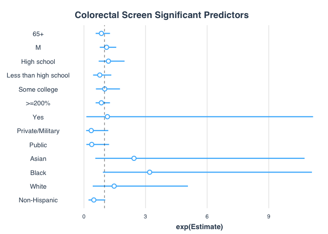

Colorectal Screening
================
Justin Hsie
11/25/2019

``` r
library(tidyverse)
library(survey)
library(car)
library(jtools)
library(ggthemes)
```

Data Import

``` r
cancer = read_csv("./data/cancerxx.csv") %>% 
  janitor::clean_names() %>% 
  select(hhx, fmx, fpx, wtfa_sa, strat_p, psu_p, region, hfobhad1, 
         rhfo2_mt, rhfo2yr, rhfo2n, rhfo2t, rhfo2, rhfob3a,
         rhfob3b, hfobrea2, fobhad1, rfob2_mt, rfob2yr,
         rfob2n, rfob2t, rofob3a, rofob3b, rfobres1)

adult = read_csv("./data/samadult.csv") %>%
  janitor::clean_names() %>% 
  select(hhx, fmx, fpx, ausualpl, ahcplrou, ahcplknd, fla1ar)

family = read_csv("./data/familyxx.csv") %>%
  janitor::clean_names() %>% 
  select(hhx, fmx, rat_cat4, rat_cat5)

person = read_csv("./data/personsx.csv") %>%
  janitor::clean_names() %>% 
  select(hhx, fmx, fpx, age_p, educ1, sex, notcov, cover65, cover65o, 
         la1ar, lcondrt, lachronr, hiscodi3, racreci3, cover, yrsinus, plborn)

col_dat = cancer %>%
  left_join(adult, by = c("hhx", "fmx", "fpx")) %>%
  left_join(person, by = c("hhx", "fmx", "fpx")) %>%
  left_join(family, by = c("hhx", "fmx"))
```

Data Manipulation

``` r
#home stool test within last year
col_dat = col_dat %>%
  mutate(col_2 = if_else(rhfob3a <= 1, 1, 0),
         imm_stat = case_when(yrsinus < 4 ~ "In U.S. < 10 yrs",
                              yrsinus == 4 | yrsinus == 5 ~ "In U.S. >= 10 yrs",
                              plborn == 1 ~ "Born in U.S."))

# create the age category
col_dat = col_dat %>% 
  mutate(age_cat = case_when(age_p >= 25 & age_p < 40 ~ "25–39",
                             age_p >= 40 & age_p < 50 ~ "40–49",
                             age_p >= 50 & age_p < 65 ~ "50–64",
                             age_p >= 65 ~ "65+"))
# create educ category
col_dat = col_dat %>% 
  mutate(educ_cat = case_when(educ1 < 13 ~ "Less than high school",
                              educ1 >= 13 & educ1 < 15 ~ "High school",
                              educ1 >= 15 & educ1 < 18 ~ "Some college",
                              educ1 >= 18 & educ1 <= 21 ~ "College graduate"))

# create financial category
col_dat = col_dat %>% 
  mutate(finc_cat = case_when(rat_cat5 <= 7 |  rat_cat5 %in% c(15, 16) ~ "<200%",
                              rat_cat5 %in% c(8, 9) ~ "200–299%", 
                              rat_cat5 %in% c(10, 11) ~ "300–399%",
                              rat_cat5 >= 18 & educ1 <= 21 ~ "400–499%",
                              rat_cat5 == 14  ~">=500%",
                              rat_cat5 == 17  ~">=200%, no further detail",
                              rat_cat5 %in% c(96, 99) ~ "Unknown"))

# create as usual category
col_dat = col_dat %>% 
  mutate(ausualpl_cat  = case_when(ausualpl == 2 ~ "No",
                                   ausualpl %in% c(1, 3) ~ "Yes",
                                   ausualpl %in% c(7, 8, 9) ~ "Other"))
# coverage status
col_dat = col_dat %>% 
  mutate(cover_cat  = case_when(notcov == 1 | cover == 4 | cover65 == 6 ~ "None",
                                cover == 2 | cover65 %in% 2:4 ~ "Public",
                                cover %in% c(1, 3) | cover65 %in% c(1, 5) ~
                                  "Private/Military"))

# disability
col_dat = col_dat %>% 
  mutate(lcond_chronic_cat = if_else(lcondrt == 1, "Yes", "No"))

# race
col_dat = col_dat %>% 
  mutate(race_cat = case_when(racreci3 == 1 ~ "White",
                              racreci3 == 2 ~ "Black",
                              racreci3 == 3 ~ "Asian",
                              racreci3 == 4 ~ "AN/AI"),
         eth_cat = case_when(hiscodi3 == 1 ~ "Hispanic",
                             hiscodi3 == 2 ~ "Non-Hispanic White",
                             hiscodi3 == 3 ~ "Non-Hispanic Black",
                             hiscodi3 == 4 ~ "Non-Hispanic Asian",
                             hiscodi3 == 5 ~ "Non-Hispanic AN/AI"))
```

Survey Design

``` r
col_dat = col_dat %>%
  mutate(domain = if_else(age_p >= 50, 1, 0))

des = svydesign(ids = ~ psu_p, strata = ~ strat_p, 
                weights = ~ wtfa_sa, nest = TRUE, data = col_dat)
```

Tables

``` r
#age percentage
age_pct = svyby(~col_2, by = ~domain + age_cat + sex, svymean, na.rm = TRUE, 
                design = des, vartype = c("ci", "se"))
age_pct %>% 
  filter(domain == 1) %>% select(-domain) %>% knitr::kable()
```

| age\_cat | sex |    col\_2 |        se |     ci\_l |     ci\_u |
| :------- | --: | --------: | --------: | --------: | --------: |
| 50–64    |   1 | 0.3182779 | 0.0248734 | 0.2695269 | 0.3670290 |
| 65+      |   1 | 0.2715899 | 0.0197757 | 0.2328304 | 0.3103495 |
| 50–64    |   2 | 0.2927010 | 0.0210953 | 0.2513550 | 0.3340471 |
| 65+      |   2 | 0.2462065 | 0.0166088 | 0.2136538 | 0.2787591 |

``` r
#education
edu_pct = svyby(~col_2, by = ~domain + educ_cat + sex, svymean, na.rm = TRUE, 
                design = des, vartype = c("se", "ci")) %>% 
  filter(domain == 1) %>%
  select(-domain, -se)

edu_pct %>% 
  knitr::kable()
```

| educ\_cat             | sex |    col\_2 |     ci\_l |     ci\_u |
| :-------------------- | --: | --------: | --------: | --------: |
| College graduate      |   1 | 0.2646712 | 0.2158128 | 0.3135295 |
| High school           |   1 | 0.3473484 | 0.2861773 | 0.4085194 |
| Less than high school |   1 | 0.3398048 | 0.2468565 | 0.4327530 |
| Some college          |   1 | 0.2698518 | 0.2130050 | 0.3266987 |
| College graduate      |   2 | 0.2717708 | 0.2304056 | 0.3131360 |
| High school           |   2 | 0.2587746 | 0.2138664 | 0.3036828 |
| Less than high school |   2 | 0.2898417 | 0.2189860 | 0.3606974 |
| Some college          |   2 | 0.2619221 | 0.2111843 | 0.3126600 |

``` r
#finc
finc_pct = svyby(~col_2, by = ~domain + finc_cat + sex, svymean, na.rm = TRUE, 
                 design = des, vartype = c("se", "ci")) %>% 
  filter(domain == 1) %>%
  select(-domain, -se)

finc_pct %>% knitr::kable()
```

| finc\_cat                  | sex |    col\_2 |       ci\_l |     ci\_u |
| :------------------------- | --: | --------: | ----------: | --------: |
| \<200%                     |   1 | 0.3480108 |   0.2811567 | 0.4148649 |
| \>=200%, no further detail |   1 | 0.1751793 |   0.0303663 | 0.3199924 |
| \>=500%                    |   1 | 0.3106846 |   0.2531369 | 0.3682323 |
| 200–299%                   |   1 | 0.2632839 |   0.1876997 | 0.3388681 |
| 300–399%                   |   1 | 0.2051748 |   0.1239285 | 0.2864211 |
| 400–499%                   |   1 | 0.3006899 |   0.2126085 | 0.3887713 |
| Unknown                    |   1 | 0.0000000 |   0.0000000 | 0.0000000 |
| \<200%                     |   2 | 0.2921319 |   0.2462205 | 0.3380433 |
| \>=200%, no further detail |   2 | 0.2690137 |   0.1551583 | 0.3828692 |
| \>=500%                    |   2 | 0.2611537 |   0.2048462 | 0.3174613 |
| 200–299%                   |   2 | 0.2299942 |   0.1668537 | 0.2931348 |
| 300–399%                   |   2 | 0.2035678 |   0.1276874 | 0.2794481 |
| 400–499%                   |   2 | 0.2780802 |   0.2100563 | 0.3461041 |
| Unknown                    |   2 | 0.3159234 | \-0.1659777 | 0.7978245 |

``` r
#usual care
ausualp_pct = svyby(~col_2, by = ~domain + ausualpl_cat + sex, svymean, 
                    na.rm = TRUE, design = des, vartype = c("se", "ci")) %>% 
  filter(domain == 1) %>%
  select(-domain, -se)

ausualp_pct %>% knitr::kable()
```

| ausualpl\_cat | sex |    col\_2 |     ci\_l |     ci\_u |
| :------------ | --: | --------: | --------: | --------: |
| No            |   1 | 0.2384056 | 0.0304807 | 0.4463304 |
| Other         |   1 | 0.0000000 | 0.0000000 | 0.0000000 |
| Yes           |   1 | 0.2941177 | 0.2629030 | 0.3253323 |
| No            |   2 | 0.1469170 | 0.0221549 | 0.2716791 |
| Other         |   2 | 0.0000000 | 0.0000000 | 0.0000000 |
| Yes           |   2 | 0.2692905 | 0.2421668 | 0.2964142 |

``` r
#health coverage
cover_pct = svyby(~col_2, by = ~domain + cover_cat + sex, svymean, na.rm = TRUE, 
                  design = des, vartype = c("se", "ci")) %>% 
  filter(domain == 1) %>%
  select(-domain, -se)

cover_pct %>% knitr::kable()
```

| cover\_cat       | sex |    col\_2 |     ci\_l |     ci\_u |
| :--------------- | --: | --------: | --------: | --------: |
| None             |   1 | 0.4863323 | 0.2370963 | 0.7355683 |
| Private/Military |   1 | 0.2851092 | 0.2482065 | 0.3220120 |
| Public           |   1 | 0.3004717 | 0.2457112 | 0.3552321 |
| None             |   2 | 0.3082222 | 0.1461641 | 0.4702803 |
| Private/Military |   2 | 0.2498385 | 0.2171444 | 0.2825326 |
| Public           |   2 | 0.2989520 | 0.2545209 | 0.3433830 |

``` r
#chronic conditions
lcond_chronic_pct = svyby(~col_2, by = ~domain + lcond_chronic_cat + sex, svymean, 
                          na.rm = TRUE, design = des, vartype = c("se", "ci")) %>% 
  filter(domain == 1) %>%
  select(-domain, -se)

lcond_chronic_pct %>% knitr::kable()
```

| lcond\_chronic\_cat | sex |    col\_2 |       ci\_l |     ci\_u |
| :------------------ | --: | --------: | ----------: | --------: |
| No                  |   1 | 0.4367342 |   0.0335440 | 0.8399244 |
| Yes                 |   1 | 0.2559718 |   0.2032853 | 0.3086583 |
| No                  |   2 | 0.2043795 | \-0.0355753 | 0.4443342 |
| Yes                 |   2 | 0.2518561 |   0.2122892 | 0.2914231 |

``` r
#race
race_pct = svyby(~col_2, by = ~domain + race_cat + sex, svymean, na.rm = TRUE, 
                 design = des, vartype = c("se", "ci")) %>% 
  filter(domain == 1) %>%
  select(-domain, -se)

race_pct %>% knitr::kable()
```

| race\_cat | sex |    col\_2 |     ci\_l |     ci\_u |
| :-------- | --: | --------: | --------: | --------: |
| AN/AI     |   1 | 0.3084385 | 0.0822501 | 0.5346269 |
| Asian     |   1 | 0.4688890 | 0.3249195 | 0.6128585 |
| Black     |   1 | 0.4122389 | 0.3186199 | 0.5058579 |
| White     |   1 | 0.2723752 | 0.2391214 | 0.3056290 |
| AN/AI     |   2 | 0.1762195 | 0.0129636 | 0.3394755 |
| Asian     |   2 | 0.5031264 | 0.3468495 | 0.6594034 |
| Black     |   2 | 0.2904902 | 0.2176051 | 0.3633752 |
| White     |   2 | 0.2552059 | 0.2265069 | 0.2839049 |

``` r
#ethnicity
eth_pct = svyby(~col_2, by = ~domain + eth_cat + sex, svymean, na.rm = TRUE,
                design = des, vartype = c("se", "ci")) %>% 
  filter(domain == 1) %>%
  select(-domain, -se)

eth_pct %>% knitr::kable()
```

| eth\_cat           | sex |    col\_2 |       ci\_l |     ci\_u |
| :----------------- | --: | --------: | ----------: | --------: |
| Hispanic           |   1 | 0.3579940 |   0.2569288 | 0.4590593 |
| Non-Hispanic AN/AI |   1 | 0.2545663 |   0.0110485 | 0.4980841 |
| Non-Hispanic Asian |   1 | 0.5010986 |   0.3463966 | 0.6558006 |
| Non-Hispanic Black |   1 | 0.4148067 |   0.3207858 | 0.5088275 |
| Non-Hispanic White |   1 | 0.2643000 |   0.2299197 | 0.2986804 |
| Hispanic           |   2 | 0.3719601 |   0.2865942 | 0.4573260 |
| Non-Hispanic AN/AI |   2 | 0.1556916 | \-0.0155723 | 0.3269555 |
| Non-Hispanic Asian |   2 | 0.5048098 |   0.3476417 | 0.6619779 |
| Non-Hispanic Black |   2 | 0.3022233 |   0.2277217 | 0.3767249 |
| Non-Hispanic White |   2 | 0.2437031 |   0.2138307 | 0.2735754 |

``` r
#immigration
imm_pct = svyby(~col_2, by = ~domain + imm_stat + sex, svymean, na.rm = TRUE,
                design = des, vartype = c("se", "ci")) %>%
  filter(domain == 1) %>%
  select(-domain, -se)
imm_pct %>% knitr::kable()
```

| imm\_stat          | sex |    col\_2 |     ci\_l |     ci\_u |
| :----------------- | --: | --------: | --------: | --------: |
| Born in U.S.       |   1 | 0.2795109 | 0.2464442 | 0.3125776 |
| In U.S. \< 10 yrs  |   1 | 0.8987319 | 0.7277576 | 1.0697062 |
| In U.S. \>= 10 yrs |   1 | 0.3794907 | 0.2917025 | 0.4672788 |
| Born in U.S.       |   2 | 0.2455390 | 0.2184926 | 0.2725854 |
| In U.S. \< 10 yrs  |   2 | 0.7624908 | 0.4719310 | 1.0530506 |
| In U.S. \>= 10 yrs |   2 | 0.4286314 | 0.3449775 | 0.5122853 |

Tables by Age

``` r
#education
edu_pct_strat = svyby(~col_2, by = ~domain + age_cat + educ_cat + sex, svymean, 
                      na.rm = TRUE, design = des, vartype = c("se", "ci"))
edu_tab = edu_pct_strat %>% 
  filter(domain == 1) %>% 
  select(-domain, -se) 

edu_tab %>% knitr::kable()
```

| age\_cat | educ\_cat             | sex |    col\_2 |     ci\_l |     ci\_u |
| :------- | :-------------------- | --: | --------: | --------: | --------: |
| 50–64    | College graduate      |   1 | 0.3093551 | 0.2338067 | 0.3849035 |
| 65+      | College graduate      |   1 | 0.2216779 | 0.1614394 | 0.2819164 |
| 50–64    | High school           |   1 | 0.3797591 | 0.2796969 | 0.4798212 |
| 65+      | High school           |   1 | 0.3214531 | 0.2455225 | 0.3973838 |
| 50–64    | Less than high school |   1 | 0.3099232 | 0.1377101 | 0.4821362 |
| 65+      | Less than high school |   1 | 0.3579265 | 0.2640090 | 0.4518440 |
| 50–64    | Some college          |   1 | 0.2872257 | 0.2024365 | 0.3720150 |
| 65+      | Some college          |   1 | 0.2549195 | 0.1841993 | 0.3256398 |
| 50–64    | College graduate      |   2 | 0.2926289 | 0.2216702 | 0.3635877 |
| 65+      | College graduate      |   2 | 0.2526323 | 0.1984237 | 0.3068409 |
| 50–64    | High school           |   2 | 0.2865447 | 0.2071094 | 0.3659801 |
| 65+      | High school           |   2 | 0.2428318 | 0.1893470 | 0.2963167 |
| 50–64    | Less than high school |   2 | 0.3687561 | 0.2424295 | 0.4950827 |
| 65+      | Less than high school |   2 | 0.2503043 | 0.1616479 | 0.3389608 |
| 50–64    | Some college          |   2 | 0.2780920 | 0.2052010 | 0.3509830 |
| 65+      | Some college          |   2 | 0.2479558 | 0.1830437 | 0.3128680 |

``` r
#finc
finc_pct_strat = svyby(~col_2, by = ~domain + age_cat + finc_cat + sex, svymean, 
                       na.rm = TRUE, design = des, vartype = c("se", "ci"))

finc_tab = finc_pct_strat %>% 
  filter(domain == 1) %>% 
  select(-domain, -se) 

finc_tab %>% knitr::kable()
```

| age\_cat | finc\_cat                  | sex |    col\_2 |       ci\_l |     ci\_u |
| :------- | :------------------------- | --: | --------: | ----------: | --------: |
| 50–64    | \<200%                     |   1 | 0.3210603 |   0.2222157 | 0.4199050 |
| 65+      | \<200%                     |   1 | 0.3767658 |   0.2945001 | 0.4590315 |
| 50–64    | \>=200%, no further detail |   1 | 0.2949177 | \-0.1041417 | 0.6939772 |
| 65+      | \>=200%, no further detail |   1 | 0.1486000 | \-0.0116239 | 0.3088238 |
| 50–64    | \>=500%                    |   1 | 0.3376123 |   0.2560278 | 0.4191969 |
| 65+      | \>=500%                    |   1 | 0.2813087 |   0.2040022 | 0.3586152 |
| 50–64    | 200–299%                   |   1 | 0.3038759 |   0.1551097 | 0.4526422 |
| 65+      | 200–299%                   |   1 | 0.2388720 |   0.1577152 | 0.3200288 |
| 50–64    | 300–399%                   |   1 | 0.2508046 |   0.0989256 | 0.4026835 |
| 65+      | 300–399%                   |   1 | 0.1735762 |   0.0846764 | 0.2624760 |
| 50–64    | 400–499%                   |   1 | 0.3159067 |   0.1613380 | 0.4704753 |
| 65+      | 400–499%                   |   1 | 0.2917527 |   0.1876179 | 0.3958875 |
| 50–64    | Unknown                    |   1 | 0.0000000 |   0.0000000 | 0.0000000 |
| 65+      | Unknown                    |   1 | 0.0000000 |   0.0000000 | 0.0000000 |
| 50–64    | \<200%                     |   2 | 0.3354345 |   0.2603098 | 0.4105593 |
| 65+      | \<200%                     |   2 | 0.2617112 |   0.2037533 | 0.3196692 |
| 50–64    | \>=200%, no further detail |   2 | 0.2019780 |   0.0248399 | 0.3791161 |
| 65+      | \>=200%, no further detail |   2 | 0.2895555 |   0.1519002 | 0.4272108 |
| 50–64    | \>=500%                    |   2 | 0.2743470 |   0.1974360 | 0.3512581 |
| 65+      | \>=500%                    |   2 | 0.2461315 |   0.1699097 | 0.3223532 |
| 50–64    | 200–299%                   |   2 | 0.2607126 |   0.1492885 | 0.3721367 |
| 65+      | 200–299%                   |   2 | 0.2172024 |   0.1420154 | 0.2923893 |
| 50–64    | 300–399%                   |   2 | 0.2722432 |   0.1460283 | 0.3984581 |
| 65+      | 300–399%                   |   2 | 0.1672526 |   0.0805817 | 0.2539235 |
| 50–64    | 400–499%                   |   2 | 0.2577215 |   0.1385026 | 0.3769405 |
| 65+      | 400–499%                   |   2 | 0.2935982 |   0.2102423 | 0.3769542 |
| 50–64    | Unknown                    |   2 | 0.8538930 |   0.5195293 | 1.1882566 |
| 65+      | Unknown                    |   2 | 0.0000000 |   0.0000000 | 0.0000000 |

``` r
#usual care
ausualp_pct_strat = svyby(~col_2, by = ~domain + age_cat + ausualpl_cat + sex, 
                          svymean, na.rm = TRUE, 
                          design = des, vartype = c("se", "ci"))
usual_tab = ausualp_pct_strat %>% 
  filter(domain == 1) %>% 
  select(-domain, -se) 

usual_tab %>% knitr::kable()
```

| age\_cat | ausualpl\_cat | sex |    col\_2 |       ci\_l |     ci\_u |
| :------- | :------------ | --: | --------: | ----------: | --------: |
| 50–64    | No            |   1 | 0.3041349 |   0.0185423 | 0.5897274 |
| 65+      | No            |   1 | 0.1033082 | \-0.0810291 | 0.2876456 |
| 50–64    | Other         |   1 | 0.0000000 |   0.0000000 | 0.0000000 |
| 65+      | Other         |   1 | 0.0000000 |   0.0000000 | 0.0000000 |
| 50–64    | Yes           |   1 | 0.3186976 |   0.2695722 | 0.3678230 |
| 65+      | Yes           |   1 | 0.2736163 |   0.2345443 | 0.3126883 |
| 50–64    | No            |   2 | 0.0503862 | \-0.0396119 | 0.1403843 |
| 65+      | No            |   2 | 0.2279831 |   0.0228558 | 0.4331105 |
| 50–64    | Other         |   2 | 0.0000000 |   0.0000000 | 0.0000000 |
| 65+      | Other         |   2 | 0.0000000 |   0.0000000 | 0.0000000 |
| 50–64    | Yes           |   2 | 0.2998242 |   0.2575565 | 0.3420918 |
| 65+      | Yes           |   2 | 0.2466416 |   0.2135417 | 0.2797415 |

``` r
#health coverage
cover_pct_strat = svyby(~col_2, by = ~domain + age_cat + cover_cat + sex, svymean, 
                        na.rm = TRUE, design = des, vartype = c("se", "ci"))
ins_tab = cover_pct_strat %>% 
  filter(domain == 1) %>% 
  select(-domain, -se)

ins_tab %>% knitr::kable()
```

| age\_cat | cover\_cat       | sex |    col\_2 |       ci\_l |     ci\_u |
| :------- | :--------------- | --: | --------: | ----------: | --------: |
| 50–64    | None             |   1 | 0.4703798 |   0.2140706 | 0.7266891 |
| 65+      | None             |   1 | 1.0000000 |   1.0000000 | 1.0000000 |
| 50–64    | Private/Military |   1 | 0.3158562 |   0.2636540 | 0.3680583 |
| 65+      | Private/Military |   1 | 0.2441347 |   0.1920119 | 0.2962575 |
| 50–64    | Public           |   1 | 0.2768991 |   0.1277833 | 0.4260149 |
| 65+      | Public           |   1 | 0.3039875 |   0.2456163 | 0.3623587 |
| 50–64    | None             |   2 | 0.3452920 |   0.1683573 | 0.5222266 |
| 65+      | None             |   2 | 0.0124315 | \-0.0152290 | 0.0400920 |
| 50–64    | Private/Military |   2 | 0.2885654 |   0.2427625 | 0.3343682 |
| 65+      | Private/Military |   2 | 0.2004231 |   0.1577835 | 0.2430628 |
| 50–64    | Public           |   2 | 0.3218907 |   0.2017593 | 0.4420221 |
| 65+      | Public           |   2 | 0.2957456 |   0.2489771 | 0.3425142 |

``` r
#chronic conditions
lcond_chronic_pct_strat = svyby(~col_2, by = ~domain + age_cat + 
                                  lcond_chronic_cat + sex,
                                svymean, na.rm = TRUE, design = des,
                                vartype = c("se", "ci"))
dis_tab = lcond_chronic_pct_strat %>% 
  filter(domain == 1) %>% 
  select(-domain, -se) 

dis_tab %>% knitr::kable()
```

| age\_cat | lcond\_chronic\_cat | sex |    col\_2 |       ci\_l |     ci\_u |
| :------- | :------------------ | --: | --------: | ----------: | --------: |
| 50–64    | No                  |   1 | 0.3523465 | \-0.1623829 | 0.8670759 |
| 65+      | No                  |   1 | 0.5348602 | \-0.0535866 | 1.1233069 |
| 50–64    | Yes                 |   1 | 0.2549203 |   0.1688474 | 0.3409932 |
| 65+      | Yes                 |   1 | 0.2566963 |   0.1896963 | 0.3236962 |
| 50–64    | No                  |   2 | 0.0000000 |   0.0000000 | 0.0000000 |
| 65+      | No                  |   2 | 0.4003621 | \-0.0513437 | 0.8520680 |
| 50–64    | Yes                 |   2 | 0.3302476 |   0.2651111 | 0.3953841 |
| 65+      | Yes                 |   2 | 0.2056220 |   0.1558094 | 0.2554345 |

``` r
#race
race_pct_strat = svyby(~col_2, by = ~domain + age_cat + race_cat + sex, svymean, 
                       na.rm = TRUE, design = des, vartype = c("se", "ci"))
race_tab = race_pct_strat %>% 
  filter(domain == 1) %>% 
  select(-domain, -se) 

race_tab %>% knitr::kable()
```

| age\_cat | race\_cat | sex |    col\_2 |       ci\_l |     ci\_u |
| :------- | :-------- | --: | --------: | ----------: | --------: |
| 50–64    | AN/AI     |   1 | 0.4734951 |   0.1002313 | 0.8467589 |
| 65+      | AN/AI     |   1 | 0.1791832 | \-0.0379228 | 0.3962892 |
| 50–64    | Asian     |   1 | 0.6415898 |   0.4530406 | 0.8301390 |
| 65+      | Asian     |   1 | 0.2662080 |   0.1193454 | 0.4130706 |
| 50–64    | Black     |   1 | 0.4642932 |   0.3306169 | 0.5979696 |
| 65+      | Black     |   1 | 0.3338563 |   0.2150908 | 0.4526217 |
| 50–64    | White     |   1 | 0.2768226 |   0.2246735 | 0.3289716 |
| 65+      | White     |   1 | 0.2688683 |   0.2265818 | 0.3111548 |
| 50–64    | AN/AI     |   2 | 0.2350830 | \-0.0198519 | 0.4900180 |
| 65+      | AN/AI     |   2 | 0.1190422 | \-0.0538181 | 0.2919025 |
| 50–64    | Asian     |   2 | 0.6104813 |   0.3707700 | 0.8501927 |
| 65+      | Asian     |   2 | 0.3926798 |   0.2313451 | 0.5540146 |
| 50–64    | Black     |   2 | 0.2770197 |   0.1835546 | 0.3704849 |
| 65+      | Black     |   2 | 0.3041289 |   0.1998962 | 0.4083617 |
| 50–64    | White     |   2 | 0.2803230 |   0.2342900 | 0.3263560 |
| 65+      | White     |   2 | 0.2374011 |   0.2022724 | 0.2725298 |

``` r
#ethnicity
eth_pct_strat = svyby(~col_2, by = ~domain + age_cat + eth_cat + sex, svymean, 
                      na.rm = TRUE, design = des, vartype = c("se", "ci"))
eth_tab = eth_pct_strat %>% 
  filter(domain == 1) %>% 
  select(-domain, -se) 

eth_tab %>% knitr::kable()
```

| age\_cat | eth\_cat           | sex |    col\_2 |       ci\_l |     ci\_u |
| :------- | :----------------- | --: | --------: | ----------: | --------: |
| 50–64    | Hispanic           |   1 | 0.3403261 |   0.1976905 | 0.4829617 |
| 65+      | Hispanic           |   1 | 0.3751849 |   0.2497860 | 0.5005838 |
| 50–64    | Non-Hispanic AN/AI |   1 | 0.4774365 |   0.0629850 | 0.8918880 |
| 65+      | Non-Hispanic AN/AI |   1 | 0.1420174 | \-0.0733489 | 0.3573838 |
| 50–64    | Non-Hispanic Asian |   1 | 0.6864800 |   0.5007690 | 0.8721910 |
| 65+      | Non-Hispanic Asian |   1 | 0.2674510 |   0.1045093 | 0.4303928 |
| 50–64    | Non-Hispanic Black |   1 | 0.4691258 |   0.3344150 | 0.6038367 |
| 65+      | Non-Hispanic Black |   1 | 0.3338563 |   0.2150908 | 0.4526217 |
| 50–64    | Non-Hispanic White |   1 | 0.2702625 |   0.2154938 | 0.3250312 |
| 65+      | Non-Hispanic White |   1 | 0.2596668 |   0.2153522 | 0.3039813 |
| 50–64    | Hispanic           |   2 | 0.3719200 |   0.2476902 | 0.4961499 |
| 65+      | Hispanic           |   2 | 0.3720216 |   0.2681472 | 0.4758960 |
| 50–64    | Non-Hispanic AN/AI |   2 | 0.2344777 | \-0.0554022 | 0.5243575 |
| 65+      | Non-Hispanic AN/AI |   2 | 0.0877230 | \-0.0639075 | 0.2393534 |
| 50–64    | Non-Hispanic Asian |   2 | 0.6139774 |   0.3716157 | 0.8563391 |
| 65+      | Non-Hispanic Asian |   2 | 0.3930364 |   0.2316619 | 0.5544108 |
| 50–64    | Non-Hispanic Black |   2 | 0.2946725 |   0.1996042 | 0.3897408 |
| 65+      | Non-Hispanic Black |   2 | 0.3095383 |   0.2039932 | 0.4150834 |
| 50–64    | Non-Hispanic White |   2 | 0.2652179 |   0.2171300 | 0.3133059 |
| 65+      | Non-Hispanic White |   2 | 0.2293644 |   0.1925061 | 0.2662227 |

``` r
#immigration
imm_pct_strat = svyby(~col_2, by = ~domain + age_cat + imm_stat + sex, svymean,
                      na.rm = TRUE, design = des, vartype = c("se", "ci"))
imm_tab = imm_pct_strat %>%
  filter(domain == 1) %>%
  select(-domain, -se)
imm_tab %>% knitr::kable()
```

| age\_cat | imm\_stat          | sex |    col\_2 |       ci\_l |     ci\_u |
| :------- | :----------------- | --: | --------: | ----------: | --------: |
| 50–64    | Born in U.S.       |   1 | 0.2940971 |   0.2424426 | 0.3457517 |
| 65+      | Born in U.S.       |   1 | 0.2673139 |   0.2252556 | 0.3093722 |
| 50–64    | In U.S. \< 10 yrs  |   1 | 1.0000000 |   1.0000000 | 1.0000000 |
| 65+      | In U.S. \< 10 yrs  |   1 | 0.8657715 |   0.6299231 | 1.1016199 |
| 50–64    | In U.S. \>= 10 yrs |   1 | 0.4937811 |   0.3681983 | 0.6193639 |
| 65+      | In U.S. \>= 10 yrs |   1 | 0.2708378 |   0.1679773 | 0.3736983 |
| 50–64    | Born in U.S.       |   2 | 0.2637543 |   0.2226754 | 0.3048331 |
| 65+      | Born in U.S.       |   2 | 0.2324973 |   0.1981342 | 0.2668603 |
| 50–64    | In U.S. \< 10 yrs  |   2 | 0.8667456 |   0.6679379 | 1.0655533 |
| 65+      | In U.S. \< 10 yrs  |   2 | 0.5472939 | \-0.1269002 | 1.2214880 |
| 50–64    | In U.S. \>= 10 yrs |   2 | 0.4717880 |   0.3459445 | 0.5976316 |
| 65+      | In U.S. \>= 10 yrs |   2 | 0.3841607 |   0.2819519 | 0.4863696 |

``` r
#total gotten colorectal
total = svyby(~col_2, by = ~domain + age_cat + sex, svymean, na.rm = TRUE, 
              design = des, vartype = c("se", "ci"))

tot_tab = total %>% 
  filter(domain == 1) %>% 
  select(-domain, -se) 

tot_tab %>% knitr::kable()
```

| age\_cat | sex |    col\_2 |     ci\_l |     ci\_u |
| :------- | --: | --------: | --------: | --------: |
| 50–64    |   1 | 0.3182779 | 0.2695269 | 0.3670290 |
| 65+      |   1 | 0.2715899 | 0.2328304 | 0.3103495 |
| 50–64    |   2 | 0.2927010 | 0.2513550 | 0.3340471 |
| 65+      |   2 | 0.2462065 | 0.2136538 | 0.2787591 |

``` r
tot_pct = svyby(~col_2, by = ~domain + sex, svymean, na.rm = TRUE, 
                design = des, vartype = c("se", "ci")) %>%
  filter(domain == 1) %>%
  select(-domain, -se) %>%
  mutate(age_cat = "50+")
```

Combine all tables

``` r
tot_tab = rbind(tot_pct, tot_tab)

tot_tab2 = tot_tab %>%
  mutate(type = "Total",
         level = "-")

edu_pct2 = edu_pct %>%
  mutate(age_cat = "50+")

edu_tab = rbind(edu_pct2, edu_tab)

edu_tab2 = edu_tab %>%
  mutate(type = "Education") %>%
  rename(level = educ_cat) %>%
  mutate(level = factor(level, 
                        levels = c("Less than high school", "High school", 
                                   "Some college", "College graduate"))) %>%
  arrange(level)

finc_pct2 = finc_pct %>%
  mutate(age_cat = "50+")

finc_tab = rbind(finc_pct2, finc_tab)

finc_tab2 = finc_tab %>%
  mutate(type = "Family Income Poverty Ratio") %>%
  rename(level = finc_cat) %>%
  mutate(level = factor(level, levels = c("<200%", ">=200%, no further detail", "200–299%", "300–399%", "400–499%", ">=500%", "Unknown"))) %>%
  arrange(level)

ausualp_pct2 = ausualp_pct %>%
  mutate(age_cat = "50+")

usual_tab = rbind(ausualp_pct2, usual_tab)

usual_tab2 = usual_tab %>%
  mutate(type = "Usual Source of Care") %>%
  rename(level = ausualpl_cat) %>%
  mutate(level = factor(level, levels = c("No", "Yes", "Other"))) %>%
  arrange(level)

cover_pct2 = cover_pct %>%
  mutate(age_cat = "50+")

ins_tab = rbind(cover_pct2, ins_tab)

ins_tab2 = ins_tab %>%
  mutate(type = "Insurance Type") %>%
  rename(level = cover_cat) %>%
  mutate(level = factor(level, levels = c("None", "Public", "Private/Military"))) %>%
  arrange(level)

lcond_chronic_pct2 = lcond_chronic_pct %>%
  mutate(age_cat = "50+")

dis_tab = rbind(lcond_chronic_pct2, dis_tab)

dis_tab2 = dis_tab %>%
  mutate(type = "Chronic Disability") %>%
  rename(level = lcond_chronic_cat) %>%
  mutate(level = factor(level, levels = c("Yes", "No"))) %>%
  arrange(level)

eth_pct2 = eth_pct %>%
  mutate(age_cat = "50+")

eth_tab = rbind(eth_pct2, eth_tab)

eth_tab2 = eth_tab %>%
  mutate(type = "Ethnicity") %>%
  rename(level = eth_cat) %>%
  mutate(level = factor(level, levels = c("Hispanic", "Non-Hispanic White", "Non-Hispanic Black", "Non-Hispanic AN/AI", "Non-Hispanic Asian"))) %>%
  arrange(level)

race_pct2 = race_pct %>%
  mutate(age_cat = "50+")

race_tab = rbind(race_pct2, race_tab)

race_tab2 = race_tab %>%
  mutate(type = "Race") %>%
  rename(level = race_cat) %>%
  mutate(level = factor(level, levels = c("White", "Black", "AN/AI", "Asian"))) %>%
  arrange(level)

imm_pct2 = imm_pct %>%
  mutate(age_cat = "50+")

imm_tab = rbind(imm_pct2, imm_tab)

imm_tab2 = imm_tab %>%
  mutate(type = "Immigration") %>%
  rename(level = imm_stat) %>%
  mutate(level = factor(level, levels = c("In U.S. < 10 yrs", "In U.S. >= 10 yrs", "Born in U.S."))) %>%
  arrange(level)

# create table of percentages of people who have gotten fobts within the last year
tab_one = rbind(tot_tab2, edu_tab2, finc_tab2, usual_tab2, ins_tab2, dis_tab2, eth_tab2, race_tab2, imm_tab2) %>%
  mutate(col_2 = round(col_2*100, 2),
         ci_l = round(ci_l*100, 2),
         ci_u = round(ci_u*100, 2),
         CI = str_c(ci_l, ", ", ci_u)) %>%
  rename(Percent = col_2) %>%
  select(-ci_l, -ci_u) %>%
  pivot_wider(names_from = c(sex, age_cat), values_from = c(Percent, CI)) %>%
  janitor::clean_names() %>%
  select(Type = type, Level = level, 
         "Percent Men Age 50-64" = percent_1_50_64, 
         "CI Men Age 50-64" = ci_1_50_64, 
         "Percent Men Age 65+" = percent_1_65, 
         "CI Men Age 65+" = ci_1_65,
         "Percent Women Age 50-64" = percent_2_50_64, 
         "CI Women Age 50-64" = ci_2_50_64, 
         "Percent Women Age 65+" = percent_2_65, 
         "CI Women Age 65+" = ci_2_65)

# print percentages
tab_one %>% knitr::kable()
```

| Type                        | Level                      | Percent Men Age 50-64 | CI Men Age 50-64 | Percent Men Age 65+ | CI Men Age 65+ | Percent Women Age 50-64 | CI Women Age 50-64 | Percent Women Age 65+ | CI Women Age 65+ |
| :-------------------------- | :------------------------- | --------------------: | :--------------- | ------------------: | :------------- | ----------------------: | :----------------- | --------------------: | :--------------- |
| Total                       | \-                         |                 31.83 | 26.95, 36.7      |               27.16 | 23.28, 31.03   |                   29.27 | 25.14, 33.4        |                 24.62 | 21.37, 27.88     |
| Education                   | Less than high school      |                 30.99 | 13.77, 48.21     |               35.79 | 26.4, 45.18    |                   36.88 | 24.24, 49.51       |                 25.03 | 16.16, 33.9      |
| Education                   | High school                |                 37.98 | 27.97, 47.98     |               32.15 | 24.55, 39.74   |                   28.65 | 20.71, 36.6        |                 24.28 | 18.93, 29.63     |
| Education                   | Some college               |                 28.72 | 20.24, 37.2      |               25.49 | 18.42, 32.56   |                   27.81 | 20.52, 35.1        |                 24.80 | 18.3, 31.29      |
| Education                   | College graduate           |                 30.94 | 23.38, 38.49     |               22.17 | 16.14, 28.19   |                   29.26 | 22.17, 36.36       |                 25.26 | 19.84, 30.68     |
| Family Income Poverty Ratio | \<200%                     |                 32.11 | 22.22, 41.99     |               37.68 | 29.45, 45.9    |                   33.54 | 26.03, 41.06       |                 26.17 | 20.38, 31.97     |
| Family Income Poverty Ratio | \>=200%, no further detail |                 29.49 | \-10.41, 69.4    |               14.86 | \-1.16, 30.88  |                   20.20 | 2.48, 37.91        |                 28.96 | 15.19, 42.72     |
| Family Income Poverty Ratio | 200–299%                   |                 30.39 | 15.51, 45.26     |               23.89 | 15.77, 32      |                   26.07 | 14.93, 37.21       |                 21.72 | 14.2, 29.24      |
| Family Income Poverty Ratio | 300–399%                   |                 25.08 | 9.89, 40.27      |               17.36 | 8.47, 26.25    |                   27.22 | 14.6, 39.85        |                 16.73 | 8.06, 25.39      |
| Family Income Poverty Ratio | 400–499%                   |                 31.59 | 16.13, 47.05     |               29.18 | 18.76, 39.59   |                   25.77 | 13.85, 37.69       |                 29.36 | 21.02, 37.7      |
| Family Income Poverty Ratio | \>=500%                    |                 33.76 | 25.6, 41.92      |               28.13 | 20.4, 35.86    |                   27.43 | 19.74, 35.13       |                 24.61 | 16.99, 32.24     |
| Family Income Poverty Ratio | Unknown                    |                  0.00 | 0, 0             |                0.00 | 0, 0           |                   85.39 | 51.95, 118.83      |                  0.00 | 0, 0             |
| Usual Source of Care        | No                         |                 30.41 | 1.85, 58.97      |               10.33 | \-8.1, 28.76   |                    5.04 | \-3.96, 14.04      |                 22.80 | 2.29, 43.31      |
| Usual Source of Care        | Yes                        |                 31.87 | 26.96, 36.78     |               27.36 | 23.45, 31.27   |                   29.98 | 25.76, 34.21       |                 24.66 | 21.35, 27.97     |
| Usual Source of Care        | Other                      |                  0.00 | 0, 0             |                0.00 | 0, 0           |                    0.00 | 0, 0               |                  0.00 | 0, 0             |
| Insurance Type              | None                       |                 47.04 | 21.41, 72.67     |              100.00 | 100, 100       |                   34.53 | 16.84, 52.22       |                  1.24 | \-1.52, 4.01     |
| Insurance Type              | Public                     |                 27.69 | 12.78, 42.6      |               30.40 | 24.56, 36.24   |                   32.19 | 20.18, 44.2        |                 29.57 | 24.9, 34.25      |
| Insurance Type              | Private/Military           |                 31.59 | 26.37, 36.81     |               24.41 | 19.2, 29.63    |                   28.86 | 24.28, 33.44       |                 20.04 | 15.78, 24.31     |
| Chronic Disability          | Yes                        |                 25.49 | 16.88, 34.1      |               25.67 | 18.97, 32.37   |                   33.02 | 26.51, 39.54       |                 20.56 | 15.58, 25.54     |
| Chronic Disability          | No                         |                 35.23 | \-16.24, 86.71   |               53.49 | \-5.36, 112.33 |                    0.00 | 0, 0               |                 40.04 | \-5.13, 85.21    |
| Ethnicity                   | Hispanic                   |                 34.03 | 19.77, 48.3      |               37.52 | 24.98, 50.06   |                   37.19 | 24.77, 49.61       |                 37.20 | 26.81, 47.59     |
| Ethnicity                   | Non-Hispanic White         |                 27.03 | 21.55, 32.5      |               25.97 | 21.54, 30.4    |                   26.52 | 21.71, 31.33       |                 22.94 | 19.25, 26.62     |
| Ethnicity                   | Non-Hispanic Black         |                 46.91 | 33.44, 60.38     |               33.39 | 21.51, 45.26   |                   29.47 | 19.96, 38.97       |                 30.95 | 20.4, 41.51      |
| Ethnicity                   | Non-Hispanic AN/AI         |                 47.74 | 6.3, 89.19       |               14.20 | \-7.33, 35.74  |                   23.45 | \-5.54, 52.44      |                  8.77 | \-6.39, 23.94    |
| Ethnicity                   | Non-Hispanic Asian         |                 68.65 | 50.08, 87.22     |               26.75 | 10.45, 43.04   |                   61.40 | 37.16, 85.63       |                 39.30 | 23.17, 55.44     |
| Race                        | White                      |                 27.68 | 22.47, 32.9      |               26.89 | 22.66, 31.12   |                   28.03 | 23.43, 32.64       |                 23.74 | 20.23, 27.25     |
| Race                        | Black                      |                 46.43 | 33.06, 59.8      |               33.39 | 21.51, 45.26   |                   27.70 | 18.36, 37.05       |                 30.41 | 19.99, 40.84     |
| Race                        | AN/AI                      |                 47.35 | 10.02, 84.68     |               17.92 | \-3.79, 39.63  |                   23.51 | \-1.99, 49         |                 11.90 | \-5.38, 29.19    |
| Race                        | Asian                      |                 64.16 | 45.3, 83.01      |               26.62 | 11.93, 41.31   |                   61.05 | 37.08, 85.02       |                 39.27 | 23.13, 55.4      |
| Immigration                 | In U.S. \< 10 yrs          |                100.00 | 100, 100         |               86.58 | 62.99, 110.16  |                   86.67 | 66.79, 106.56      |                 54.73 | \-12.69, 122.15  |
| Immigration                 | In U.S. \>= 10 yrs         |                 49.38 | 36.82, 61.94     |               27.08 | 16.8, 37.37    |                   47.18 | 34.59, 59.76       |                 38.42 | 28.2, 48.64      |
| Immigration                 | Born in U.S.               |                 29.41 | 24.24, 34.58     |               26.73 | 22.53, 30.94   |                   26.38 | 22.27, 30.48       |                 23.25 | 19.81, 26.69     |

Barplots of Usual Care and Insurance Coverage

``` r
# usual source of care barchart
usual_tab %>%
  mutate(sex = if_else(sex == 1, "M", "F")) %>% 
  filter(age_cat != "50+" & ausualpl_cat != "Other") %>%
  ggplot(aes(x = ausualpl_cat, y = col_2, fill = ausualpl_cat)) +
  geom_col() +
  scale_y_continuous(limits = c(0,1), breaks = c(0, 0.25, 0.5, 0.75, 1)) +
  geom_errorbar(aes(ymin = ci_l, ymax = ci_u)) +
  facet_grid(~age_cat + sex) + ggthemes::theme_few() + ggthemes::scale_fill_few() + theme(legend.position = "none") +
  labs(y = "Percent Had Colorectal Screen, Last 5 Years", x = "Usual Source of Care (Have/Have Not)")
```

    ## Warning: Removed 2 rows containing missing values (geom_errorbar).

<!-- -->

``` r
# insurance type barchart
ins_tab %>%
  mutate(sex = if_else(sex == 1, "M", "F")) %>%
  filter(age_cat != "50+") %>%
  ggplot(aes(x = cover_cat, y = col_2, fill = cover_cat)) +
  geom_col() + 
  scale_y_continuous(limits = c(0,1), breaks = c(0, 0.25, 0.5, 0.75, 1)) +
  geom_errorbar(aes(ymin = ci_l, ymax = ci_u)) +
  facet_grid(~age_cat + sex) + ggthemes::theme_few() + ggthemes::scale_fill_few() + theme(legend.position = "none", axis.text.x = element_text(angle = 90, hjust = 1)) +
  labs(y = "Percent Had Colorectal Screen, Last 5 Years", x = "Type of Insurance Coverage")
```

    ## Warning: Removed 1 rows containing missing values (geom_errorbar).

<!-- -->

Models

``` r
col_fit = svyglm(col_2 ~ as.factor(age_cat) + as.factor(educ_cat) + as.factor(finc_cat) + as.factor(ausualpl_cat) + as.factor(cover_cat) + as.factor(eth_cat) + as.factor(imm_stat), design = des, subset = domain == 1,
                  family = binomial(link = "logit"))
summary(col_fit)
```

    ## 
    ## Call:
    ## svyglm(formula = col_2 ~ as.factor(age_cat) + as.factor(educ_cat) + 
    ##     as.factor(finc_cat) + as.factor(ausualpl_cat) + as.factor(cover_cat) + 
    ##     as.factor(eth_cat) + as.factor(imm_stat), design = des, subset = domain == 
    ##     1, family = binomial(link = "logit"))
    ## 
    ## Survey design:
    ## svydesign(ids = ~psu_p, strata = ~strat_p, weights = ~wtfa_sa, 
    ##     nest = TRUE, data = col_dat)
    ## 
    ## Coefficients:
    ##                                               Estimate Std. Error t value
    ## (Intercept)                                   -1.08030    0.55007  -1.964
    ## as.factor(age_cat)65+                         -0.22385    0.11822  -1.893
    ## as.factor(educ_cat)High school                 0.16931    0.12939   1.309
    ## as.factor(educ_cat)Less than high school       0.06568    0.17467   0.376
    ## as.factor(educ_cat)Some college               -0.03013    0.13656  -0.221
    ## as.factor(finc_cat)>=200%, no further detail  -0.19415    0.26869  -0.723
    ## as.factor(finc_cat)>=500%                      0.08225    0.16594   0.496
    ## as.factor(finc_cat)200–299%                   -0.22656    0.17185  -1.318
    ## as.factor(finc_cat)300–399%                   -0.40463    0.21482  -1.884
    ## as.factor(finc_cat)400–499%                    0.03187    0.17678   0.180
    ## as.factor(ausualpl_cat)Other                 -11.51020    1.12087 -10.269
    ## as.factor(ausualpl_cat)Yes                     0.77967    0.41630   1.873
    ## as.factor(cover_cat)Private/Military          -0.56473    0.36681  -1.540
    ## as.factor(cover_cat)Public                    -0.30357    0.36746  -0.826
    ## as.factor(eth_cat)Non-Hispanic AN/AI          -0.54568    0.52733  -1.035
    ## as.factor(eth_cat)Non-Hispanic Asian           0.50023    0.30487   1.641
    ## as.factor(eth_cat)Non-Hispanic Black           0.25527    0.24389   1.047
    ## as.factor(eth_cat)Non-Hispanic White          -0.18167    0.21476  -0.846
    ## as.factor(imm_stat)In U.S. < 10 yrs            2.54161    0.66332   3.832
    ## as.factor(imm_stat)In U.S. >= 10 yrs           0.47288    0.19236   2.458
    ##                                              Pr(>|t|)    
    ## (Intercept)                                  0.050642 .  
    ## as.factor(age_cat)65+                        0.059449 .  
    ## as.factor(educ_cat)High school               0.191877    
    ## as.factor(educ_cat)Less than high school     0.707225    
    ## as.factor(educ_cat)Some college              0.825539    
    ## as.factor(finc_cat)>=200%, no further detail 0.470603    
    ## as.factor(finc_cat)>=500%                    0.620593    
    ## as.factor(finc_cat)200–299%                  0.188589    
    ## as.factor(finc_cat)300–399%                  0.060782 .  
    ## as.factor(finc_cat)400–499%                  0.857077    
    ## as.factor(ausualpl_cat)Other                  < 2e-16 ***
    ## as.factor(ausualpl_cat)Yes                   0.062250 .  
    ## as.factor(cover_cat)Private/Military         0.124922    
    ## as.factor(cover_cat)Public                   0.409514    
    ## as.factor(eth_cat)Non-Hispanic AN/AI         0.301757    
    ## as.factor(eth_cat)Non-Hispanic Asian         0.102099    
    ## as.factor(eth_cat)Non-Hispanic Black         0.296252    
    ## as.factor(eth_cat)Non-Hispanic White         0.398395    
    ## as.factor(imm_stat)In U.S. < 10 yrs          0.000161 ***
    ## as.factor(imm_stat)In U.S. >= 10 yrs         0.014638 *  
    ## ---
    ## Signif. codes:  0 '***' 0.001 '**' 0.01 '*' 0.05 '.' 0.1 ' ' 1
    ## 
    ## (Dispersion parameter for binomial family taken to be 0.9872891)
    ## 
    ## Number of Fisher Scoring iterations: 11

``` r
summ(col_fit)
```

<table class="table table-striped table-hover table-condensed table-responsive" style="width: auto !important; margin-left: auto; margin-right: auto;">

<tbody>

<tr>

<td style="text-align:left;font-weight: bold;">

Observations

</td>

<td style="text-align:right;">

3638

</td>

</tr>

<tr>

<td style="text-align:left;font-weight: bold;">

Dependent variable

</td>

<td style="text-align:right;">

col\_2

</td>

</tr>

<tr>

<td style="text-align:left;font-weight: bold;">

Type

</td>

<td style="text-align:right;">

Survey-weighted generalized linear
model

</td>

</tr>

<tr>

<td style="text-align:left;font-weight: bold;">

Family

</td>

<td style="text-align:right;">

binomial

</td>

</tr>

<tr>

<td style="text-align:left;font-weight: bold;">

Link

</td>

<td style="text-align:right;">

logit

</td>

</tr>

</tbody>

</table>

<table class="table table-striped table-hover table-condensed table-responsive" style="width: auto !important; margin-left: auto; margin-right: auto;">

<tbody>

<tr>

<td style="text-align:left;font-weight: bold;">

Pseudo-R² (Cragg-Uhler)

</td>

<td style="text-align:right;">

0.01

</td>

</tr>

<tr>

<td style="text-align:left;font-weight: bold;">

Pseudo-R²
(McFadden)

</td>

<td style="text-align:right;">

0.04

</td>

</tr>

<tr>

<td style="text-align:left;font-weight: bold;">

AIC

</td>

<td style="text-align:right;">

4085.53

</td>

</tr>

</tbody>

</table>

<table class="table table-striped table-hover table-condensed table-responsive" style="width: auto !important; margin-left: auto; margin-right: auto;">

<thead>

<tr>

<th style="text-align:left;">

</th>

<th style="text-align:right;">

Est.

</th>

<th style="text-align:right;">

S.E.

</th>

<th style="text-align:right;">

t val.

</th>

<th style="text-align:right;">

p

</th>

</tr>

</thead>

<tbody>

<tr>

<td style="text-align:left;font-weight: bold;">

(Intercept)

</td>

<td style="text-align:right;">

\-1.08

</td>

<td style="text-align:right;">

0.55

</td>

<td style="text-align:right;">

\-1.96

</td>

<td style="text-align:right;">

0.05

</td>

</tr>

<tr>

<td style="text-align:left;font-weight: bold;">

as.factor(age\_cat)65+

</td>

<td style="text-align:right;">

\-0.22

</td>

<td style="text-align:right;">

0.12

</td>

<td style="text-align:right;">

\-1.89

</td>

<td style="text-align:right;">

0.06

</td>

</tr>

<tr>

<td style="text-align:left;font-weight: bold;">

as.factor(educ\_cat)High school

</td>

<td style="text-align:right;">

0.17

</td>

<td style="text-align:right;">

0.13

</td>

<td style="text-align:right;">

1.31

</td>

<td style="text-align:right;">

0.19

</td>

</tr>

<tr>

<td style="text-align:left;font-weight: bold;">

as.factor(educ\_cat)Less than high school

</td>

<td style="text-align:right;">

0.07

</td>

<td style="text-align:right;">

0.17

</td>

<td style="text-align:right;">

0.38

</td>

<td style="text-align:right;">

0.71

</td>

</tr>

<tr>

<td style="text-align:left;font-weight: bold;">

as.factor(educ\_cat)Some college

</td>

<td style="text-align:right;">

\-0.03

</td>

<td style="text-align:right;">

0.14

</td>

<td style="text-align:right;">

\-0.22

</td>

<td style="text-align:right;">

0.83

</td>

</tr>

<tr>

<td style="text-align:left;font-weight: bold;">

as.factor(finc\_cat)\>=200%, no further detail

</td>

<td style="text-align:right;">

\-0.19

</td>

<td style="text-align:right;">

0.27

</td>

<td style="text-align:right;">

\-0.72

</td>

<td style="text-align:right;">

0.47

</td>

</tr>

<tr>

<td style="text-align:left;font-weight: bold;">

as.factor(finc\_cat)\>=500%

</td>

<td style="text-align:right;">

0.08

</td>

<td style="text-align:right;">

0.17

</td>

<td style="text-align:right;">

0.50

</td>

<td style="text-align:right;">

0.62

</td>

</tr>

<tr>

<td style="text-align:left;font-weight: bold;">

as.factor(finc\_cat)200–299%

</td>

<td style="text-align:right;">

\-0.23

</td>

<td style="text-align:right;">

0.17

</td>

<td style="text-align:right;">

\-1.32

</td>

<td style="text-align:right;">

0.19

</td>

</tr>

<tr>

<td style="text-align:left;font-weight: bold;">

as.factor(finc\_cat)300–399%

</td>

<td style="text-align:right;">

\-0.40

</td>

<td style="text-align:right;">

0.21

</td>

<td style="text-align:right;">

\-1.88

</td>

<td style="text-align:right;">

0.06

</td>

</tr>

<tr>

<td style="text-align:left;font-weight: bold;">

as.factor(finc\_cat)400–499%

</td>

<td style="text-align:right;">

0.03

</td>

<td style="text-align:right;">

0.18

</td>

<td style="text-align:right;">

0.18

</td>

<td style="text-align:right;">

0.86

</td>

</tr>

<tr>

<td style="text-align:left;font-weight: bold;">

as.factor(ausualpl\_cat)Other

</td>

<td style="text-align:right;">

\-11.51

</td>

<td style="text-align:right;">

1.12

</td>

<td style="text-align:right;">

\-10.27

</td>

<td style="text-align:right;">

0.00

</td>

</tr>

<tr>

<td style="text-align:left;font-weight: bold;">

as.factor(ausualpl\_cat)Yes

</td>

<td style="text-align:right;">

0.78

</td>

<td style="text-align:right;">

0.42

</td>

<td style="text-align:right;">

1.87

</td>

<td style="text-align:right;">

0.06

</td>

</tr>

<tr>

<td style="text-align:left;font-weight: bold;">

as.factor(cover\_cat)Private/Military

</td>

<td style="text-align:right;">

\-0.56

</td>

<td style="text-align:right;">

0.37

</td>

<td style="text-align:right;">

\-1.54

</td>

<td style="text-align:right;">

0.12

</td>

</tr>

<tr>

<td style="text-align:left;font-weight: bold;">

as.factor(cover\_cat)Public

</td>

<td style="text-align:right;">

\-0.30

</td>

<td style="text-align:right;">

0.37

</td>

<td style="text-align:right;">

\-0.83

</td>

<td style="text-align:right;">

0.41

</td>

</tr>

<tr>

<td style="text-align:left;font-weight: bold;">

as.factor(eth\_cat)Non-Hispanic AN/AI

</td>

<td style="text-align:right;">

\-0.55

</td>

<td style="text-align:right;">

0.53

</td>

<td style="text-align:right;">

\-1.03

</td>

<td style="text-align:right;">

0.30

</td>

</tr>

<tr>

<td style="text-align:left;font-weight: bold;">

as.factor(eth\_cat)Non-Hispanic Asian

</td>

<td style="text-align:right;">

0.50

</td>

<td style="text-align:right;">

0.30

</td>

<td style="text-align:right;">

1.64

</td>

<td style="text-align:right;">

0.10

</td>

</tr>

<tr>

<td style="text-align:left;font-weight: bold;">

as.factor(eth\_cat)Non-Hispanic Black

</td>

<td style="text-align:right;">

0.26

</td>

<td style="text-align:right;">

0.24

</td>

<td style="text-align:right;">

1.05

</td>

<td style="text-align:right;">

0.30

</td>

</tr>

<tr>

<td style="text-align:left;font-weight: bold;">

as.factor(eth\_cat)Non-Hispanic White

</td>

<td style="text-align:right;">

\-0.18

</td>

<td style="text-align:right;">

0.21

</td>

<td style="text-align:right;">

\-0.85

</td>

<td style="text-align:right;">

0.40

</td>

</tr>

<tr>

<td style="text-align:left;font-weight: bold;">

as.factor(imm\_stat)In U.S. \< 10 yrs

</td>

<td style="text-align:right;">

2.54

</td>

<td style="text-align:right;">

0.66

</td>

<td style="text-align:right;">

3.83

</td>

<td style="text-align:right;">

0.00

</td>

</tr>

<tr>

<td style="text-align:left;font-weight: bold;">

as.factor(imm\_stat)In U.S. \>= 10 yrs

</td>

<td style="text-align:right;">

0.47

</td>

<td style="text-align:right;">

0.19

</td>

<td style="text-align:right;">

2.46

</td>

<td style="text-align:right;">

0.01

</td>

</tr>

</tbody>

<tfoot>

<tr>

<td style="padding: 0; border: 0;" colspan="100%">

<sup></sup> Standard errors: Robust

</td>

</tr>

</tfoot>

</table>

``` r
Anova(col_fit, type = 3)
```

    ## Analysis of Deviance Table (Type III tests)
    ## 
    ## Response: col_2
    ##                         Df    Chisq Pr(>Chisq)    
    ## (Intercept)              1   3.8570   0.049538 *  
    ## as.factor(age_cat)       1   3.5851   0.058299 .  
    ## as.factor(educ_cat)      3   2.4681   0.481083    
    ## as.factor(finc_cat)      5   9.0916   0.105465    
    ## as.factor(ausualpl_cat)  2 139.1951  < 2.2e-16 ***
    ## as.factor(cover_cat)     2   5.4704   0.064882 .  
    ## as.factor(eth_cat)       4  15.2350   0.004238 ** 
    ## as.factor(imm_stat)      2  21.7613  1.882e-05 ***
    ## ---
    ## Signif. codes:  0 '***' 0.001 '**' 0.01 '*' 0.05 '.' 0.1 ' ' 1

``` r
col_fit2 = svyglm(col_2 ~ as.factor(age_cat) + as.factor(educ_cat) + as.factor(finc_cat) + as.factor(ausualpl_cat) + as.factor(cover_cat) + as.factor(eth_cat), design = des, subset = domain == 1, 
                  family = binomial(link = "logit"))
summary(col_fit2)
```

    ## 
    ## Call:
    ## svyglm(formula = col_2 ~ as.factor(age_cat) + as.factor(educ_cat) + 
    ##     as.factor(finc_cat) + as.factor(ausualpl_cat) + as.factor(cover_cat) + 
    ##     as.factor(eth_cat), design = des, subset = domain == 1, family = binomial(link = "logit"))
    ## 
    ## Survey design:
    ## svydesign(ids = ~psu_p, strata = ~strat_p, weights = ~wtfa_sa, 
    ##     nest = TRUE, data = col_dat)
    ## 
    ## Coefficients:
    ##                                               Estimate Std. Error t value
    ## (Intercept)                                   -0.55817    0.55080  -1.013
    ## as.factor(age_cat)65+                         -0.21327    0.11557  -1.845
    ## as.factor(educ_cat)High school                 0.15919    0.12862   1.238
    ## as.factor(educ_cat)Less than high school       0.03991    0.17550   0.227
    ## as.factor(educ_cat)Some college               -0.05026    0.13497  -0.372
    ## as.factor(finc_cat)>=200%, no further detail  -0.22468    0.27252  -0.824
    ## as.factor(finc_cat)>=500%                      0.07477    0.16618   0.450
    ## as.factor(finc_cat)200–299%                   -0.21664    0.17010  -1.274
    ## as.factor(finc_cat)300–399%                   -0.42433    0.21412  -1.982
    ## as.factor(finc_cat)400–499%                    0.03688    0.17421   0.212
    ## as.factor(ausualpl_cat)Other                 -11.43331    1.11741 -10.232
    ## as.factor(ausualpl_cat)Yes                     0.67635    0.41562   1.627
    ## as.factor(cover_cat)Private/Military          -0.63457    0.36052  -1.760
    ## as.factor(cover_cat)Public                    -0.37710    0.36078  -1.045
    ## as.factor(eth_cat)Non-Hispanic AN/AI          -0.79975    0.47569  -1.681
    ## as.factor(eth_cat)Non-Hispanic Asian           0.50786    0.29555   1.718
    ## as.factor(eth_cat)Non-Hispanic Black          -0.05696    0.20398  -0.279
    ## as.factor(eth_cat)Non-Hispanic White          -0.49731    0.16846  -2.952
    ##                                              Pr(>|t|)    
    ## (Intercept)                                   0.31184    
    ## as.factor(age_cat)65+                         0.06615 .  
    ## as.factor(educ_cat)High school                0.21696    
    ## as.factor(educ_cat)Less than high school      0.82028    
    ## as.factor(educ_cat)Some college               0.70994    
    ## as.factor(finc_cat)>=200%, no further detail  0.41046    
    ## as.factor(finc_cat)>=500%                     0.65314    
    ## as.factor(finc_cat)200–299%                   0.20397    
    ## as.factor(finc_cat)300–399%                   0.04859 *  
    ## as.factor(finc_cat)400–499%                   0.83253    
    ## as.factor(ausualpl_cat)Other                  < 2e-16 ***
    ## as.factor(ausualpl_cat)Yes                    0.10491    
    ## as.factor(cover_cat)Private/Military          0.07959 .  
    ## as.factor(cover_cat)Public                    0.29691    
    ## as.factor(eth_cat)Non-Hispanic AN/AI          0.09395 .  
    ## as.factor(eth_cat)Non-Hispanic Asian          0.08695 .  
    ## as.factor(eth_cat)Non-Hispanic Black          0.78028    
    ## as.factor(eth_cat)Non-Hispanic White          0.00345 ** 
    ## ---
    ## Signif. codes:  0 '***' 0.001 '**' 0.01 '*' 0.05 '.' 0.1 ' ' 1
    ## 
    ## (Dispersion parameter for binomial family taken to be 0.9874879)
    ## 
    ## Number of Fisher Scoring iterations: 11

``` r
summ(col_fit2)
```

<table class="table table-striped table-hover table-condensed table-responsive" style="width: auto !important; margin-left: auto; margin-right: auto;">

<tbody>

<tr>

<td style="text-align:left;font-weight: bold;">

Observations

</td>

<td style="text-align:right;">

3644

</td>

</tr>

<tr>

<td style="text-align:left;font-weight: bold;">

Dependent variable

</td>

<td style="text-align:right;">

col\_2

</td>

</tr>

<tr>

<td style="text-align:left;font-weight: bold;">

Type

</td>

<td style="text-align:right;">

Survey-weighted generalized linear
model

</td>

</tr>

<tr>

<td style="text-align:left;font-weight: bold;">

Family

</td>

<td style="text-align:right;">

binomial

</td>

</tr>

<tr>

<td style="text-align:left;font-weight: bold;">

Link

</td>

<td style="text-align:right;">

logit

</td>

</tr>

</tbody>

</table>

<table class="table table-striped table-hover table-condensed table-responsive" style="width: auto !important; margin-left: auto; margin-right: auto;">

<tbody>

<tr>

<td style="text-align:left;font-weight: bold;">

Pseudo-R² (Cragg-Uhler)

</td>

<td style="text-align:right;">

0.01

</td>

</tr>

<tr>

<td style="text-align:left;font-weight: bold;">

Pseudo-R²
(McFadden)

</td>

<td style="text-align:right;">

0.03

</td>

</tr>

<tr>

<td style="text-align:left;font-weight: bold;">

AIC

</td>

<td style="text-align:right;">

4116.55

</td>

</tr>

</tbody>

</table>

<table class="table table-striped table-hover table-condensed table-responsive" style="width: auto !important; margin-left: auto; margin-right: auto;">

<thead>

<tr>

<th style="text-align:left;">

</th>

<th style="text-align:right;">

Est.

</th>

<th style="text-align:right;">

S.E.

</th>

<th style="text-align:right;">

t val.

</th>

<th style="text-align:right;">

p

</th>

</tr>

</thead>

<tbody>

<tr>

<td style="text-align:left;font-weight: bold;">

(Intercept)

</td>

<td style="text-align:right;">

\-0.56

</td>

<td style="text-align:right;">

0.55

</td>

<td style="text-align:right;">

\-1.01

</td>

<td style="text-align:right;">

0.31

</td>

</tr>

<tr>

<td style="text-align:left;font-weight: bold;">

as.factor(age\_cat)65+

</td>

<td style="text-align:right;">

\-0.21

</td>

<td style="text-align:right;">

0.12

</td>

<td style="text-align:right;">

\-1.85

</td>

<td style="text-align:right;">

0.07

</td>

</tr>

<tr>

<td style="text-align:left;font-weight: bold;">

as.factor(educ\_cat)High school

</td>

<td style="text-align:right;">

0.16

</td>

<td style="text-align:right;">

0.13

</td>

<td style="text-align:right;">

1.24

</td>

<td style="text-align:right;">

0.22

</td>

</tr>

<tr>

<td style="text-align:left;font-weight: bold;">

as.factor(educ\_cat)Less than high school

</td>

<td style="text-align:right;">

0.04

</td>

<td style="text-align:right;">

0.18

</td>

<td style="text-align:right;">

0.23

</td>

<td style="text-align:right;">

0.82

</td>

</tr>

<tr>

<td style="text-align:left;font-weight: bold;">

as.factor(educ\_cat)Some college

</td>

<td style="text-align:right;">

\-0.05

</td>

<td style="text-align:right;">

0.13

</td>

<td style="text-align:right;">

\-0.37

</td>

<td style="text-align:right;">

0.71

</td>

</tr>

<tr>

<td style="text-align:left;font-weight: bold;">

as.factor(finc\_cat)\>=200%, no further detail

</td>

<td style="text-align:right;">

\-0.22

</td>

<td style="text-align:right;">

0.27

</td>

<td style="text-align:right;">

\-0.82

</td>

<td style="text-align:right;">

0.41

</td>

</tr>

<tr>

<td style="text-align:left;font-weight: bold;">

as.factor(finc\_cat)\>=500%

</td>

<td style="text-align:right;">

0.07

</td>

<td style="text-align:right;">

0.17

</td>

<td style="text-align:right;">

0.45

</td>

<td style="text-align:right;">

0.65

</td>

</tr>

<tr>

<td style="text-align:left;font-weight: bold;">

as.factor(finc\_cat)200–299%

</td>

<td style="text-align:right;">

\-0.22

</td>

<td style="text-align:right;">

0.17

</td>

<td style="text-align:right;">

\-1.27

</td>

<td style="text-align:right;">

0.20

</td>

</tr>

<tr>

<td style="text-align:left;font-weight: bold;">

as.factor(finc\_cat)300–399%

</td>

<td style="text-align:right;">

\-0.42

</td>

<td style="text-align:right;">

0.21

</td>

<td style="text-align:right;">

\-1.98

</td>

<td style="text-align:right;">

0.05

</td>

</tr>

<tr>

<td style="text-align:left;font-weight: bold;">

as.factor(finc\_cat)400–499%

</td>

<td style="text-align:right;">

0.04

</td>

<td style="text-align:right;">

0.17

</td>

<td style="text-align:right;">

0.21

</td>

<td style="text-align:right;">

0.83

</td>

</tr>

<tr>

<td style="text-align:left;font-weight: bold;">

as.factor(ausualpl\_cat)Other

</td>

<td style="text-align:right;">

\-11.43

</td>

<td style="text-align:right;">

1.12

</td>

<td style="text-align:right;">

\-10.23

</td>

<td style="text-align:right;">

0.00

</td>

</tr>

<tr>

<td style="text-align:left;font-weight: bold;">

as.factor(ausualpl\_cat)Yes

</td>

<td style="text-align:right;">

0.68

</td>

<td style="text-align:right;">

0.42

</td>

<td style="text-align:right;">

1.63

</td>

<td style="text-align:right;">

0.10

</td>

</tr>

<tr>

<td style="text-align:left;font-weight: bold;">

as.factor(cover\_cat)Private/Military

</td>

<td style="text-align:right;">

\-0.63

</td>

<td style="text-align:right;">

0.36

</td>

<td style="text-align:right;">

\-1.76

</td>

<td style="text-align:right;">

0.08

</td>

</tr>

<tr>

<td style="text-align:left;font-weight: bold;">

as.factor(cover\_cat)Public

</td>

<td style="text-align:right;">

\-0.38

</td>

<td style="text-align:right;">

0.36

</td>

<td style="text-align:right;">

\-1.05

</td>

<td style="text-align:right;">

0.30

</td>

</tr>

<tr>

<td style="text-align:left;font-weight: bold;">

as.factor(eth\_cat)Non-Hispanic AN/AI

</td>

<td style="text-align:right;">

\-0.80

</td>

<td style="text-align:right;">

0.48

</td>

<td style="text-align:right;">

\-1.68

</td>

<td style="text-align:right;">

0.09

</td>

</tr>

<tr>

<td style="text-align:left;font-weight: bold;">

as.factor(eth\_cat)Non-Hispanic Asian

</td>

<td style="text-align:right;">

0.51

</td>

<td style="text-align:right;">

0.30

</td>

<td style="text-align:right;">

1.72

</td>

<td style="text-align:right;">

0.09

</td>

</tr>

<tr>

<td style="text-align:left;font-weight: bold;">

as.factor(eth\_cat)Non-Hispanic Black

</td>

<td style="text-align:right;">

\-0.06

</td>

<td style="text-align:right;">

0.20

</td>

<td style="text-align:right;">

\-0.28

</td>

<td style="text-align:right;">

0.78

</td>

</tr>

<tr>

<td style="text-align:left;font-weight: bold;">

as.factor(eth\_cat)Non-Hispanic White

</td>

<td style="text-align:right;">

\-0.50

</td>

<td style="text-align:right;">

0.17

</td>

<td style="text-align:right;">

\-2.95

</td>

<td style="text-align:right;">

0.00

</td>

</tr>

</tbody>

<tfoot>

<tr>

<td style="padding: 0; border: 0;" colspan="100%">

<sup></sup> Standard errors: Robust

</td>

</tr>

</tfoot>

</table>

``` r
Anova(col_fit2, type = 3)
```

    ## Analysis of Deviance Table (Type III tests)
    ## 
    ## Response: col_2
    ##                         Df    Chisq Pr(>Chisq)    
    ## (Intercept)              1   1.0270    0.31087    
    ## as.factor(age_cat)       1   3.4053    0.06499 .  
    ## as.factor(educ_cat)      3   2.5806    0.46090    
    ## as.factor(finc_cat)      5   9.3710    0.09515 .  
    ## as.factor(ausualpl_cat)  2 134.3579  < 2.2e-16 ***
    ## as.factor(cover_cat)     2   5.9908    0.05002 .  
    ## as.factor(eth_cat)       4  37.2230   1.62e-07 ***
    ## ---
    ## Signif. codes:  0 '***' 0.001 '**' 0.01 '*' 0.05 '.' 0.1 ' ' 1

``` r
# get sample sizes
# 17056
col_temp = col_dat %>%
  filter(domain == 1)

#7436
col_tempm = col_temp %>% 
  filter(sex == 1)

#9620
col_tempf = col_temp %>% 
  filter(sex == 2)

# 8678
col_temp50 = col_temp %>%
  filter(age_cat == "50–64")

# 8378
col_temp65 = col_temp %>%
  filter(age_cat == "65+")
```

``` r
col_dat2 = col_dat %>%
  mutate(finc_cat2 = if_else(finc_cat == "<200%", finc_cat,
                             if_else(finc_cat == "Unknown", finc_cat, ">=200%")),
         eth_cat2 = if_else(eth_cat == "Hispanic", eth_cat, "Non-Hispanic"),
         sex = if_else(sex == 1, "M", "F"))

des2 = svydesign(ids = ~psu_p, strata = ~strat_p, weights = ~wtfa_sa, nest = TRUE,
                 data = col_dat2)

col2_fit = svyglm(col_2 ~ as.factor(age_cat) + as.factor(sex) + as.factor(educ_cat) + as.factor(finc_cat2) + as.factor(ausualpl_cat) + as.factor(cover_cat) + as.factor(lcond_chronic_cat) + as.factor(race_cat) + as.factor(eth_cat2) + as.factor(imm_stat),
       design = des2, subset = domain == 1, 
       family = binomial(link = "logit"))
```

    ## Warning in eval(family$initialize): non-integer #successes in a binomial
    ## glm!

``` r
summary(col2_fit)
```

    ## 
    ## Call:
    ## svyglm(formula = col_2 ~ as.factor(age_cat) + as.factor(sex) + 
    ##     as.factor(educ_cat) + as.factor(finc_cat2) + as.factor(ausualpl_cat) + 
    ##     as.factor(cover_cat) + as.factor(lcond_chronic_cat) + as.factor(race_cat) + 
    ##     as.factor(eth_cat2) + as.factor(imm_stat), design = des2, 
    ##     subset = domain == 1, family = binomial(link = "logit"))
    ## 
    ## Survey design:
    ## svydesign(ids = ~psu_p, strata = ~strat_p, weights = ~wtfa_sa, 
    ##     nest = TRUE, data = col_dat2)
    ## 
    ## Coefficients:
    ##                                           Estimate Std. Error t value
    ## (Intercept)                                0.11364    1.37689   0.083
    ## as.factor(age_cat)65+                     -0.16299    0.20432  -0.798
    ## as.factor(sex)M                            0.09579    0.18201   0.526
    ## as.factor(educ_cat)High school             0.17440    0.25882   0.674
    ## as.factor(educ_cat)Less than high school  -0.26211    0.28013  -0.936
    ## as.factor(educ_cat)Some college            0.01047    0.28128   0.037
    ## as.factor(finc_cat2)>=200%                -0.16556    0.20480  -0.808
    ## as.factor(ausualpl_cat)Yes                 0.13224    1.16329   0.114
    ## as.factor(cover_cat)Private/Military      -1.04033    0.61709  -1.686
    ## as.factor(cover_cat)Public                -0.97338    0.59958  -1.623
    ## as.factor(lcond_chronic_cat)Yes            0.02257    0.73710   0.031
    ## as.factor(race_cat)Asian                   0.89037    0.75719   1.176
    ## as.factor(race_cat)Black                   1.16280    0.63497   1.831
    ## as.factor(race_cat)White                   0.38476    0.63126   0.610
    ## as.factor(eth_cat2)Non-Hispanic           -0.73553    0.39299  -1.872
    ## as.factor(imm_stat)In U.S. < 10 yrs      -12.79876    0.91617 -13.970
    ## as.factor(imm_stat)In U.S. >= 10 yrs       0.00150    0.36527   0.004
    ##                                          Pr(>|t|)    
    ## (Intercept)                                0.9343    
    ## as.factor(age_cat)65+                      0.4263    
    ## as.factor(sex)M                            0.5995    
    ## as.factor(educ_cat)High school             0.5015    
    ## as.factor(educ_cat)Less than high school   0.3510    
    ## as.factor(educ_cat)Some college            0.9704    
    ## as.factor(finc_cat2)>=200%                 0.4202    
    ## as.factor(ausualpl_cat)Yes                 0.9097    
    ## as.factor(cover_cat)Private/Military       0.0940 .  
    ## as.factor(cover_cat)Public                 0.1067    
    ## as.factor(lcond_chronic_cat)Yes            0.9756    
    ## as.factor(race_cat)Asian                   0.2416    
    ## as.factor(race_cat)Black                   0.0691 .  
    ## as.factor(race_cat)White                   0.5431    
    ## as.factor(eth_cat2)Non-Hispanic            0.0633 .  
    ## as.factor(imm_stat)In U.S. < 10 yrs        <2e-16 ***
    ## as.factor(imm_stat)In U.S. >= 10 yrs       0.9967    
    ## ---
    ## Signif. codes:  0 '***' 0.001 '**' 0.01 '*' 0.05 '.' 0.1 ' ' 1
    ## 
    ## (Dispersion parameter for binomial family taken to be 0.8890662)
    ## 
    ## Number of Fisher Scoring iterations: 12

``` r
summ(col2_fit)
```

<table class="table table-striped table-hover table-condensed table-responsive" style="width: auto !important; margin-left: auto; margin-right: auto;">

<tbody>

<tr>

<td style="text-align:left;font-weight: bold;">

Observations

</td>

<td style="text-align:right;">

1186

</td>

</tr>

<tr>

<td style="text-align:left;font-weight: bold;">

Dependent variable

</td>

<td style="text-align:right;">

col\_2

</td>

</tr>

<tr>

<td style="text-align:left;font-weight: bold;">

Type

</td>

<td style="text-align:right;">

Survey-weighted generalized linear
model

</td>

</tr>

<tr>

<td style="text-align:left;font-weight: bold;">

Family

</td>

<td style="text-align:right;">

binomial

</td>

</tr>

<tr>

<td style="text-align:left;font-weight: bold;">

Link

</td>

<td style="text-align:right;">

logit

</td>

</tr>

</tbody>

</table>

<table class="table table-striped table-hover table-condensed table-responsive" style="width: auto !important; margin-left: auto; margin-right: auto;">

<tbody>

<tr>

<td style="text-align:left;font-weight: bold;">

Pseudo-R² (Cragg-Uhler)

</td>

<td style="text-align:right;">

0.04

</td>

</tr>

<tr>

<td style="text-align:left;font-weight: bold;">

Pseudo-R²
(McFadden)

</td>

<td style="text-align:right;">

0.13

</td>

</tr>

<tr>

<td style="text-align:left;font-weight: bold;">

AIC

</td>

<td style="text-align:right;">

1167.41

</td>

</tr>

</tbody>

</table>

<table class="table table-striped table-hover table-condensed table-responsive" style="width: auto !important; margin-left: auto; margin-right: auto;">

<thead>

<tr>

<th style="text-align:left;">

</th>

<th style="text-align:right;">

Est.

</th>

<th style="text-align:right;">

S.E.

</th>

<th style="text-align:right;">

t val.

</th>

<th style="text-align:right;">

p

</th>

</tr>

</thead>

<tbody>

<tr>

<td style="text-align:left;font-weight: bold;">

(Intercept)

</td>

<td style="text-align:right;">

0.11

</td>

<td style="text-align:right;">

1.38

</td>

<td style="text-align:right;">

0.08

</td>

<td style="text-align:right;">

0.93

</td>

</tr>

<tr>

<td style="text-align:left;font-weight: bold;">

as.factor(age\_cat)65+

</td>

<td style="text-align:right;">

\-0.16

</td>

<td style="text-align:right;">

0.20

</td>

<td style="text-align:right;">

\-0.80

</td>

<td style="text-align:right;">

0.43

</td>

</tr>

<tr>

<td style="text-align:left;font-weight: bold;">

as.factor(sex)M

</td>

<td style="text-align:right;">

0.10

</td>

<td style="text-align:right;">

0.18

</td>

<td style="text-align:right;">

0.53

</td>

<td style="text-align:right;">

0.60

</td>

</tr>

<tr>

<td style="text-align:left;font-weight: bold;">

as.factor(educ\_cat)High school

</td>

<td style="text-align:right;">

0.17

</td>

<td style="text-align:right;">

0.26

</td>

<td style="text-align:right;">

0.67

</td>

<td style="text-align:right;">

0.50

</td>

</tr>

<tr>

<td style="text-align:left;font-weight: bold;">

as.factor(educ\_cat)Less than high school

</td>

<td style="text-align:right;">

\-0.26

</td>

<td style="text-align:right;">

0.28

</td>

<td style="text-align:right;">

\-0.94

</td>

<td style="text-align:right;">

0.35

</td>

</tr>

<tr>

<td style="text-align:left;font-weight: bold;">

as.factor(educ\_cat)Some college

</td>

<td style="text-align:right;">

0.01

</td>

<td style="text-align:right;">

0.28

</td>

<td style="text-align:right;">

0.04

</td>

<td style="text-align:right;">

0.97

</td>

</tr>

<tr>

<td style="text-align:left;font-weight: bold;">

as.factor(finc\_cat2)\>=200%

</td>

<td style="text-align:right;">

\-0.17

</td>

<td style="text-align:right;">

0.20

</td>

<td style="text-align:right;">

\-0.81

</td>

<td style="text-align:right;">

0.42

</td>

</tr>

<tr>

<td style="text-align:left;font-weight: bold;">

as.factor(ausualpl\_cat)Yes

</td>

<td style="text-align:right;">

0.13

</td>

<td style="text-align:right;">

1.16

</td>

<td style="text-align:right;">

0.11

</td>

<td style="text-align:right;">

0.91

</td>

</tr>

<tr>

<td style="text-align:left;font-weight: bold;">

as.factor(cover\_cat)Private/Military

</td>

<td style="text-align:right;">

\-1.04

</td>

<td style="text-align:right;">

0.62

</td>

<td style="text-align:right;">

\-1.69

</td>

<td style="text-align:right;">

0.09

</td>

</tr>

<tr>

<td style="text-align:left;font-weight: bold;">

as.factor(cover\_cat)Public

</td>

<td style="text-align:right;">

\-0.97

</td>

<td style="text-align:right;">

0.60

</td>

<td style="text-align:right;">

\-1.62

</td>

<td style="text-align:right;">

0.11

</td>

</tr>

<tr>

<td style="text-align:left;font-weight: bold;">

as.factor(lcond\_chronic\_cat)Yes

</td>

<td style="text-align:right;">

0.02

</td>

<td style="text-align:right;">

0.74

</td>

<td style="text-align:right;">

0.03

</td>

<td style="text-align:right;">

0.98

</td>

</tr>

<tr>

<td style="text-align:left;font-weight: bold;">

as.factor(race\_cat)Asian

</td>

<td style="text-align:right;">

0.89

</td>

<td style="text-align:right;">

0.76

</td>

<td style="text-align:right;">

1.18

</td>

<td style="text-align:right;">

0.24

</td>

</tr>

<tr>

<td style="text-align:left;font-weight: bold;">

as.factor(race\_cat)Black

</td>

<td style="text-align:right;">

1.16

</td>

<td style="text-align:right;">

0.63

</td>

<td style="text-align:right;">

1.83

</td>

<td style="text-align:right;">

0.07

</td>

</tr>

<tr>

<td style="text-align:left;font-weight: bold;">

as.factor(race\_cat)White

</td>

<td style="text-align:right;">

0.38

</td>

<td style="text-align:right;">

0.63

</td>

<td style="text-align:right;">

0.61

</td>

<td style="text-align:right;">

0.54

</td>

</tr>

<tr>

<td style="text-align:left;font-weight: bold;">

as.factor(eth\_cat2)Non-Hispanic

</td>

<td style="text-align:right;">

\-0.74

</td>

<td style="text-align:right;">

0.39

</td>

<td style="text-align:right;">

\-1.87

</td>

<td style="text-align:right;">

0.06

</td>

</tr>

<tr>

<td style="text-align:left;font-weight: bold;">

as.factor(imm\_stat)In U.S. \< 10 yrs

</td>

<td style="text-align:right;">

\-12.80

</td>

<td style="text-align:right;">

0.92

</td>

<td style="text-align:right;">

\-13.97

</td>

<td style="text-align:right;">

0.00

</td>

</tr>

<tr>

<td style="text-align:left;font-weight: bold;">

as.factor(imm\_stat)In U.S. \>= 10 yrs

</td>

<td style="text-align:right;">

0.00

</td>

<td style="text-align:right;">

0.37

</td>

<td style="text-align:right;">

0.00

</td>

<td style="text-align:right;">

1.00

</td>

</tr>

</tbody>

<tfoot>

<tr>

<td style="padding: 0; border: 0;" colspan="100%">

<sup></sup> Standard errors: Robust

</td>

</tr>

</tfoot>

</table>

``` r
Anova(col2_fit, type = 3)
```

    ## Analysis of Deviance Table (Type III tests)
    ## 
    ## Response: col_2
    ##                              Df    Chisq Pr(>Chisq)    
    ## (Intercept)                   1   0.0068   0.934223    
    ## as.factor(age_cat)            1   0.6363   0.425036    
    ## as.factor(sex)                1   0.2770   0.598690    
    ## as.factor(educ_cat)           3   3.1598   0.367639    
    ## as.factor(finc_cat2)          1   0.6535   0.418866    
    ## as.factor(ausualpl_cat)       1   0.0129   0.909495    
    ## as.factor(cover_cat)          2   2.8547   0.239939    
    ## as.factor(lcond_chronic_cat)  1   0.0009   0.975570    
    ## as.factor(race_cat)           3  16.9286   0.000731 ***
    ## as.factor(eth_cat2)           1   3.5031   0.061255 .  
    ## as.factor(imm_stat)           2 206.1369  < 2.2e-16 ***
    ## ---
    ## Signif. codes:  0 '***' 0.001 '**' 0.01 '*' 0.05 '.' 0.1 ' ' 1

``` r
col2_fit2 = svyglm(col_2 ~ as.factor(age_cat) + as.factor(sex) + as.factor(educ_cat) + as.factor(finc_cat2) + as.factor(ausualpl_cat) + as.factor(cover_cat) + as.factor(race_cat) + as.factor(eth_cat2),
                   design = des2, subset = domain == 1 & ausualpl_cat != "Other", 
                   family = binomial(link = "logit"))
```

    ## Warning in eval(family$initialize): non-integer #successes in a binomial
    ## glm!

``` r
summary(col2_fit2)
```

    ## 
    ## Call:
    ## svyglm(formula = col_2 ~ as.factor(age_cat) + as.factor(sex) + 
    ##     as.factor(educ_cat) + as.factor(finc_cat2) + as.factor(ausualpl_cat) + 
    ##     as.factor(cover_cat) + as.factor(race_cat) + as.factor(eth_cat2), 
    ##     design = des2, subset = domain == 1 & ausualpl_cat != "Other", 
    ##     family = binomial(link = "logit"))
    ## 
    ## Survey design:
    ## svydesign(ids = ~psu_p, strata = ~strat_p, weights = ~wtfa_sa, 
    ##     nest = TRUE, data = col_dat2)
    ## 
    ## Coefficients:
    ##                                          Estimate Std. Error t value
    ## (Intercept)                              -0.82859    0.67517  -1.227
    ## as.factor(age_cat)65+                    -0.24222    0.11754  -2.061
    ## as.factor(sex)M                           0.15184    0.10740   1.414
    ## as.factor(educ_cat)High school            0.09253    0.12539   0.738
    ## as.factor(educ_cat)Less than high school -0.02329    0.17219  -0.135
    ## as.factor(educ_cat)Some college          -0.10038    0.13234  -0.758
    ## as.factor(finc_cat2)>=200%               -0.10572    0.13003  -0.813
    ## as.factor(ausualpl_cat)Yes                0.66919    0.41450   1.614
    ## as.factor(cover_cat)Private/Military     -0.62799    0.35715  -1.758
    ## as.factor(cover_cat)Public               -0.37542    0.35840  -1.048
    ## as.factor(race_cat)Asian                  1.12245    0.47116   2.382
    ## as.factor(race_cat)Black                  0.59928    0.43593   1.375
    ## as.factor(race_cat)White                  0.24717    0.41834   0.591
    ## as.factor(eth_cat2)Non-Hispanic          -0.43929    0.16364  -2.684
    ##                                          Pr(>|t|)   
    ## (Intercept)                               0.22086   
    ## as.factor(age_cat)65+                     0.04033 * 
    ## as.factor(sex)M                           0.15863   
    ## as.factor(educ_cat)High school            0.46124   
    ## as.factor(educ_cat)Less than high school  0.89252   
    ## as.factor(educ_cat)Some college           0.44887   
    ## as.factor(finc_cat2)>=200%                0.41693   
    ## as.factor(ausualpl_cat)Yes                0.10766   
    ## as.factor(cover_cat)Private/Military      0.07988 . 
    ## as.factor(cover_cat)Public                0.29585   
    ## as.factor(race_cat)Asian                  0.01793 * 
    ## as.factor(race_cat)Black                  0.17042   
    ## as.factor(race_cat)White                  0.55514   
    ## as.factor(eth_cat2)Non-Hispanic           0.00774 **
    ## ---
    ## Signif. codes:  0 '***' 0.001 '**' 0.01 '*' 0.05 '.' 0.1 ' ' 1
    ## 
    ## (Dispersion parameter for binomial family taken to be 0.9879249)
    ## 
    ## Number of Fisher Scoring iterations: 4

``` r
summ(col2_fit2)
```

<table class="table table-striped table-hover table-condensed table-responsive" style="width: auto !important; margin-left: auto; margin-right: auto;">

<tbody>

<tr>

<td style="text-align:left;font-weight: bold;">

Observations

</td>

<td style="text-align:right;">

3643

</td>

</tr>

<tr>

<td style="text-align:left;font-weight: bold;">

Dependent variable

</td>

<td style="text-align:right;">

col\_2

</td>

</tr>

<tr>

<td style="text-align:left;font-weight: bold;">

Type

</td>

<td style="text-align:right;">

Survey-weighted generalized linear
model

</td>

</tr>

<tr>

<td style="text-align:left;font-weight: bold;">

Family

</td>

<td style="text-align:right;">

binomial

</td>

</tr>

<tr>

<td style="text-align:left;font-weight: bold;">

Link

</td>

<td style="text-align:right;">

logit

</td>

</tr>

</tbody>

</table>

<table class="table table-striped table-hover table-condensed table-responsive" style="width: auto !important; margin-left: auto; margin-right: auto;">

<tbody>

<tr>

<td style="text-align:left;font-weight: bold;">

Pseudo-R² (Cragg-Uhler)

</td>

<td style="text-align:right;">

0.01

</td>

</tr>

<tr>

<td style="text-align:left;font-weight: bold;">

Pseudo-R²
(McFadden)

</td>

<td style="text-align:right;">

0.03

</td>

</tr>

<tr>

<td style="text-align:left;font-weight: bold;">

AIC

</td>

<td style="text-align:right;">

4125.78

</td>

</tr>

</tbody>

</table>

<table class="table table-striped table-hover table-condensed table-responsive" style="width: auto !important; margin-left: auto; margin-right: auto;">

<thead>

<tr>

<th style="text-align:left;">

</th>

<th style="text-align:right;">

Est.

</th>

<th style="text-align:right;">

S.E.

</th>

<th style="text-align:right;">

t val.

</th>

<th style="text-align:right;">

p

</th>

</tr>

</thead>

<tbody>

<tr>

<td style="text-align:left;font-weight: bold;">

(Intercept)

</td>

<td style="text-align:right;">

\-0.83

</td>

<td style="text-align:right;">

0.68

</td>

<td style="text-align:right;">

\-1.23

</td>

<td style="text-align:right;">

0.22

</td>

</tr>

<tr>

<td style="text-align:left;font-weight: bold;">

as.factor(age\_cat)65+

</td>

<td style="text-align:right;">

\-0.24

</td>

<td style="text-align:right;">

0.12

</td>

<td style="text-align:right;">

\-2.06

</td>

<td style="text-align:right;">

0.04

</td>

</tr>

<tr>

<td style="text-align:left;font-weight: bold;">

as.factor(sex)M

</td>

<td style="text-align:right;">

0.15

</td>

<td style="text-align:right;">

0.11

</td>

<td style="text-align:right;">

1.41

</td>

<td style="text-align:right;">

0.16

</td>

</tr>

<tr>

<td style="text-align:left;font-weight: bold;">

as.factor(educ\_cat)High school

</td>

<td style="text-align:right;">

0.09

</td>

<td style="text-align:right;">

0.13

</td>

<td style="text-align:right;">

0.74

</td>

<td style="text-align:right;">

0.46

</td>

</tr>

<tr>

<td style="text-align:left;font-weight: bold;">

as.factor(educ\_cat)Less than high school

</td>

<td style="text-align:right;">

\-0.02

</td>

<td style="text-align:right;">

0.17

</td>

<td style="text-align:right;">

\-0.14

</td>

<td style="text-align:right;">

0.89

</td>

</tr>

<tr>

<td style="text-align:left;font-weight: bold;">

as.factor(educ\_cat)Some college

</td>

<td style="text-align:right;">

\-0.10

</td>

<td style="text-align:right;">

0.13

</td>

<td style="text-align:right;">

\-0.76

</td>

<td style="text-align:right;">

0.45

</td>

</tr>

<tr>

<td style="text-align:left;font-weight: bold;">

as.factor(finc\_cat2)\>=200%

</td>

<td style="text-align:right;">

\-0.11

</td>

<td style="text-align:right;">

0.13

</td>

<td style="text-align:right;">

\-0.81

</td>

<td style="text-align:right;">

0.42

</td>

</tr>

<tr>

<td style="text-align:left;font-weight: bold;">

as.factor(ausualpl\_cat)Yes

</td>

<td style="text-align:right;">

0.67

</td>

<td style="text-align:right;">

0.41

</td>

<td style="text-align:right;">

1.61

</td>

<td style="text-align:right;">

0.11

</td>

</tr>

<tr>

<td style="text-align:left;font-weight: bold;">

as.factor(cover\_cat)Private/Military

</td>

<td style="text-align:right;">

\-0.63

</td>

<td style="text-align:right;">

0.36

</td>

<td style="text-align:right;">

\-1.76

</td>

<td style="text-align:right;">

0.08

</td>

</tr>

<tr>

<td style="text-align:left;font-weight: bold;">

as.factor(cover\_cat)Public

</td>

<td style="text-align:right;">

\-0.38

</td>

<td style="text-align:right;">

0.36

</td>

<td style="text-align:right;">

\-1.05

</td>

<td style="text-align:right;">

0.30

</td>

</tr>

<tr>

<td style="text-align:left;font-weight: bold;">

as.factor(race\_cat)Asian

</td>

<td style="text-align:right;">

1.12

</td>

<td style="text-align:right;">

0.47

</td>

<td style="text-align:right;">

2.38

</td>

<td style="text-align:right;">

0.02

</td>

</tr>

<tr>

<td style="text-align:left;font-weight: bold;">

as.factor(race\_cat)Black

</td>

<td style="text-align:right;">

0.60

</td>

<td style="text-align:right;">

0.44

</td>

<td style="text-align:right;">

1.37

</td>

<td style="text-align:right;">

0.17

</td>

</tr>

<tr>

<td style="text-align:left;font-weight: bold;">

as.factor(race\_cat)White

</td>

<td style="text-align:right;">

0.25

</td>

<td style="text-align:right;">

0.42

</td>

<td style="text-align:right;">

0.59

</td>

<td style="text-align:right;">

0.56

</td>

</tr>

<tr>

<td style="text-align:left;font-weight: bold;">

as.factor(eth\_cat2)Non-Hispanic

</td>

<td style="text-align:right;">

\-0.44

</td>

<td style="text-align:right;">

0.16

</td>

<td style="text-align:right;">

\-2.68

</td>

<td style="text-align:right;">

0.01

</td>

</tr>

</tbody>

<tfoot>

<tr>

<td style="padding: 0; border: 0;" colspan="100%">

<sup></sup> Standard errors: Robust

</td>

</tr>

</tfoot>

</table>

``` r
Anova(col2_fit2, type = 3)
```

    ## Analysis of Deviance Table (Type III tests)
    ## 
    ## Response: col_2
    ##                         Df   Chisq Pr(>Chisq)    
    ## (Intercept)              1  1.5061  0.2197362    
    ## as.factor(age_cat)       1  4.2470  0.0393203 *  
    ## as.factor(sex)           1  1.9988  0.1574233    
    ## as.factor(educ_cat)      3  1.9912  0.5742335    
    ## as.factor(finc_cat2)     1  0.6611  0.4161803    
    ## as.factor(ausualpl_cat)  1  2.6065  0.1064286    
    ## as.factor(cover_cat)     2  5.9703  0.0505308 .  
    ## as.factor(race_cat)      3 20.0702  0.0001642 ***
    ## as.factor(eth_cat2)      1  7.2064  0.0072642 ** 
    ## ---
    ## Signif. codes:  0 '***' 0.001 '**' 0.01 '*' 0.05 '.' 0.1 ' ' 1

``` r
col2_fit3 = svyglm(col_2 ~ as.factor(age_cat) + as.factor(sex) + as.factor(educ_cat) + as.factor(ausualpl_cat) + as.factor(cover_cat) + as.factor(eth_cat2),
                   design = des2, subset = (domain == 1 & ausualpl_cat != "Other"),
                   family = binomial(link = "logit")) 
```

    ## Warning in eval(family$initialize): non-integer #successes in a binomial
    ## glm!

``` r
summary(col2_fit3)
```

    ## 
    ## Call:
    ## svyglm(formula = col_2 ~ as.factor(age_cat) + as.factor(sex) + 
    ##     as.factor(educ_cat) + as.factor(ausualpl_cat) + as.factor(cover_cat) + 
    ##     as.factor(eth_cat2), design = des2, subset = (domain == 1 & 
    ##     ausualpl_cat != "Other"), family = binomial(link = "logit"))
    ## 
    ## Survey design:
    ## svydesign(ids = ~psu_p, strata = ~strat_p, weights = ~wtfa_sa, 
    ##     nest = TRUE, data = col_dat2)
    ## 
    ## Coefficients:
    ##                                          Estimate Std. Error t value
    ## (Intercept)                              -0.76043    0.53262  -1.428
    ## as.factor(age_cat)65+                    -0.33441    0.11429  -2.926
    ## as.factor(sex)M                           0.12996    0.10424   1.247
    ## as.factor(educ_cat)High school            0.13679    0.11505   1.189
    ## as.factor(educ_cat)Less than high school  0.11763    0.16795   0.700
    ## as.factor(educ_cat)Some college          -0.02506    0.12701  -0.197
    ## as.factor(ausualpl_cat)Yes                0.66688    0.39211   1.701
    ## as.factor(cover_cat)Private/Military     -0.55222    0.36407  -1.517
    ## as.factor(cover_cat)Public               -0.25172    0.36839  -0.683
    ## as.factor(eth_cat2)Non-Hispanic          -0.33581    0.15406  -2.180
    ##                                          Pr(>|t|)   
    ## (Intercept)                               0.15454   
    ## as.factor(age_cat)65+                     0.00373 **
    ## as.factor(sex)M                           0.21359   
    ## as.factor(educ_cat)High school            0.23549   
    ## as.factor(educ_cat)Less than high school  0.48427   
    ## as.factor(educ_cat)Some college           0.84375   
    ## as.factor(ausualpl_cat)Yes                0.09016 . 
    ## as.factor(cover_cat)Private/Military      0.13050   
    ## as.factor(cover_cat)Public                0.49501   
    ## as.factor(eth_cat2)Non-Hispanic           0.03016 * 
    ## ---
    ## Signif. codes:  0 '***' 0.001 '**' 0.01 '*' 0.05 '.' 0.1 ' ' 1
    ## 
    ## (Dispersion parameter for binomial family taken to be 0.990493)
    ## 
    ## Number of Fisher Scoring iterations: 4

``` r
summ(col2_fit3)
```

<table class="table table-striped table-hover table-condensed table-responsive" style="width: auto !important; margin-left: auto; margin-right: auto;">

<tbody>

<tr>

<td style="text-align:left;font-weight: bold;">

Observations

</td>

<td style="text-align:right;">

3950

</td>

</tr>

<tr>

<td style="text-align:left;font-weight: bold;">

Dependent variable

</td>

<td style="text-align:right;">

col\_2

</td>

</tr>

<tr>

<td style="text-align:left;font-weight: bold;">

Type

</td>

<td style="text-align:right;">

Survey-weighted generalized linear
model

</td>

</tr>

<tr>

<td style="text-align:left;font-weight: bold;">

Family

</td>

<td style="text-align:right;">

binomial

</td>

</tr>

<tr>

<td style="text-align:left;font-weight: bold;">

Link

</td>

<td style="text-align:right;">

logit

</td>

</tr>

</tbody>

</table>

<table class="table table-striped table-hover table-condensed table-responsive" style="width: auto !important; margin-left: auto; margin-right: auto;">

<tbody>

<tr>

<td style="text-align:left;font-weight: bold;">

Pseudo-R² (Cragg-Uhler)

</td>

<td style="text-align:right;">

0.01

</td>

</tr>

<tr>

<td style="text-align:left;font-weight: bold;">

Pseudo-R²
(McFadden)

</td>

<td style="text-align:right;">

0.02

</td>

</tr>

<tr>

<td style="text-align:left;font-weight: bold;">

AIC

</td>

<td style="text-align:right;">

4500.41

</td>

</tr>

</tbody>

</table>

<table class="table table-striped table-hover table-condensed table-responsive" style="width: auto !important; margin-left: auto; margin-right: auto;">

<thead>

<tr>

<th style="text-align:left;">

</th>

<th style="text-align:right;">

Est.

</th>

<th style="text-align:right;">

S.E.

</th>

<th style="text-align:right;">

t val.

</th>

<th style="text-align:right;">

p

</th>

</tr>

</thead>

<tbody>

<tr>

<td style="text-align:left;font-weight: bold;">

(Intercept)

</td>

<td style="text-align:right;">

\-0.76

</td>

<td style="text-align:right;">

0.53

</td>

<td style="text-align:right;">

\-1.43

</td>

<td style="text-align:right;">

0.15

</td>

</tr>

<tr>

<td style="text-align:left;font-weight: bold;">

as.factor(age\_cat)65+

</td>

<td style="text-align:right;">

\-0.33

</td>

<td style="text-align:right;">

0.11

</td>

<td style="text-align:right;">

\-2.93

</td>

<td style="text-align:right;">

0.00

</td>

</tr>

<tr>

<td style="text-align:left;font-weight: bold;">

as.factor(sex)M

</td>

<td style="text-align:right;">

0.13

</td>

<td style="text-align:right;">

0.10

</td>

<td style="text-align:right;">

1.25

</td>

<td style="text-align:right;">

0.21

</td>

</tr>

<tr>

<td style="text-align:left;font-weight: bold;">

as.factor(educ\_cat)High school

</td>

<td style="text-align:right;">

0.14

</td>

<td style="text-align:right;">

0.12

</td>

<td style="text-align:right;">

1.19

</td>

<td style="text-align:right;">

0.24

</td>

</tr>

<tr>

<td style="text-align:left;font-weight: bold;">

as.factor(educ\_cat)Less than high school

</td>

<td style="text-align:right;">

0.12

</td>

<td style="text-align:right;">

0.17

</td>

<td style="text-align:right;">

0.70

</td>

<td style="text-align:right;">

0.48

</td>

</tr>

<tr>

<td style="text-align:left;font-weight: bold;">

as.factor(educ\_cat)Some college

</td>

<td style="text-align:right;">

\-0.03

</td>

<td style="text-align:right;">

0.13

</td>

<td style="text-align:right;">

\-0.20

</td>

<td style="text-align:right;">

0.84

</td>

</tr>

<tr>

<td style="text-align:left;font-weight: bold;">

as.factor(ausualpl\_cat)Yes

</td>

<td style="text-align:right;">

0.67

</td>

<td style="text-align:right;">

0.39

</td>

<td style="text-align:right;">

1.70

</td>

<td style="text-align:right;">

0.09

</td>

</tr>

<tr>

<td style="text-align:left;font-weight: bold;">

as.factor(cover\_cat)Private/Military

</td>

<td style="text-align:right;">

\-0.55

</td>

<td style="text-align:right;">

0.36

</td>

<td style="text-align:right;">

\-1.52

</td>

<td style="text-align:right;">

0.13

</td>

</tr>

<tr>

<td style="text-align:left;font-weight: bold;">

as.factor(cover\_cat)Public

</td>

<td style="text-align:right;">

\-0.25

</td>

<td style="text-align:right;">

0.37

</td>

<td style="text-align:right;">

\-0.68

</td>

<td style="text-align:right;">

0.50

</td>

</tr>

<tr>

<td style="text-align:left;font-weight: bold;">

as.factor(eth\_cat2)Non-Hispanic

</td>

<td style="text-align:right;">

\-0.34

</td>

<td style="text-align:right;">

0.15

</td>

<td style="text-align:right;">

\-2.18

</td>

<td style="text-align:right;">

0.03

</td>

</tr>

</tbody>

<tfoot>

<tr>

<td style="padding: 0; border: 0;" colspan="100%">

<sup></sup> Standard errors: Robust

</td>

</tr>

</tfoot>

</table>

``` r
Anova(col2_fit3, type = 3)
```

    ## Analysis of Deviance Table (Type III tests)
    ## 
    ## Response: col_2
    ##                         Df  Chisq Pr(>Chisq)   
    ## (Intercept)              1 2.0384   0.153371   
    ## as.factor(age_cat)       1 8.5612   0.003434 **
    ## as.factor(sex)           1 1.5543   0.212498   
    ## as.factor(educ_cat)      3 2.2055   0.530874   
    ## as.factor(ausualpl_cat)  1 2.8925   0.088992 . 
    ## as.factor(cover_cat)     2 7.8631   0.019613 * 
    ## as.factor(eth_cat2)      1 4.7510   0.029282 * 
    ## ---
    ## Signif. codes:  0 '***' 0.001 '**' 0.01 '*' 0.05 '.' 0.1 ' ' 1

``` r
#use fit 2

coef <- names(coef(col2_fit2))
coef_new = stringr::str_remove(coef, "^[^_]*_cat[)]")
coef_new = stringr::str_remove(coef_new, "^[^_]*_cat2[)]")
coef_new = stringr::str_remove(coef_new, "^[^_]*sex[)]")
names(coef) <- coef_new
coef = coef[-1]

jtools::plot_summs(col2_fit, coefs = coef, exp = TRUE) +
  labs(title = "Colorectal Screen Significant Predictors")
```

<!-- -->
