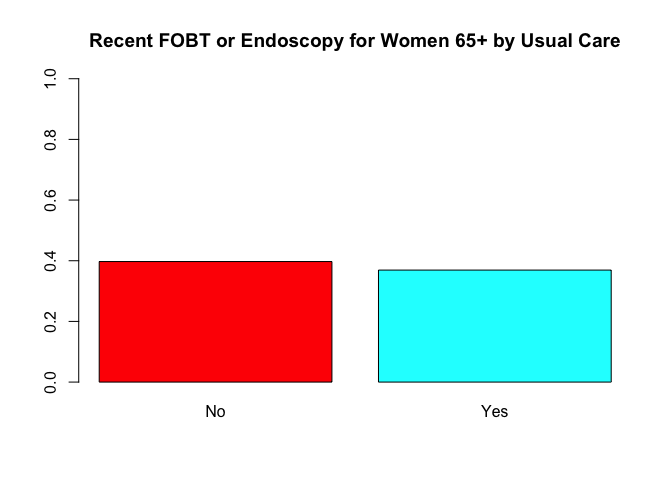

Colorectal Screening
================
Justin Hsie
11/25/2019

``` r
library(tidyverse)
```

    ## ── Attaching packages ─────────────────────────────────────────────── tidyverse 1.2.1 ──

    ## ✔ ggplot2 3.2.1     ✔ purrr   0.3.2
    ## ✔ tibble  2.1.3     ✔ dplyr   0.8.3
    ## ✔ tidyr   1.0.0     ✔ stringr 1.4.0
    ## ✔ readr   1.3.1     ✔ forcats 0.4.0

    ## ── Conflicts ────────────────────────────────────────────────── tidyverse_conflicts() ──
    ## ✖ dplyr::filter() masks stats::filter()
    ## ✖ dplyr::lag()    masks stats::lag()

``` r
library(survey)
```

    ## Loading required package: grid

    ## Loading required package: Matrix

    ## 
    ## Attaching package: 'Matrix'

    ## The following objects are masked from 'package:tidyr':
    ## 
    ##     expand, pack, unpack

    ## Loading required package: survival

    ## 
    ## Attaching package: 'survey'

    ## The following object is masked from 'package:graphics':
    ## 
    ##     dotchart

Data Import

``` r
cancer = read_csv("./data/cancerxx.csv") %>% 
  janitor::clean_names() %>% 
  select(hhx, fmx, fpx, wtfa_sa, strat_p, psu_p, region, hfobhad1, 
         rhfo2_mt, rhfo2yr, rhfo2n, rhfo2t, rhfo2, rhfob3a,
         rhfob3b, hfobrea2, fobhad1, rfob2_mt, rfob2yr,
         rfob2n, rfob2t, rofob3a, rofob3b, rfobres1, colhad, 
         col_mt, colyr, coln, colt, col2, col3a, col3b, colreas, 
         colpay, sighad, sig_mt, sigyr, sign, sigt, sig2, sig3a, sig3b, sigreas)
```

    ## Parsed with column specification:
    ## cols(
    ##   .default = col_double(),
    ##   FPX = col_character(),
    ##   FMX = col_character(),
    ##   FN_AGE10 = col_logical(),
    ##   FN_AGE12 = col_logical(),
    ##   FN_AGE14 = col_logical(),
    ##   FN_AGE15 = col_logical(),
    ##   FN_AGE25 = col_logical(),
    ##   FN_AGE28 = col_logical(),
    ##   FN_AGE33 = col_logical(),
    ##   FN_MAN10 = col_logical(),
    ##   FN_MAN12 = col_logical(),
    ##   FN_MAN14 = col_logical(),
    ##   FN_MAN15 = col_logical(),
    ##   FN_MAN25 = col_logical(),
    ##   FN_MAN28 = col_logical(),
    ##   FN_MAN33 = col_logical(),
    ##   HHX = col_character()
    ## )

    ## See spec(...) for full column specifications.

    ## Warning: 227 parsing failures.
    ##  row      col           expected actual                  file
    ## 5956 FN_AGE10 1/0/T/F/TRUE/FALSE      9 './data/cancerxx.csv'
    ## 5956 FN_AGE12 1/0/T/F/TRUE/FALSE      9 './data/cancerxx.csv'
    ## 5956 FN_AGE14 1/0/T/F/TRUE/FALSE      9 './data/cancerxx.csv'
    ## 5956 FN_AGE15 1/0/T/F/TRUE/FALSE      9 './data/cancerxx.csv'
    ## 5956 FN_AGE25 1/0/T/F/TRUE/FALSE      9 './data/cancerxx.csv'
    ## .... ........ .................. ...... .....................
    ## See problems(...) for more details.

``` r
adult = read_csv("./data/samadult.csv") %>%
  janitor::clean_names() %>% 
  select(hhx, fmx, fpx, ausualpl, ahcplrou, ahcplknd, fla1ar)
```

    ## Parsed with column specification:
    ## cols(
    ##   .default = col_double(),
    ##   FPX = col_character(),
    ##   FMX = col_character(),
    ##   HHX = col_character(),
    ##   CNKIND31 = col_logical(),
    ##   CANAGE2 = col_logical(),
    ##   CANAGE4 = col_logical(),
    ##   CANAGE8 = col_logical(),
    ##   CANAGE9 = col_logical(),
    ##   CANAGE13 = col_logical(),
    ##   CANAGE17 = col_logical(),
    ##   CANAGE19 = col_logical(),
    ##   CANAGE24 = col_logical(),
    ##   CANAGE25 = col_logical(),
    ##   CANAGE27 = col_logical(),
    ##   ALTIME26 = col_logical(),
    ##   ALTIME27 = col_logical(),
    ##   ALTIME29 = col_logical(),
    ##   ALTIME30 = col_logical(),
    ##   ALTIME34 = col_logical(),
    ##   ALUNIT26 = col_logical()
    ##   # ... with 24 more columns
    ## )
    ## See spec(...) for full column specifications.

    ## Warning: 650 parsing failures.
    ##  row      col           expected actual                  file
    ## 1056 ALTIME34 1/0/T/F/TRUE/FALSE     6  './data/samadult.csv'
    ## 1056 ALUNIT34 1/0/T/F/TRUE/FALSE     3  './data/samadult.csv'
    ## 1056 ALDURB34 1/0/T/F/TRUE/FALSE     3  './data/samadult.csv'
    ## 1056 ALCHRC34 1/0/T/F/TRUE/FALSE     2  './data/samadult.csv'
    ## 1101 CANAGE24 1/0/T/F/TRUE/FALSE     35 './data/samadult.csv'
    ## .... ........ .................. ...... .....................
    ## See problems(...) for more details.

``` r
family = read_csv("./data/familyxx.csv") %>%
  janitor::clean_names() %>% 
  select(hhx, fmx, rat_cat4, rat_cat5)
```

    ## Parsed with column specification:
    ## cols(
    ##   .default = col_double(),
    ##   FMX = col_character(),
    ##   HHX = col_character()
    ## )
    ## See spec(...) for full column specifications.

``` r
person = read_csv("./data/personsx.csv") %>%
  janitor::clean_names() %>% 
  select(hhx, fmx, fpx, age_p, educ1, sex, notcov, cover65, cover65o, 
         la1ar, lcondrt, lachronr, hiscodi3, racreci3, cover)
```

    ## Parsed with column specification:
    ## cols(
    ##   .default = col_double(),
    ##   FPX = col_character(),
    ##   AGE_CHG = col_logical(),
    ##   FSPOUS2 = col_character(),
    ##   FCOHAB3 = col_character(),
    ##   FMX = col_character(),
    ##   HHREFLG = col_character(),
    ##   FMREFLG = col_character(),
    ##   FMRPFLG = col_character(),
    ##   FMOTHER1 = col_character(),
    ##   FFATHER1 = col_character(),
    ##   HHX = col_character(),
    ##   LCTIME5 = col_logical(),
    ##   LCUNIT5 = col_logical(),
    ##   LCTIME6 = col_logical(),
    ##   LCUNIT6 = col_logical(),
    ##   LCTIME10 = col_logical(),
    ##   LCUNIT10 = col_logical(),
    ##   LCTIME11 = col_logical(),
    ##   LCUNIT11 = col_logical(),
    ##   LCTIME90 = col_logical()
    ##   # ... with 68 more columns
    ## )
    ## See spec(...) for full column specifications.

    ## Warning: 2523 parsing failures.
    ##  row      col           expected actual                  file
    ## 1265 LCTIME5  1/0/T/F/TRUE/FALSE     96 './data/personsx.csv'
    ## 1265 LCUNIT5  1/0/T/F/TRUE/FALSE     6  './data/personsx.csv'
    ## 1265 LCDURA5  1/0/T/F/TRUE/FALSE     10 './data/personsx.csv'
    ## 1265 LCDURB5  1/0/T/F/TRUE/FALSE     4  './data/personsx.csv'
    ## 1422 LAUNIT31 1/0/T/F/TRUE/FALSE     4  './data/personsx.csv'
    ## .... ........ .................. ...... .....................
    ## See problems(...) for more details.

``` r
col_dat = cancer %>%
  left_join(adult, by = c("hhx", "fmx", "fpx")) %>%
  left_join(person, by = c("hhx", "fmx", "fpx")) %>%
  left_join(family, by = c("hhx", "fmx"))
```

Data Manipulation

``` r
#home stool test within last year
col_dat = col_dat %>%
  mutate(col_2 = if_else(sig3a <= 5, 1, 0))
#rhfob3a <= 1 | col3a <= 5 | 
# create the age category
col_dat = col_dat %>% 
  mutate(age_cat = case_when(age_p >= 25 & age_p < 40 ~ "25–39",
                             age_p >= 40 & age_p < 50 ~ "40–49",
                             age_p >= 50 & age_p < 65 ~ "50–64",
                             age_p >= 65 ~ "65+"))
# create educ category
col_dat = col_dat %>% 
  mutate(educ_cat = case_when(educ1 < 13 ~ "Less than high school",
                              educ1 >= 13 & educ1 < 15 ~ "High school",
                              educ1 >= 15 & educ1 < 18 ~ "Some college",
                              educ1 >= 18 & educ1 <= 21 ~ "College graduate"))

# create financial category
col_dat = col_dat %>% 
  mutate(finc_cat = case_when(rat_cat5 <= 7 |  rat_cat5 %in% c(15, 16) ~ "<200%",
                              rat_cat5 %in% c(8, 9) ~ "200–299%", 
                              rat_cat5 %in% c(10, 11) ~ "300–399%",
                              rat_cat5 >= 18 & educ1 <= 21 ~ "400–499%",
                              rat_cat5 == 14  ~">=500%",
                              rat_cat5 == 17  ~">=200%, no further detail",
                              rat_cat5 %in% c(96, 99) ~ "Unknown"))

# create as usual category
col_dat = col_dat %>% 
  mutate(ausualpl_cat  = case_when(ausualpl == 2 ~ "No",
                                   ausualpl %in% c(1, 3) ~ "Yes",
                                   ausualpl %in% c(7, 8, 9) ~ "Other"))
# coverage status
col_dat = col_dat %>% 
  mutate(cover_cat  = case_when(notcov == 1 | cover == 4 | cover65 == 6 ~ "None",
                                cover == 2 | cover65 %in% 2:4 ~ "Public",
                                cover %in% c(1, 3) | cover65 %in% c(1, 5) ~
                                  "Private/Military"))

# disability
col_dat = col_dat %>% 
  mutate(lcond_chronic_cat = if_else(lcondrt == 1, "Yes", "No"))

# race
col_dat = col_dat %>% 
  mutate(race_cat = case_when(racreci3 == 1 ~ "White",
                              racreci3 == 2 ~ "Black",
                              racreci3 == 3 ~ "Asian",
                              racreci3 == 4 ~ "AN/AI"),
         eth_cat = case_when(hiscodi3 == 1 ~ "Hispanic",
                             hiscodi3 == 2 ~ "Non-Hispanic White",
                             hiscodi3 == 3 ~ "Non-Hispanic Black",
                             hiscodi3 == 4 ~ "Non-Hispanic Asian",
                             hiscodi3 == 5 ~ "Non-Hispanic AN/AI"))
```

Survey Design Men

``` r
col_dat = col_dat %>%
  mutate(domain = if_else(sex == 1 & age_p >= 50, 1, 0))

des = svydesign(ids = ~ psu_p, strata = ~ strat_p, 
                weights = ~ wtfa_sa, nest = TRUE, data = col_dat)
```

Tables Men

``` r
#percentage
age_pct = svyby(~col_2, by = ~domain + age_cat, svymean, na.rm = TRUE, 
                design = des)
age_pct %>% 
  filter(domain == 1) %>% select(-domain) %>% knitr::kable()
```

| age\_cat |    col\_2 |        se |
| :------- | --------: | --------: |
| 50–64    | 0.5090432 | 0.0499276 |
| 65+      | 0.4726019 | 0.0319118 |

``` r
#total
age_tot = svyby(~col_2, by = ~domain + age_cat, svytotal, na.rm = TRUE, 
                design = des)
age_tot %>% 
  filter(domain == 1) %>% select(-domain) %>% knitr::kable()
```

| age\_cat |  col\_2 |       se |
| :------- | ------: | -------: |
| 50–64    |  767994 | 106879.4 |
| 65+      | 1353453 | 124850.6 |

``` r
#education
edu_pct = svyby(~col_2, by = ~domain + educ_cat, svymean, na.rm = TRUE, 
                design = des, vartype = c("se", "ci"))
edu_pct %>% 
  filter(domain == 1) %>% select(-domain) %>% knitr::kable()
```

| educ\_cat             |    col\_2 |        se |     ci\_l |     ci\_u |
| :-------------------- | --------: | --------: | --------: | --------: |
| College graduate      | 0.3796814 | 0.0378574 | 0.3054822 | 0.4538805 |
| High school           | 0.5914825 | 0.0626025 | 0.4687839 | 0.7141812 |
| Less than high school | 0.7275404 | 0.0769088 | 0.5768020 | 0.8782789 |
| Some college          | 0.5481062 | 0.0494392 | 0.4512072 | 0.6450052 |

``` r
#education total
edu_tot = svyby(~col_2, by = ~domain + educ_cat, svytotal, na.rm = TRUE, 
                design = des)
edu_tot %>% 
  filter(domain == 1) %>% select(-domain) %>% knitr::kable()
```

| educ\_cat             | col\_2 |        se |
| :-------------------- | -----: | --------: |
| College graduate      | 836173 | 107836.72 |
| High school           | 454064 |  73656.31 |
| Less than high school | 253243 |  51705.80 |
| Some college          | 577967 |  78251.45 |

``` r
#finc
finc_pct = svyby(~col_2, by = ~domain + finc_cat, svymean, na.rm = TRUE, 
                 design = des, vartype = c("se", "ci"))
finc_pct %>% 
  filter(domain == 1) %>% select(-domain) %>% knitr::kable()
```

| finc\_cat                  |    col\_2 |        se |     ci\_l |     ci\_u |
| :------------------------- | --------: | --------: | --------: | --------: |
| \<200%                     | 0.7139486 | 0.0579534 | 0.6003620 | 0.8275353 |
| \>=200%, no further detail | 0.5487776 | 0.1591498 | 0.2368496 | 0.8607055 |
| \>=500%                    | 0.4217716 | 0.0443596 | 0.3348284 | 0.5087147 |
| 200–299%                   | 0.6874073 | 0.0694352 | 0.5513168 | 0.8234978 |
| 300–399%                   | 0.3797810 | 0.0730280 | 0.2366487 | 0.5229133 |
| 400–499%                   | 0.3659852 | 0.0655457 | 0.2375179 | 0.4944525 |
| Unknown                    | 0.0000000 | 0.0000000 | 0.0000000 | 0.0000000 |

``` r
#finc total
finc_tot = svyby(~col_2, by = ~domain + finc_cat, svytotal, na.rm = TRUE, 
                 design = des)
finc_tot %>% 
  filter(domain == 1) %>% select(-domain) %>% knitr::kable()
```

| finc\_cat                  | col\_2 |        se |
| :------------------------- | -----: | --------: |
| \<200%                     | 442953 |  63731.79 |
| \>=200%, no further detail |  45880 |  17397.83 |
| \>=500%                    | 757983 | 107713.61 |
| 200–299%                   | 365214 |  68287.43 |
| 300–399%                   | 146807 |  33329.50 |
| 400–499%                   | 239160 |  49047.65 |
| Unknown                    |      0 |      0.00 |

``` r
#usual care
ausualp_pct = svyby(~col_2, by = ~domain + ausualpl_cat, svymean, na.rm = TRUE, 
                    design = des, vartype = c("se", "ci"))
ausualp_pct %>% 
  filter(domain == 1) %>% select(-domain) %>% knitr::kable()
```

| ausualpl\_cat |    col\_2 |        se |     ci\_l |     ci\_u |
| :------------ | --------: | --------: | --------: | --------: |
| No            | 0.4696037 | 0.1319166 | 0.2110519 | 0.7281555 |
| Other         | 0.0000000 | 0.0000000 | 0.0000000 | 0.0000000 |
| Yes           | 0.4856989 | 0.0281608 | 0.4305048 | 0.5408929 |

``` r
#usual care total
ausualp_tot = svyby(~col_2, by = ~domain + ausualpl_cat, svytotal, na.rm = TRUE, 
                    design = des)
ausualp_tot %>% 
  filter(domain == 1) %>% select(-domain) %>% knitr::kable()
```

| ausualpl\_cat |  col\_2 |        se |
| :------------ | ------: | --------: |
| No            |   66749 |  17046.89 |
| Other         |       0 |      0.00 |
| Yes           | 2054698 | 159621.65 |

``` r
#health coverage
cover_pct = svyby(~col_2, by = ~domain + cover_cat, svymean, na.rm = TRUE, 
                  design = des, vartype = c("se", "ci"))
cover_pct %>% 
  filter(domain == 1) %>% select(-domain) %>% knitr::kable()
```

| cover\_cat       |    col\_2 |        se |    ci\_l |     ci\_u |
| :--------------- | --------: | --------: | -------: | --------: |
| None             | 0.5222128 | 0.1638534 | 0.201066 | 0.8433595 |
| Private/Military | 0.4507666 | 0.0330948 | 0.385902 | 0.5156312 |
| Public           | 0.5691820 | 0.0460897 | 0.478848 | 0.6595161 |

``` r
#health coverage total
cover_tot = svyby(~col_2, by = ~domain + cover_cat, svytotal, na.rm = TRUE, 
                  design = des)
cover_tot %>% 
  filter(domain == 1) %>% select(-domain) %>% knitr::kable()
```

| cover\_cat       |  col\_2 |        se |
| :--------------- | ------: | --------: |
| None             |   85904 |  33527.25 |
| Private/Military | 1368851 | 129780.49 |
| Public           |  666692 |  79683.86 |

``` r
#chronic conditions
lcond_chronic_pct = svyby(~col_2, by = ~domain + lcond_chronic_cat, svymean, 
                          na.rm = TRUE, design = des, vartype = c("se", "ci"))
lcond_chronic_pct %>% 
  filter(domain == 1) %>% select(-domain) %>% knitr::kable()
```

| lcond\_chronic\_cat |    col\_2 |        se |     ci\_l |     ci\_u |
| :------------------ | --------: | --------: | --------: | --------: |
| No                  | 0.0000000 | 0.0000000 | 0.0000000 | 0.0000000 |
| Yes                 | 0.5548613 | 0.0507334 | 0.4554258 | 0.6542969 |

``` r
#chronic conditions total
lcond_chronic_tot = svyby(~col_2, by = ~domain + lcond_chronic_cat, svytotal, 
                          na.rm = TRUE, design = des)
lcond_chronic_tot %>% 
  filter(domain == 1) %>% select(-domain) %>% knitr::kable()
```

| lcond\_chronic\_cat | col\_2 |       se |
| :------------------ | -----: | -------: |
| No                  |      0 |     0.00 |
| Yes                 | 612841 | 74758.87 |

``` r
#race
race_pct = svyby(~col_2, by = ~domain + race_cat, svymean, na.rm = TRUE, 
                 design = des, vartype = c("se", "ci"))
race_pct %>% 
  filter(domain == 1) %>% select(-domain) %>% knitr::kable()
```

| race\_cat |    col\_2 |        se |     ci\_l |     ci\_u |
| :-------- | --------: | --------: | --------: | --------: |
| AN/AI     | 0.7346278 | 0.2243639 | 0.2948826 | 1.1743730 |
| Asian     | 0.7174921 | 0.1140926 | 0.4938747 | 0.9411095 |
| Black     | 0.6671341 | 0.0978874 | 0.4752783 | 0.8589898 |
| White     | 0.4613144 | 0.0297009 | 0.4031017 | 0.5195271 |

``` r
#race total
race_tot = svyby(~col_2, by = ~domain + race_cat, svytotal, na.rm = TRUE, 
                 design = des)
race_tot %>% 
  filter(domain == 1) %>% select(-domain) %>% knitr::kable()
```

| race\_cat |  col\_2 |         se |
| :-------- | ------: | ---------: |
| AN/AI     |   11804 |   8123.745 |
| Asian     |   99034 |  28034.731 |
| Black     |  209336 |  46240.372 |
| White     | 1801273 | 150402.882 |

``` r
#ethnicity
eth_pct = svyby(~col_2, by = ~domain + eth_cat, svymean, na.rm = TRUE,
                design = des, vartype = c("se", "ci"))
eth_pct %>% 
  filter(domain == 1) %>% select(-domain) %>% knitr::kable()
```

| eth\_cat           |    col\_2 |        se |     ci\_l |     ci\_u |
| :----------------- | --------: | --------: | --------: | --------: |
| Hispanic           | 0.7337482 | 0.1055327 | 0.5269079 | 0.9405885 |
| Non-Hispanic AN/AI | 0.9715226 | 0.0335853 | 0.9056966 | 1.0373486 |
| Non-Hispanic Asian | 0.6855069 | 0.1171363 | 0.4559240 | 0.9150898 |
| Non-Hispanic Black | 0.6635030 | 0.0988686 | 0.4697242 | 0.8572818 |
| Non-Hispanic White | 0.4454137 | 0.0308074 | 0.3850324 | 0.5057951 |

``` r
#ethnicity total
eth_tot = svyby(~col_2, by = ~domain + eth_cat, svytotal, na.rm = TRUE, 
                design = des)
eth_tot %>% 
  filter(domain == 1) %>% select(-domain) %>% knitr::kable()
```

| eth\_cat           |  col\_2 |         se |
| :----------------- | ------: | ---------: |
| Hispanic           |  178146 |  42943.143 |
| Non-Hispanic AN/AI |   11804 |   8123.745 |
| Non-Hispanic Asian |   84996 |  26217.843 |
| Non-Hispanic Black |  205950 |  46116.234 |
| Non-Hispanic White | 1640551 | 145417.115 |

Tables by Age Men

``` r
#education
edu_pct_strat = svyby(~col_2, by = ~domain + age_cat + educ_cat, svymean, 
                      na.rm = TRUE, design = des, vartype = c("se", "ci"))
edu_tab = edu_pct_strat %>% 
  filter(domain == 1) %>% 
  select(-domain, -se) 

edu_tab %>% knitr::kable()
```

| age\_cat | educ\_cat             |    col\_2 |     ci\_l |     ci\_u |
| :------- | :-------------------- | --------: | --------: | --------: |
| 50–64    | College graduate      | 0.3934796 | 0.2545549 | 0.5324043 |
| 65+      | College graduate      | 0.3718878 | 0.2855142 | 0.4582615 |
| 50–64    | High school           | 0.6247351 | 0.3999279 | 0.8495424 |
| 65+      | High school           | 0.5775211 | 0.4369972 | 0.7180449 |
| 50–64    | Less than high school | 0.8667903 | 0.6223344 | 1.1112461 |
| 65+      | Less than high school | 0.6878984 | 0.5126912 | 0.8631055 |
| 50–64    | Some college          | 0.6018226 | 0.4325210 | 0.7711241 |
| 65+      | Some college          | 0.5139818 | 0.3986636 | 0.6293001 |

``` r
#education total
edu_tot_strat = svyby(~col_2, by = ~domain + age_cat + educ_cat, svytotal, 
                      na.rm = TRUE, design = des) %>%
  filter(domain == 1) %>%
  select(-domain, -se) %>%
  rename(num = col_2)
edu_tot_strat %>% knitr::kable()
```

| age\_cat | educ\_cat             |    num |
| :------- | :-------------------- | -----: |
| 50–64    | College graduate      | 312784 |
| 65+      | College graduate      | 523389 |
| 50–64    | High school           | 141818 |
| 65+      | High school           | 312246 |
| 50–64    | Less than high school |  66859 |
| 65+      | Less than high school | 186384 |
| 50–64    | Some college          | 246533 |
| 65+      | Some college          | 331434 |

``` r
num = edu_tot_strat$num

edu_tab = cbind(edu_tab, num) 

#finc
finc_pct_strat = svyby(~col_2, by = ~domain + age_cat + finc_cat, svymean, 
                       na.rm = TRUE, design = des, vartype = c("se", "ci"))

finc_tab = finc_pct_strat %>% 
  filter(domain == 1) %>% 
  select(-domain, -se) 

finc_tab %>% knitr::kable()
```

| age\_cat | finc\_cat                  |    col\_2 |     ci\_l |     ci\_u |
| :------- | :------------------------- | --------: | --------: | --------: |
| 50–64    | \<200%                     | 0.8022877 | 0.6647796 | 0.9397958 |
| 65+      | \<200%                     | 0.6615871 | 0.5140544 | 0.8091198 |
| 50–64    | \>=200%, no further detail | 1.0000000 | 1.0000000 | 1.0000000 |
| 65+      | \>=200%, no further detail | 0.4579574 | 0.1229833 | 0.7929314 |
| 50–64    | \>=500%                    | 0.4404002 | 0.2826068 | 0.5981937 |
| 65+      | \>=500%                    | 0.4114804 | 0.3184882 | 0.5044726 |
| 50–64    | 200–299%                   | 0.7078311 | 0.4436180 | 0.9720442 |
| 65+      | 200–299%                   | 0.6755125 | 0.5234710 | 0.8275540 |
| 50–64    | 300–399%                   | 0.4946503 | 0.1876688 | 0.8016319 |
| 65+      | 300–399%                   | 0.3405463 | 0.1814174 | 0.4996751 |
| 50–64    | 400–499%                   | 0.2755255 | 0.0780582 | 0.4729927 |
| 65+      | 400–499%                   | 0.4129197 | 0.2570732 | 0.5687663 |
| 50–64    | Unknown                    | 0.0000000 | 0.0000000 | 0.0000000 |
| 65+      | Unknown                    | 0.0000000 | 0.0000000 | 0.0000000 |

``` r
#finc total
finc_tot_strat = svyby(~col_2, by = ~domain + age_cat + finc_cat, svytotal, 
                       na.rm = TRUE, design = des) %>%
  filter(domain == 1) %>%
  select(-domain, -se) %>%
  rename(num = col_2)

num = finc_tot_strat$num

finc_tab = cbind(finc_tab, num)

#usual care
ausualp_pct_strat = svyby(~col_2, by = ~domain + age_cat + ausualpl_cat, svymean, 
                          na.rm = TRUE, design = des, vartype = c("se", "ci"))
usual_tab = ausualp_pct_strat %>% 
  filter(domain == 1) %>% 
  select(-domain, -se) 

usual_tab %>% knitr::kable()
```

| age\_cat | ausualpl\_cat |    col\_2 |     ci\_l |     ci\_u |
| :------- | :------------ | --------: | --------: | --------: |
| 50–64    | No            | 0.4145431 | 0.0959166 | 0.7331696 |
| 65+      | No            | 0.6437630 | 0.2750277 | 1.0124983 |
| 50–64    | Other         | 0.0000000 | 0.0000000 | 0.0000000 |
| 65+      | Other         | 0.0000000 | 0.0000000 | 0.0000000 |
| 50–64    | Yes           | 0.5163293 | 0.4136948 | 0.6189637 |
| 65+      | Yes           | 0.4705367 | 0.4077152 | 0.5333582 |

``` r
#usual care total
ausualp_tot_strat = svyby(~col_2, by = ~domain + age_cat + ausualpl_cat, svytotal, 
                          na.rm = TRUE, design = des) %>%
  filter(domain == 1) %>%
  select(-domain, -se) %>%
  rename(num = col_2)

num = ausualp_tot_strat$num

usual_tab = cbind(usual_tab, num)

#health coverage
cover_pct_strat = svyby(~col_2, by = ~domain + age_cat + cover_cat, svymean, 
                        na.rm = TRUE, design = des, vartype = c("se", "ci"))
ins_tab = cover_pct_strat %>% 
  filter(domain == 1) %>% 
  select(-domain, -se)

ins_tab %>% knitr::kable()
```

| age\_cat | cover\_cat       |    col\_2 |     ci\_l |     ci\_u |
| :------- | :--------------- | --------: | --------: | --------: |
| 50–64    | None             | 0.5028181 | 0.1740094 | 0.8316269 |
| 65+      | None             | 1.0000000 | 1.0000000 | 1.0000000 |
| 50–64    | Private/Military | 0.4862496 | 0.3819805 | 0.5905187 |
| 65+      | Private/Military | 0.4254038 | 0.3487178 | 0.5020897 |
| 50–64    | Public           | 0.8608861 | 0.6878839 | 1.0338883 |
| 65+      | Public           | 0.5464149 | 0.4490361 | 0.6437937 |

``` r
#health coverage total
cover_tot_strat = svyby(~col_2, by = ~domain + age_cat + cover_cat, svytotal, 
                        na.rm = TRUE, design = des) %>%
  filter(domain == 1) %>%
  select(-domain, -se) %>%
  rename(num = col_2)

num = cover_tot_strat$num

ins_tab = cbind(ins_tab, num)

#chronic conditions
lcond_chronic_pct_strat = svyby(~col_2, by = ~domain + age_cat + lcond_chronic_cat,
                                svymean, na.rm = TRUE, design = des,
                                vartype = c("se", "ci"))
dis_tab = lcond_chronic_pct_strat %>% 
  filter(domain == 1) %>% 
  select(-domain, -se) 

dis_tab %>% knitr::kable()
```

| age\_cat | lcond\_chronic\_cat |    col\_2 |     ci\_l |     ci\_u |
| :------- | :------------------ | --------: | --------: | --------: |
| 50–64    | No                  | 0.0000000 | 0.0000000 | 0.0000000 |
| 65+      | No                  | 0.0000000 | 0.0000000 | 0.0000000 |
| 50–64    | Yes                 | 0.5020555 | 0.3106547 | 0.6934562 |
| 65+      | Yes                 | 0.5811203 | 0.4637524 | 0.6984882 |

``` r
#chronic conditions total
lcond_chronic_tot_strat = svyby(~col_2, by = ~domain + age_cat + lcond_chronic_cat,
                                svytotal, na.rm = TRUE, design = des) %>%
  filter(domain == 1) %>%
  select(-domain, -se) %>%
  rename(num = col_2)

num = lcond_chronic_tot_strat$num

dis_tab = cbind(dis_tab, num)

#race
race_pct_strat = svyby(~col_2, by = ~domain + age_cat + race_cat, svymean, 
                       na.rm = TRUE, design = des, vartype = c("se", "ci"))
race_tab = race_pct_strat %>% 
  filter(domain == 1) %>% 
  select(-domain, -se) 

race_tab %>% knitr::kable()
```

| age\_cat | race\_cat |    col\_2 |       ci\_l |     ci\_u |
| :------- | :-------- | --------: | ----------: | --------: |
| 50–64    | AN/AI     | 0.5760167 | \-0.0693746 | 1.2214080 |
| 65+      | AN/AI     | 1.0000000 |   1.0000000 | 1.0000000 |
| 50–64    | Asian     | 0.6572212 |   0.2768542 | 1.0375882 |
| 65+      | Asian     | 0.7421938 |   0.4878047 | 0.9965829 |
| 50–64    | Black     | 0.6212094 |   0.3374347 | 0.9049841 |
| 65+      | Black     | 0.7098415 |   0.5007593 | 0.9189237 |
| 50–64    | White     | 0.4910076 |   0.3805858 | 0.6014294 |
| 65+      | White     | 0.4463688 |   0.3806532 | 0.5120844 |

``` r
#race total
race_tot_strat = svyby(~col_2, by = ~domain + age_cat + race_cat, svytotal, 
                       na.rm = TRUE, design = des) %>%
  filter(domain == 1) %>%
  select(-domain, -se) %>%
  rename(num = col_2)

num = race_tot_strat$num

race_tab = cbind(race_tab, num)

#ethnicity
eth_pct_strat = svyby(~col_2, by = ~domain + age_cat + eth_cat, svymean, 
                      na.rm = TRUE, design = des, vartype = c("se", "ci"))
eth_tab = eth_pct_strat %>% 
  filter(domain == 1) %>% 
  select(-domain, -se) 

eth_tab %>% knitr::kable()
```

| age\_cat | eth\_cat           |    col\_2 |     ci\_l |     ci\_u |
| :------- | :----------------- | --------: | --------: | --------: |
| 50–64    | Hispanic           | 0.4481449 | 0.1001979 | 0.7960919 |
| 65+      | Hispanic           | 0.9216780 | 0.8268754 | 1.0164807 |
| 50–64    | Non-Hispanic AN/AI | 0.9436390 | 0.7974406 | 1.0898374 |
| 65+      | Non-Hispanic AN/AI | 1.0000000 | 1.0000000 | 1.0000000 |
| 50–64    | Non-Hispanic Asian | 0.6572212 | 0.2768542 | 1.0375882 |
| 65+      | Non-Hispanic Asian | 0.6990401 | 0.4132550 | 0.9848252 |
| 50–64    | Non-Hispanic Black | 0.6212094 | 0.3374347 | 0.9049841 |
| 65+      | Non-Hispanic Black | 0.7036702 | 0.4907218 | 0.9166187 |
| 50–64    | Non-Hispanic White | 0.4928236 | 0.3782252 | 0.6074220 |
| 65+      | Non-Hispanic White | 0.4220790 | 0.3540409 | 0.4901172 |

``` r
#ethnicity total
eth_tot_strat = svyby(~col_2, by = ~domain + age_cat + eth_cat, svytotal, 
                      na.rm = TRUE, design = des) %>%
  filter(domain == 1) %>%
  select(-domain, -se) %>%
  rename(num = col_2)

num = eth_tot_strat$num

eth_tab = cbind(eth_tab, num)

#total gotten fobt
total = svyby(~col_2, by = ~domain + age_cat, svymean, na.rm = TRUE, 
              design = des, vartype = c("se", "ci"))

tot_tab = total %>% 
  filter(domain == 1) %>% 
  select(-domain, -se) 

tot_tab %>% knitr::kable()
```

| age\_cat |    col\_2 |     ci\_l |     ci\_u |
| :------- | --------: | --------: | --------: |
| 50–64    | 0.5090432 | 0.4111869 | 0.6068995 |
| 65+      | 0.4726019 | 0.4100560 | 0.5351478 |

``` r
tot_num = svyby(~col_2, by = ~domain + age_cat, svytotal, na.rm = TRUE, 
                design = des) %>%
  filter(domain == 1) %>%
  select(-domain, -se) %>%
  rename(num = col_2)

num = tot_num$num

tot_tab = cbind(tot_tab, num)
```

Combine all tables Men

``` r
tot_tab2 = tot_tab %>%
  mutate(type = "Total",
         level = "-")

edu_tab2 = edu_tab %>%
  mutate(type = "Education") %>%
  rename(level = educ_cat)

finc_tab2 = finc_tab %>%
  mutate(type = "Family Income Poverty Ratio") %>%
  rename(level = finc_cat)

usual_tab2 = usual_tab %>%
  mutate(type = "Usual Source of Care") %>%
  rename(level = ausualpl_cat)

ins_tab2 = ins_tab %>%
  mutate(type = "Insurance Type") %>%
  rename(level = cover_cat)

dis_tab2 = dis_tab %>%
  mutate(type = "Chronic Disability") %>%
  rename(level = lcond_chronic_cat)

eth_tab2 = eth_tab %>%
  mutate(type = "Ethnicity") %>%
  rename(level = eth_cat)

race_tab2 = race_tab %>%
  mutate(type = "Race") %>%
  rename(level = race_cat)

# create table of percentages of men who have gotten fobts within the last year
tab_one = rbind(tot_tab2, edu_tab2, finc_tab2, usual_tab2, ins_tab2, dis_tab2, eth_tab2, race_tab2) %>%
  mutate(col_2 = round(col_2*100, 2),
         ci_l = round(ci_l*100, 2),
         ci_u = round(ci_u*100, 2),
         CI = str_c(ci_l, ", ", ci_u)) %>%
  rename(Percent = col_2,
         No = num) %>%
  select(-ci_l, -ci_u) %>%
  pivot_wider(names_from = age_cat, values_from = c(No, Percent, CI)) %>%
  janitor::clean_names() %>%
  select(type, level, no_50_64, percent_50_64, ci_50_64, everything())
```

Survey Design Women

``` r
col_datf = col_dat %>%
  mutate(domain = if_else(sex == 2 & age_p >= 50, 1, 0))

desf = svydesign(ids = ~ psu_p, strata = ~ strat_p, 
                weights = ~ wtfa_sa, nest = TRUE, data = col_datf)
```

Tables Women

``` r
#percentage
age_pctf = svyby(~col_2, by = ~domain + age_cat, svymean, na.rm = TRUE, 
                design = desf)
age_pctf %>% 
  filter(domain == 1) %>% select(-domain) %>% knitr::kable()
```

| age\_cat |    col\_2 |        se |
| :------- | --------: | --------: |
| 50–64    | 0.4403833 | 0.0437305 |
| 65+      | 0.3694593 | 0.0288263 |

``` r
#total
age_totf = svyby(~col_2, by = ~domain + age_cat, svytotal, na.rm = TRUE, 
                design = desf)
age_totf %>% 
  filter(domain == 1) %>% select(-domain) %>% knitr::kable()
```

| age\_cat |  col\_2 |        se |
| :------- | ------: | --------: |
| 50–64    |  708933 |  94021.97 |
| 65+      | 1066248 | 112124.64 |

``` r
#education
edu_pctf = svyby(~col_2, by = ~domain + educ_cat, svymean, na.rm = TRUE, 
                design = desf, vartype = c("se", "ci"))
edu_pctf %>% 
  filter(domain == 1) %>% select(-domain) %>% knitr::kable()
```

| educ\_cat             |    col\_2 |        se |     ci\_l |     ci\_u |
| :-------------------- | --------: | --------: | --------: | --------: |
| College graduate      | 0.4004689 | 0.0366332 | 0.3286692 | 0.4722685 |
| High school           | 0.2750171 | 0.0417551 | 0.1931787 | 0.3568555 |
| Less than high school | 0.6153344 | 0.0776064 | 0.4632286 | 0.7674402 |
| Some college          | 0.4081862 | 0.0444348 | 0.3210955 | 0.4952769 |

``` r
#education total
edu_totf = svyby(~col_2, by = ~domain + educ_cat, svytotal, na.rm = TRUE, 
                design = desf)
edu_totf %>% 
  filter(domain == 1) %>% select(-domain) %>% knitr::kable()
```

| educ\_cat             | col\_2 |       se |
| :-------------------- | -----: | -------: |
| College graduate      | 651715 | 84176.13 |
| High school           | 267986 | 50484.29 |
| Less than high school | 229233 | 45695.74 |
| Some college          | 613292 | 97517.82 |

``` r
#finc
finc_pctf = svyby(~col_2, by = ~domain + finc_cat, svymean, na.rm = TRUE, 
                 design = desf, vartype = c("se", "ci"))
finc_pctf %>% 
  filter(domain == 1) %>% select(-domain) %>% knitr::kable()
```

| finc\_cat                  |    col\_2 |        se |       ci\_l |     ci\_u |
| :------------------------- | --------: | --------: | ----------: | --------: |
| \<200%                     | 0.4725168 | 0.0465361 |   0.3813077 | 0.5637258 |
| \>=200%, no further detail | 0.2373311 | 0.1024451 |   0.0365425 | 0.4381198 |
| \>=500%                    | 0.4154576 | 0.0450232 |   0.3272136 | 0.5037015 |
| 200–299%                   | 0.3858268 | 0.0731679 |   0.2424204 | 0.5292331 |
| 300–399%                   | 0.3412610 | 0.0716755 |   0.2007796 | 0.4817424 |
| 400–499%                   | 0.3001494 | 0.0621264 |   0.1783840 | 0.4219148 |
| Unknown                    | 0.4410668 | 0.3486416 | \-0.2422583 | 1.1243918 |

``` r
#finc total
finc_totf = svyby(~col_2, by = ~domain + finc_cat, svytotal, na.rm = TRUE, 
                 design = desf)
finc_totf %>% 
  filter(domain == 1) %>% select(-domain) %>% knitr::kable()
```

| finc\_cat                  | col\_2 |       se |
| :------------------------- | -----: | -------: |
| \<200%                     | 447583 | 60275.05 |
| \>=200%, no further detail |  24035 | 11663.62 |
| \>=500%                    | 599202 | 91929.22 |
| 200–299%                   | 218589 | 48949.30 |
| 300–399%                   | 136085 | 36129.78 |
| 400–499%                   | 205319 | 47505.42 |
| Unknown                    |   4730 |  4730.00 |

``` r
#usual care
ausualp_pctf = svyby(~col_2, by = ~domain + ausualpl_cat, svymean, na.rm = TRUE, 
                    design = desf, vartype = c("se", "ci"))
ausualp_pctf %>% 
  filter(domain == 1) %>% select(-domain) %>% knitr::kable()
```

| ausualpl\_cat |    col\_2 |        se |     ci\_l |     ci\_u |
| :------------ | --------: | --------: | --------: | --------: |
| No            | 0.3410967 | 0.1478316 | 0.0513521 | 0.6308414 |
| Other         | 0.0000000 | 0.0000000 | 0.0000000 | 0.0000000 |
| Yes           | 0.3957445 | 0.0232440 | 0.3501871 | 0.4413018 |

``` r
#usual care total
ausualp_totf = svyby(~col_2, by = ~domain + ausualpl_cat, svytotal, na.rm = TRUE, 
                    design = desf)
ausualp_totf %>% 
  filter(domain == 1) %>% select(-domain) %>% knitr::kable()
```

| ausualpl\_cat |  col\_2 |        se |
| :------------ | ------: | --------: |
| No            |   24956 |  12587.93 |
| Other         |       0 |      0.00 |
| Yes           | 1750225 | 142619.65 |

``` r
#health coverage
cover_pctf = svyby(~col_2, by = ~domain + cover_cat, svymean, na.rm = TRUE, 
                  design = desf, vartype = c("se", "ci"))
cover_pctf %>% 
  filter(domain == 1) %>% select(-domain) %>% knitr::kable()
```

| cover\_cat       |    col\_2 |        se |       ci\_l |     ci\_u |
| :--------------- | --------: | --------: | ----------: | --------: |
| None             | 0.3889338 | 0.2144349 | \-0.0313508 | 0.8092184 |
| Private/Military | 0.3437796 | 0.0274922 |   0.2898959 | 0.3976633 |
| Public           | 0.5068786 | 0.0425316 |   0.4235182 | 0.5902391 |

``` r
#health coverage total
cover_totf = svyby(~col_2, by = ~domain + cover_cat, svytotal, na.rm = TRUE, 
                  design = desf)
cover_totf %>% 
  filter(domain == 1) %>% select(-domain) %>% knitr::kable()
```

| cover\_cat       |  col\_2 |        se |
| :--------------- | ------: | --------: |
| None             |   16343 |  10527.26 |
| Private/Military | 1053712 | 110474.64 |
| Public           |  702622 |  93126.05 |

``` r
#chronic conditions
lcond_chronic_pctf = svyby(~col_2, by = ~domain + lcond_chronic_cat, svymean, 
                          na.rm = TRUE, design = desf, vartype = c("se", "ci"))
lcond_chronic_pctf %>% 
  filter(domain == 1) %>% select(-domain) %>% knitr::kable()
```

| lcond\_chronic\_cat |    col\_2 |        se |     ci\_l |     ci\_u |
| :------------------ | --------: | --------: | --------: | --------: |
| No                  | 0.5613002 | 0.1804988 | 0.2075291 | 0.9150714 |
| Yes                 | 0.4081711 | 0.0429342 | 0.3240216 | 0.4923207 |

``` r
#chronic conditions total
lcond_chronic_totf = svyby(~col_2, by = ~domain + lcond_chronic_cat, svytotal, 
                          na.rm = TRUE, design = desf)
lcond_chronic_totf %>% 
  filter(domain == 1) %>% select(-domain) %>% knitr::kable()
```

| lcond\_chronic\_cat | col\_2 |       se |
| :------------------ | -----: | -------: |
| No                  |  38714 | 22047.56 |
| Yes                 | 511807 | 71025.66 |

``` r
#race
race_pctf = svyby(~col_2, by = ~domain + race_cat, svymean, na.rm = TRUE, 
                 design = desf, vartype = c("se", "ci"))
race_pctf %>% 
  filter(domain == 1) %>% select(-domain) %>% knitr::kable()
```

| race\_cat |    col\_2 |        se |     ci\_l |     ci\_u |
| :-------- | --------: | --------: | --------: | --------: |
| AN/AI     | 0.4694312 | 0.2352741 | 0.0083025 | 0.9305599 |
| Asian     | 0.5593918 | 0.1332854 | 0.2981573 | 0.8206263 |
| Black     | 0.4546471 | 0.0682779 | 0.3208248 | 0.5884695 |
| White     | 0.3857167 | 0.0243298 | 0.3380312 | 0.4334023 |

``` r
#race total
race_totf = svyby(~col_2, by = ~domain + race_cat, svytotal, na.rm = TRUE, 
                 design = desf)
race_totf %>% 
  filter(domain == 1) %>% select(-domain) %>% knitr::kable()
```

| race\_cat |  col\_2 |         se |
| :-------- | ------: | ---------: |
| AN/AI     |   14988 |   8154.756 |
| Asian     |   61000 |  22431.997 |
| Black     |  128436 |  28300.724 |
| White     | 1570757 | 138857.438 |

``` r
#ethnicity
eth_pctf = svyby(~col_2, by = ~domain + eth_cat, svymean, na.rm = TRUE,
                design = desf, vartype = c("se", "ci"))
eth_pctf %>% 
  filter(domain == 1) %>% select(-domain) %>% knitr::kable()
```

| eth\_cat           |    col\_2 |        se |       ci\_l |     ci\_u |
| :----------------- | --------: | --------: | ----------: | --------: |
| Hispanic           | 0.7355776 | 0.0727640 |   0.5929629 | 0.8781924 |
| Non-Hispanic AN/AI | 0.4224147 | 0.2421274 | \-0.0521463 | 0.8969757 |
| Non-Hispanic Asian | 0.5593918 | 0.1332854 |   0.2981573 | 0.8206263 |
| Non-Hispanic Black | 0.4584789 | 0.0686935 |   0.3238421 | 0.5931158 |
| Non-Hispanic White | 0.3635859 | 0.0249572 |   0.3146707 | 0.4125011 |

``` r
#ethnicity total
eth_totf = svyby(~col_2, by = ~domain + eth_cat, svytotal, na.rm = TRUE, 
                design = desf)
eth_totf %>% 
  filter(domain == 1) %>% select(-domain) %>% knitr::kable()
```

| eth\_cat           |  col\_2 |         se |
| :----------------- | ------: | ---------: |
| Hispanic           |  179784 |  38678.060 |
| Non-Hispanic AN/AI |   12389 |   7729.505 |
| Non-Hispanic Asian |   61000 |  22431.997 |
| Non-Hispanic Black |  128436 |  28300.724 |
| Non-Hispanic White | 1393572 | 131003.912 |

Tables by Age Women

``` r
#education
edu_pct_stratf = svyby(~col_2, by = ~domain + age_cat + educ_cat, svymean, 
                      na.rm = TRUE, design = desf, vartype = c("se", "ci"))
edu_tabf = edu_pct_stratf %>% 
  filter(domain == 1) %>% 
  select(-domain, -se) 

edu_tabf %>% knitr::kable()
```

| age\_cat | educ\_cat             |    col\_2 |     ci\_l |     ci\_u |
| :------- | :-------------------- | --------: | --------: | --------: |
| 50–64    | College graduate      | 0.4612067 | 0.3359523 | 0.5864610 |
| 65+      | College graduate      | 0.3546536 | 0.2621159 | 0.4471913 |
| 50–64    | High school           | 0.2713114 | 0.1007740 | 0.4418489 |
| 65+      | High school           | 0.2766490 | 0.1779643 | 0.3753337 |
| 50–64    | Less than high school | 0.5789444 | 0.3145547 | 0.8433341 |
| 65+      | Less than high school | 0.6375381 | 0.4549084 | 0.8201678 |
| 50–64    | Some college          | 0.4748641 | 0.3285467 | 0.6211814 |
| 65+      | Some college          | 0.3777414 | 0.2751909 | 0.4802919 |

``` r
#education total
edu_tot_stratf = svyby(~col_2, by = ~domain + age_cat + educ_cat, svytotal, 
                      na.rm = TRUE, design = desf) %>%
  filter(domain == 1) %>%
  select(-domain, -se) %>%
  rename(num = col_2)
edu_tot_stratf %>% knitr::kable()
```

| age\_cat | educ\_cat             |    num |
| :------- | :-------------------- | -----: |
| 50–64    | College graduate      | 322722 |
| 65+      | College graduate      | 328993 |
| 50–64    | High school           |  80831 |
| 65+      | High school           | 187155 |
| 50–64    | Less than high school |  81729 |
| 65+      | Less than high school | 147504 |
| 50–64    | Some college          | 223651 |
| 65+      | Some college          | 389641 |

``` r
numf = edu_tot_stratf$num

edu_tabf = cbind(edu_tabf, numf) 

#finc
finc_pct_stratf = svyby(~col_2, by = ~domain + age_cat + finc_cat, svymean, 
                       na.rm = TRUE, design = desf, vartype = c("se", "ci"))

finc_tabf = finc_pct_stratf %>% 
  filter(domain == 1) %>% 
  select(-domain, -se) 

finc_tabf %>% knitr::kable()
```

| age\_cat | finc\_cat                  |    col\_2 |       ci\_l |     ci\_u |
| :------- | :------------------------- | --------: | ----------: | --------: |
| 50–64    | \<200%                     | 0.5275102 |   0.3797542 | 0.6752662 |
| 65+      | \<200%                     | 0.4341948 |   0.3173093 | 0.5510803 |
| 50–64    | \>=200%, no further detail | 0.0000000 |   0.0000000 | 0.0000000 |
| 65+      | \>=200%, no further detail | 0.2420175 |   0.0373190 | 0.4467160 |
| 50–64    | \>=500%                    | 0.5001973 |   0.3608190 | 0.6395755 |
| 65+      | \>=500%                    | 0.3513782 |   0.2365288 | 0.4662276 |
| 50–64    | 200–299%                   | 0.3117084 |   0.0924181 | 0.5309987 |
| 65+      | 200–299%                   | 0.4167006 |   0.2452823 | 0.5881189 |
| 50–64    | 300–399%                   | 0.4373139 |   0.1316581 | 0.7429698 |
| 65+      | 300–399%                   | 0.3059707 |   0.1521193 | 0.4598220 |
| 50–64    | 400–499%                   | 0.2510218 |   0.0426468 | 0.4593968 |
| 65+      | 400–499%                   | 0.3234325 |   0.1821989 | 0.4646661 |
| 50–64    | Unknown                    | 0.0000000 |   0.0000000 | 0.0000000 |
| 65+      | Unknown                    | 0.4410668 | \-0.2422583 | 1.1243918 |

``` r
#finc total
finc_tot_stratf = svyby(~col_2, by = ~domain + age_cat + finc_cat, svytotal, 
                       na.rm = TRUE, design = desf) %>%
  filter(domain == 1) %>%
  select(-domain, -se) %>%
  rename(num = col_2)

numf = finc_tot_stratf$num

finc_tabf = cbind(finc_tabf, numf)

#usual care
ausualp_pct_stratf = svyby(~col_2, by = ~domain + age_cat + ausualpl_cat, svymean, 
                          na.rm = TRUE, design = desf, vartype = c("se", "ci"))
usual_tabf = ausualp_pct_stratf %>% 
  filter(domain == 1) %>% 
  select(-domain, -se) 

usual_tabf %>% knitr::kable()
```

| age\_cat | ausualpl\_cat |    col\_2 |       ci\_l |     ci\_u |
| :------- | :------------ | --------: | ----------: | --------: |
| 50–64    | No            | 0.3072832 | \-0.0186045 | 0.6331709 |
| 65+      | No            | 0.3973426 | \-0.1043994 | 0.8990846 |
| 50–64    | Other         | 0.0000000 |   0.0000000 | 0.0000000 |
| 65+      | Other         | 0.0000000 |   0.0000000 | 0.0000000 |
| 50–64    | Yes           | 0.4442717 |   0.3564358 | 0.5321076 |
| 65+      | Yes           | 0.3691913 |   0.3126696 | 0.4257130 |

``` r
#usual care total
ausualp_tot_stratf = svyby(~col_2, by = ~domain + age_cat + ausualpl_cat, svytotal, 
                          na.rm = TRUE, design = desf) %>%
  filter(domain == 1) %>%
  select(-domain, -se) %>%
  rename(num = col_2)

numf = ausualp_tot_stratf$num

usual_tabf = cbind(usual_tabf, numf)

#health coverage
cover_pct_stratf = svyby(~col_2, by = ~domain + age_cat + cover_cat, svymean, 
                        na.rm = TRUE, design = desf, vartype = c("se", "ci"))
ins_tabf = cover_pct_stratf %>% 
  filter(domain == 1) %>% 
  select(-domain, -se)

ins_tabf %>% knitr::kable()
```

| age\_cat | cover\_cat       |    col\_2 |       ci\_l |     ci\_u |
| :------- | :--------------- | --------: | ----------: | --------: |
| 50–64    | None             | 0.3000304 | \-0.1304975 | 0.7305582 |
| 65+      | None             | 0.9433442 |   0.7952025 | 1.0914860 |
| 50–64    | Private/Military | 0.4159078 |   0.3236644 | 0.5081511 |
| 65+      | Private/Military | 0.2826394 |   0.2158271 | 0.3494517 |
| 50–64    | Public           | 0.6763234 |   0.4645752 | 0.8880716 |
| 65+      | Public           | 0.4836030 |   0.3978323 | 0.5693737 |

``` r
#health coverage total
cover_tot_stratf = svyby(~col_2, by = ~domain + age_cat + cover_cat, svytotal, 
                        na.rm = TRUE, design = desf) %>%
  filter(domain == 1) %>%
  select(-domain, -se) %>%
  rename(num = col_2)

numf = cover_tot_stratf$num

ins_tabf = cbind(ins_tabf, numf)

#chronic conditions
lcond_chronic_pct_stratf = svyby(~col_2, by = ~domain + age_cat + lcond_chronic_cat,
                                svymean, na.rm = TRUE, design = desf,
                                vartype = c("se", "ci"))
dis_tabf = lcond_chronic_pct_stratf %>% 
  filter(domain == 1) %>% 
  select(-domain, -se) 

dis_tabf %>% knitr::kable()
```

| age\_cat | lcond\_chronic\_cat |    col\_2 |       ci\_l |     ci\_u |
| :------- | :------------------ | --------: | ----------: | --------: |
| 50–64    | No                  | 0.4812283 | \-0.0012604 | 0.9637170 |
| 65+      | No                  | 0.6805110 |   0.1514256 | 1.2095963 |
| 50–64    | Yes                 | 0.3947941 |   0.2401523 | 0.5494360 |
| 65+      | Yes                 | 0.4148712 |   0.3159236 | 0.5138189 |

``` r
#chronic conditions total
lcond_chronic_tot_stratf = svyby(~col_2, by = ~domain + age_cat + lcond_chronic_cat,
                                svytotal, na.rm = TRUE, design = desf) %>%
  filter(domain == 1) %>%
  select(-domain, -se) %>%
  rename(num = col_2)

numf = lcond_chronic_tot_stratf$num

dis_tabf = cbind(dis_tabf, numf)

#race
race_pct_stratf = svyby(~col_2, by = ~domain + age_cat + race_cat, svymean, 
                       na.rm = TRUE, design = desf, vartype = c("se", "ci"))
race_tabf = race_pct_stratf %>% 
  filter(domain == 1) %>% 
  select(-domain, -se) 

race_tabf %>% knitr::kable()
```

| age\_cat | race\_cat |    col\_2 |       ci\_l |     ci\_u |
| :------- | :-------- | --------: | ----------: | --------: |
| 50–64    | AN/AI     | 0.3239858 | \-0.1553078 | 0.8032794 |
| 65+      | AN/AI     | 0.9707521 |   0.9018669 | 1.0396372 |
| 50–64    | Asian     | 0.6513797 |   0.3178404 | 0.9849189 |
| 65+      | Asian     | 0.5026467 |   0.1386208 | 0.8666725 |
| 50–64    | Black     | 0.5208806 |   0.2675304 | 0.7742308 |
| 65+      | Black     | 0.4105998 |   0.2596590 | 0.5615405 |
| 50–64    | White     | 0.4299121 |   0.3373735 | 0.5224507 |
| 65+      | White     | 0.3617824 |   0.3026004 | 0.4209643 |

``` r
#race total
race_tot_stratf = svyby(~col_2, by = ~domain + age_cat + race_cat, svytotal, 
                       na.rm = TRUE, design = desf) %>%
  filter(domain == 1) %>%
  select(-domain, -se) %>%
  rename(num = col_2)

numf = race_tot_stratf$num

race_tabf = cbind(race_tabf, numf)

#ethnicity
eth_pct_stratf = svyby(~col_2, by = ~domain + age_cat + eth_cat, svymean, 
                      na.rm = TRUE, design = desf, vartype = c("se", "ci"))
eth_tabf = eth_pct_stratf %>% 
  filter(domain == 1) %>% 
  select(-domain, -se) 

eth_tabf %>% knitr::kable()
```

| age\_cat | eth\_cat           |    col\_2 |       ci\_l |     ci\_u |
| :------- | :----------------- | --------: | ----------: | --------: |
| 50–64    | Hispanic           | 0.7481941 |   0.5315358 | 0.9648524 |
| 65+      | Hispanic           | 0.7210480 |   0.5365327 | 0.9055632 |
| 50–64    | Non-Hispanic AN/AI | 0.3239858 | \-0.1553078 | 0.8032794 |
| 65+      | Non-Hispanic AN/AI | 0.9541585 |   0.8329194 | 1.0753976 |
| 50–64    | Non-Hispanic Asian | 0.6513797 |   0.3178404 | 0.9849189 |
| 65+      | Non-Hispanic Asian | 0.5026467 |   0.1386208 | 0.8666725 |
| 50–64    | Non-Hispanic Black | 0.5208806 |   0.2675304 | 0.7742308 |
| 65+      | Non-Hispanic Black | 0.4163942 |   0.2640327 | 0.5687557 |
| 50–64    | Non-Hispanic White | 0.3978786 |   0.3022568 | 0.4935004 |
| 65+      | Non-Hispanic White | 0.3459890 |   0.2858280 | 0.4061499 |

``` r
#ethnicity total
eth_tot_stratf = svyby(~col_2, by = ~domain + age_cat + eth_cat, svytotal, 
                      na.rm = TRUE, design = desf) %>%
  filter(domain == 1) %>%
  select(-domain, -se) %>%
  rename(num = col_2)

numf = eth_tot_stratf$num

eth_tabf = cbind(eth_tabf, numf)

#total gotten fobt
totalf = svyby(~col_2, by = ~domain + age_cat, svymean, na.rm = TRUE, 
              design = desf, vartype = c("se", "ci"))

tot_tabf = totalf %>% 
  filter(domain == 1) %>% 
  select(-domain, -se) 

tot_tabf %>% knitr::kable()
```

| age\_cat |    col\_2 |     ci\_l |     ci\_u |
| :------- | --------: | --------: | --------: |
| 50–64    | 0.4403833 | 0.3546731 | 0.5260935 |
| 65+      | 0.3694593 | 0.3129608 | 0.4259578 |

``` r
tot_numf = svyby(~col_2, by = ~domain + age_cat, svytotal, na.rm = TRUE, 
                design = desf) %>%
  filter(domain == 1) %>%
  select(-domain, -se) %>%
  rename(num = col_2)

numf = tot_numf$num

tot_tabf = cbind(tot_tabf, numf)
```

Combine all tables Women

``` r
tot_tab2f = tot_tabf %>%
  mutate(type = "Total",
         level = "-")

edu_tab2f = edu_tabf %>%
  mutate(type = "Education") %>%
  rename(level = educ_cat)

finc_tab2f = finc_tabf %>%
  mutate(type = "Family Income Poverty Ratio") %>%
  rename(level = finc_cat)

usual_tab2f = usual_tabf %>%
  mutate(type = "Usual Source of Care") %>%
  rename(level = ausualpl_cat)

ins_tab2f = ins_tabf %>%
  mutate(type = "Insurance Type") %>%
  rename(level = cover_cat)

dis_tab2f = dis_tabf %>%
  mutate(type = "Chronic Disability") %>%
  rename(level = lcond_chronic_cat)

eth_tab2f = eth_tabf %>%
  mutate(type = "Ethnicity") %>%
  rename(level = eth_cat)

race_tab2f = race_tabf %>%
  mutate(type = "Race") %>%
  rename(level = race_cat)

# create table of percentages of women who have gotten fobts within the last year
tab_onef = rbind(tot_tab2f, edu_tab2f, finc_tab2f, usual_tab2f, ins_tab2f, dis_tab2f, eth_tab2f, race_tab2f) %>%
  mutate(col_2 = round(col_2*100, 2),
         ci_l = round(ci_l*100, 2),
         ci_u = round(ci_u*100, 2),
         CI = str_c(ci_l, ", ", ci_u)) %>%
  rename(Percent = col_2,
         No = numf) %>%
  select(-ci_l, -ci_u) %>%
  pivot_wider(names_from = age_cat, values_from = c(No, Percent, CI)) %>%
  janitor::clean_names() %>%
  select(type, level, no_50_64, percent_50_64, ci_50_64, everything())
```

Combine Men and Women Tables

``` r
tab_all = cbind(tab_one, tab_onef)
tab_all %>% knitr::kable()
```

| type                        | level                      | no\_50\_64 | percent\_50\_64 | ci\_50\_64     |  no\_65 | percent\_65 | ci\_65        | type                        | level                      | no\_50\_64 | percent\_50\_64 | ci\_50\_64     |  no\_65 | percent\_65 | ci\_65          |
| :-------------------------- | :------------------------- | ---------: | --------------: | :------------- | ------: | ----------: | :------------ | :-------------------------- | :------------------------- | ---------: | --------------: | :------------- | ------: | ----------: | :-------------- |
| Total                       | \-                         |     767994 |           50.90 | 41.12, 60.69   | 1353453 |       47.26 | 41.01, 53.51  | Total                       | \-                         |     708933 |           44.04 | 35.47, 52.61   | 1066248 |       36.95 | 31.3, 42.6      |
| Education                   | College graduate           |     312784 |           39.35 | 25.46, 53.24   |  523389 |       37.19 | 28.55, 45.83  | Education                   | College graduate           |     322722 |           46.12 | 33.6, 58.65    |  328993 |       35.47 | 26.21, 44.72    |
| Education                   | High school                |     141818 |           62.47 | 39.99, 84.95   |  312246 |       57.75 | 43.7, 71.8    | Education                   | High school                |      80831 |           27.13 | 10.08, 44.18   |  187155 |       27.66 | 17.8, 37.53     |
| Education                   | Less than high school      |      66859 |           86.68 | 62.23, 111.12  |  186384 |       68.79 | 51.27, 86.31  | Education                   | Less than high school      |      81729 |           57.89 | 31.46, 84.33   |  147504 |       63.75 | 45.49, 82.02    |
| Education                   | Some college               |     246533 |           60.18 | 43.25, 77.11   |  331434 |       51.40 | 39.87, 62.93  | Education                   | Some college               |     223651 |           47.49 | 32.85, 62.12   |  389641 |       37.77 | 27.52, 48.03    |
| Family Income Poverty Ratio | \<200%                     |     185241 |           80.23 | 66.48, 93.98   |  257712 |       66.16 | 51.41, 80.91  | Family Income Poverty Ratio | \<200%                     |     205202 |           52.75 | 37.98, 67.53   |  242381 |       43.42 | 31.73, 55.11    |
| Family Income Poverty Ratio | \>=200%, no further detail |      14008 |          100.00 | 100, 100       |   31872 |       45.80 | 12.3, 79.29   | Family Income Poverty Ratio | \>=200%, no further detail |          0 |            0.00 | 0, 0           |   24035 |       24.20 | 3.73, 44.67     |
| Family Income Poverty Ratio | \>=500%                    |     281643 |           44.04 | 28.26, 59.82   |  476340 |       41.15 | 31.85, 50.45  | Family Income Poverty Ratio | \>=500%                    |     310633 |           50.02 | 36.08, 63.96   |  288569 |       35.14 | 23.65, 46.62    |
| Family Income Poverty Ratio | 200–299%                   |     138410 |           70.78 | 44.36, 97.2    |  226804 |       67.55 | 52.35, 82.76  | Family Income Poverty Ratio | 200–299%                   |      51930 |           31.17 | 9.24, 53.1     |  166659 |       41.67 | 24.53, 58.81    |
| Family Income Poverty Ratio | 300–399%                   |      48682 |           49.47 | 18.77, 80.16   |   98125 |       34.05 | 18.14, 49.97  | Family Income Poverty Ratio | 300–399%                   |      46856 |           43.73 | 13.17, 74.3    |   89229 |       30.60 | 15.21, 45.98    |
| Family Income Poverty Ratio | 400–499%                   |      61505 |           27.55 | 7.81, 47.3     |  177655 |       41.29 | 25.71, 56.88  | Family Income Poverty Ratio | 400–499%                   |      55213 |           25.10 | 4.26, 45.94    |  150106 |       32.34 | 18.22, 46.47    |
| Family Income Poverty Ratio | Unknown                    |          0 |            0.00 | 0, 0           |       0 |        0.00 | 0, 0          | Family Income Poverty Ratio | Unknown                    |          0 |            0.00 | 0, 0           |    4730 |       44.11 | \-24.23, 112.44 |
| Usual Source of Care        | No                         |      44769 |           41.45 | 9.59, 73.32    |   21980 |       64.38 | 27.5, 101.25  | Usual Source of Care        | No                         |      14041 |           30.73 | \-1.86, 63.32  |   10915 |       39.73 | \-10.44, 89.91  |
| Usual Source of Care        | Other                      |          0 |            0.00 | 0, 0           |       0 |        0.00 | 0, 0          | Usual Source of Care        | Other                      |          0 |            0.00 | 0, 0           |       0 |        0.00 | 0, 0            |
| Usual Source of Care        | Yes                        |     723225 |           51.63 | 41.37, 61.9    | 1331473 |       47.05 | 40.77, 53.34  | Usual Source of Care        | Yes                        |     694892 |           44.43 | 35.64, 53.21   | 1055333 |       36.92 | 31.27, 42.57    |
| Insurance Type              | None                       |      79487 |           50.28 | 17.4, 83.16    |    6417 |      100.00 | 100, 100      | Insurance Type              | None                       |      10865 |           30.00 | \-13.05, 73.06 |    5478 |       94.33 | 79.52, 109.15   |
| Insurance Type              | Private/Military           |     615503 |           48.62 | 38.2, 59.05    |  753348 |       42.54 | 34.87, 50.21  | Insurance Type              | Private/Military           |     584842 |           41.59 | 32.37, 50.82   |  468870 |       28.26 | 21.58, 34.95    |
| Insurance Type              | Public                     |      73004 |           86.09 | 68.79, 103.39  |  593688 |       54.64 | 44.9, 64.38   | Insurance Type              | Public                     |     113226 |           67.63 | 46.46, 88.81   |  589396 |       48.36 | 39.78, 56.94    |
| Chronic Disability          | No                         |          0 |            0.00 | 0, 0           |       0 |        0.00 | 0, 0          | Chronic Disability          | No                         |      19855 |           48.12 | \-0.13, 96.37  |   18859 |       68.05 | 15.14, 120.96   |
| Chronic Disability          | Yes                        |     184166 |           50.21 | 31.07, 69.35   |  428675 |       58.11 | 46.38, 69.85  | Chronic Disability          | Yes                        |     165202 |           39.48 | 24.02, 54.94   |  346605 |       41.49 | 31.59, 51.38    |
| Ethnicity                   | Hispanic                   |      43181 |           44.81 | 10.02, 79.61   |  134965 |       92.17 | 82.69, 101.65 | Ethnicity                   | Hispanic                   |      97878 |           74.82 | 53.15, 96.49   |   81906 |       72.10 | 53.65, 90.56    |
| Ethnicity                   | Non-Hispanic AN/AI         |       5793 |           94.36 | 79.74, 108.98  |    6011 |      100.00 | 100, 100      | Ethnicity                   | Non-Hispanic AN/AI         |       8018 |           32.40 | \-15.53, 80.33 |    4371 |       95.42 | 83.29, 107.54   |
| Ethnicity                   | Non-Hispanic Asian         |      26371 |           65.72 | 27.69, 103.76  |   58625 |       69.90 | 41.33, 98.48  | Ethnicity                   | Non-Hispanic Asian         |      27100 |           65.14 | 31.78, 98.49   |   33900 |       50.26 | 13.86, 86.67    |
| Ethnicity                   | Non-Hispanic Black         |      93925 |           62.12 | 33.74, 90.5    |  112025 |       70.37 | 49.07, 91.66  | Ethnicity                   | Non-Hispanic Black         |      58772 |           52.09 | 26.75, 77.42   |   69664 |       41.64 | 26.4, 56.88     |
| Ethnicity                   | Non-Hispanic White         |     598724 |           49.28 | 37.82, 60.74   | 1041827 |       42.21 | 35.4, 49.01   | Ethnicity                   | Non-Hispanic White         |     517165 |           39.79 | 30.23, 49.35   |  876407 |       34.60 | 28.58, 40.61    |
| Race                        | AN/AI                      |       5793 |           57.60 | \-6.94, 122.14 |    6011 |      100.00 | 100, 100      | Race                        | AN/AI                      |       8018 |           32.40 | \-15.53, 80.33 |    6970 |       97.08 | 90.19, 103.96   |
| Race                        | Asian                      |      26371 |           65.72 | 27.69, 103.76  |   72663 |       74.22 | 48.78, 99.66  | Race                        | Asian                      |      27100 |           65.14 | 31.78, 98.49   |   33900 |       50.26 | 13.86, 86.67    |
| Race                        | Black                      |      93925 |           62.12 | 33.74, 90.5    |  115411 |       70.98 | 50.08, 91.89  | Race                        | Black                      |      58772 |           52.09 | 26.75, 77.42   |   69664 |       41.06 | 25.97, 56.15    |
| Race                        | White                      |     641905 |           49.10 | 38.06, 60.14   | 1159368 |       44.64 | 38.07, 51.21  | Race                        | White                      |     615043 |           42.99 | 33.74, 52.25   |  955714 |       36.18 | 30.26, 42.1     |

Barplots Usual Care Men

``` r
b = svyby(~col_2, by = ~domain + age_cat + ausualpl_cat,
                          svymean, na.rm = TRUE, design = des) %>%
  filter(domain == 1,
         ausualpl_cat != "Other") %>%
  select(-domain)

b1 = b %>%
  filter(trimws(age_cat) == "50–64")

b2 = b %>%
  filter(age_cat == "65+")


barplot(b1$col_2, beside = FALSE,
        names.arg = c("No", "Yes"),
        main = "Recent FOBT or Endoscopy for Men 50-64 by Usual Care",
        ylim = c(0, 1),
        col = rainbow(2))
```

<!-- -->

``` r
barplot(b2$col_2, beside = FALSE,
        names.arg = c("No", "Yes"),
        main = "Recent FOBT or Endoscopy for Men 65+ by Usual Care",
        ylim = c(0, 1),
        col = rainbow(2))
```

<!-- -->

Barplots Usual Care Women

``` r
bf = svyby(~col_2, by = ~domain + age_cat + ausualpl_cat,
                          svymean, na.rm = TRUE, design = desf) %>%
  filter(domain == 1,
         ausualpl_cat != "Other") %>%
  select(-domain)

b1f = bf %>%
  filter(trimws(age_cat) == "50–64")

b2f = bf %>%
  filter(age_cat == "65+")


barplot(b1f$col_2, beside = FALSE,
        names.arg = c("No", "Yes"),
        main = "Recent FOBT or Endoscopy for Women 50-64 by Usual Care",
        ylim = c(0, 1),
        col = rainbow(2))
```

<!-- -->

``` r
barplot(b2f$col_2, beside = FALSE,
        names.arg = c("No", "Yes"),
        main = "Recent FOBT or Endoscopy for Women 65+ by Usual Care",
        ylim = c(0, 1),
        col = rainbow(2))
```

<!-- -->
