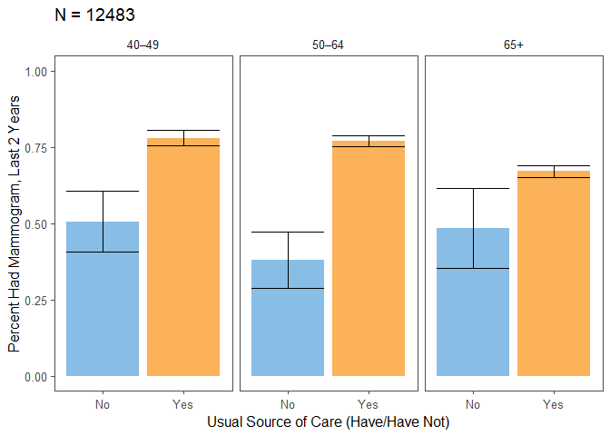

Mammogram
================

Read in the data.

``` r
cancer = read_csv("./data/cancerxx.csv") %>%
  select(HHX, FMX, FPX, WTFA_SA, STRAT_P, PSU_P, REGION, MAMHAD, MAM6YR, 
         RMAM1_MT, RMAM1YR, RMAM1N, RMAM1T, RMAM2, RMAM3A, RMAM3B, MAMPAY, 
         MAMREAS, MDRECMAM, MAMDNBR, MAMABN1, MFOLLOW0, MFOLLO01, MFOLLO02, 
         MFOLLO03, MFOLLO04, MFOLLO05, MNOTFOL1, MAMMODE, MAMCAN1)

adult = read_csv("./data/samadult.csv") %>%
  select(HHX, FMX, FPX, AUSUALPL, AHCPLROU, AHCPLKND, FLA1AR)

family = read_csv("./data/familyxx.csv") %>%
  select(HHX, FMX, RAT_CAT4, RAT_CAT5)

person = read_csv("./data/personsx.csv") %>%
  select(HHX, FMX, FPX, AGE_P, EDUC1, SEX, NOTCOV, COVER65, COVER65O, LA1AR,
         LCONDRT, LACHRONR, HISCODI3, RACRECI3, COVER)

mam_dat = cancer %>%
  left_join(adult, by = c("HHX", "FMX", "FPX")) %>%
  left_join(person, by = c("HHX", "FMX", "FPX")) %>%
  left_join(family, by = c("HHX", "FMX")) 
```

Data Manipulation

``` r
# outcome is having a mammogram in the last 2 years:RMAM2 = 1,2
mam_dat = mam_dat %>%
  mutate(mam_2 = if_else(RMAM2 <= 2, 1, 0))

# create the age category
mam_dat = mam_dat %>% 
  mutate(age_cat = case_when(AGE_P >= 25 & AGE_P < 40 ~ "25–39",
                             AGE_P >= 40 & AGE_P < 50 ~ "40–49",
                             AGE_P >= 50 & AGE_P < 65 ~ "50–64",
                             AGE_P >= 65 ~ "65+"))
# create educ category
mam_dat = mam_dat %>% 
  mutate(educ_cat = case_when(EDUC1 < 13 ~ "Less than high school",
                              EDUC1 >= 13 & EDUC1 < 15 ~ "High school",
                              EDUC1 >= 15 & EDUC1 < 18 ~ "Some college",
                              EDUC1 >= 18 & EDUC1 <= 21 ~ "College graduate"))

# create financial category
mam_dat = mam_dat %>% 
  mutate(finc_cat = case_when(RAT_CAT5 <= 7 |  RAT_CAT5 %in% c(15, 16) ~ "<200%",
                              RAT_CAT5 %in% c(8, 9) ~ "200–299%", 
                              RAT_CAT5 %in% c(10, 11) ~ "300–399%",
                              RAT_CAT5 >= 18 & EDUC1 <= 21 ~ "400–499%",
                              RAT_CAT5 == 14  ~">=500%",
                              RAT_CAT5 == 17  ~">=200%, no further detail",
                              RAT_CAT5 %in% c(96, 99) ~ "Unknown"))

# create as usual category
mam_dat = mam_dat %>% 
  mutate(ausualpl_cat  = case_when(AUSUALPL == 2 ~ "No",
                                   AUSUALPL %in% c(1, 3) ~ "Yes",
                                   AUSUALPL %in% c(7, 8, 9) ~ "Other"))
# coverage status
mam_dat = mam_dat %>% 
  mutate(cover_cat  = case_when(NOTCOV == 1 | COVER == 4 | COVER65 == 6 ~ "None",
                                COVER == 2 | COVER65 %in% 2:4 ~ "Public",
                                COVER %in% c(1, 3) | COVER65 %in% c(1, 5) ~ "Private/Military"))

# disability
mam_dat = mam_dat %>% 
  mutate(lcond_chronic_cat = if_else(LCONDRT == 1, "Yes", "No"))

# race
mam_dat = mam_dat %>% 
  mutate(race_cat = case_when(RACRECI3 == 1 ~ "White",
                              RACRECI3 == 2 ~ "Black",
                              RACRECI3 == 3 ~ "Asian",
                              RACRECI3 == 4 ~ "AN/AI"),
         eth_cat = case_when(HISCODI3 == 1 ~ "Hispanic",
                             HISCODI3 == 2 ~ "Non-Hispanic White",
                             HISCODI3 == 3 ~ "Non-Hispanic Black",
                             HISCODI3 == 4 ~ "Non-Hispanic Asian",
                             HISCODI3 == 5 ~ "Non-Hispanic AN/AI"))
```

Survey Design

``` r
mam_dat = mam_dat %>%
  mutate(domain = if_else(SEX == 2 & AGE_P >= 40, 1, 0))


des = svydesign(ids = ~PSU_P, strata = ~STRAT_P, weights = ~WTFA_SA, nest = TRUE, data = mam_dat)
```

Tables

``` r
# percent of women who have had mammogram in the last two years
# unsure-can't filter before the design because then it gives me an error about only one PSU in strata 73
# options(survey.lonely.psu = "certainty")
age_pct = svyby(~mam_2, by = ~domain+age_cat, svymean, na.rm = TRUE, design = des)
age_pct %>% filter(domain == 1) %>% select(-domain) %>% knitr::kable()
```

| age\_cat |     mam\_2|         se|
|:---------|----------:|----------:|
| 40–49    |  0.3176038|  0.0266974|
| 50–64    |  0.3264640|  0.0174223|
| 65+      |  0.2648560|  0.0140089|

``` r
age_tot = svyby(~mam_2, by = ~domain+age_cat, svytotal, na.rm = TRUE, design = des)
age_tot %>% filter(domain == 1) %>% select(-domain) %>% knitr::kable()
```

| age\_cat |   mam\_2|        se|
|:---------|--------:|---------:|
| 40–49    |  1160711|  107452.8|
| 50–64    |  2793509|  183442.9|
| 65+      |  2282234|  140867.4|

``` r
# mammogram by education
edu_pct = svyby(~mam_2, by = ~domain+educ_cat, svymean, na.rm = TRUE, design = des)
edu_pct %>% filter(domain == 1) %>% select(-domain) %>% knitr::kable()
```

| educ\_cat             |     mam\_2|         se|
|:----------------------|----------:|----------:|
| College graduate      |  0.3859343|  0.0231881|
| High school           |  0.2395907|  0.0162470|
| Less than high school |  0.2921496|  0.0247320|
| Some college          |  0.2944866|  0.0190413|

``` r
edu_tot = svyby(~mam_2, by = ~domain+educ_cat, svytotal, na.rm = TRUE, design = des)
edu_tot %>% filter(domain == 1) %>% select(-domain) %>% knitr::kable()
```

| educ\_cat             |   mam\_2|        se|
|:----------------------|--------:|---------:|
| College graduate      |  2009887|  148288.3|
| High school           |  1413381|  105670.2|
| Less than high school |  1013725|  105001.2|
| Some college          |  1783546|  125719.6|

``` r
# mammogram by finc
finc_pct = svyby(~mam_2, by = ~domain+finc_cat, svymean, na.rm = TRUE, design = des)
finc_pct %>% filter(domain == 1) %>% select(-domain) %>% knitr::kable()
```

| finc\_cat                    |     mam\_2|         se|
|:-----------------------------|----------:|----------:|
| &lt;200%                     |  0.2466641|  0.0148705|
| &gt;=200%, no further detail |  0.3228125|  0.0467298|
| &gt;=500%                    |  0.3792062|  0.0276675|
| 200–299%                     |  0.2452990|  0.0293613|
| 300–399%                     |  0.2986085|  0.0335513|
| 400–499%                     |  0.3954329|  0.0279231|
| Unknown                      |  0.1058113|  0.1009204|

``` r
finc_tot = svyby(~mam_2, by = ~domain+finc_cat, svytotal, na.rm = TRUE, design = des)
finc_tot %>% filter(domain == 1) %>% select(-domain) %>% knitr::kable()
```

| finc\_cat                    |   mam\_2|         se|
|:-----------------------------|--------:|----------:|
| &lt;200%                     |  1681121|  114507.49|
| &gt;=200%, no further detail |   254425|   41905.66|
| &gt;=500%                    |  1584621|  145667.19|
| 200–299%                     |   696807|   90389.81|
| 300–399%                     |   539346|   72701.72|
| 400–499%                     |  1224889|  112609.63|
| Unknown                      |     5994|    5994.00|

``` r
# mammogram by usual care
ausualp_pct = svyby(~mam_2, by = ~domain+ausualpl_cat, svymean, na.rm = TRUE, design = des)
ausualp_pct %>% filter(domain == 1) %>% select(-domain) %>% knitr::kable()
```

| ausualpl\_cat |     mam\_2|         se|
|:--------------|----------:|----------:|
| No            |  0.1324871|  0.0242305|
| Other         |  0.0000000|  0.0000000|
| Yes           |  0.3125982|  0.0106714|

``` r
ausualp_tot = svyby(~mam_2, by = ~domain+ausualpl_cat, svytotal, na.rm = TRUE, design = des)
ausualp_tot %>% filter(domain == 1) %>% select(-domain) %>% knitr::kable()
```

| ausualpl\_cat |   mam\_2|         se|
|:--------------|--------:|----------:|
| No            |   200445|   37909.37|
| Other         |        0|       0.00|
| Yes           |  6036009|  246940.43|

``` r
# mammogram by health coverage
cover_pct = svyby(~mam_2, by = ~domain+cover_cat, svymean, na.rm = TRUE, design = des)
cover_pct %>% filter(domain == 1) %>% select(-domain) %>% knitr::kable()
```

| cover\_cat       |     mam\_2|         se|
|:-----------------|----------:|----------:|
| None             |  0.1599616|  0.0323559|
| Private/Military |  0.3296367|  0.0139620|
| Public           |  0.2666126|  0.0171297|

``` r
cover_tot = svyby(~mam_2, by = ~domain+cover_cat, svytotal, na.rm = TRUE, design = des)
cover_tot %>% filter(domain == 1) %>% select(-domain) %>% knitr::kable()
```

| cover\_cat       |   mam\_2|         se|
|:-----------------|--------:|----------:|
| None             |   216060|   45028.34|
| Private/Military |  4362043|  214710.68|
| Public           |  1645117|  123516.85|

``` r
# mammogram by chronic conditions
lcond_chronic_pct = svyby(~mam_2, by = ~domain+lcond_chronic_cat, svymean, na.rm = TRUE, design = des)
lcond_chronic_pct %>% filter(domain == 1) %>% select(-domain) %>% knitr::kable()
```

| lcond\_chronic\_cat |     mam\_2|         se|
|:--------------------|----------:|----------:|
| No                  |  0.3227098|  0.1272247|
| Yes                 |  0.2268148|  0.0154096|

``` r
lcond_chronic_tot = svyby(~mam_2, by = ~domain+lcond_chronic_cat, svytotal, na.rm = TRUE, design = des)
lcond_chronic_tot %>% filter(domain == 1) %>% select(-domain) %>% knitr::kable()
```

| lcond\_chronic\_cat |   mam\_2|         se|
|:--------------------|--------:|----------:|
| No                  |    44330|   21246.71|
| Yes                 |  1434243|  118088.54|

``` r
#mammogram by race
race_pct = svyby(~mam_2, by = ~domain+race_cat, svymean, na.rm = TRUE, design = des)
race_pct %>% filter(domain == 1) %>% select(-domain) %>% knitr::kable()
```

| race\_cat |     mam\_2|         se|
|:----------|----------:|----------:|
| AN/AI     |  0.1850641|  0.0724294|
| Asian     |  0.3160724|  0.0453117|
| Black     |  0.3768600|  0.0316087|
| White     |  0.2894254|  0.0110402|

``` r
race_tot = svyby(~mam_2, by = ~domain+race_cat, svytotal, na.rm = TRUE, design = des)
race_tot %>% filter(domain == 1) %>% select(-domain) %>% knitr::kable()
```

| race\_cat |   mam\_2|         se|
|:----------|--------:|----------:|
| AN/AI     |    47322|   20171.97|
| Asian     |   380012|   68840.07|
| Black     |   874328|   96259.80|
| White     |  4934792|  217295.53|

``` r
# mammogram by ethnicity
eth_pct = svyby(~mam_2, by = ~domain+eth_cat, svymean, na.rm = TRUE, design = des)
eth_pct %>% filter(domain == 1) %>% select(-domain) %>% knitr::kable()
```

| eth\_cat           |     mam\_2|         se|
|:-------------------|----------:|----------:|
| Hispanic           |  0.3987374|  0.0298913|
| Non-Hispanic AN/AI |  0.2048993|  0.0996913|
| Non-Hispanic Asian |  0.3204003|  0.0458825|
| Non-Hispanic Black |  0.3728957|  0.0320404|
| Non-Hispanic White |  0.2720955|  0.0116547|

``` r
eth_tot = svyby(~mam_2, by = ~domain+eth_cat, svytotal, na.rm = TRUE, design = des)
eth_tot %>% filter(domain == 1) %>% select(-domain) %>% knitr::kable()
```

| eth\_cat           |   mam\_2|         se|
|:-------------------|--------:|----------:|
| Hispanic           |   949318|   92055.11|
| Non-Hispanic AN/AI |    34654|   18680.84|
| Non-Hispanic Asian |   378931|   68831.58|
| Non-Hispanic Black |   820815|   93199.85|
| Non-Hispanic White |  4052736|  205267.14|

Tables By Age Group

``` r
# mammogram by education
edu_pct_strat = svyby(~mam_2, by = ~domain + age_cat + educ_cat, svymean, 
                      na.rm = TRUE, design = des, vartype = c("se", "ci"))
edu_tab = edu_pct_strat %>% 
  filter(domain == 1) %>% 
  select(-domain, -se) 

edu_tab %>% knitr::kable()
```

| age\_cat | educ\_cat             |     mam\_2|      ci\_l|      ci\_u|
|:---------|:----------------------|----------:|----------:|----------:|
| 40–49    | College graduate      |  0.3628165|  0.2691092|  0.4565238|
| 50–64    | College graduate      |  0.4368191|  0.3674965|  0.5061416|
| 65+      | College graduate      |  0.3249096|  0.2542029|  0.3956163|
| 40–49    | High school           |  0.2553434|  0.1591447|  0.3515422|
| 50–64    | High school           |  0.2663692|  0.2008008|  0.3319376|
| 65+      | High school           |  0.2156457|  0.1707661|  0.2605252|
| 40–49    | Less than high school |  0.3408288|  0.2140130|  0.4676445|
| 50–64    | Less than high school |  0.2907496|  0.2069343|  0.3745649|
| 65+      | Less than high school |  0.2797153|  0.2097049|  0.3497257|
| 40–49    | Some college          |  0.3060292|  0.2171920|  0.3948663|
| 50–64    | Some college          |  0.2958289|  0.2338755|  0.3577823|
| 65+      | Some college          |  0.2870106|  0.2325250|  0.3414962|

``` r
edu_tot_strat = svyby(~mam_2, by = ~domain + age_cat + educ_cat, svytotal, 
                      na.rm = TRUE, design = des) %>%
  filter(domain == 1) %>%
  select(-domain, -se) %>%
  rename(num = mam_2)
edu_tot_strat %>% 
  knitr::kable()
```

| age\_cat | educ\_cat             |      num|
|:---------|:----------------------|--------:|
| 40–49    | College graduate      |   437536|
| 50–64    | College graduate      |  1062071|
| 65+      | College graduate      |   510280|
| 40–49    | High school           |   218276|
| 50–64    | High school           |   563580|
| 65+      | High school           |   631525|
| 40–49    | Less than high school |   169381|
| 50–64    | Less than high school |   336595|
| 65+      | Less than high school |   507749|
| 40–49    | Some college          |   329856|
| 50–64    | Some college          |   831263|
| 65+      | Some college          |   622427|

``` r
num = edu_tot_strat$num

edu_tab = cbind(edu_tab, num) 

# mammogram by finc
finc_pct_strat = svyby(~mam_2, by = ~domain + age_cat + finc_cat, svymean, 
                       na.rm = TRUE, design = des, vartype = c("se", "ci"))

finc_tab = finc_pct_strat %>% 
  filter(domain == 1) %>% 
  select(-domain, -se) 

finc_tab %>% knitr::kable()
```

| age\_cat | finc\_cat                    |     mam\_2|       ci\_l|      ci\_u|
|:---------|:-----------------------------|----------:|-----------:|----------:|
| 40–49    | &lt;200%                     |  0.3110863|   0.2345485|  0.3876242|
| 50–64    | &lt;200%                     |  0.2659748|   0.2155477|  0.3164020|
| 65+      | &lt;200%                     |  0.2059262|   0.1684476|  0.2434049|
| 40–49    | &gt;=200%, no further detail |  0.4289634|   0.0853033|  0.7726234|
| 50–64    | &gt;=200%, no further detail |  0.3433714|   0.1625292|  0.5242137|
| 65+      | &gt;=200%, no further detail |  0.3070764|   0.1908211|  0.4233316|
| 40–49    | &gt;=500%                    |  0.3471008|   0.2410188|  0.4531827|
| 50–64    | &gt;=500%                    |  0.4140524|   0.3374080|  0.4906968|
| 65+      | &gt;=500%                    |  0.3340848|   0.2319338|  0.4362358|
| 40–49    | 200–299%                     |  0.1798488|   0.0733379|  0.2863597|
| 50–64    | 200–299%                     |  0.2578120|   0.1483816|  0.3672424|
| 65+      | 200–299%                     |  0.2643767|   0.1903966|  0.3383568|
| 40–49    | 300–399%                     |  0.3098936|   0.1791381|  0.4406491|
| 50–64    | 300–399%                     |  0.2946467|   0.1649468|  0.4243466|
| 65+      | 300–399%                     |  0.2968388|   0.2016116|  0.3920659|
| 40–49    | 400–499%                     |  0.4729520|   0.2946084|  0.6512955|
| 50–64    | 400–499%                     |  0.4412923|   0.3374184|  0.5451662|
| 65+      | 400–499%                     |  0.3316844|   0.2553715|  0.4079974|
| 40–49    | Unknown                      |  0.0000000|   0.0000000|  0.0000000|
| 50–64    | Unknown                      |  0.0000000|   0.0000000|  0.0000000|
| 65+      | Unknown                      |  0.1173017|  -0.1011337|  0.3357371|

``` r
finc_tot_strat = svyby(~mam_2, by = ~ domain + age_cat + finc_cat, svytotal,
                       na.rm = TRUE, design = des) %>%
  filter(domain == 1) %>%
  select(-domain, -se) %>%
  rename(num = mam_2)

num = finc_tot_strat$num

finc_tab = cbind(finc_tab, num)


# mammogram by usual care
ausualp_pct_strat = svyby(~mam_2, by = ~domain + age_cat + ausualpl_cat,
                          svymean, na.rm = TRUE, design = des, 
                          vartype = c("se", "ci"))

usual_tab = ausualp_pct_strat %>% 
  filter(domain == 1) %>% 
  select(-domain, -se) 

usual_tab %>% knitr::kable()
```

| age\_cat | ausualpl\_cat |     mam\_2|      ci\_l|      ci\_u|
|:---------|:--------------|----------:|----------:|----------:|
| 40–49    | No            |  0.1409714|  0.0560443|  0.2258986|
| 50–64    | No            |  0.1129043|  0.0456726|  0.1801361|
| 65+      | No            |  0.1682582|  0.0356718|  0.3008447|
| 40–49    | Other         |  0.0000000|  0.0000000|  0.0000000|
| 50–64    | Other         |  0.0000000|  0.0000000|  0.0000000|
| 65+      | Other         |  0.0000000|  0.0000000|  0.0000000|
| 40–49    | Yes           |  0.3454294|  0.2871078|  0.4037510|
| 50–64    | Yes           |  0.3466129|  0.3098444|  0.3833815|
| 65+      | Yes           |  0.2682009|  0.2401863|  0.2962155|

``` r
ausualp_tot_strat = svyby(~mam_2, by = ~domain + age_cat +ausualpl_cat,
                          svytotal, na.rm = TRUE, design = des) %>%
  filter(domain == 1) %>%
  select(-domain, -se) %>%
  rename(num = mam_2)

num = ausualp_tot_strat$num

usual_tab = cbind(usual_tab, num)

# mammogram by health coverage
cover_pct_strat = svyby(~mam_2, by = ~domain + age_cat + cover_cat, svymean,
                        na.rm = TRUE, design = des, vartype = c("se", "ci"))

ins_tab = cover_pct_strat %>% 
  filter(domain == 1) %>% 
  select(-domain, -se)

ins_tab %>% knitr::kable()
```

| age\_cat | cover\_cat       |     mam\_2|      ci\_l|      ci\_u|
|:---------|:-----------------|----------:|----------:|----------:|
| 40–49    | None             |  0.1959259|  0.0896914|  0.3021603|
| 50–64    | None             |  0.1200942|  0.0391182|  0.2010702|
| 65+      | None             |  0.3796540|  0.0212452|  0.7380627|
| 40–49    | Private/Military |  0.3407561|  0.2773570|  0.4041552|
| 50–64    | Private/Military |  0.3580790|  0.3150181|  0.4011400|
| 65+      | Private/Military |  0.2782850|  0.2378470|  0.3187229|
| 40–49    | Public           |  0.3221841|  0.2050819|  0.4392862|
| 50–64    | Public           |  0.2962089|  0.2103427|  0.3820751|
| 65+      | Public           |  0.2513543|  0.2113775|  0.2913311|

``` r
cover_tot_strat = svyby(~mam_2, by = ~domain + age_cat + cover_cat, svytotal,
                        na.rm = TRUE, design = des) %>%
  filter(domain == 1) %>%
  select(-domain, -se) %>%
  rename(num = mam_2)

num = cover_tot_strat$num

ins_tab = cbind(ins_tab, num)

# mammogram by chronic conditions
lcond_chronic_pct_strat = svyby(~mam_2, 
                                by = ~domain + age_cat + lcond_chronic_cat,
                                svymean, na.rm = TRUE, design = des,
                                vartype = c("se", "ci"))

dis_tab = lcond_chronic_pct_strat %>% 
  filter(domain == 1) %>% 
  select(-domain, -se) 

dis_tab %>% knitr::kable()
```

| age\_cat | lcond\_chronic\_cat |     mam\_2|       ci\_l|      ci\_u|
|:---------|:--------------------|----------:|-----------:|----------:|
| 40–49    | No                  |  0.3736354|  -0.1932069|  0.9404777|
| 50–64    | No                  |  0.6058108|   0.0759335|  1.1356881|
| 65+      | No                  |  0.2284719|   0.0014515|  0.4554922|
| 40–49    | Yes                 |  0.3141957|   0.1935065|  0.4348849|
| 50–64    | Yes                 |  0.2564085|   0.1978651|  0.3149519|
| 65+      | Yes                 |  0.1994143|   0.1611532|  0.2376755|

``` r
lcond_chronic_tot_strat = svyby(~mam_2, 
                                by = ~domain + age_cat + lcond_chronic_cat,
                                svytotal, na.rm = TRUE, design = des) %>%
  filter(domain == 1) %>%
  select(-domain, -se) %>%
  rename(num = mam_2)

num = lcond_chronic_tot_strat$num

dis_tab = cbind(dis_tab, num)

# mammogram by race
race_pct_strat = svyby(~mam_2, by = ~domain + age_cat + race_cat, svymean, 
                       na.rm = TRUE, design = des, vartype = c("se", "ci"))

race_tab = race_pct_strat %>% 
  filter(domain == 1) %>% 
  select(-domain, -se) 

race_tab %>% knitr::kable()
```

| age\_cat | race\_cat |     mam\_2|       ci\_l|      ci\_u|
|:---------|:----------|----------:|-----------:|----------:|
| 40–49    | AN/AI     |  0.1064797|  -0.0960006|  0.3089600|
| 50–64    | AN/AI     |  0.1820756|   0.0090923|  0.3550590|
| 65+      | AN/AI     |  0.2507746|  -0.1044343|  0.6059836|
| 40–49    | Asian     |  0.3662753|   0.1912158|  0.5413349|
| 50–64    | Asian     |  0.3539920|   0.1997924|  0.5081916|
| 65+      | Asian     |  0.2158222|   0.0959545|  0.3356898|
| 40–49    | Black     |  0.3995041|   0.2661115|  0.5328967|
| 50–64    | Black     |  0.4135665|   0.3211752|  0.5059578|
| 65+      | Black     |  0.3147076|   0.2349437|  0.3944716|
| 40–49    | White     |  0.3000826|   0.2404242|  0.3597410|
| 50–64    | White     |  0.3143985|   0.2741405|  0.3546564|
| 65+      | White     |  0.2620824|   0.2321136|  0.2920512|

``` r
race_tot_strat = svyby(~mam_2, by = ~domain + age_cat + race_cat, svytotal,
                       na.rm = TRUE, design = des) %>%
  filter(domain == 1) %>%
  select(-domain, -se) %>%
  rename(num = mam_2)

num = race_tot_strat$num

race_tab = cbind(race_tab, num)

# mammogram by ethnicity
eth_pct_strat = svyby(~mam_2, by = ~domain + age_cat + eth_cat, svymean, 
                      na.rm = TRUE, design = des, vartype = c("se", "ci"))

eth_tab = eth_pct_strat %>% 
  filter(domain == 1) %>% 
  select(-domain, -se) 

eth_tab %>% knitr::kable()
```

| age\_cat | eth\_cat           |     mam\_2|       ci\_l|      ci\_u|
|:---------|:-------------------|----------:|-----------:|----------:|
| 40–49    | Hispanic           |  0.3614476|   0.2645338|  0.4583613|
| 50–64    | Hispanic           |  0.4632209|   0.3539508|  0.5724909|
| 65+      | Hispanic           |  0.3555218|   0.2716820|  0.4393616|
| 40–49    | Non-Hispanic AN/AI |  0.0141961|  -0.0164020|  0.0447942|
| 50–64    | Non-Hispanic AN/AI |  0.1715973|  -0.0378381|  0.3810326|
| 65+      | Non-Hispanic AN/AI |  0.3033935|  -0.1048823|  0.7116693|
| 40–49    | Non-Hispanic Asian |  0.3744387|   0.1950287|  0.5538487|
| 50–64    | Non-Hispanic Asian |  0.3560777|   0.2010113|  0.5111440|
| 65+      | Non-Hispanic Asian |  0.2195271|   0.0975996|  0.3414547|
| 40–49    | Non-Hispanic Black |  0.4116241|   0.2652489|  0.5579993|
| 50–64    | Non-Hispanic Black |  0.4052808|   0.3103289|  0.5002328|
| 65+      | Non-Hispanic Black |  0.3084453|   0.2312517|  0.3856388|
| 40–49    | Non-Hispanic White |  0.2753570|   0.2071887|  0.3435254|
| 50–64    | Non-Hispanic White |  0.2934804|   0.2507723|  0.3361885|
| 65+      | Non-Hispanic White |  0.2514847|   0.2202771|  0.2826922|

``` r
eth_tot_strat = svyby(~mam_2, by = ~domain + age_cat + eth_cat, svytotal, 
                      na.rm = TRUE, design = des) %>%
  filter(domain == 1) %>%
  select(-domain, -se) %>%
  rename(num = mam_2)

num = eth_tot_strat$num

eth_tab = cbind(eth_tab, num)

# total gotten mammogram
total = svyby(~mam_2, by = ~domain + age_cat, svymean, na.rm = TRUE, 
              design = des, vartype = c("se", "ci"))

tot_tab = total %>% 
  filter(domain == 1) %>% 
  select(-domain, -se) 

tot_tab %>% knitr::kable()
```

| age\_cat |     mam\_2|      ci\_l|      ci\_u|
|:---------|----------:|----------:|----------:|
| 40–49    |  0.3176038|  0.2652778|  0.3699298|
| 50–64    |  0.3264640|  0.2923169|  0.3606110|
| 65+      |  0.2648560|  0.2373989|  0.2923130|

``` r
tot_num = svyby(~mam_2, by = ~domain + age_cat, svytotal, na.rm = TRUE, 
                design = des) %>%
  filter(domain == 1) %>%
  select(-domain, -se) %>%
  rename(num = mam_2)

num = tot_num$num

tot_tab = cbind(tot_tab, num)
```

Combine into paper table

``` r
tot_tab2 = tot_tab %>%
  mutate(type = "Total",
         level = "-")

edu_tab2 = edu_tab %>%
  mutate(type = "Education") %>%
  rename(level = educ_cat)

finc_tab2 = finc_tab %>%
  mutate(type = "Family Income Poverty Ratio") %>%
  rename(level = finc_cat)

usual_tab2 = usual_tab %>%
  mutate(type = "Usual Source of Care") %>%
  rename(level = ausualpl_cat)

ins_tab2 = ins_tab %>%
  mutate(type = "Insurance Type") %>%
  rename(level = cover_cat)

dis_tab2 = dis_tab %>%
  mutate(type = "Chronic Disability") %>%
  rename(level = lcond_chronic_cat)

eth_tab2 = eth_tab %>%
  mutate(type = "Ethnicity") %>%
  rename(level = eth_cat)

race_tab2 = race_tab %>%
  mutate(type = "Race") %>%
  rename(level = race_cat)

# create table of percentages of women who have gotten mammograms within the last two years (still need to add CIs)
tab_one = rbind(tot_tab2, edu_tab2, finc_tab2, usual_tab2, ins_tab2, dis_tab2, eth_tab2, race_tab2) %>%
  mutate(mam_2 = round(mam_2*100, 2),
         ci_l = round(ci_l*100, 2),
         ci_u = round(ci_u*100, 2),
         CI = str_c(ci_l, ", ", ci_u)) %>%
  rename(Percent = mam_2,
         No = num) %>%
  select(-ci_l, -ci_u) %>%
  pivot_wider(names_from = age_cat, values_from = c(No, Percent, CI)) %>%
  janitor::clean_names() %>%
  select(type, level, no_40_49, percent_40_49, ci_40_49, no_50_64, percent_50_64, ci_50_64, everything())

# print percentages
tab_one %>% knitr::kable()
```

| type                        | level                        |  no\_40\_49|  percent\_40\_49| ci\_40\_49    |  no\_50\_64|  percent\_50\_64| ci\_50\_64   |   no\_65|  percent\_65| ci\_65        |
|:----------------------------|:-----------------------------|-----------:|----------------:|:--------------|-----------:|----------------:|:-------------|--------:|------------:|:--------------|
| Total                       | -                            |     1160711|            31.76| 26.53, 36.99  |     2793509|            32.65| 29.23, 36.06 |  2282234|        26.49| 23.74, 29.23  |
| Education                   | College graduate             |      437536|            36.28| 26.91, 45.65  |     1062071|            43.68| 36.75, 50.61 |   510280|        32.49| 25.42, 39.56  |
| Education                   | High school                  |      218276|            25.53| 15.91, 35.15  |      563580|            26.64| 20.08, 33.19 |   631525|        21.56| 17.08, 26.05  |
| Education                   | Less than high school        |      169381|            34.08| 21.4, 46.76   |      336595|            29.07| 20.69, 37.46 |   507749|        27.97| 20.97, 34.97  |
| Education                   | Some college                 |      329856|            30.60| 21.72, 39.49  |      831263|            29.58| 23.39, 35.78 |   622427|        28.70| 23.25, 34.15  |
| Family Income Poverty Ratio | &lt;200%                     |      352188|            31.11| 23.45, 38.76  |      702455|            26.60| 21.55, 31.64 |   626478|        20.59| 16.84, 24.34  |
| Family Income Poverty Ratio | &gt;=200%, no further detail |       13134|            42.90| 8.53, 77.26   |       82028|            34.34| 16.25, 52.42 |   159263|        30.71| 19.08, 42.33  |
| Family Income Poverty Ratio | &gt;=500%                    |      319626|            34.71| 24.1, 45.32   |      914221|            41.41| 33.74, 49.07 |   350774|        33.41| 23.19, 43.62  |
| Family Income Poverty Ratio | 200–299%                     |      100961|            17.98| 7.33, 28.64   |      264775|            25.78| 14.84, 36.72 |   331071|        26.44| 19.04, 33.84  |
| Family Income Poverty Ratio | 300–399%                     |      111095|            30.99| 17.91, 44.06  |      199434|            29.46| 16.49, 42.43 |   228817|        29.68| 20.16, 39.21  |
| Family Income Poverty Ratio | 400–499%                     |      187341|            47.30| 29.46, 65.13  |      569730|            44.13| 33.74, 54.52 |   467818|        33.17| 25.54, 40.8   |
| Family Income Poverty Ratio | Unknown                      |           0|             0.00| 0, 0          |           0|             0.00| 0, 0         |     5994|        11.73| -10.11, 33.57 |
| Usual Source of Care        | No                           |       68628|            14.10| 5.6, 22.59    |       83292|            11.29| 4.57, 18.01  |    48525|        16.83| 3.57, 30.08   |
| Usual Source of Care        | Other                        |           0|             0.00| 0, 0          |           0|             0.00| 0, 0         |        0|         0.00| 0, 0          |
| Usual Source of Care        | Yes                          |     1092083|            34.54| 28.71, 40.38  |     2710217|            34.66| 30.98, 38.34 |  2233709|        26.82| 24.02, 29.62  |
| Insurance Type              | None                         |      104942|            19.59| 8.97, 30.22   |       91764|            12.01| 3.91, 20.11  |    19354|        37.97| 2.12, 73.81   |
| Insurance Type              | Private/Military             |      874479|            34.08| 27.74, 40.42  |     2329984|            35.81| 31.5, 40.11  |  1157580|        27.83| 23.78, 31.87  |
| Insurance Type              | Public                       |      173875|            32.22| 20.51, 43.93  |      369318|            29.62| 21.03, 38.21 |  1101924|        25.14| 21.14, 29.13  |
| Chronic Disability          | No                           |        6811|            37.36| -19.32, 94.05 |       16535|            60.58| 7.59, 113.57 |    20984|        22.85| 0.15, 45.55   |
| Chronic Disability          | Yes                          |      152192|            31.42| 19.35, 43.49  |      529361|            25.64| 19.79, 31.5  |   752690|        19.94| 16.12, 23.77  |
| Ethnicity                   | Hispanic                     |      252058|            36.14| 26.45, 45.84  |      424755|            46.32| 35.4, 57.25  |   272505|        35.55| 27.17, 43.94  |
| Ethnicity                   | Non-Hispanic AN/AI           |         215|             1.42| -1.64, 4.48   |       15986|            17.16| -3.78, 38.1  |    18453|        30.34| -10.49, 71.17 |
| Ethnicity                   | Non-Hispanic Asian           |      129828|            37.44| 19.5, 55.38   |      171033|            35.61| 20.1, 51.11  |    78070|        21.95| 9.76, 34.15   |
| Ethnicity                   | Non-Hispanic Black           |      193204|            41.16| 26.52, 55.8   |      391064|            40.53| 31.03, 50.02 |   236547|        30.84| 23.13, 38.56  |
| Ethnicity                   | Non-Hispanic White           |      585406|            27.54| 20.72, 34.35  |     1790671|            29.35| 25.08, 33.62 |  1676659|        25.15| 22.03, 28.27  |
| Race                        | AN/AI                        |        6044|            10.65| -9.6, 30.9    |       22825|            18.21| 0.91, 35.51  |    18453|        25.08| -10.44, 60.6  |
| Race                        | Asian                        |      130909|            36.63| 19.12, 54.13  |      171033|            35.40| 19.98, 50.82 |    78070|        21.58| 9.6, 33.57    |
| Race                        | Black                        |      206397|            39.95| 26.61, 53.29  |      419959|            41.36| 32.12, 50.6  |   247972|        31.47| 23.49, 39.45  |
| Race                        | White                        |      817361|            30.01| 24.04, 35.97  |     2179692|            31.44| 27.41, 35.47 |  1937739|        26.21| 23.21, 29.21  |

Barplots of Usual Care

``` r
b = svyby(~mam_2, by = ~domain + age_cat + ausualpl_cat,
                          svymean, na.rm = TRUE, design = des) %>%
  filter(domain == 1,
         ausualpl_cat != "Other") %>%
  select(-domain)

b1 = b %>%
  filter(trimws(age_cat) == "40–49")

b2 = b %>%
  filter(trimws(age_cat) == "50–64")

b3 = b %>%
  filter(age_cat == "65+")


barplot(b1$mam_2, beside = FALSE,
        names.arg = c("No", "Yes"),
        main = "Recent Mammogram for Women 40-49 by Usual Care",
        ylim = c(0, 0.4))
```



``` r
barplot(b2$mam_2, beside = FALSE,
        names.arg = c("No", "Yes"),
        main = "Recent Mammogram for Women 50-64 by Usual Care",
        ylim = c(0, 0.4))
```


``` r
barplot(b3$mam_2, beside = FALSE,
        names.arg = c("No", "Yes"),
        main = "Recent Mammogran for Women 65+ by Usual Care",
        ylim = c(0, 0.4))
```


Models

``` r
mam_fit = svyglm(mam_2 ~ as.factor(age_cat) + as.factor(educ_cat) + as.factor(finc_cat) + as.factor(ausualpl_cat) + as.factor(cover_cat) + as.factor(lcond_chronic_cat) + as.factor(race_cat) + as.factor(eth_cat), 
       design = des, subset = domain == 1, family = binomial(link = "logit"))
```

    ## Warning in eval(family$initialize): non-integer #successes in a binomial
    ## glm!

``` r
summary(mam_fit)
```

    ## 
    ## Call:
    ## svyglm(formula = mam_2 ~ as.factor(age_cat) + as.factor(educ_cat) + 
    ##     as.factor(finc_cat) + as.factor(ausualpl_cat) + as.factor(cover_cat) + 
    ##     as.factor(lcond_chronic_cat) + as.factor(race_cat) + as.factor(eth_cat), 
    ##     design = des, subset = domain == 1, family = binomial(link = "logit"))
    ## 
    ## Survey design:
    ## svydesign(ids = ~PSU_P, strata = ~STRAT_P, weights = ~WTFA_SA, 
    ##     nest = TRUE, data = mam_dat)
    ## 
    ## Coefficients:
    ##                                              Estimate Std. Error t value
    ## (Intercept)                                   -0.7972     1.7195  -0.464
    ## as.factor(age_cat)50–64                       -0.2498     0.3233  -0.773
    ## as.factor(age_cat)65+                         -0.7079     0.3510  -2.017
    ## as.factor(educ_cat)High school                -0.3738     0.2712  -1.378
    ## as.factor(educ_cat)Less than high school      -0.7492     0.3232  -2.318
    ## as.factor(educ_cat)Some college               -0.3273     0.2893  -1.132
    ## as.factor(finc_cat)>=200%, no further detail  -0.2472     0.3902  -0.634
    ## as.factor(finc_cat)>=500%                      0.2423     0.3651   0.664
    ## as.factor(finc_cat)200–299%                   -0.1199     0.3167  -0.379
    ## as.factor(finc_cat)300–399%                   -0.4340     0.4944  -0.878
    ## as.factor(finc_cat)400–499%                    0.2877     0.3302   0.871
    ## as.factor(ausualpl_cat)Other                 -10.6454     1.2399  -8.586
    ## as.factor(ausualpl_cat)Yes                     0.7072     0.5924   1.194
    ## as.factor(cover_cat)Private/Military           1.5366     0.4754   3.232
    ## as.factor(cover_cat)Public                     1.5240     0.4811   3.168
    ## as.factor(lcond_chronic_cat)Yes               -0.5082     0.5778  -0.880
    ## as.factor(race_cat)Asian                     -13.2760     1.7913  -7.411
    ## as.factor(race_cat)Black                      -0.6715     1.9099  -0.352
    ## as.factor(race_cat)White                      -0.3841     1.4404  -0.267
    ## as.factor(eth_cat)Non-Hispanic AN/AI          -0.6207     1.6015  -0.388
    ## as.factor(eth_cat)Non-Hispanic Asian          12.5512     1.1511  10.904
    ## as.factor(eth_cat)Non-Hispanic Black          -0.4184     1.3042  -0.321
    ## as.factor(eth_cat)Non-Hispanic White          -0.8985     0.3194  -2.813
    ##                                              Pr(>|t|)    
    ## (Intercept)                                   0.64367    
    ## as.factor(age_cat)50–64                       0.44106    
    ## as.factor(age_cat)65+                         0.04580 *  
    ## as.factor(educ_cat)High school                0.17044    
    ## as.factor(educ_cat)Less than high school      0.02200 *  
    ## as.factor(educ_cat)Some college               0.25989    
    ## as.factor(finc_cat)>=200%, no further detail  0.52750    
    ## as.factor(finc_cat)>=500%                     0.50802    
    ## as.factor(finc_cat)200–299%                   0.70549    
    ## as.factor(finc_cat)300–399%                   0.38166    
    ## as.factor(finc_cat)400–499%                   0.38525    
    ## as.factor(ausualpl_cat)Other                 2.39e-14 ***
    ## as.factor(ausualpl_cat)Yes                    0.23471    
    ## as.factor(cover_cat)Private/Military          0.00156 ** 
    ## as.factor(cover_cat)Public                    0.00191 ** 
    ## as.factor(lcond_chronic_cat)Yes               0.38071    
    ## as.factor(race_cat)Asian                     1.42e-11 ***
    ## as.factor(race_cat)Black                      0.72571    
    ## as.factor(race_cat)White                      0.79014    
    ## as.factor(eth_cat)Non-Hispanic AN/AI          0.69897    
    ## as.factor(eth_cat)Non-Hispanic Asian          < 2e-16 ***
    ## as.factor(eth_cat)Non-Hispanic Black          0.74889    
    ## as.factor(eth_cat)Non-Hispanic White          0.00567 ** 
    ## ---
    ## Signif. codes:  0 '***' 0.001 '**' 0.01 '*' 0.05 '.' 0.1 ' ' 1
    ## 
    ## (Dispersion parameter for binomial family taken to be 0.816151)
    ## 
    ## Number of Fisher Scoring iterations: 12

``` r
Anova(mam_fit, type = 3)
```

    ## Analysis of Deviance Table (Type III tests)
    ## 
    ## Response: mam_2
    ##                              Df    Chisq Pr(>Chisq)    
    ## (Intercept)                   1   0.2150   0.642892    
    ## as.factor(age_cat)            2   5.4389   0.065912 .  
    ## as.factor(educ_cat)           3   5.3977   0.144885    
    ## as.factor(finc_cat)           5   3.0014   0.699770    
    ## as.factor(ausualpl_cat)       2  92.4528  < 2.2e-16 ***
    ## as.factor(cover_cat)          2  10.7613   0.004605 ** 
    ## as.factor(lcond_chronic_cat)  1   0.7737   0.379085    
    ## as.factor(race_cat)           3 138.4048  < 2.2e-16 ***
    ## as.factor(eth_cat)            4 128.2984  < 2.2e-16 ***
    ## ---
    ## Signif. codes:  0 '***' 0.001 '**' 0.01 '*' 0.05 '.' 0.1 ' ' 1

``` r
mam_fit2 = svyglm(mam_2 ~ as.factor(ausualpl_cat) + as.factor(cover_cat) + as.factor(race_cat) + as.factor(eth_cat), design = des, subset = domain == 1,
                  family = binomial(link = "logit"))
```

    ## Warning in eval(family$initialize): non-integer #successes in a binomial
    ## glm!

``` r
summary(mam_fit2)
```

    ## 
    ## Call:
    ## svyglm(formula = mam_2 ~ as.factor(ausualpl_cat) + as.factor(cover_cat) + 
    ##     as.factor(race_cat) + as.factor(eth_cat), design = des, subset = domain == 
    ##     1, family = binomial(link = "logit"))
    ## 
    ## Survey design:
    ## svydesign(ids = ~PSU_P, strata = ~STRAT_P, weights = ~WTFA_SA, 
    ##     nest = TRUE, data = mam_dat)
    ## 
    ## Coefficients:
    ##                                      Estimate Std. Error t value Pr(>|t|)
    ## (Intercept)                           -3.3317     0.7127  -4.675 4.69e-06
    ## as.factor(ausualpl_cat)Other          -8.8627     1.0628  -8.339 4.14e-15
    ## as.factor(ausualpl_cat)Yes             0.9173     0.2373   3.865 0.000140
    ## as.factor(cover_cat)Private/Military   0.9819     0.2611   3.760 0.000209
    ## as.factor(cover_cat)Public             0.5858     0.2547   2.300 0.022214
    ## as.factor(race_cat)Asian              -0.9625     1.3132  -0.733 0.464257
    ## as.factor(race_cat)Black               1.6138     0.8369   1.928 0.054890
    ## as.factor(race_cat)White               1.4967     0.6641   2.254 0.025027
    ## as.factor(eth_cat)Non-Hispanic AN/AI   0.4483     0.9347   0.480 0.631881
    ## as.factor(eth_cat)Non-Hispanic Asian   1.8188     1.1369   1.600 0.110839
    ## as.factor(eth_cat)Non-Hispanic Black  -0.4610     0.5204  -0.886 0.376477
    ## as.factor(eth_cat)Non-Hispanic White  -0.8632     0.1532  -5.634 4.50e-08
    ##                                         
    ## (Intercept)                          ***
    ## as.factor(ausualpl_cat)Other         ***
    ## as.factor(ausualpl_cat)Yes           ***
    ## as.factor(cover_cat)Private/Military ***
    ## as.factor(cover_cat)Public           *  
    ## as.factor(race_cat)Asian                
    ## as.factor(race_cat)Black             .  
    ## as.factor(race_cat)White             *  
    ## as.factor(eth_cat)Non-Hispanic AN/AI    
    ## as.factor(eth_cat)Non-Hispanic Asian    
    ## as.factor(eth_cat)Non-Hispanic Black    
    ## as.factor(eth_cat)Non-Hispanic White ***
    ## ---
    ## Signif. codes:  0 '***' 0.001 '**' 0.01 '*' 0.05 '.' 0.1 ' ' 1
    ## 
    ## (Dispersion parameter for binomial family taken to be 0.9499377)
    ## 
    ## Number of Fisher Scoring iterations: 10

``` r
Anova(mam_fit2, type = 3)
```

    ## Analysis of Deviance Table (Type III tests)
    ## 
    ## Response: mam_2
    ##                         Df    Chisq Pr(>Chisq)    
    ## (Intercept)              1  21.8530  2.944e-06 ***
    ## as.factor(ausualpl_cat)  2 106.3710  < 2.2e-16 ***
    ## as.factor(cover_cat)     2  19.7960  5.028e-05 ***
    ## as.factor(race_cat)      3   9.6052    0.02224 *  
    ## as.factor(eth_cat)       4  36.3262  2.479e-07 ***
    ## ---
    ## Signif. codes:  0 '***' 0.001 '**' 0.01 '*' 0.05 '.' 0.1 ' ' 1

Usual Care, Type of Coverage, Race, and Ethnicity are significant predictors of having a recent mammogram.
The OR for having a recent mammogram when comparing having a source of usual care to not having a source of usual care is 2.503.
The OR for having a recent mammogram when comparing having private/military insurance to none is 2.67.
The OR for having a recent mammogram when comparing having public insurance to none is 1.796.
The OR for having a recent mammogram when comparing Asian women to Alaskan Native/American Indian women is 0.382.
The OR for having a recent mammogram when comparing Black women to Alaskan Native/American Indian women is 5.022.
The OR for having a recent mammogram when comparing White women to Alaskan Native/American Indian women is 4.467.
The OR for having a recent mammogram when comparing Non-Hispanic AN/AI women to Hispanic women is 1.566.
The OR for having a recent mammogram when comparing Non-Hispanic Asian women to Hispanic women is 6.164.
The OR for having a recent mammogram when comparing Non-Hispanic Black women to Hispanic women is 0.631.
The OR for having a recent mammogram when comparing Non-Hispanic White women to Hispanic women is 0.422.
