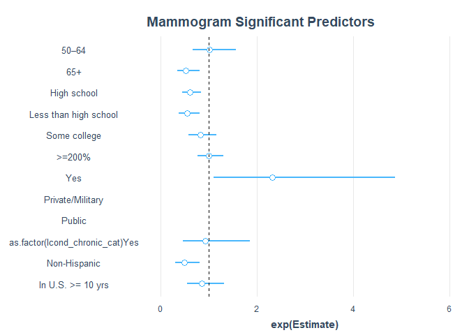

Mammogram
================

Read in the data.

``` r
cancer = read_csv("./data/cancerxx.csv") %>%
  select(HHX, FMX, FPX, WTFA_SA, STRAT_P, PSU_P, REGION, MAMHAD, MAM6YR, 
         RMAM1_MT, RMAM1YR, RMAM1N, RMAM1T, RMAM2, RMAM3A, RMAM3B, MAMPAY, 
         MAMREAS, MDRECMAM, MAMDNBR, MAMABN1, MFOLLOW0, MFOLLO01, MFOLLO02, 
         MFOLLO03, MFOLLO04, MFOLLO05, MNOTFOL1, MAMMODE, MAMCAN1)

adult = read_csv("./data/samadult.csv") %>%
  select(HHX, FMX, FPX, AUSUALPL, AHCPLROU, AHCPLKND, FLA1AR)

family = read_csv("./data/familyxx.csv") %>%
  select(HHX, FMX, RAT_CAT4, RAT_CAT5)

person = read_csv("./data/personsx.csv") %>%
  select(HHX, FMX, FPX, AGE_P, EDUC1, SEX, NOTCOV, COVER65, COVER65O, LA1AR,
         LCONDRT, LACHRONR, HISCODI3, RACRECI3, COVER, YRSINUS, PLBORN)

mam_dat = cancer %>%
  left_join(adult, by = c("HHX", "FMX", "FPX")) %>%
  left_join(person, by = c("HHX", "FMX", "FPX")) %>%
  left_join(family, by = c("HHX", "FMX")) 
```

Data Manipulation

``` r
# outcome is having a mammogram in the last 2 years:RMAM3A = 1,2
mam_dat = mam_dat %>%
  mutate(mam_2 = if_else(RMAM3A <= 2, 1, 0),
         imm_stat = case_when(YRSINUS < 4 ~ "In U.S. < 10 yrs",
                              YRSINUS == 4 | YRSINUS == 5 ~ "In U.S. >= 10 yrs",
                              PLBORN == 1 ~ "Born in U.S."))

# create the age category
mam_dat = mam_dat %>% 
  mutate(age_cat = case_when(AGE_P >= 25 & AGE_P < 40 ~ "25–39",
                             AGE_P >= 40 & AGE_P < 50 ~ "40–49",
                             AGE_P >= 50 & AGE_P < 65 ~ "50–64",
                             AGE_P >= 65 ~ "65+"))
# create educ category
mam_dat = mam_dat %>% 
  mutate(educ_cat = case_when(EDUC1 < 13 ~ "Less than high school",
                              EDUC1 >= 13 & EDUC1 < 15 ~ "High school",
                              EDUC1 >= 15 & EDUC1 < 18 ~ "Some college",
                              EDUC1 >= 18 & EDUC1 <= 21 ~ "College graduate"))

# create financial category
mam_dat = mam_dat %>% 
  mutate(finc_cat = case_when(RAT_CAT5 <= 7 |  RAT_CAT5 %in% c(15, 16) ~ "<200%",
                              RAT_CAT5 %in% c(8, 9) ~ "200–299%", 
                              RAT_CAT5 %in% c(10, 11) ~ "300–399%",
                              RAT_CAT5 >= 18 & EDUC1 <= 21 ~ "400–499%",
                              RAT_CAT5 == 14  ~">=500%",
                              RAT_CAT5 == 17  ~">=200%, no further detail",
                              RAT_CAT5 %in% c(96, 99) ~ "Unknown"))

# create as usual category
mam_dat = mam_dat %>% 
  mutate(ausualpl_cat  = case_when(AUSUALPL == 2 ~ "No",
                                   AUSUALPL %in% c(1, 3) ~ "Yes",
                                   AUSUALPL %in% c(7, 8, 9) ~ "Other"))
# coverage status
mam_dat = mam_dat %>% 
  mutate(cover_cat  = case_when(NOTCOV == 1 | COVER == 4 | COVER65 == 6 ~ "None",
                                COVER == 2 | COVER65 %in% 2:4 ~ "Public",
                                COVER %in% c(1, 3) | COVER65 %in% c(1, 5) ~ "Private/Military"))

# disability
mam_dat = mam_dat %>% 
  mutate(lcond_chronic_cat = if_else(LCONDRT == 1, "Yes", "No"))

# race
mam_dat = mam_dat %>% 
  mutate(race_cat = case_when(RACRECI3 == 1 ~ "White",
                              RACRECI3 == 2 ~ "Black",
                              RACRECI3 == 3 ~ "Asian",
                              RACRECI3 == 4 ~ "AN/AI"),
         eth_cat = case_when(HISCODI3 == 1 ~ "Hispanic",
                             HISCODI3 == 2 ~ "Non-Hispanic White",
                             HISCODI3 == 3 ~ "Non-Hispanic Black",
                             HISCODI3 == 4 ~ "Non-Hispanic Asian",
                             HISCODI3 == 5 ~ "Non-Hispanic AN/AI"))
```

Survey Design

``` r
mam_dat = mam_dat %>%
  mutate(domain = if_else(SEX == 2 & AGE_P >= 40, 1, 0))


des = svydesign(ids = ~PSU_P, strata = ~STRAT_P, weights = ~WTFA_SA, nest = TRUE, data = mam_dat)
```

Tables

``` r
# percent of women who have had mammogram in the last two years

age_pct = svyby(~mam_2, by = ~domain+age_cat, svymean, na.rm = TRUE, 
                design = des, vartype = c("ci", "se"))
age_pct %>% filter(domain == 1) %>% select(-domain, -se) %>% knitr::kable()
```

| age\_cat |     mam\_2|      ci\_l|      ci\_u|
|:---------|----------:|----------:|----------:|
| 40–49    |  0.7609720|  0.7348160|  0.7871280|
| 50–64    |  0.7510356|  0.7339199|  0.7681512|
| 65+      |  0.6669962|  0.6481919|  0.6858006|

``` r
# mammogram by education
edu_pct = svyby(~mam_2, by = ~domain+educ_cat, svymean, na.rm = TRUE, 
                design = des, vartype = c("se", "ci")) %>%
  filter(domain == 1) %>%
  select(-domain, -se)

edu_pct %>% 
  knitr::kable()
```

| educ\_cat             |     mam\_2|      ci\_l|      ci\_u|
|:----------------------|----------:|----------:|----------:|
| College graduate      |  0.7952259|  0.7759755|  0.8144763|
| High school           |  0.6785310|  0.6548180|  0.7022440|
| Less than high school |  0.6233975|  0.5880548|  0.6587402|
| Some college          |  0.7298794|  0.7085698|  0.7511891|

``` r
# mammogram by finc
finc_pct = svyby(~mam_2, by = ~domain+finc_cat, svymean, na.rm = TRUE, 
                 design = des, vartype = c("se", "ci")) %>%
  filter(domain == 1) %>%
  select(-domain, -se)

finc_pct %>% knitr::kable()
```

| finc\_cat                    |     mam\_2|      ci\_l|      ci\_u|
|:-----------------------------|----------:|----------:|----------:|
| &lt;200%                     |  0.6336404|  0.6102688|  0.6570120|
| &gt;=200%, no further detail |  0.6829528|  0.6182815|  0.7476241|
| &gt;=500%                    |  0.8049806|  0.7828196|  0.8271415|
| 200–299%                     |  0.6846054|  0.6473660|  0.7218448|
| 300–399%                     |  0.7389614|  0.7026038|  0.7753189|
| 400–499%                     |  0.7582742|  0.7263519|  0.7901964|
| Unknown                      |  0.4531864|  0.1993634|  0.7070094|

``` r
# mammogram by usual care
ausualp_pct = svyby(~mam_2, by = ~domain+ausualpl_cat, svymean, na.rm = TRUE, 
                    design = des, vartype = c("se", "ci")) %>%
  filter(domain == 1) %>%
  select(-domain, -se)

ausualp_pct %>% knitr::kable()
```

| ausualpl\_cat |     mam\_2|       ci\_l|      ci\_u|
|:--------------|----------:|-----------:|----------:|
| No            |  0.4426809|   0.3857382|  0.4996237|
| Other         |  0.6349977|  -0.0074398|  1.2774351|
| Yes           |  0.7374589|   0.7258591|  0.7490586|

``` r
# mammogram by health coverage
cover_pct = svyby(~mam_2, by = ~domain+cover_cat, svymean, na.rm = TRUE, 
                  design = des, vartype = c("se", "ci")) %>%
  filter(domain == 1) %>%
  select(-domain, -se)

cover_pct %>% knitr::kable()
```

| cover\_cat       |     mam\_2|      ci\_l|      ci\_u|
|:-----------------|----------:|----------:|----------:|
| None             |  0.4711737|  0.4004064|  0.5419410|
| Private/Military |  0.7605363|  0.7467293|  0.7743434|
| Public           |  0.6643714|  0.6409525|  0.6877904|

``` r
# mammogram by chronic conditions
lcond_chronic_pct = svyby(~mam_2, by = ~domain+lcond_chronic_cat, svymean, 
                          na.rm = TRUE, design = des, vartype = c("se", "ci")) %>%
  filter(domain == 1) %>%
  select(-domain, -se)

lcond_chronic_pct %>% knitr::kable()
```

| lcond\_chronic\_cat |     mam\_2|      ci\_l|      ci\_u|
|:--------------------|----------:|----------:|----------:|
| No                  |  0.6235415|  0.4602961|  0.7867868|
| Yes                 |  0.6105575|  0.5844282|  0.6366868|

``` r
#mammogram by race
race_pct = svyby(~mam_2, by = ~domain+race_cat, svymean, na.rm = TRUE, 
                 design = des, vartype = c("se", "ci")) %>%
  filter(domain == 1) %>%
  select(-domain, -se)

race_pct %>% knitr::kable()
```

| race\_cat |     mam\_2|      ci\_l|      ci\_u|
|:----------|----------:|----------:|----------:|
| AN/AI     |  0.6382206|  0.5275676|  0.7488735|
| Asian     |  0.7023464|  0.6479896|  0.7567032|
| Black     |  0.7688270|  0.7385748|  0.7990792|
| White     |  0.7203100|  0.7071951|  0.7334248|

``` r
# mammogram by ethnicity
eth_pct = svyby(~mam_2, by = ~domain+eth_cat, svymean, na.rm = TRUE, 
                design = des, vartype = c("se", "ci")) %>%
  filter(domain == 1) %>%
  select(-domain, -se)

eth_pct %>% knitr::kable()
```

| eth\_cat           |     mam\_2|      ci\_l|      ci\_u|
|:-------------------|----------:|----------:|----------:|
| Hispanic           |  0.7434129|  0.7136199|  0.7732058|
| Non-Hispanic AN/AI |  0.6787829|  0.5493178|  0.8082481|
| Non-Hispanic Asian |  0.7005102|  0.6454834|  0.7555370|
| Non-Hispanic Black |  0.7684556|  0.7377942|  0.7991169|
| Non-Hispanic White |  0.7165402|  0.7025792|  0.7305012|

``` r
imm_pct = svyby(~mam_2, by = ~domain+imm_stat, svymean, na.rm = TRUE,
                design = des, vartype = c("se", "ci")) %>%
  filter(domain == 1) %>%
  select(-domain, -se)

imm_pct %>% knitr::kable()
```

| imm\_stat            |     mam\_2|      ci\_l|      ci\_u|
|:---------------------|----------:|----------:|----------:|
| Born in U.S.         |  0.7247355|  0.7124950|  0.7369760|
| In U.S. &lt; 10 yrs  |  0.6920384|  0.5859504|  0.7981264|
| In U.S. &gt;= 10 yrs |  0.7232266|  0.6925968|  0.7538563|

Tables By Age Group

``` r
# mammogram by education
edu_pct_strat = svyby(~mam_2, by = ~domain + age_cat + educ_cat, svymean, 
                      na.rm = TRUE, design = des, vartype = c("se", "ci"))
edu_tab = edu_pct_strat %>% 
  filter(domain == 1) %>% 
  select(-domain, -se) 

edu_tab %>% knitr::kable()
```

| age\_cat | educ\_cat             |     mam\_2|      ci\_l|      ci\_u|
|:---------|:----------------------|----------:|----------:|----------:|
| 40–49    | College graduate      |  0.8085672|  0.7707166|  0.8464178|
| 50–64    | College graduate      |  0.8109270|  0.7831941|  0.8386598|
| 65+      | College graduate      |  0.7537526|  0.7172640|  0.7902411|
| 40–49    | High school           |  0.6818410|  0.6144456|  0.7492364|
| 50–64    | High school           |  0.7247121|  0.6848474|  0.7645768|
| 65+      | High school           |  0.6336142|  0.5983451|  0.6688834|
| 40–49    | Less than high school |  0.6999305|  0.6228325|  0.7770285|
| 50–64    | Less than high school |  0.6506867|  0.5928630|  0.7085104|
| 65+      | Less than high school |  0.5719782|  0.5172242|  0.6267323|
| 40–49    | Some college          |  0.7628288|  0.7164342|  0.8092234|
| 50–64    | Some college          |  0.7406601|  0.7105614|  0.7707588|
| 65+      | Some college          |  0.6909571|  0.6565986|  0.7253157|

``` r
# mammogram by finc
finc_pct_strat = svyby(~mam_2, by = ~domain + age_cat + finc_cat, svymean, 
                       na.rm = TRUE, design = des, vartype = c("se", "ci"))

finc_tab = finc_pct_strat %>% 
  filter(domain == 1) %>% 
  select(-domain, -se) 

finc_tab %>% knitr::kable()
```

| age\_cat | finc\_cat                    |     mam\_2|       ci\_l|      ci\_u|
|:---------|:-----------------------------|----------:|-----------:|----------:|
| 40–49    | &lt;200%                     |  0.6956259|   0.6448771|  0.7463748|
| 50–64    | &lt;200%                     |  0.6495575|   0.6101441|  0.6889709|
| 65+      | &lt;200%                     |  0.5848766|   0.5493209|  0.6204322|
| 40–49    | &gt;=200%, no further detail |  0.8594243|   0.7506689|  0.9681797|
| 50–64    | &gt;=200%, no further detail |  0.7350658|   0.6237214|  0.8464101|
| 65+      | &gt;=200%, no further detail |  0.6088342|   0.5150514|  0.7026171|
| 40–49    | &gt;=500%                    |  0.8120277|   0.7701024|  0.8539529|
| 50–64    | &gt;=500%                    |  0.8105147|   0.7804614|  0.8405680|
| 65+      | &gt;=500%                    |  0.7855235|   0.7417109|  0.8293361|
| 40–49    | 200–299%                     |  0.7072433|   0.6214273|  0.7930594|
| 50–64    | 200–299%                     |  0.7089483|   0.6459559|  0.7719406|
| 65+      | 200–299%                     |  0.6470099|   0.5991062|  0.6949135|
| 40–49    | 300–399%                     |  0.7310784|   0.6541823|  0.8079745|
| 50–64    | 300–399%                     |  0.7706667|   0.7051139|  0.8362195|
| 65+      | 300–399%                     |  0.7085731|   0.6507690|  0.7663771|
| 40–49    | 400–499%                     |  0.8174002|   0.7382089|  0.8965915|
| 50–64    | 400–499%                     |  0.7917000|   0.7382696|  0.8451305|
| 65+      | 400–499%                     |  0.7010436|   0.6564844|  0.7456028|
| 40–49    | Unknown                      |  0.0000000|   0.0000000|  0.0000000|
| 50–64    | Unknown                      |  0.9962176|   0.9879882|  1.0044469|
| 65+      | Unknown                      |  0.2035140|  -0.0544638|  0.4614919|

``` r
# mammogram by usual care
ausualp_pct_strat = svyby(~mam_2, by = ~domain + age_cat + ausualpl_cat,
                          svymean, na.rm = TRUE, design = des, 
                          vartype = c("se", "ci"))

usual_tab = ausualp_pct_strat %>% 
  filter(domain == 1) %>% 
  select(-domain, -se) 

usual_tab %>% knitr::kable()
```

| age\_cat | ausualpl\_cat |     mam\_2|      ci\_l|      ci\_u|
|:---------|:--------------|----------:|----------:|----------:|
| 40–49    | No            |  0.5056792|  0.4057956|  0.6055628|
| 50–64    | No            |  0.3810310|  0.2889497|  0.4731123|
| 65+      | No            |  0.4840104|  0.3523452|  0.6156756|
| 40–49    | Other         |  0.0000000|  0.0000000|  0.0000000|
| 50–64    | Other         |  1.0000000|  1.0000000|  1.0000000|
| 65+      | Other         |  0.0000000|  0.0000000|  0.0000000|
| 40–49    | Yes           |  0.7802444|  0.7542141|  0.8062747|
| 50–64    | Yes           |  0.7700861|  0.7529459|  0.7872262|
| 65+      | Yes           |  0.6714421|  0.6525374|  0.6903469|

``` r
# mammogram by health coverage
cover_pct_strat = svyby(~mam_2, by = ~domain + age_cat + cover_cat, svymean,
                        na.rm = TRUE, design = des, vartype = c("se", "ci"))

ins_tab = cover_pct_strat %>% 
  filter(domain == 1) %>% 
  select(-domain, -se)

ins_tab %>% knitr::kable()
```

| age\_cat | cover\_cat       |     mam\_2|      ci\_l|      ci\_u|
|:---------|:-----------------|----------:|----------:|----------:|
| 40–49    | None             |  0.4829030|  0.3629256|  0.6028804|
| 50–64    | None             |  0.4603852|  0.3769433|  0.5438272|
| 65+      | None             |  0.5160788|  0.2196597|  0.8124978|
| 40–49    | Private/Military |  0.7914360|  0.7633846|  0.8194874|
| 50–64    | Private/Military |  0.7802779|  0.7610562|  0.7994996|
| 65+      | Private/Military |  0.6871598|  0.6611642|  0.7131553|
| 40–49    | Public           |  0.7370242|  0.6725539|  0.8014945|
| 50–64    | Public           |  0.6818896|  0.6241168|  0.7396625|
| 65+      | Public           |  0.6486552|  0.6199508|  0.6773596|

``` r
# mammogram by chronic conditions
lcond_chronic_pct_strat = svyby(~mam_2, 
                                by = ~domain + age_cat + lcond_chronic_cat,
                                svymean, na.rm = TRUE, design = des,
                                vartype = c("se", "ci"))

dis_tab = lcond_chronic_pct_strat %>% 
  filter(domain == 1) %>% 
  select(-domain, -se) 

dis_tab %>% knitr::kable()
```

| age\_cat | lcond\_chronic\_cat |     mam\_2|      ci\_l|      ci\_u|
|:---------|:--------------------|----------:|----------:|----------:|
| 40–49    | No                  |  0.7176907|  0.3453040|  1.0900773|
| 50–64    | No                  |  0.8619131|  0.7174233|  1.0064030|
| 65+      | No                  |  0.4720814|  0.2627660|  0.6813969|
| 40–49    | Yes                 |  0.6903587|  0.6133066|  0.7674109|
| 50–64    | Yes                 |  0.6848202|  0.6423921|  0.7272482|
| 65+      | Yes                 |  0.5381731|  0.5032309|  0.5731153|

``` r
# mammogram by race
race_pct_strat = svyby(~mam_2, by = ~domain + age_cat + race_cat, svymean, 
                       na.rm = TRUE, design = des, vartype = c("se", "ci"))

race_tab = race_pct_strat %>% 
  filter(domain == 1) %>% 
  select(-domain, -se) 

race_tab %>% knitr::kable()
```

| age\_cat | race\_cat |     mam\_2|      ci\_l|      ci\_u|
|:---------|:----------|----------:|----------:|----------:|
| 40–49    | AN/AI     |  0.6820006|  0.4637318|  0.9002694|
| 50–64    | AN/AI     |  0.5832300|  0.4209941|  0.7454660|
| 65+      | AN/AI     |  0.6798373|  0.4792802|  0.8803944|
| 40–49    | Asian     |  0.7285098|  0.6249686|  0.8320510|
| 50–64    | Asian     |  0.7388677|  0.6510686|  0.8266667|
| 65+      | Asian     |  0.6051615|  0.5083183|  0.7020048|
| 40–49    | Black     |  0.8109375|  0.7584382|  0.8634368|
| 50–64    | Black     |  0.7983266|  0.7574828|  0.8391704|
| 65+      | Black     |  0.6804674|  0.6261574|  0.7347773|
| 40–49    | White     |  0.7567230|  0.7267415|  0.7867046|
| 50–64    | White     |  0.7467055|  0.7263464|  0.7670646|
| 65+      | White     |  0.6680536|  0.6481251|  0.6879822|

``` r
# mammogram by ethnicity
eth_pct_strat = svyby(~mam_2, by = ~domain + age_cat + eth_cat, svymean, 
                      na.rm = TRUE, design = des, vartype = c("se", "ci"))

eth_tab = eth_pct_strat %>% 
  filter(domain == 1) %>% 
  select(-domain, -se) 

eth_tab %>% knitr::kable()
```

| age\_cat | eth\_cat           |     mam\_2|      ci\_l|      ci\_u|
|:---------|:-------------------|----------:|----------:|----------:|
| 40–49    | Hispanic           |  0.7350049|  0.6860044|  0.7840053|
| 50–64    | Hispanic           |  0.7887929|  0.7425060|  0.8350797|
| 65+      | Hispanic           |  0.6757057|  0.6174945|  0.7339170|
| 40–49    | Non-Hispanic AN/AI |  0.8614933|  0.7233204|  0.9996662|
| 50–64    | Non-Hispanic AN/AI |  0.5788007|  0.3741846|  0.7834168|
| 65+      | Non-Hispanic AN/AI |  0.6618173|  0.4220170|  0.9016176|
| 40–49    | Non-Hispanic Asian |  0.7255322|  0.6191024|  0.8319621|
| 50–64    | Non-Hispanic Asian |  0.7358176|  0.6461917|  0.8254434|
| 65+      | Non-Hispanic Asian |  0.6088310|  0.5113248|  0.7063372|
| 40–49    | Non-Hispanic Black |  0.8174351|  0.7624666|  0.8724036|
| 50–64    | Non-Hispanic Black |  0.7971501|  0.7556416|  0.8386587|
| 65+      | Non-Hispanic Black |  0.6774079|  0.6234387|  0.7313772|
| 40–49    | Non-Hispanic White |  0.7584481|  0.7227714|  0.7941248|
| 50–64    | Non-Hispanic White |  0.7405940|  0.7183667|  0.7628213|
| 65+      | Non-Hispanic White |  0.6676896|  0.6471933|  0.6881859|

``` r
imm_pct_strat = svyby(~mam_2, by = ~domain + age_cat + imm_stat, svymean,
                      na.rm = TRUE, design = des, vartype = c("se", "ci"))

imm_tab = imm_pct_strat %>%
  filter(domain == 1) %>%
  select(-domain, -se)

imm_tab %>% knitr::kable()
```

| age\_cat | imm\_stat            |     mam\_2|      ci\_l|      ci\_u|
|:---------|:---------------------|----------:|----------:|----------:|
| 40–49    | Born in U.S.         |  0.7648196|  0.7336183|  0.7960209|
| 50–64    | Born in U.S.         |  0.7475203|  0.7283139|  0.7667267|
| 65+      | Born in U.S.         |  0.6740989|  0.6550582|  0.6931396|
| 40–49    | In U.S. &lt; 10 yrs  |  0.6718178|  0.5154111|  0.8282245|
| 50–64    | In U.S. &lt; 10 yrs  |  0.7269500|  0.5430927|  0.9108074|
| 65+      | In U.S. &lt; 10 yrs  |  0.6844641|  0.4369705|  0.9319578|
| 40–49    | In U.S. &gt;= 10 yrs |  0.7543553|  0.6990657|  0.8096448|
| 50–64    | In U.S. &gt;= 10 yrs |  0.7729488|  0.7269979|  0.8188997|
| 65+      | In U.S. &gt;= 10 yrs |  0.6163448|  0.5632557|  0.6694340|

``` r
# total gotten mammogram
total = svyby(~mam_2, by = ~domain + age_cat, svymean, na.rm = TRUE, 
              design = des, vartype = c("se", "ci"))

tot_tab = total %>% 
  filter(domain == 1) %>% 
  select(-domain, -se) 

tot_tab %>% knitr::kable()
```

| age\_cat |     mam\_2|      ci\_l|      ci\_u|
|:---------|----------:|----------:|----------:|
| 40–49    |  0.7609720|  0.7348160|  0.7871280|
| 50–64    |  0.7510356|  0.7339199|  0.7681512|
| 65+      |  0.6669962|  0.6481919|  0.6858006|

``` r
tot_pct = svyby(~mam_2, by = ~domain, svymean, na.rm = TRUE, design = des,
                vartype = c("se", "ci")) %>%
  filter(domain == 1) %>%
  select(-domain, -se) %>%
  mutate(age_cat = "40+")
```

Combine into paper table

``` r
tot_tab = rbind(tot_pct, tot_tab)

tot_tab2 = tot_tab %>%
  mutate(type = "Total",
         level = "-")

edu_pct2 = edu_pct %>%
  mutate(age_cat = "40+")

edu_tab = rbind(edu_pct2, edu_tab)

edu_tab2 = edu_tab %>%
  mutate(type = "Education") %>%
  rename(level = educ_cat) %>%
  mutate(level = factor(level, levels = c("Less than high school", "High school", "Some college", "College graduate"))) %>%
  arrange(level)

finc_pct2 = finc_pct %>%
  mutate(age_cat = "40+")

finc_tab = rbind(finc_pct2, finc_tab)

# 
finc_tab2 = finc_tab %>%
  mutate(type = "Family Income Poverty Ratio") %>%
  rename(level = finc_cat) %>%
  mutate(level = factor(level, levels = c("<200%", ">=200%, no further detail", "200–299%", "300–399%", "400–499%", ">=500%", "Unknown"))) %>%
  arrange(level)

ausualp_pct2 = ausualp_pct %>%
  mutate(age_cat = "40+")

usual_tab = rbind(ausualp_pct2, usual_tab)

usual_tab2 = usual_tab %>%
  mutate(type = "Usual Source of Care") %>%
  rename(level = ausualpl_cat) %>%
  mutate(level = factor(level, levels = c("No", "Yes", "Other"))) %>%
  arrange(level)

cover_pct2 = cover_pct %>%
  mutate(age_cat = "40+")

ins_tab = rbind(cover_pct2, ins_tab)

ins_tab2 = ins_tab %>%
  mutate(type = "Insurance Type") %>%
  rename(level = cover_cat) %>%
  mutate(level = factor(level, levels = c("None", "Public", "Private/Military"))) %>%
  arrange(level)

lcond_chronic_pct2 = lcond_chronic_pct %>%
  mutate(age_cat = "40+")

dis_tab = rbind(lcond_chronic_pct2, dis_tab)

dis_tab2 = dis_tab %>%
  mutate(type = "Chronic Disability") %>%
  rename(level = lcond_chronic_cat) %>%
  mutate(level = factor(level, levels = c("Yes", "No"))) %>%
  arrange(level)

eth_pct2 = eth_pct %>%
  mutate(age_cat = "40+")

eth_tab = rbind(eth_pct2, eth_tab)

eth_tab2 = eth_tab %>%
  mutate(type = "Ethnicity") %>%
  rename(level = eth_cat) %>%
  mutate(level = factor(level, levels = c("Hispanic", "Non-Hispanic White", "Non-Hispanic Black", "Non-Hispanic AN/AI", "Non-Hispanic Asian"))) %>%
  arrange(level)

race_pct2 = race_pct %>%
  mutate(age_cat = "40+")

race_tab = rbind(race_pct2, race_tab)

race_tab2 = race_tab %>%
  mutate(type = "Race") %>%
  rename(level = race_cat) %>%
  mutate(level = factor(level, levels = c("White", "Black", "AN/AI", "Asian"))) %>%
  arrange(level)

imm_pct2 = imm_pct %>%
  mutate(age_cat = "40+")

imm_tab = rbind(imm_pct2, imm_tab)

imm_tab2 = imm_tab %>%
  mutate(type = "Immigration") %>%
  rename(level = imm_stat) %>%
  mutate(level = factor(level, levels = c("In U.S. < 10 yrs", "In U.S. >= 10 yrs", "Born in U.S."))) %>%
  arrange(level)

# create table of percentages of women who have gotten mammograms within the last two years (still need to add CIs)
tab_one = rbind(tot_tab2, edu_tab2, finc_tab2, usual_tab2, ins_tab2, dis_tab2, eth_tab2, race_tab2, imm_tab2) %>%
  mutate(mam_2 = round(mam_2*100, 2),
         ci_l = round(ci_l*100, 2),
         ci_u = round(ci_u*100, 2),
         CI = str_c(ci_l, ", ", ci_u)) %>%
  rename(Percent = mam_2) %>%
  select(-ci_l, -ci_u) %>%
  pivot_wider(names_from = age_cat, values_from = c(Percent, CI)) %>%
  janitor::clean_names() %>%
  select(type, level, percent_40, ci_40, percent_40_49, ci_40_49, percent_50_64, ci_50_64, everything())

# print percentages
tab_one %>% knitr::kable()
```

| type                        | level                        |  percent\_40| ci\_40        |  percent\_40\_49| ci\_40\_49    |  percent\_50\_64| ci\_50\_64    |  percent\_65| ci\_65       |
|:----------------------------|:-----------------------------|------------:|:--------------|----------------:|:--------------|----------------:|:--------------|------------:|:-------------|
| Total                       | -                            |        72.42| 71.28, 73.57  |            76.10| 73.48, 78.71  |            75.10| 73.39, 76.82  |        66.70| 64.82, 68.58 |
| Education                   | Less than high school        |        62.34| 58.81, 65.87  |            69.99| 62.28, 77.7   |            65.07| 59.29, 70.85  |        57.20| 51.72, 62.67 |
| Education                   | High school                  |        67.85| 65.48, 70.22  |            68.18| 61.44, 74.92  |            72.47| 68.48, 76.46  |        63.36| 59.83, 66.89 |
| Education                   | Some college                 |        72.99| 70.86, 75.12  |            76.28| 71.64, 80.92  |            74.07| 71.06, 77.08  |        69.10| 65.66, 72.53 |
| Education                   | College graduate             |        79.52| 77.6, 81.45   |            80.86| 77.07, 84.64  |            81.09| 78.32, 83.87  |        75.38| 71.73, 79.02 |
| Family Income Poverty Ratio | &lt;200%                     |        63.36| 61.03, 65.7   |            69.56| 64.49, 74.64  |            64.96| 61.01, 68.9   |        58.49| 54.93, 62.04 |
| Family Income Poverty Ratio | &gt;=200%, no further detail |        68.30| 61.83, 74.76  |            85.94| 75.07, 96.82  |            73.51| 62.37, 84.64  |        60.88| 51.51, 70.26 |
| Family Income Poverty Ratio | 200–299%                     |        68.46| 64.74, 72.18  |            70.72| 62.14, 79.31  |            70.89| 64.6, 77.19   |        64.70| 59.91, 69.49 |
| Family Income Poverty Ratio | 300–399%                     |        73.90| 70.26, 77.53  |            73.11| 65.42, 80.8   |            77.07| 70.51, 83.62  |        70.86| 65.08, 76.64 |
| Family Income Poverty Ratio | 400–499%                     |        75.83| 72.64, 79.02  |            81.74| 73.82, 89.66  |            79.17| 73.83, 84.51  |        70.10| 65.65, 74.56 |
| Family Income Poverty Ratio | &gt;=500%                    |        80.50| 78.28, 82.71  |            81.20| 77.01, 85.4   |            81.05| 78.05, 84.06  |        78.55| 74.17, 82.93 |
| Family Income Poverty Ratio | Unknown                      |        45.32| 19.94, 70.7   |             0.00| 0, 0          |            99.62| 98.8, 100.44  |        20.35| -5.45, 46.15 |
| Usual Source of Care        | No                           |        44.27| 38.57, 49.96  |            50.57| 40.58, 60.56  |            38.10| 28.89, 47.31  |        48.40| 35.23, 61.57 |
| Usual Source of Care        | Yes                          |        73.75| 72.59, 74.91  |            78.02| 75.42, 80.63  |            77.01| 75.29, 78.72  |        67.14| 65.25, 69.03 |
| Usual Source of Care        | Other                        |        63.50| -0.74, 127.74 |             0.00| 0, 0          |           100.00| 100, 100      |         0.00| 0, 0         |
| Insurance Type              | None                         |        47.12| 40.04, 54.19  |            48.29| 36.29, 60.29  |            46.04| 37.69, 54.38  |        51.61| 21.97, 81.25 |
| Insurance Type              | Public                       |        66.44| 64.1, 68.78   |            73.70| 67.26, 80.15  |            68.19| 62.41, 73.97  |        64.87| 62, 67.74    |
| Insurance Type              | Private/Military             |        76.05| 74.67, 77.43  |            79.14| 76.34, 81.95  |            78.03| 76.11, 79.95  |        68.72| 66.12, 71.32 |
| Chronic Disability          | Yes                          |        61.06| 58.44, 63.67  |            69.04| 61.33, 76.74  |            68.48| 64.24, 72.72  |        53.82| 50.32, 57.31 |
| Chronic Disability          | No                           |        62.35| 46.03, 78.68  |            71.77| 34.53, 109.01 |            86.19| 71.74, 100.64 |        47.21| 26.28, 68.14 |
| Ethnicity                   | Hispanic                     |        74.34| 71.36, 77.32  |            73.50| 68.6, 78.4    |            78.88| 74.25, 83.51  |        67.57| 61.75, 73.39 |
| Ethnicity                   | Non-Hispanic White           |        71.65| 70.26, 73.05  |            75.84| 72.28, 79.41  |            74.06| 71.84, 76.28  |        66.77| 64.72, 68.82 |
| Ethnicity                   | Non-Hispanic Black           |        76.85| 73.78, 79.91  |            81.74| 76.25, 87.24  |            79.72| 75.56, 83.87  |        67.74| 62.34, 73.14 |
| Ethnicity                   | Non-Hispanic AN/AI           |        67.88| 54.93, 80.82  |            86.15| 72.33, 99.97  |            57.88| 37.42, 78.34  |        66.18| 42.2, 90.16  |
| Ethnicity                   | Non-Hispanic Asian           |        70.05| 64.55, 75.55  |            72.55| 61.91, 83.2   |            73.58| 64.62, 82.54  |        60.88| 51.13, 70.63 |
| Race                        | White                        |        72.03| 70.72, 73.34  |            75.67| 72.67, 78.67  |            74.67| 72.63, 76.71  |        66.81| 64.81, 68.8  |
| Race                        | Black                        |        76.88| 73.86, 79.91  |            81.09| 75.84, 86.34  |            79.83| 75.75, 83.92  |        68.05| 62.62, 73.48 |
| Race                        | AN/AI                        |        63.82| 52.76, 74.89  |            68.20| 46.37, 90.03  |            58.32| 42.1, 74.55   |        67.98| 47.93, 88.04 |
| Race                        | Asian                        |        70.23| 64.8, 75.67   |            72.85| 62.5, 83.21   |            73.89| 65.11, 82.67  |        60.52| 50.83, 70.2  |
| Immigration                 | In U.S. &lt; 10 yrs          |        69.20| 58.6, 79.81   |            67.18| 51.54, 82.82  |            72.70| 54.31, 91.08  |        68.45| 43.7, 93.2   |
| Immigration                 | In U.S. &gt;= 10 yrs         |        72.32| 69.26, 75.39  |            75.44| 69.91, 80.96  |            77.29| 72.7, 81.89   |        61.63| 56.33, 66.94 |
| Immigration                 | Born in U.S.                 |        72.47| 71.25, 73.7   |            76.48| 73.36, 79.6   |            74.75| 72.83, 76.67  |        67.41| 65.51, 69.31 |

Barplots of Usual Care and Insurance Coverage

``` r
# usual source of care barchart
usual_tab %>%
  filter(age_cat != "40+" & ausualpl_cat != "Other") %>%
  ggplot(aes(x = ausualpl_cat, y = mam_2, fill = ausualpl_cat)) +
  geom_col() +
  scale_y_continuous(limits = c(0,1), breaks = c(0, 0.25, 0.5, 0.75, 1)) +
  geom_errorbar(aes(ymin = ci_l, ymax = ci_u)) +
  facet_grid(~age_cat) + ggthemes::theme_few() + ggthemes::scale_fill_few() + theme(legend.position = "none") +
  labs(y = "Percent Had Mammogram, Last 2 Years", x = "Usual Source of Care (Have/Have Not)")
```


``` r
# insurance type barchart
ins_tab %>%
  filter(age_cat != "40+") %>%
  ggplot(aes(x = cover_cat, y = mam_2, fill = cover_cat)) +
  geom_col() + 
  scale_y_continuous(limits = c(0,1), breaks = c(0, 0.25, 0.5, 0.75, 1)) +
  geom_errorbar(aes(ymin = ci_l, ymax = ci_u)) +
  facet_grid(~age_cat) + ggthemes::theme_few() + ggthemes::scale_fill_few() + theme(legend.position = "none") +
  labs(y = "Percent Had Mammogram, Last 2 Years", x = "Type of Insurance Coverage")
```


Models

``` r
mam_fit = svyglm(mam_2 ~ as.factor(age_cat) + as.factor(educ_cat) + as.factor(finc_cat) + as.factor(ausualpl_cat) + as.factor(cover_cat) + as.factor(lcond_chronic_cat) + as.factor(race_cat) + as.factor(eth_cat) + as.factor(imm_stat), 
       design = des, subset = domain == 1, family = binomial(link = "logit"))
```

    ## Warning in eval(family$initialize): non-integer #successes in a binomial
    ## glm!

``` r
summary(mam_fit)
```

    ## 
    ## Call:
    ## svyglm(formula = mam_2 ~ as.factor(age_cat) + as.factor(educ_cat) + 
    ##     as.factor(finc_cat) + as.factor(ausualpl_cat) + as.factor(cover_cat) + 
    ##     as.factor(lcond_chronic_cat) + as.factor(race_cat) + as.factor(eth_cat) + 
    ##     as.factor(imm_stat), design = des, subset = domain == 1, 
    ##     family = binomial(link = "logit"))
    ## 
    ## Survey design:
    ## svydesign(ids = ~PSU_P, strata = ~STRAT_P, weights = ~WTFA_SA, 
    ##     nest = TRUE, data = mam_dat)
    ## 
    ## Coefficients:
    ##                                               Estimate Std. Error t value
    ## (Intercept)                                    1.06128    1.29031   0.823
    ## as.factor(age_cat)50–64                       -0.02853    0.22139  -0.129
    ## as.factor(age_cat)65+                         -0.65368    0.21940  -2.979
    ## as.factor(educ_cat)High school                -0.41077    0.17025  -2.413
    ## as.factor(educ_cat)Less than high school      -0.54541    0.20845  -2.617
    ## as.factor(educ_cat)Some college               -0.17589    0.18016  -0.976
    ## as.factor(finc_cat)>=200%, no further detail  -0.51678    0.28376  -1.821
    ## as.factor(finc_cat)>=500%                      0.45089    0.23188   1.944
    ## as.factor(finc_cat)200–299%                   -0.12623    0.17883  -0.706
    ## as.factor(finc_cat)300–399%                    0.22968    0.26097   0.880
    ## as.factor(finc_cat)400–499%                    0.12509    0.18916   0.661
    ## as.factor(ausualpl_cat)Other                 -13.40861    1.11589 -12.016
    ## as.factor(ausualpl_cat)Yes                     0.86445    0.33946   2.547
    ## as.factor(cover_cat)Private/Military           1.11095    0.33806   3.286
    ## as.factor(cover_cat)Public                     1.15390    0.35869   3.217
    ## as.factor(lcond_chronic_cat)Yes               -0.09762    0.34406  -0.284
    ## as.factor(race_cat)Asian                      -1.84454    1.67361  -1.102
    ## as.factor(race_cat)Black                      -2.11258    1.41194  -1.496
    ## as.factor(race_cat)White                      -1.09481    1.12904  -0.970
    ## as.factor(eth_cat)Non-Hispanic AN/AI          -1.26040    1.29111  -0.976
    ## as.factor(eth_cat)Non-Hispanic Asian          -0.12125    1.27925  -0.095
    ## as.factor(eth_cat)Non-Hispanic Black           0.61690    0.93852   0.657
    ## as.factor(eth_cat)Non-Hispanic White          -0.84526    0.28088  -3.009
    ## as.factor(imm_stat)In U.S. < 10 yrs           14.48681    0.76703  18.887
    ## as.factor(imm_stat)In U.S. >= 10 yrs          -0.10945    0.23629  -0.463
    ##                                              Pr(>|t|)    
    ## (Intercept)                                   0.41162    
    ## as.factor(age_cat)50–64                       0.89756    
    ## as.factor(age_cat)65+                         0.00319 ** 
    ## as.factor(educ_cat)High school                0.01659 *  
    ## as.factor(educ_cat)Less than high school      0.00945 ** 
    ## as.factor(educ_cat)Some college               0.32992    
    ## as.factor(finc_cat)>=200%, no further detail  0.06983 .  
    ## as.factor(finc_cat)>=500%                     0.05302 .  
    ## as.factor(finc_cat)200–299%                   0.48095    
    ## as.factor(finc_cat)300–399%                   0.37971    
    ## as.factor(finc_cat)400–499%                   0.50909    
    ## as.factor(ausualpl_cat)Other                  < 2e-16 ***
    ## as.factor(ausualpl_cat)Yes                    0.01151 *  
    ## as.factor(cover_cat)Private/Military          0.00117 ** 
    ## as.factor(cover_cat)Public                    0.00148 ** 
    ## as.factor(lcond_chronic_cat)Yes               0.77688    
    ## as.factor(race_cat)Asian                      0.27152    
    ## as.factor(race_cat)Black                      0.13592    
    ## as.factor(race_cat)White                      0.33319    
    ## as.factor(eth_cat)Non-Hispanic AN/AI          0.32995    
    ## as.factor(eth_cat)Non-Hispanic Asian          0.92457    
    ## as.factor(eth_cat)Non-Hispanic Black          0.51162    
    ## as.factor(eth_cat)Non-Hispanic White          0.00290 ** 
    ## as.factor(imm_stat)In U.S. < 10 yrs           < 2e-16 ***
    ## as.factor(imm_stat)In U.S. >= 10 yrs          0.64364    
    ## ---
    ## Signif. codes:  0 '***' 0.001 '**' 0.01 '*' 0.05 '.' 0.1 ' ' 1
    ## 
    ## (Dispersion parameter for binomial family taken to be 0.8271949)
    ## 
    ## Number of Fisher Scoring iterations: 13

``` r
summ(mam_fit)
```

    ## MODEL INFO:
    ## Observations: 2669
    ## Dependent Variable: mam_2
    ## Type: Analysis of complex survey design 
    ##  Family: binomial 
    ##  Link function: logit 
    ## 
    ## MODEL FIT:
    ## Pseudo-R² (Cragg-Uhler) = 0.06
    ## Pseudo-R² (McFadden) = 0.21
    ## AIC = 2736.15 
    ## 
    ## --------------------------------------------------------------------------
    ##                                                Est.   S.E.   t val.      p
    ## ------------------------------------------ -------- ------ -------- ------
    ## (Intercept)                                    1.06   1.29     0.82   0.41
    ## as.factor(age_cat)50–64                     -0.03   0.22    -0.13   0.90
    ## as.factor(age_cat)65+                         -0.65   0.22    -2.98   0.00
    ## as.factor(educ_cat)High                       -0.41   0.17    -2.41   0.02
    ## school                                                                    
    ## as.factor(educ_cat)Less than                  -0.55   0.21    -2.62   0.01
    ## high school                                                               
    ## as.factor(educ_cat)Some                       -0.18   0.18    -0.98   0.33
    ## college                                                                   
    ## as.factor(finc_cat)>=200%,                    -0.52   0.28    -1.82   0.07
    ## no further detail                                                         
    ## as.factor(finc_cat)>=500%                      0.45   0.23     1.94   0.05
    ## as.factor(finc_cat)200–299%                 -0.13   0.18    -0.71   0.48
    ## as.factor(finc_cat)300–399%                  0.23   0.26     0.88   0.38
    ## as.factor(finc_cat)400–499%                  0.13   0.19     0.66   0.51
    ## as.factor(ausualpl_cat)Other                 -13.41   1.12   -12.02   0.00
    ## as.factor(ausualpl_cat)Yes                     0.86   0.34     2.55   0.01
    ## as.factor(cover_cat)Private/Military           1.11   0.34     3.29   0.00
    ## as.factor(cover_cat)Public                     1.15   0.36     3.22   0.00
    ## as.factor(lcond_chronic_cat)Yes               -0.10   0.34    -0.28   0.78
    ## as.factor(race_cat)Asian                      -1.84   1.67    -1.10   0.27
    ## as.factor(race_cat)Black                      -2.11   1.41    -1.50   0.14
    ## as.factor(race_cat)White                      -1.09   1.13    -0.97   0.33
    ## as.factor(eth_cat)Non-Hispanic                -1.26   1.29    -0.98   0.33
    ## AN/AI                                                                     
    ## as.factor(eth_cat)Non-Hispanic                -0.12   1.28    -0.09   0.92
    ## Asian                                                                     
    ## as.factor(eth_cat)Non-Hispanic                 0.62   0.94     0.66   0.51
    ## Black                                                                     
    ## as.factor(eth_cat)Non-Hispanic                -0.85   0.28    -3.01   0.00
    ## White                                                                     
    ## as.factor(imm_stat)In U.S. <                  14.49   0.77    18.89   0.00
    ## 10 yrs                                                                    
    ## as.factor(imm_stat)In U.S.                    -0.11   0.24    -0.46   0.64
    ## >= 10 yrs                                                                 
    ## --------------------------------------------------------------------------
    ## 
    ## Estimated dispersion parameter = 0.83

``` r
Anova(mam_fit, type = 3)
```

    ## Analysis of Deviance Table (Type III tests)
    ## 
    ## Response: mam_2
    ##                              Df    Chisq Pr(>Chisq)    
    ## (Intercept)                   1   0.6765   0.410791    
    ## as.factor(age_cat)            2  26.0464  2.208e-06 ***
    ## as.factor(educ_cat)           3   9.3179   0.025350 *  
    ## as.factor(finc_cat)           5  11.1146   0.049154 *  
    ## as.factor(ausualpl_cat)       2 164.1865  < 2.2e-16 ***
    ## as.factor(cover_cat)          2  10.9756   0.004137 ** 
    ## as.factor(lcond_chronic_cat)  1   0.0805   0.776628    
    ## as.factor(race_cat)           3   2.6100   0.455747    
    ## as.factor(eth_cat)            4  10.6850   0.030341 *  
    ## as.factor(imm_stat)           2 363.6698  < 2.2e-16 ***
    ## ---
    ## Signif. codes:  0 '***' 0.001 '**' 0.01 '*' 0.05 '.' 0.1 ' ' 1

``` r
mam_fit2 = svyglm(mam_2 ~ as.factor(age_cat) + as.factor(educ_cat) + as.factor(finc_cat) + as.factor(ausualpl_cat) + as.factor(cover_cat) + as.factor(eth_cat) + as.factor(imm_stat), design = des, subset = domain == 1,
                  family = binomial(link = "logit"))
```

    ## Warning in eval(family$initialize): non-integer #successes in a binomial
    ## glm!

``` r
summary(mam_fit2)
```

    ## 
    ## Call:
    ## svyglm(formula = mam_2 ~ as.factor(age_cat) + as.factor(educ_cat) + 
    ##     as.factor(finc_cat) + as.factor(ausualpl_cat) + as.factor(cover_cat) + 
    ##     as.factor(eth_cat) + as.factor(imm_stat), design = des, subset = domain == 
    ##     1, family = binomial(link = "logit"))
    ## 
    ## Survey design:
    ## svydesign(ids = ~PSU_P, strata = ~STRAT_P, weights = ~WTFA_SA, 
    ##     nest = TRUE, data = mam_dat)
    ## 
    ## Coefficients:
    ##                                              Estimate Std. Error t value
    ## (Intercept)                                  -0.37810    0.22993  -1.644
    ## as.factor(age_cat)50–64                      -0.04664    0.09714  -0.480
    ## as.factor(age_cat)65+                        -0.37719    0.09907  -3.807
    ## as.factor(educ_cat)High school               -0.35722    0.09196  -3.884
    ## as.factor(educ_cat)Less than high school     -0.54301    0.12542  -4.330
    ## as.factor(educ_cat)Some college              -0.22914    0.09696  -2.363
    ## as.factor(finc_cat)>=200%, no further detail  0.13296    0.16676   0.797
    ## as.factor(finc_cat)>=500%                     0.59420    0.11003   5.401
    ## as.factor(finc_cat)200–299%                   0.14677    0.10467   1.402
    ## as.factor(finc_cat)300–399%                   0.36390    0.11726   3.103
    ## as.factor(finc_cat)400–499%                   0.43712    0.11734   3.725
    ## as.factor(ausualpl_cat)Other                  0.92168    1.11576   0.826
    ## as.factor(ausualpl_cat)Yes                    1.06742    0.13528   7.891
    ## as.factor(cover_cat)Private/Military          0.94365    0.16772   5.626
    ## as.factor(cover_cat)Public                    0.89174    0.17377   5.132
    ## as.factor(eth_cat)Non-Hispanic AN/AI         -0.42856    0.45310  -0.946
    ## as.factor(eth_cat)Non-Hispanic Asian         -0.80992    0.18199  -4.450
    ## as.factor(eth_cat)Non-Hispanic Black         -0.12517    0.15603  -0.802
    ## as.factor(eth_cat)Non-Hispanic White         -0.53576    0.13941  -3.843
    ## as.factor(imm_stat)In U.S. < 10 yrs           0.46164    0.32599   1.416
    ## as.factor(imm_stat)In U.S. >= 10 yrs          0.03776    0.12698   0.297
    ##                                              Pr(>|t|)    
    ## (Intercept)                                  0.101212    
    ## as.factor(age_cat)50–64                      0.631496    
    ## as.factor(age_cat)65+                        0.000173 ***
    ## as.factor(educ_cat)High school               0.000128 ***
    ## as.factor(educ_cat)Less than high school     2.09e-05 ***
    ## as.factor(educ_cat)Some college              0.018802 *  
    ## as.factor(finc_cat)>=200%, no further detail 0.425934    
    ## as.factor(finc_cat)>=500%                    1.42e-07 ***
    ## as.factor(finc_cat)200–299%                  0.161972    
    ## as.factor(finc_cat)300–399%                  0.002110 ** 
    ## as.factor(finc_cat)400–499%                  0.000236 ***
    ## as.factor(ausualpl_cat)Other                 0.409480    
    ## as.factor(ausualpl_cat)Yes                   6.88e-14 ***
    ## as.factor(cover_cat)Private/Military         4.48e-08 ***
    ## as.factor(cover_cat)Public                   5.39e-07 ***
    ## as.factor(eth_cat)Non-Hispanic AN/AI         0.345049    
    ## as.factor(eth_cat)Non-Hispanic Asian         1.24e-05 ***
    ## as.factor(eth_cat)Non-Hispanic Black         0.423099    
    ## as.factor(eth_cat)Non-Hispanic White         0.000150 ***
    ## as.factor(imm_stat)In U.S. < 10 yrs          0.157858    
    ## as.factor(imm_stat)In U.S. >= 10 yrs         0.766421    
    ## ---
    ## Signif. codes:  0 '***' 0.001 '**' 0.01 '*' 0.05 '.' 0.1 ' ' 1
    ## 
    ## (Dispersion parameter for binomial family taken to be 0.9955403)
    ## 
    ## Number of Fisher Scoring iterations: 4

``` r
summ(mam_fit2)
```

    ## MODEL INFO:
    ## Observations: 9410
    ## Dependent Variable: mam_2
    ## Type: Analysis of complex survey design 
    ##  Family: binomial 
    ##  Link function: logit 
    ## 
    ## MODEL FIT:
    ## Pseudo-R² (Cragg-Uhler) = 0.02
    ## Pseudo-R² (McFadden) = 0.06
    ## AIC = 10142.15 
    ## 
    ## -------------------------------------------------------------------------
    ##                                               Est.   S.E.   t val.      p
    ## ------------------------------------------ ------- ------ -------- ------
    ## (Intercept)                                  -0.38   0.23    -1.64   0.10
    ## as.factor(age_cat)50–64                    -0.05   0.10    -0.48   0.63
    ## as.factor(age_cat)65+                        -0.38   0.10    -3.81   0.00
    ## as.factor(educ_cat)High                      -0.36   0.09    -3.88   0.00
    ## school                                                                   
    ## as.factor(educ_cat)Less than                 -0.54   0.13    -4.33   0.00
    ## high school                                                              
    ## as.factor(educ_cat)Some                      -0.23   0.10    -2.36   0.02
    ## college                                                                  
    ## as.factor(finc_cat)>=200%,                    0.13   0.17     0.80   0.43
    ## no further detail                                                        
    ## as.factor(finc_cat)>=500%                     0.59   0.11     5.40   0.00
    ## as.factor(finc_cat)200–299%                 0.15   0.10     1.40   0.16
    ## as.factor(finc_cat)300–399%                 0.36   0.12     3.10   0.00
    ## as.factor(finc_cat)400–499%                 0.44   0.12     3.73   0.00
    ## as.factor(ausualpl_cat)Other                  0.92   1.12     0.83   0.41
    ## as.factor(ausualpl_cat)Yes                    1.07   0.14     7.89   0.00
    ## as.factor(cover_cat)Private/Military          0.94   0.17     5.63   0.00
    ## as.factor(cover_cat)Public                    0.89   0.17     5.13   0.00
    ## as.factor(eth_cat)Non-Hispanic               -0.43   0.45    -0.95   0.35
    ## AN/AI                                                                    
    ## as.factor(eth_cat)Non-Hispanic               -0.81   0.18    -4.45   0.00
    ## Asian                                                                    
    ## as.factor(eth_cat)Non-Hispanic               -0.13   0.16    -0.80   0.42
    ## Black                                                                    
    ## as.factor(eth_cat)Non-Hispanic               -0.54   0.14    -3.84   0.00
    ## White                                                                    
    ## as.factor(imm_stat)In U.S. <                  0.46   0.33     1.42   0.16
    ## 10 yrs                                                                   
    ## as.factor(imm_stat)In U.S.                    0.04   0.13     0.30   0.77
    ## >= 10 yrs                                                                
    ## -------------------------------------------------------------------------
    ## 
    ## Estimated dispersion parameter = 1

``` r
Anova(mam_fit2, type = 3)
```

    ## Analysis of Deviance Table (Type III tests)
    ## 
    ## Response: mam_2
    ##                         Df   Chisq Pr(>Chisq)    
    ## (Intercept)              1  2.7042     0.1001    
    ## as.factor(age_cat)       2 24.5310  4.712e-06 ***
    ## as.factor(educ_cat)      3 21.9781  6.592e-05 ***
    ## as.factor(finc_cat)      5 35.7829  1.050e-06 ***
    ## as.factor(ausualpl_cat)  2 62.9084  2.186e-14 ***
    ## as.factor(cover_cat)     2 31.7361  1.284e-07 ***
    ## as.factor(eth_cat)       4 34.7799  5.155e-07 ***
    ## as.factor(imm_stat)      2  2.0099     0.3661    
    ## ---
    ## Signif. codes:  0 '***' 0.001 '**' 0.01 '*' 0.05 '.' 0.1 ' ' 1

``` r
mam_fit3 = svyglm(mam_2 ~ as.factor(age_cat) + as.factor(educ_cat) + as.factor(finc_cat) + as.factor(ausualpl_cat) + as.factor(cover_cat) + as.factor(eth_cat), design = des, subset = domain == 1, 
                  family = binomial(link = "logit"))
```

    ## Warning in eval(family$initialize): non-integer #successes in a binomial
    ## glm!

``` r
summary(mam_fit3)
```

    ## 
    ## Call:
    ## svyglm(formula = mam_2 ~ as.factor(age_cat) + as.factor(educ_cat) + 
    ##     as.factor(finc_cat) + as.factor(ausualpl_cat) + as.factor(cover_cat) + 
    ##     as.factor(eth_cat), design = des, subset = domain == 1, family = binomial(link = "logit"))
    ## 
    ## Survey design:
    ## svydesign(ids = ~PSU_P, strata = ~STRAT_P, weights = ~WTFA_SA, 
    ##     nest = TRUE, data = mam_dat)
    ## 
    ## Coefficients:
    ##                                              Estimate Std. Error t value
    ## (Intercept)                                  -0.30090    0.21149  -1.423
    ## as.factor(age_cat)50–64                      -0.05683    0.09711  -0.585
    ## as.factor(age_cat)65+                        -0.38801    0.09908  -3.916
    ## as.factor(educ_cat)High school               -0.35882    0.09215  -3.894
    ## as.factor(educ_cat)Less than high school     -0.54116    0.12335  -4.387
    ## as.factor(educ_cat)Some college              -0.23029    0.09735  -2.366
    ## as.factor(finc_cat)>=200%, no further detail  0.13415    0.16736   0.802
    ## as.factor(finc_cat)>=500%                     0.59396    0.10993   5.403
    ## as.factor(finc_cat)200–299%                   0.14725    0.10455   1.408
    ## as.factor(finc_cat)300–399%                   0.36447    0.11752   3.101
    ## as.factor(finc_cat)400–499%                   0.43360    0.11706   3.704
    ## as.factor(ausualpl_cat)Other                  0.89873    1.12004   0.802
    ## as.factor(ausualpl_cat)Yes                    1.06048    0.13502   7.854
    ## as.factor(cover_cat)Private/Military          0.92479    0.16572   5.580
    ## as.factor(cover_cat)Public                    0.87454    0.17188   5.088
    ## as.factor(eth_cat)Non-Hispanic AN/AI         -0.47325    0.44354  -1.067
    ## as.factor(eth_cat)Non-Hispanic Asian         -0.78028    0.18254  -4.274
    ## as.factor(eth_cat)Non-Hispanic Black         -0.16561    0.13811  -1.199
    ## as.factor(eth_cat)Non-Hispanic White         -0.57610    0.11730  -4.911
    ##                                              Pr(>|t|)    
    ## (Intercept)                                  0.155905    
    ## as.factor(age_cat)50–64                      0.558867    
    ## as.factor(age_cat)65+                        0.000113 ***
    ## as.factor(educ_cat)High school               0.000123 ***
    ## as.factor(educ_cat)Less than high school     1.63e-05 ***
    ## as.factor(educ_cat)Some college              0.018684 *  
    ## as.factor(finc_cat)>=200%, no further detail 0.423484    
    ## as.factor(finc_cat)>=500%                    1.40e-07 ***
    ## as.factor(finc_cat)200–299%                  0.160118    
    ## as.factor(finc_cat)300–399%                  0.002123 ** 
    ## as.factor(finc_cat)400–499%                  0.000256 ***
    ## as.factor(ausualpl_cat)Other                 0.422991    
    ## as.factor(ausualpl_cat)Yes                   8.57e-14 ***
    ## as.factor(cover_cat)Private/Military         5.65e-08 ***
    ## as.factor(cover_cat)Public                   6.63e-07 ***
    ## as.factor(eth_cat)Non-Hispanic AN/AI         0.286897    
    ## as.factor(eth_cat)Non-Hispanic Asian         2.63e-05 ***
    ## as.factor(eth_cat)Non-Hispanic Black         0.231484    
    ## as.factor(eth_cat)Non-Hispanic White         1.54e-06 ***
    ## ---
    ## Signif. codes:  0 '***' 0.001 '**' 0.01 '*' 0.05 '.' 0.1 ' ' 1
    ## 
    ## (Dispersion parameter for binomial family taken to be 0.9953984)
    ## 
    ## Number of Fisher Scoring iterations: 4

``` r
summ(mam_fit3)
```

    ## MODEL INFO:
    ## Observations: 9422
    ## Dependent Variable: mam_2
    ## Type: Analysis of complex survey design 
    ##  Family: binomial 
    ##  Link function: logit 
    ## 
    ## MODEL FIT:
    ## Pseudo-R² (Cragg-Uhler) = 0.02
    ## Pseudo-R² (McFadden) = 0.06
    ## AIC = 10151.01 
    ## 
    ## -------------------------------------------------------------------------
    ##                                               Est.   S.E.   t val.      p
    ## ------------------------------------------ ------- ------ -------- ------
    ## (Intercept)                                  -0.30   0.21    -1.42   0.16
    ## as.factor(age_cat)50–64                    -0.06   0.10    -0.59   0.56
    ## as.factor(age_cat)65+                        -0.39   0.10    -3.92   0.00
    ## as.factor(educ_cat)High                      -0.36   0.09    -3.89   0.00
    ## school                                                                   
    ## as.factor(educ_cat)Less than                 -0.54   0.12    -4.39   0.00
    ## high school                                                              
    ## as.factor(educ_cat)Some                      -0.23   0.10    -2.37   0.02
    ## college                                                                  
    ## as.factor(finc_cat)>=200%,                    0.13   0.17     0.80   0.42
    ## no further detail                                                        
    ## as.factor(finc_cat)>=500%                     0.59   0.11     5.40   0.00
    ## as.factor(finc_cat)200–299%                 0.15   0.10     1.41   0.16
    ## as.factor(finc_cat)300–399%                 0.36   0.12     3.10   0.00
    ## as.factor(finc_cat)400–499%                 0.43   0.12     3.70   0.00
    ## as.factor(ausualpl_cat)Other                  0.90   1.12     0.80   0.42
    ## as.factor(ausualpl_cat)Yes                    1.06   0.14     7.85   0.00
    ## as.factor(cover_cat)Private/Military          0.92   0.17     5.58   0.00
    ## as.factor(cover_cat)Public                    0.87   0.17     5.09   0.00
    ## as.factor(eth_cat)Non-Hispanic               -0.47   0.44    -1.07   0.29
    ## AN/AI                                                                    
    ## as.factor(eth_cat)Non-Hispanic               -0.78   0.18    -4.27   0.00
    ## Asian                                                                    
    ## as.factor(eth_cat)Non-Hispanic               -0.17   0.14    -1.20   0.23
    ## Black                                                                    
    ## as.factor(eth_cat)Non-Hispanic               -0.58   0.12    -4.91   0.00
    ## White                                                                    
    ## -------------------------------------------------------------------------
    ## 
    ## Estimated dispersion parameter = 1

``` r
Anova(mam_fit3, type = 3)
```

    ## Analysis of Deviance Table (Type III tests)
    ## 
    ## Response: mam_2
    ##                         Df   Chisq Pr(>Chisq)    
    ## (Intercept)              1  2.0243     0.1548    
    ## as.factor(age_cat)       2 25.2488  3.291e-06 ***
    ## as.factor(educ_cat)      3 22.2496  5.788e-05 ***
    ## as.factor(finc_cat)      5 35.6070  1.138e-06 ***
    ## as.factor(ausualpl_cat)  2 62.3093  2.949e-14 ***
    ## as.factor(cover_cat)     2 31.2365  1.648e-07 ***
    ## as.factor(eth_cat)       4 36.4525  2.335e-07 ***
    ## ---
    ## Signif. codes:  0 '***' 0.001 '**' 0.01 '*' 0.05 '.' 0.1 ' ' 1

Age cateogry, education level, financial status, usual care, insurance type, and ethnicity are significant predictors of having a recent mammogram. 
The OR for having a recent mammogram when comparing 50-64 year old women to 40-49 year old women is 0.9448. 
The OR for having a recent mammogram when comparing 65+ women to 40-49 year old women is 0.6784. 
The OR for having a recent mammogram when comparing women who only have a high school degree to women who have a college degree is 0.6985. 
The OR for having a recent mammogram when comparing women who have less than a high school degree to women who have a college degree is 0.5821. 
The OR for having a recent mammogram when comparing women who have some college education to women who have a college degree is 0.7943. 
The OR for having a recent mammogram when comparing women who are only known as having a poverty ratio of &gt;200% to women who have a poverty ratio &lt;200% is 1.1436. 
The OR for having a recent mammogram when comparing women who have a poverty ratio between 200-299% to women who have a poverty ratio &lt;200% is 1.1586. 
The OR for having a recent mammogram when comparing women who have a poverty ratio between 300-399% to women who have a poverty ratio &lt;200% is 1.4398. 
The OR for having a recent mammogram when comparing women who have a poverty ratio between 400-499% to women who have a poverty ratio &lt;200% is 1.5428. 
The OR for having a recent mammogram when comparing women who have a poverty ratio &gt;=500% to women who have a poverty ratio &lt;200% is 1.8111. 
The OR for having a recent mammogram when comparing having a source of usual care to not having a source of usual care is 2.8878. 
The OR for having a recent mammogram when comparing having private/military insurance to none is 2.5213. 
The OR for having a recent mammogram when comparing having public insurance to none is 2.3978. 
The OR for having a recent mammogram when comparing Non-Hispanic AN/AI women to Hispanic women is 0.623. 
The OR for having a recent mammogram when comparing Non-Hispanic Asian women to Hispanic women is 0.4583. 
The OR for having a recent mammogram when comparing Non-Hispanic Black women to Hispanic women is 0.8474. 
The OR for having a recent mammogram when comparing Non-Hispanic White women to Hispanic women is 0.5621. 

The groups least likely to have had a recent mammogram are women aged 65+, women who have less than a high school degree, women who have a poverty ratio &lt;200%, women who do not have a usual source of care, women who have no insurance, and Non-Hispanic women.

``` r
# get sample sizes
# 12483
mam_temp = mam_dat %>%
  filter(domain == 1)

# 2863
mam_temp40 = mam_temp %>%
  filter(age_cat == "40–49")

# 4716
mam_temp50 = mam_temp %>%
  filter(age_cat == "50–64")

# 4904
mam_temp65 = mam_temp %>%
  filter(age_cat == "65+")
```

*collapsing some categories*

``` r
mam_dat2 = mam_dat %>%
  mutate(finc_cat2 = if_else(finc_cat == "<200%", finc_cat,
                             if_else(finc_cat == "Unknown", finc_cat, ">=200%")),
         eth_cat2 = if_else(eth_cat == "Hispanic", eth_cat, "Non-Hispanic"))

des2 = svydesign(ids = ~PSU_P, strata = ~STRAT_P, weights = ~WTFA_SA, nest = TRUE, data = mam_dat2)

mam2_fit = svyglm(mam_2 ~ as.factor(age_cat) + as.factor(educ_cat) + as.factor(finc_cat2) + as.factor(ausualpl_cat) + as.factor(cover_cat) + as.factor(lcond_chronic_cat) + as.factor(race_cat) + as.factor(eth_cat2) + as.factor(imm_stat), 
       design = des2, subset = domain == 1, family = binomial(link = "logit"))
```

    ## Warning in eval(family$initialize): non-integer #successes in a binomial
    ## glm!

``` r
summary(mam2_fit)
```

    ## 
    ## Call:
    ## svyglm(formula = mam_2 ~ as.factor(age_cat) + as.factor(educ_cat) + 
    ##     as.factor(finc_cat2) + as.factor(ausualpl_cat) + as.factor(cover_cat) + 
    ##     as.factor(lcond_chronic_cat) + as.factor(race_cat) + as.factor(eth_cat2) + 
    ##     as.factor(imm_stat), design = des2, subset = domain == 1, 
    ##     family = binomial(link = "logit"))
    ## 
    ## Survey design:
    ## svydesign(ids = ~PSU_P, strata = ~STRAT_P, weights = ~WTFA_SA, 
    ##     nest = TRUE, data = mam_dat2)
    ## 
    ## Coefficients:
    ##                                           Estimate Std. Error t value
    ## (Intercept)                                0.54793    0.92890   0.590
    ## as.factor(age_cat)50–64                    0.01181    0.22483   0.053
    ## as.factor(age_cat)65+                     -0.62217    0.22392  -2.778
    ## as.factor(educ_cat)High school            -0.49785    0.16646  -2.991
    ## as.factor(educ_cat)Less than high school  -0.62878    0.20467  -3.072
    ## as.factor(educ_cat)Some college           -0.22711    0.17594  -1.291
    ## as.factor(finc_cat2)>=200%                 0.04698    0.13703   0.343
    ## as.factor(ausualpl_cat)Other             -13.35945    1.12207 -11.906
    ## as.factor(ausualpl_cat)Yes                 0.89840    0.34510   2.603
    ## as.factor(cover_cat)Private/Military       1.15845    0.34510   3.357
    ## as.factor(cover_cat)Public                 1.15046    0.36553   3.147
    ## as.factor(lcond_chronic_cat)Yes           -0.06553    0.35072  -0.187
    ## as.factor(race_cat)Asian                  -0.73656    0.74814  -0.985
    ## as.factor(race_cat)Black                  -0.32110    0.60985  -0.527
    ## as.factor(race_cat)White                  -0.70976    0.59751  -1.188
    ## as.factor(eth_cat2)Non-Hispanic           -0.74697    0.26887  -2.778
    ## as.factor(imm_stat)In U.S. < 10 yrs       13.92456    0.39044  35.663
    ## as.factor(imm_stat)In U.S. >= 10 yrs      -0.11904    0.23054  -0.516
    ##                                          Pr(>|t|)    
    ## (Intercept)                              0.555825    
    ## as.factor(age_cat)50–64                  0.958138    
    ## as.factor(age_cat)65+                    0.005886 ** 
    ## as.factor(educ_cat)High school           0.003068 ** 
    ## as.factor(educ_cat)Less than high school 0.002366 ** 
    ## as.factor(educ_cat)Some college          0.197989    
    ## as.factor(finc_cat2)>=200%               0.732030    
    ## as.factor(ausualpl_cat)Other              < 2e-16 ***
    ## as.factor(ausualpl_cat)Yes               0.009799 ** 
    ## as.factor(cover_cat)Private/Military     0.000914 ***
    ## as.factor(cover_cat)Public               0.001853 ** 
    ## as.factor(lcond_chronic_cat)Yes          0.851938    
    ## as.factor(race_cat)Asian                 0.325835    
    ## as.factor(race_cat)Black                 0.599002    
    ## as.factor(race_cat)White                 0.236039    
    ## as.factor(eth_cat2)Non-Hispanic          0.005892 ** 
    ## as.factor(imm_stat)In U.S. < 10 yrs       < 2e-16 ***
    ## as.factor(imm_stat)In U.S. >= 10 yrs     0.606073    
    ## ---
    ## Signif. codes:  0 '***' 0.001 '**' 0.01 '*' 0.05 '.' 0.1 ' ' 1
    ## 
    ## (Dispersion parameter for binomial family taken to be 0.8289432)
    ## 
    ## Number of Fisher Scoring iterations: 13

``` r
summ(mam2_fit)
```

    ## MODEL INFO:
    ## Observations: 2669
    ## Dependent Variable: mam_2
    ## Type: Analysis of complex survey design 
    ##  Family: binomial 
    ##  Link function: logit 
    ## 
    ## MODEL FIT:
    ## Pseudo-R² (Cragg-Uhler) = 0.05
    ## Pseudo-R² (McFadden) = 0.21
    ## AIC = 2746.25 
    ## 
    ## --------------------------------------------------------------------------
    ##                                                Est.   S.E.   t val.      p
    ## ------------------------------------------ -------- ------ -------- ------
    ## (Intercept)                                    0.55   0.93     0.59   0.56
    ## as.factor(age_cat)50–64                      0.01   0.22     0.05   0.96
    ## as.factor(age_cat)65+                         -0.62   0.22    -2.78   0.01
    ## as.factor(educ_cat)High                       -0.50   0.17    -2.99   0.00
    ## school                                                                    
    ## as.factor(educ_cat)Less than                  -0.63   0.20    -3.07   0.00
    ## high school                                                               
    ## as.factor(educ_cat)Some                       -0.23   0.18    -1.29   0.20
    ## college                                                                   
    ## as.factor(finc_cat2)>=200%                     0.05   0.14     0.34   0.73
    ## as.factor(ausualpl_cat)Other                 -13.36   1.12   -11.91   0.00
    ## as.factor(ausualpl_cat)Yes                     0.90   0.35     2.60   0.01
    ## as.factor(cover_cat)Private/Military           1.16   0.35     3.36   0.00
    ## as.factor(cover_cat)Public                     1.15   0.37     3.15   0.00
    ## as.factor(lcond_chronic_cat)Yes               -0.07   0.35    -0.19   0.85
    ## as.factor(race_cat)Asian                      -0.74   0.75    -0.98   0.33
    ## as.factor(race_cat)Black                      -0.32   0.61    -0.53   0.60
    ## as.factor(race_cat)White                      -0.71   0.60    -1.19   0.24
    ## as.factor(eth_cat2)Non-Hispanic               -0.75   0.27    -2.78   0.01
    ## as.factor(imm_stat)In U.S. <                  13.92   0.39    35.66   0.00
    ## 10 yrs                                                                    
    ## as.factor(imm_stat)In U.S.                    -0.12   0.23    -0.52   0.61
    ## >= 10 yrs                                                                 
    ## --------------------------------------------------------------------------
    ## 
    ## Estimated dispersion parameter = 0.83

``` r
Anova(mam2_fit, type = 3)
```

    ## Analysis of Deviance Table (Type III tests)
    ## 
    ## Response: mam_2
    ##                              Df     Chisq Pr(>Chisq)    
    ## (Intercept)                   1    0.3479   0.555279    
    ## as.factor(age_cat)            2   25.9316  2.339e-06 ***
    ## as.factor(educ_cat)           3   12.8987   0.004861 ** 
    ## as.factor(finc_cat2)          1    0.1175   0.731735    
    ## as.factor(ausualpl_cat)       2  163.4565  < 2.2e-16 ***
    ## as.factor(cover_cat)          2   11.2703   0.003570 ** 
    ## as.factor(lcond_chronic_cat)  1    0.0349   0.851783    
    ## as.factor(race_cat)           3    6.9470   0.073607 .  
    ## as.factor(eth_cat2)           1    7.7183   0.005467 ** 
    ## as.factor(imm_stat)           2 1350.5628  < 2.2e-16 ***
    ## ---
    ## Signif. codes:  0 '***' 0.001 '**' 0.01 '*' 0.05 '.' 0.1 ' ' 1

``` r
mam2_fit2 = svyglm(mam_2 ~ as.factor(age_cat) + as.factor(educ_cat) + as.factor(ausualpl_cat) + as.factor(cover_cat) + as.factor(eth_cat2) + as.factor(imm_stat),
                   design = des2, subset = domain == 1, 
                   family = binomial(link = "logit"))
```

    ## Warning in eval(family$initialize): non-integer #successes in a binomial
    ## glm!

``` r
summary(mam2_fit2)
```

    ## 
    ## Call:
    ## svyglm(formula = mam_2 ~ as.factor(age_cat) + as.factor(educ_cat) + 
    ##     as.factor(ausualpl_cat) + as.factor(cover_cat) + as.factor(eth_cat2) + 
    ##     as.factor(imm_stat), design = des2, subset = domain == 1, 
    ##     family = binomial(link = "logit"))
    ## 
    ## Survey design:
    ## svydesign(ids = ~PSU_P, strata = ~STRAT_P, weights = ~WTFA_SA, 
    ##     nest = TRUE, data = mam_dat2)
    ## 
    ## Coefficients:
    ##                                          Estimate Std. Error t value
    ## (Intercept)                              -0.04941    0.21929  -0.225
    ## as.factor(age_cat)50–64                  -0.04503    0.09277  -0.485
    ## as.factor(age_cat)65+                    -0.40882    0.09335  -4.379
    ## as.factor(educ_cat)High school           -0.52279    0.08115  -6.442
    ## as.factor(educ_cat)Less than high school -0.73472    0.11143  -6.594
    ## as.factor(educ_cat)Some college          -0.32815    0.08662  -3.788
    ## as.factor(ausualpl_cat)Other              0.80179    1.16217   0.690
    ## as.factor(ausualpl_cat)Yes                1.09634    0.12808   8.560
    ## as.factor(cover_cat)Private/Military      1.01612    0.16500   6.158
    ## as.factor(cover_cat)Public                0.85220    0.17027   5.005
    ## as.factor(eth_cat2)Non-Hispanic          -0.47723    0.12309  -3.877
    ## as.factor(imm_stat)In U.S. < 10 yrs       0.07032    0.31373   0.224
    ## as.factor(imm_stat)In U.S. >= 10 yrs     -0.04325    0.10982  -0.394
    ##                                          Pr(>|t|)    
    ## (Intercept)                              0.821897    
    ## as.factor(age_cat)50–64                  0.627761    
    ## as.factor(age_cat)65+                    1.67e-05 ***
    ## as.factor(educ_cat)High school           4.95e-10 ***
    ## as.factor(educ_cat)Less than high school 2.06e-10 ***
    ## as.factor(educ_cat)Some college          0.000185 ***
    ## as.factor(ausualpl_cat)Other             0.490808    
    ## as.factor(ausualpl_cat)Yes               6.95e-16 ***
    ## as.factor(cover_cat)Private/Military     2.47e-09 ***
    ## as.factor(cover_cat)Public               9.76e-07 ***
    ## as.factor(eth_cat2)Non-Hispanic          0.000131 ***
    ## as.factor(imm_stat)In U.S. < 10 yrs      0.822807    
    ## as.factor(imm_stat)In U.S. >= 10 yrs     0.693981    
    ## ---
    ## Signif. codes:  0 '***' 0.001 '**' 0.01 '*' 0.05 '.' 0.1 ' ' 1
    ## 
    ## (Dispersion parameter for binomial family taken to be 1.000119)
    ## 
    ## Number of Fisher Scoring iterations: 4

``` r
summ(mam2_fit2)
```

    ## MODEL INFO:
    ## Observations: 10147
    ## Dependent Variable: mam_2
    ## Type: Analysis of complex survey design 
    ##  Family: binomial 
    ##  Link function: logit 
    ## 
    ## MODEL FIT:
    ## Pseudo-R² (Cragg-Uhler) = 0.01
    ## Pseudo-R² (McFadden) = 0.04
    ## AIC = 11066.22 
    ## 
    ## -------------------------------------------------------------------------
    ##                                               Est.   S.E.   t val.      p
    ## ------------------------------------------ ------- ------ -------- ------
    ## (Intercept)                                  -0.05   0.22    -0.23   0.82
    ## as.factor(age_cat)50–64                    -0.05   0.09    -0.49   0.63
    ## as.factor(age_cat)65+                        -0.41   0.09    -4.38   0.00
    ## as.factor(educ_cat)High                      -0.52   0.08    -6.44   0.00
    ## school                                                                   
    ## as.factor(educ_cat)Less than                 -0.73   0.11    -6.59   0.00
    ## high school                                                              
    ## as.factor(educ_cat)Some                      -0.33   0.09    -3.79   0.00
    ## college                                                                  
    ## as.factor(ausualpl_cat)Other                  0.80   1.16     0.69   0.49
    ## as.factor(ausualpl_cat)Yes                    1.10   0.13     8.56   0.00
    ## as.factor(cover_cat)Private/Military          1.02   0.16     6.16   0.00
    ## as.factor(cover_cat)Public                    0.85   0.17     5.00   0.00
    ## as.factor(eth_cat2)Non-Hispanic              -0.48   0.12    -3.88   0.00
    ## as.factor(imm_stat)In U.S. <                  0.07   0.31     0.22   0.82
    ## 10 yrs                                                                   
    ## as.factor(imm_stat)In U.S.                   -0.04   0.11    -0.39   0.69
    ## >= 10 yrs                                                                
    ## -------------------------------------------------------------------------
    ## 
    ## Estimated dispersion parameter = 1

``` r
Anova(mam2_fit2, type = 3)
```

    ## Analysis of Deviance Table (Type III tests)
    ## 
    ## Response: mam_2
    ##                         Df   Chisq Pr(>Chisq)    
    ## (Intercept)              1  0.0508  0.8217371    
    ## as.factor(age_cat)       2 34.7906  2.788e-08 ***
    ## as.factor(educ_cat)      3 57.4587  2.051e-12 ***
    ## as.factor(ausualpl_cat)  2 73.5663  < 2.2e-16 ***
    ## as.factor(cover_cat)     2 39.0810  3.263e-09 ***
    ## as.factor(eth_cat2)      1 15.0329  0.0001057 ***
    ## as.factor(imm_stat)      2  0.2327  0.8901841    
    ## ---
    ## Signif. codes:  0 '***' 0.001 '**' 0.01 '*' 0.05 '.' 0.1 ' ' 1

``` r
mam2_fit3 = svyglm(mam_2 ~ as.factor(age_cat) + as.factor(educ_cat) + as.factor(ausualpl_cat) + as.factor(cover_cat) + as.factor(eth_cat2),
                   design = des2, subset = (domain == 1 & ausualpl_cat != "Other"),
                   family = binomial(link = "logit")) 
```

    ## Warning in eval(family$initialize): non-integer #successes in a binomial
    ## glm!

``` r
summary(mam2_fit3)
```

    ## 
    ## Call:
    ## svyglm(formula = mam_2 ~ as.factor(age_cat) + as.factor(educ_cat) + 
    ##     as.factor(ausualpl_cat) + as.factor(cover_cat) + as.factor(eth_cat2), 
    ##     design = des2, subset = (domain == 1 & ausualpl_cat != "Other"), 
    ##     family = binomial(link = "logit"))
    ## 
    ## Survey design:
    ## svydesign(ids = ~PSU_P, strata = ~STRAT_P, weights = ~WTFA_SA, 
    ##     nest = TRUE, data = mam_dat2)
    ## 
    ## Coefficients:
    ##                                          Estimate Std. Error t value
    ## (Intercept)                              -0.05937    0.19861  -0.299
    ## as.factor(age_cat)50–64                  -0.05054    0.09224  -0.548
    ## as.factor(age_cat)65+                    -0.41238    0.09206  -4.480
    ## as.factor(educ_cat)High school           -0.52121    0.08127  -6.414
    ## as.factor(educ_cat)Less than high school -0.73917    0.11037  -6.697
    ## as.factor(educ_cat)Some college          -0.32540    0.08724  -3.730
    ## as.factor(ausualpl_cat)Yes                1.09991    0.12802   8.592
    ## as.factor(cover_cat)Private/Military      1.00284    0.16372   6.125
    ## as.factor(cover_cat)Public                0.83859    0.16944   4.949
    ## as.factor(eth_cat2)Non-Hispanic          -0.45805    0.10736  -4.266
    ##                                          Pr(>|t|)    
    ## (Intercept)                               0.76521    
    ## as.factor(age_cat)50–64                   0.58416    
    ## as.factor(age_cat)65+                    1.08e-05 ***
    ## as.factor(educ_cat)High school           5.76e-10 ***
    ## as.factor(educ_cat)Less than high school 1.10e-10 ***
    ## as.factor(educ_cat)Some college           0.00023 ***
    ## as.factor(ausualpl_cat)Yes               5.38e-16 ***
    ## as.factor(cover_cat)Private/Military     2.94e-09 ***
    ## as.factor(cover_cat)Public               1.27e-06 ***
    ## as.factor(eth_cat2)Non-Hispanic          2.69e-05 ***
    ## ---
    ## Signif. codes:  0 '***' 0.001 '**' 0.01 '*' 0.05 '.' 0.1 ' ' 1
    ## 
    ## (Dispersion parameter for binomial family taken to be 0.9998118)
    ## 
    ## Number of Fisher Scoring iterations: 4

``` r
summ(mam2_fit3)
```

    ## MODEL INFO:
    ## Observations: 10158
    ## Dependent Variable: mam_2
    ## Type: Analysis of complex survey design 
    ##  Family: binomial 
    ##  Link function: logit 
    ## 
    ## MODEL FIT:
    ## Pseudo-R² (Cragg-Uhler) = 0.01
    ## Pseudo-R² (McFadden) = 0.04
    ## AIC = 11066.70 
    ## 
    ## -------------------------------------------------------------------------
    ##                                               Est.   S.E.   t val.      p
    ## ------------------------------------------ ------- ------ -------- ------
    ## (Intercept)                                  -0.06   0.20    -0.30   0.77
    ## as.factor(age_cat)50–64                    -0.05   0.09    -0.55   0.58
    ## as.factor(age_cat)65+                        -0.41   0.09    -4.48   0.00
    ## as.factor(educ_cat)High                      -0.52   0.08    -6.41   0.00
    ## school                                                                   
    ## as.factor(educ_cat)Less than                 -0.74   0.11    -6.70   0.00
    ## high school                                                              
    ## as.factor(educ_cat)Some                      -0.33   0.09    -3.73   0.00
    ## college                                                                  
    ## as.factor(ausualpl_cat)Yes                    1.10   0.13     8.59   0.00
    ## as.factor(cover_cat)Private/Military          1.00   0.16     6.13   0.00
    ## as.factor(cover_cat)Public                    0.84   0.17     4.95   0.00
    ## as.factor(eth_cat2)Non-Hispanic              -0.46   0.11    -4.27   0.00
    ## -------------------------------------------------------------------------
    ## 
    ## Estimated dispersion parameter = 1

``` r
Anova(mam2_fit3, type = 3)
```

    ## Analysis of Deviance Table (Type III tests)
    ## 
    ## Response: mam_2
    ##                         Df   Chisq Pr(>Chisq)    
    ## (Intercept)              1  0.0894      0.765    
    ## as.factor(age_cat)       2 35.5016  1.954e-08 ***
    ## as.factor(educ_cat)      3 57.7555  1.773e-12 ***
    ## as.factor(ausualpl_cat)  1 73.8161  < 2.2e-16 ***
    ## as.factor(cover_cat)     2 38.7375  3.875e-09 ***
    ## as.factor(eth_cat2)      1 18.2021  1.987e-05 ***
    ## ---
    ## Signif. codes:  0 '***' 0.001 '**' 0.01 '*' 0.05 '.' 0.1 ' ' 1

``` r
coef <- names(coef(mam2_fit3))
coef_new = stringr::str_remove(coef, "^[^_]*_cat[)]")
coef_new = stringr::str_remove(coef_new, "^[^_]*_cat2[)]")
names(coef) <- coef_new
coef = coef[-1]

jtools::plot_summs(mam2_fit3, coefs = coef, exp = TRUE) +
  labs(title = "Mammogram Significant Predictors")
```


