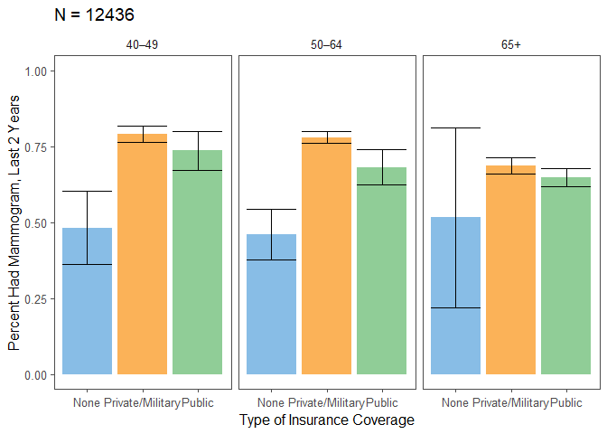

Mammogram
================

Read in the data.

``` r
# read in cancer module data
cancer = read_csv("./data/cancerxx.csv") %>%
  select(HHX, FMX, FPX, WTFA_SA, STRAT_P, PSU_P, REGION, MAMHAD, MAM6YR, 
         RMAM1_MT, RMAM1YR, RMAM1N, RMAM1T, RMAM2, RMAM3A, RMAM3B, MAMPAY, 
         MAMREAS, MDRECMAM, MAMDNBR, MAMABN1, MFOLLOW0, MFOLLO01, MFOLLO02, 
         MFOLLO03, MFOLLO04, MFOLLO05, MNOTFOL1, MAMMODE, MAMCAN1)

# read in adult data
adult = read_csv("./data/samadult.csv") %>%
  select(HHX, FMX, FPX, AUSUALPL, AHCPLROU, AHCPLKND, FLA1AR)

# read in family data
family = read_csv("./data/familyxx.csv") %>%
  select(HHX, FMX, RAT_CAT4, RAT_CAT5)

# read in person data
person = read_csv("./data/personsx.csv") %>%
  select(HHX, FMX, FPX, AGE_P, EDUC1, SEX, NOTCOV, COVER65, COVER65O, LA1AR,
         LCONDRT, LACHRONR, HISCODI3, RACRECI3, COVER, YRSINUS, PLBORN)

# join these data files into one for analysis
mam_dat = cancer %>%
  left_join(adult, by = c("HHX", "FMX", "FPX")) %>%
  left_join(person, by = c("HHX", "FMX", "FPX")) %>%
  left_join(family, by = c("HHX", "FMX")) 
```

Data Manipulation

``` r
# CREATE VARIABLES FOR ANALYSIS: OUTCOME AND DEMOGRAPHIC

# outcome is having a mammogram in the last 2 years:RMAM3A = 1,2
# create immigration status variable based on PLBORN and YRSINUS
mam_dat = mam_dat %>%
  mutate(mam_2 = if_else(RMAM3A <= 2, 1, 0),
         imm_stat = case_when(YRSINUS < 4 ~ "In U.S. < 10 yrs",
                              YRSINUS == 4 | YRSINUS == 5 ~ "In U.S. >= 10 yrs",
                              PLBORN == 1 ~ "Born in U.S."))

# create the age category
mam_dat = mam_dat %>% 
  mutate(age_cat = case_when(AGE_P >= 25 & AGE_P < 40 ~ "25–39",
                             AGE_P >= 40 & AGE_P < 50 ~ "40–49",
                             AGE_P >= 50 & AGE_P < 65 ~ "50–64",
                             AGE_P >= 65 ~ "65+"))
# create educ category
mam_dat = mam_dat %>% 
  mutate(educ_cat = case_when(EDUC1 < 13 ~ "Less than high school",
                              EDUC1 >= 13 & EDUC1 < 15 ~ "High school",
                              EDUC1 >= 15 & EDUC1 < 18 ~ "Some college",
                              EDUC1 >= 18 & EDUC1 <= 21 ~ "College graduate"))

# create financial category
mam_dat = mam_dat %>% 
  mutate(finc_cat = case_when(RAT_CAT5 <= 7 |  RAT_CAT5 %in% c(15, 16) ~ "<200%",
                              RAT_CAT5 %in% c(8, 9) ~ "200–299%", 
                              RAT_CAT5 %in% c(10, 11) ~ "300–399%",
                              RAT_CAT5 >= 18 & EDUC1 <= 21 ~ "400–499%",
                              RAT_CAT5 == 14  ~">=500%",
                              RAT_CAT5 == 17  ~">=200%, no further detail",
                              RAT_CAT5 %in% c(96, 99) ~ "Unknown"))

# create usual care category
mam_dat = mam_dat %>% 
  mutate(ausualpl_cat  = case_when(AUSUALPL == 2 ~ "No",
                                   AUSUALPL %in% c(1, 3) ~ "Yes",
                                   AUSUALPL %in% c(7, 8, 9) ~ "Other"))
# create coverage status
mam_dat = mam_dat %>% 
  mutate(cover_cat  = case_when(NOTCOV == 1 | COVER == 4 | COVER65 == 6 ~ "None",
                                COVER == 2 | COVER65 %in% 2:4 ~ "Public",
                                COVER %in% c(1, 3) | COVER65 %in% c(1, 5) ~ "Private/Military"))

# create disability variable
mam_dat = mam_dat %>% 
  mutate(lcond_chronic_cat = if_else(LCONDRT == 1, "Yes", "No"))

# create race & ethnic categories
mam_dat = mam_dat %>% 
  mutate(race_cat = case_when(RACRECI3 == 1 ~ "White",
                              RACRECI3 == 2 ~ "Black",
                              RACRECI3 == 3 ~ "Asian",
                              RACRECI3 == 4 ~ "AN/AI"),
         eth_cat = case_when(HISCODI3 == 1 ~ "Hispanic",
                             HISCODI3 == 2 ~ "Non-Hispanic White",
                             HISCODI3 == 3 ~ "Non-Hispanic Black",
                             HISCODI3 == 4 ~ "Non-Hispanic Asian",
                             HISCODI3 == 5 ~ "Non-Hispanic AN/AI"))
```

Survey Design

``` r
# create domain variable for inclusion criteria
mam_dat = mam_dat %>%
  mutate(domain = if_else(SEX == 2 & AGE_P >= 40, 1, 0))

# create survey design object
des = svydesign(ids = ~PSU_P, strata = ~STRAT_P, weights = ~WTFA_SA, nest = TRUE, data = mam_dat)
```

Tables

``` r
# percent of women who have had mammogram in the last two years by age

age_pct = svyby(~mam_2, by = ~domain+age_cat, svymean, na.rm = TRUE, 
                design = des, vartype = c("ci", "se"))
age_pct %>% filter(domain == 1) %>% select(-domain, -se) %>% knitr::kable()
```

| age\_cat |     mam\_2|      ci\_l|      ci\_u|
|:---------|----------:|----------:|----------:|
| 40–49    |  0.7609720|  0.7348160|  0.7871280|
| 50–64    |  0.7510356|  0.7339199|  0.7681512|
| 65+      |  0.6669962|  0.6481919|  0.6858006|

``` r
# percent of women who have had mammogram by education
edu_pct = svyby(~mam_2, by = ~domain+educ_cat, svymean, na.rm = TRUE, 
                design = des, vartype = c("se", "ci")) %>%
  filter(domain == 1) %>%
  select(-domain, -se)

edu_counts = filter(mam_dat, domain == 1) %>%
  group_by(educ_cat) %>%
  summarise(count = n())

edu_pct = left_join(edu_pct, edu_counts, by = "educ_cat")

edu_pct %>% 
  knitr::kable()
```

| educ\_cat             |     mam\_2|      ci\_l|      ci\_u|  count|
|:----------------------|----------:|----------:|----------:|------:|
| College graduate      |  0.7952259|  0.7759755|  0.8144763|   3535|
| High school           |  0.6785310|  0.6548180|  0.7022440|   3234|
| Less than high school |  0.6233975|  0.5880548|  0.6587402|   1842|
| Some college          |  0.7298794|  0.7085698|  0.7511891|   3794|

``` r
# percent of women who have had mammogram by financial category
finc_pct = svyby(~mam_2, by = ~domain+finc_cat, svymean, na.rm = TRUE, 
                 design = des, vartype = c("se", "ci")) %>%
  filter(domain == 1) %>%
  select(-domain, -se)

finc_counts = filter(mam_dat, domain == 1) %>%
  group_by(finc_cat) %>%
  summarise(count = n())

finc_pct = left_join(finc_pct, finc_counts, by = "finc_cat")

finc_pct %>% knitr::kable()
```

| finc\_cat                    |     mam\_2|      ci\_l|      ci\_u|  count|
|:-----------------------------|----------:|----------:|----------:|------:|
| &lt;200%                     |  0.6336404|  0.6102688|  0.6570120|   4294|
| &gt;=200%, no further detail |  0.6829528|  0.6182815|  0.7476241|    409|
| &gt;=500%                    |  0.8049806|  0.7828196|  0.8271415|   2571|
| 200–299%                     |  0.6846054|  0.6473660|  0.7218448|   1618|
| 300–399%                     |  0.7389614|  0.7026038|  0.7753189|   1196|
| 400–499%                     |  0.7582742|  0.7263519|  0.7901964|   1501|
| Unknown                      |  0.4531864|  0.1993634|  0.7070094|     27|

``` r
# percent of women who have had mammogram by usual care category
ausualp_pct = svyby(~mam_2, by = ~domain+ausualpl_cat, svymean, na.rm = TRUE, 
                    design = des, vartype = c("se", "ci")) %>%
  filter(domain == 1) %>%
  select(-domain, -se)

usual_counts = filter(mam_dat, domain == 1) %>%
  group_by(ausualpl_cat) %>%
  summarise(count = n())

ausualp_pct = left_join(ausualp_pct, usual_counts, by = "ausualpl_cat")

ausualp_pct %>% knitr::kable()
```

| ausualpl\_cat |     mam\_2|       ci\_l|      ci\_u|  count|
|:--------------|----------:|-----------:|----------:|------:|
| No            |  0.4426809|   0.3857382|  0.4996237|    749|
| Other         |  0.6349977|  -0.0074398|  1.2774351|    102|
| Yes           |  0.7374589|   0.7258591|  0.7490586|  11632|

``` r
# percent of women who have had mammogram by health coverage
cover_pct = svyby(~mam_2, by = ~domain+cover_cat, svymean, na.rm = TRUE, 
                  design = des, vartype = c("se", "ci")) %>%
  filter(domain == 1) %>%
  select(-domain, -se)

cover_counts = filter(mam_dat, domain == 1) %>%
  group_by(cover_cat) %>%
  summarise(count = n())

cover_pct = left_join(cover_pct, cover_counts, by = "cover_cat")

cover_pct %>% knitr::kable()
```

| cover\_cat       |     mam\_2|      ci\_l|      ci\_u|  count|
|:-----------------|----------:|----------:|----------:|------:|
| None             |  0.4711737|  0.4004064|  0.5419410|    785|
| Private/Military |  0.7605363|  0.7467293|  0.7743434|   8041|
| Public           |  0.6643714|  0.6409525|  0.6877904|   3610|

``` r
# percent of women who have had mammogram by chronic conditions
lcond_chronic_pct = svyby(~mam_2, by = ~domain+lcond_chronic_cat, svymean, 
                          na.rm = TRUE, design = des, vartype = c("se", "ci")) %>%
  filter(domain == 1) %>%
  select(-domain, -se)

chronic_counts = filter(mam_dat, domain == 1) %>%
  group_by(lcond_chronic_cat) %>%
  summarise(count = n())

lcond_chronic_pct = left_join(lcond_chronic_pct, chronic_counts, by = "lcond_chronic_cat")

lcond_chronic_pct %>% knitr::kable()
```

| lcond\_chronic\_cat |     mam\_2|      ci\_l|      ci\_u|  count|
|:--------------------|----------:|----------:|----------:|------:|
| No                  |  0.6235415|  0.4602961|  0.7867868|     71|
| Yes                 |  0.6105575|  0.5844282|  0.6366868|   3285|

``` r
# percent of women who have had mammogram by race
race_pct = svyby(~mam_2, by = ~domain+race_cat, svymean, na.rm = TRUE, 
                 design = des, vartype = c("se", "ci")) %>%
  filter(domain == 1) %>%
  select(-domain, -se)

race_counts = filter(mam_dat, domain == 1) %>%
  group_by(race_cat) %>%
  summarise(count = n())

race_pct = left_join(race_pct, race_counts, by = "race_cat")

race_pct %>% knitr::kable()
```

| race\_cat |     mam\_2|      ci\_l|      ci\_u|  count|
|:----------|----------:|----------:|----------:|------:|
| AN/AI     |  0.6382206|  0.5275676|  0.7488735|    175|
| Asian     |  0.7023464|  0.6479896|  0.7567032|    640|
| Black     |  0.7688270|  0.7385748|  0.7990792|   1908|
| White     |  0.7203100|  0.7071951|  0.7334248|   9760|

``` r
# percent of women who have had mammogram by ethnicity
eth_pct = svyby(~mam_2, by = ~domain+eth_cat, svymean, na.rm = TRUE, 
                design = des, vartype = c("se", "ci")) %>%
  filter(domain == 1) %>%
  select(-domain, -se)

eth_counts = filter(mam_dat, domain == 1) %>%
  group_by(eth_cat) %>%
  summarise(count = n())

eth_pct = left_join(eth_pct, eth_counts, by = "eth_cat")

eth_pct %>% knitr::kable()
```

| eth\_cat           |     mam\_2|      ci\_l|      ci\_u|  count|
|:-------------------|----------:|----------:|----------:|------:|
| Hispanic           |  0.7434129|  0.7136199|  0.7732058|   1685|
| Non-Hispanic AN/AI |  0.6787829|  0.5493178|  0.8082481|    123|
| Non-Hispanic Asian |  0.7005102|  0.6454834|  0.7555370|    613|
| Non-Hispanic Black |  0.7684556|  0.7377942|  0.7991169|   1833|
| Non-Hispanic White |  0.7165402|  0.7025792|  0.7305012|   8229|

``` r
# percent of women who have had mammogram by immigration status
imm_pct = svyby(~mam_2, by = ~domain+imm_stat, svymean, na.rm = TRUE,
                design = des, vartype = c("se", "ci")) %>%
  filter(domain == 1) %>%
  select(-domain, -se)

imm_counts = filter(mam_dat, domain == 1) %>%
  group_by(imm_stat) %>%
  summarise(count = n())

imm_pct = left_join(imm_pct, imm_counts, by = "imm_stat")

imm_pct %>% knitr::kable()
```

| imm\_stat            |     mam\_2|      ci\_l|      ci\_u|  count|
|:---------------------|----------:|----------:|----------:|------:|
| Born in U.S.         |  0.7247355|  0.7124950|  0.7369760|  10312|
| In U.S. &lt; 10 yrs  |  0.6920384|  0.5859504|  0.7981264|    195|
| In U.S. &gt;= 10 yrs |  0.7232266|  0.6925968|  0.7538563|   1947|

Tables By Age Group

``` r
# percent of women who have had mammogram by education and age 
edu_pct_strat = svyby(~mam_2, by = ~domain + age_cat + educ_cat, svymean, 
                      na.rm = TRUE, design = des, vartype = c("se", "ci"))
edu_tab = edu_pct_strat %>% 
  filter(domain == 1) %>% 
  select(-domain, -se) 

edu_counts2 = filter(mam_dat, domain == 1) %>%
  group_by(age_cat, educ_cat) %>%
  summarise(count = n())

edu_tab = left_join(edu_tab, edu_counts2, by = c("age_cat", "educ_cat"))

edu_tab %>% knitr::kable()
```

| age\_cat | educ\_cat             |     mam\_2|      ci\_l|      ci\_u|  count|
|:---------|:----------------------|----------:|----------:|----------:|------:|
| 40–49    | College graduate      |  0.8085672|  0.7707166|  0.8464178|   1021|
| 50–64    | College graduate      |  0.8109270|  0.7831941|  0.8386598|   1435|
| 65+      | College graduate      |  0.7537526|  0.7172640|  0.7902411|   1079|
| 40–49    | High school           |  0.6818410|  0.6144456|  0.7492364|    586|
| 50–64    | High school           |  0.7247121|  0.6848474|  0.7645768|   1156|
| 65+      | High school           |  0.6336142|  0.5983451|  0.6688834|   1492|
| 40–49    | Less than high school |  0.6999305|  0.6228325|  0.7770285|    355|
| 50–64    | Less than high school |  0.6506867|  0.5928630|  0.7085104|    570|
| 65+      | Less than high school |  0.5719782|  0.5172242|  0.6267323|    917|
| 40–49    | Some college          |  0.7628288|  0.7164342|  0.8092234|    889|
| 50–64    | Some college          |  0.7406601|  0.7105614|  0.7707588|   1536|
| 65+      | Some college          |  0.6909571|  0.6565986|  0.7253157|   1369|

``` r
# percent of women who have had mammogram by financial category and age
finc_pct_strat = svyby(~mam_2, by = ~domain + age_cat + finc_cat, svymean, 
                       na.rm = TRUE, design = des, vartype = c("se", "ci"))

finc_tab = finc_pct_strat %>% 
  filter(domain == 1) %>% 
  select(-domain, -se) 

finc_counts2 = filter(mam_dat, domain == 1) %>%
  group_by(age_cat, finc_cat) %>%
  summarise(count = n())

finc_tab = left_join(finc_tab, finc_counts2, by = c("age_cat", "finc_cat"))

finc_tab %>% knitr::kable()
```

| age\_cat | finc\_cat                    |     mam\_2|       ci\_l|      ci\_u|  count|
|:---------|:-----------------------------|----------:|-----------:|----------:|------:|
| 40–49    | &lt;200%                     |  0.6956259|   0.6448771|  0.7463748|    957|
| 50–64    | &lt;200%                     |  0.6495575|   0.6101441|  0.6889709|   1488|
| 65+      | &lt;200%                     |  0.5848766|   0.5493209|  0.6204322|   1849|
| 40–49    | &gt;=200%, no further detail |  0.8594243|   0.7506689|  0.9681797|     64|
| 50–64    | &gt;=200%, no further detail |  0.7350658|   0.6237214|  0.8464101|    123|
| 65+      | &gt;=200%, no further detail |  0.6088342|   0.5150514|  0.7026171|    222|
| 40–49    | &gt;=500%                    |  0.8120277|   0.7701024|  0.8539529|    683|
| 50–64    | &gt;=500%                    |  0.8105147|   0.7804614|  0.8405680|   1220|
| 65+      | &gt;=500%                    |  0.7855235|   0.7417109|  0.8293361|    668|
| 40–49    | 200–299%                     |  0.7072433|   0.6214273|  0.7930594|    394|
| 50–64    | 200–299%                     |  0.7089483|   0.6459559|  0.7719406|    548|
| 65+      | 200–299%                     |  0.6470099|   0.5991062|  0.6949135|    676|
| 40–49    | 300–399%                     |  0.7310784|   0.6541823|  0.8079745|    304|
| 50–64    | 300–399%                     |  0.7706667|   0.7051139|  0.8362195|    446|
| 65+      | 300–399%                     |  0.7085731|   0.6507690|  0.7663771|    446|
| 40–49    | 400–499%                     |  0.8174002|   0.7382089|  0.8965915|    219|
| 50–64    | 400–499%                     |  0.7917000|   0.7382696|  0.8451305|    534|
| 65+      | 400–499%                     |  0.7010436|   0.6564844|  0.7456028|    748|
| 40–49    | Unknown                      |  0.0000000|   0.0000000|  0.0000000|      2|
| 50–64    | Unknown                      |  0.9962176|   0.9879882|  1.0044469|      7|
| 65+      | Unknown                      |  0.2035140|  -0.0544638|  0.4614919|     18|

``` r
# percent of women who have had mammogram by usual care and age
ausualp_pct_strat = svyby(~mam_2, by = ~domain + age_cat + ausualpl_cat,
                          svymean, na.rm = TRUE, design = des, 
                          vartype = c("se", "ci"))

usual_tab = ausualp_pct_strat %>% 
  filter(domain == 1) %>% 
  select(-domain, -se) 

usual_counts2 = filter(mam_dat, domain == 1) %>%
  group_by(age_cat, ausualpl_cat) %>%
  summarise(count = n())

usual_tab = left_join(usual_tab, usual_counts2, by = c("age_cat", "ausualpl_cat"))

usual_tab %>% knitr::kable()
```

| age\_cat | ausualpl\_cat |     mam\_2|      ci\_l|      ci\_u|  count|
|:---------|:--------------|----------:|----------:|----------:|------:|
| 40–49    | No            |  0.5056792|  0.4057956|  0.6055628|    295|
| 50–64    | No            |  0.3810310|  0.2889497|  0.4731123|    304|
| 65+      | No            |  0.4840104|  0.3523452|  0.6156756|    150|
| 40–49    | Other         |  0.0000000|  0.0000000|  0.0000000|     23|
| 50–64    | Other         |  1.0000000|  1.0000000|  1.0000000|     43|
| 65+      | Other         |  0.0000000|  0.0000000|  0.0000000|     36|
| 40–49    | Yes           |  0.7802444|  0.7542141|  0.8062747|   2545|
| 50–64    | Yes           |  0.7700861|  0.7529459|  0.7872262|   4369|
| 65+      | Yes           |  0.6714421|  0.6525374|  0.6903469|   4718|

``` r
# percent of women who have had mammogram by health coverage and age
cover_pct_strat = svyby(~mam_2, by = ~domain + age_cat + cover_cat, svymean,
                        na.rm = TRUE, design = des, vartype = c("se", "ci"))

ins_tab = cover_pct_strat %>% 
  filter(domain == 1) %>% 
  select(-domain, -se)

ins_counts2 = filter(mam_dat, domain == 1) %>%
  group_by(age_cat, cover_cat) %>%
  summarise(count = n())

ins_tab = left_join(ins_tab, ins_counts2, by = c("age_cat", "cover_cat"))

ins_tab %>% knitr::kable()
```

| age\_cat | cover\_cat       |     mam\_2|      ci\_l|      ci\_u|  count|
|:---------|:-----------------|----------:|----------:|----------:|------:|
| 40–49    | None             |  0.4829030|  0.3629256|  0.6028804|    362|
| 50–64    | None             |  0.4603852|  0.3769433|  0.5438272|    392|
| 65+      | None             |  0.5160788|  0.2196597|  0.8124978|     31|
| 40–49    | Private/Military |  0.7914360|  0.7633846|  0.8194874|   2021|
| 50–64    | Private/Military |  0.7802779|  0.7610562|  0.7994996|   3586|
| 65+      | Private/Military |  0.6871598|  0.6611642|  0.7131553|   2434|
| 40–49    | Public           |  0.7370242|  0.6725539|  0.8014945|    469|
| 50–64    | Public           |  0.6818896|  0.6241168|  0.7396625|    717|
| 65+      | Public           |  0.6486552|  0.6199508|  0.6773596|   2424|

``` r
# percent of women who have had mammogram by chronic conditions and age
lcond_chronic_pct_strat = svyby(~mam_2, 
                                by = ~domain + age_cat + lcond_chronic_cat,
                                svymean, na.rm = TRUE, design = des,
                                vartype = c("se", "ci"))

dis_tab = lcond_chronic_pct_strat %>% 
  filter(domain == 1) %>% 
  select(-domain, -se)

dis_counts2 = filter(mam_dat, domain == 1) %>%
  group_by(age_cat, lcond_chronic_cat) %>%
  summarise(count = n())

dis_tab = left_join(dis_tab, dis_counts2, by = c("age_cat", "lcond_chronic_cat"))

dis_tab %>% knitr::kable()
```

| age\_cat | lcond\_chronic\_cat |     mam\_2|      ci\_l|      ci\_u|  count|
|:---------|:--------------------|----------:|----------:|----------:|------:|
| 40–49    | No                  |  0.7176907|  0.3453040|  1.0900773|     11|
| 50–64    | No                  |  0.8619131|  0.7174233|  1.0064030|     20|
| 65+      | No                  |  0.4720814|  0.2627660|  0.6813969|     40|
| 40–49    | Yes                 |  0.6903587|  0.6133066|  0.7674109|    354|
| 50–64    | Yes                 |  0.6848202|  0.6423921|  0.7272482|   1126|
| 65+      | Yes                 |  0.5381731|  0.5032309|  0.5731153|   1805|

``` r
# percent of women who have had mammogram by race and age
race_pct_strat = svyby(~mam_2, by = ~domain + age_cat + race_cat, svymean, 
                       na.rm = TRUE, design = des, vartype = c("se", "ci"))

race_tab = race_pct_strat %>% 
  filter(domain == 1) %>% 
  select(-domain, -se) 

race_counts2 = filter(mam_dat, domain == 1) %>%
  group_by(age_cat, race_cat) %>%
  summarise(count = n())

race_tab = left_join(race_tab, race_counts2, by = c("age_cat", "race_cat"))

race_tab %>% knitr::kable()
```

| age\_cat | race\_cat |     mam\_2|      ci\_l|      ci\_u|  count|
|:---------|:----------|----------:|----------:|----------:|------:|
| 40–49    | AN/AI     |  0.6820006|  0.4637318|  0.9002694|     52|
| 50–64    | AN/AI     |  0.5832300|  0.4209941|  0.7454660|     78|
| 65+      | AN/AI     |  0.6798373|  0.4792802|  0.8803944|     45|
| 40–49    | Asian     |  0.7285098|  0.6249686|  0.8320510|    191|
| 50–64    | Asian     |  0.7388677|  0.6510686|  0.8266667|    235|
| 65+      | Asian     |  0.6051615|  0.5083183|  0.7020048|    214|
| 40–49    | Black     |  0.8109375|  0.7584382|  0.8634368|    482|
| 50–64    | Black     |  0.7983266|  0.7574828|  0.8391704|    773|
| 65+      | Black     |  0.6804674|  0.6261574|  0.7347773|    653|
| 40–49    | White     |  0.7567230|  0.7267415|  0.7867046|   2138|
| 50–64    | White     |  0.7467055|  0.7263464|  0.7670646|   3630|
| 65+      | White     |  0.6680536|  0.6481251|  0.6879822|   3992|

``` r
# percent of women who have had mammogram by ethnicity and age
eth_pct_strat = svyby(~mam_2, by = ~domain + age_cat + eth_cat, svymean, 
                      na.rm = TRUE, design = des, vartype = c("se", "ci"))

eth_tab = eth_pct_strat %>% 
  filter(domain == 1) %>% 
  select(-domain, -se) 

eth_counts2 = filter(mam_dat, domain == 1) %>%
  group_by(age_cat, eth_cat) %>%
  summarise(count = n())

eth_tab = left_join(eth_tab, eth_counts2, by = c("age_cat", "eth_cat"))

eth_tab %>% knitr::kable()
```

| age\_cat | eth\_cat           |     mam\_2|      ci\_l|      ci\_u|  count|
|:---------|:-------------------|----------:|----------:|----------:|------:|
| 40–49    | Hispanic           |  0.7350049|  0.6860044|  0.7840053|    590|
| 50–64    | Hispanic           |  0.7887929|  0.7425060|  0.8350797|    600|
| 65+      | Hispanic           |  0.6757057|  0.6174945|  0.7339170|    495|
| 40–49    | Non-Hispanic AN/AI |  0.8614933|  0.7233204|  0.9996662|     35|
| 50–64    | Non-Hispanic AN/AI |  0.5788007|  0.3741846|  0.7834168|     55|
| 65+      | Non-Hispanic AN/AI |  0.6618173|  0.4220170|  0.9016176|     33|
| 40–49    | Non-Hispanic Asian |  0.7255322|  0.6191024|  0.8319621|    178|
| 50–64    | Non-Hispanic Asian |  0.7358176|  0.6461917|  0.8254434|    225|
| 65+      | Non-Hispanic Asian |  0.6088310|  0.5113248|  0.7063372|    210|
| 40–49    | Non-Hispanic Black |  0.8174351|  0.7624666|  0.8724036|    449|
| 50–64    | Non-Hispanic Black |  0.7971501|  0.7556416|  0.8386587|    746|
| 65+      | Non-Hispanic Black |  0.6774079|  0.6234387|  0.7313772|    638|
| 40–49    | Non-Hispanic White |  0.7584481|  0.7227714|  0.7941248|   1611|
| 50–64    | Non-Hispanic White |  0.7405940|  0.7183667|  0.7628213|   3090|
| 65+      | Non-Hispanic White |  0.6676896|  0.6471933|  0.6881859|   3528|

``` r
# percent of women who have had mammogram by immigration and age
imm_pct_strat = svyby(~mam_2, by = ~domain + age_cat + imm_stat, svymean,
                      na.rm = TRUE, design = des, vartype = c("se", "ci"))

imm_tab = imm_pct_strat %>%
  filter(domain == 1) %>%
  select(-domain, -se)

imm_counts2 = filter(mam_dat, domain == 1) %>%
  group_by(age_cat, imm_stat) %>%
  summarise(count = n())

imm_tab = left_join(imm_tab, imm_counts2, by = c("age_cat", "imm_stat"))

imm_tab %>% knitr::kable()
```

| age\_cat | imm\_stat            |     mam\_2|      ci\_l|      ci\_u|  count|
|:---------|:---------------------|----------:|----------:|----------:|------:|
| 40–49    | Born in U.S.         |  0.7648196|  0.7336183|  0.7960209|   2153|
| 50–64    | Born in U.S.         |  0.7475203|  0.7283139|  0.7667267|   3964|
| 65+      | Born in U.S.         |  0.6740989|  0.6550582|  0.6931396|   4195|
| 40–49    | In U.S. &lt; 10 yrs  |  0.6718178|  0.5154111|  0.8282245|    101|
| 50–64    | In U.S. &lt; 10 yrs  |  0.7269500|  0.5430927|  0.9108074|     54|
| 65+      | In U.S. &lt; 10 yrs  |  0.6844641|  0.4369705|  0.9319578|     40|
| 40–49    | In U.S. &gt;= 10 yrs |  0.7543553|  0.6990657|  0.8096448|    596|
| 50–64    | In U.S. &gt;= 10 yrs |  0.7729488|  0.7269979|  0.8188997|    690|
| 65+      | In U.S. &gt;= 10 yrs |  0.6163448|  0.5632557|  0.6694340|    661|

``` r
# overall percent of women who have had mammogram
total = svyby(~mam_2, by = ~domain + age_cat, svymean, na.rm = TRUE, 
              design = des, vartype = c("se", "ci"))

tot_tab = total %>% 
  filter(domain == 1) %>% 
  select(-domain, -se) 

tot_counts = filter(mam_dat, domain == 1) %>%
  group_by(age_cat) %>%
  summarise(count = n())

tot_tab = left_join(tot_tab, tot_counts, by = "age_cat")

tot_tab %>% knitr::kable()
```

| age\_cat |     mam\_2|      ci\_l|      ci\_u|  count|
|:---------|----------:|----------:|----------:|------:|
| 40–49    |  0.7609720|  0.7348160|  0.7871280|   2863|
| 50–64    |  0.7510356|  0.7339199|  0.7681512|   4716|
| 65+      |  0.6669962|  0.6481919|  0.6858006|   4904|

``` r
all_counts = filter(mam_dat, domain == 1)

tot_pct = svyby(~mam_2, by = ~domain, svymean, na.rm = TRUE, design = des,
                vartype = c("se", "ci")) %>%
  filter(domain == 1) %>%
  select(-domain, -se) %>%
  mutate(age_cat = "40+",
         count = 12483)
```

Combine into paper table

``` r
# COMBINE TABLES BY AGE WITH TABLES OVERALL

# overall

tot_tab = rbind(tot_pct, tot_tab)

tot_tab2 = tot_tab %>%
  mutate(type = "Total",
         level = "-")

# education
edu_pct2 = edu_pct %>%
  mutate(age_cat = "40+")

edu_tab = rbind(edu_pct2, edu_tab)

# factor levels for presentation
edu_tab2 = edu_tab %>%
  mutate(type = "Education") %>%
  rename(level = educ_cat) %>%
  mutate(level = factor(level, levels = c("Less than high school", "High school", "Some college", "College graduate"))) %>%
  arrange(level)

# financial category
finc_pct2 = finc_pct %>%
  mutate(age_cat = "40+")

finc_tab = rbind(finc_pct2, finc_tab)

# factor levels for presentation
finc_tab2 = finc_tab %>%
  mutate(type = "Family Income Poverty Ratio") %>%
  rename(level = finc_cat) %>%
  mutate(level = factor(level, levels = c("<200%", ">=200%, no further detail", "200–299%", "300–399%", "400–499%", ">=500%", "Unknown"))) %>%
  arrange(level)

# usual care category
ausualp_pct2 = ausualp_pct %>%
  mutate(age_cat = "40+")

usual_tab = rbind(ausualp_pct2, usual_tab)


# factor levels for presentation
usual_tab2 = usual_tab %>%
  mutate(type = "Usual Source of Care") %>%
  rename(level = ausualpl_cat) %>%
  mutate(level = factor(level, levels = c("No", "Yes", "Other"))) %>%
  arrange(level)

# insurance coverage category
cover_pct2 = cover_pct %>%
  mutate(age_cat = "40+")

ins_tab = rbind(cover_pct2, ins_tab)

# factor levels for presentation
ins_tab2 = ins_tab %>%
  mutate(type = "Insurance Type") %>%
  rename(level = cover_cat) %>%
  mutate(level = factor(level, levels = c("None", "Public", "Private/Military"))) %>%
  arrange(level)

# chronic condition category
lcond_chronic_pct2 = lcond_chronic_pct %>%
  mutate(age_cat = "40+")

dis_tab = rbind(lcond_chronic_pct2, dis_tab)

# factor levels for presentation
dis_tab2 = dis_tab %>%
  mutate(type = "Chronic Disability") %>%
  rename(level = lcond_chronic_cat) %>%
  mutate(level = factor(level, levels = c("Yes", "No"))) %>%
  arrange(level)

# ethnic category
eth_pct2 = eth_pct %>%
  mutate(age_cat = "40+")

eth_tab = rbind(eth_pct2, eth_tab)

# factor levels for presentation
eth_tab2 = eth_tab %>%
  mutate(type = "Ethnicity") %>%
  rename(level = eth_cat) %>%
  mutate(level = factor(level, levels = c("Hispanic", "Non-Hispanic White", "Non-Hispanic Black", "Non-Hispanic AN/AI", "Non-Hispanic Asian"))) %>%
  arrange(level)

# race category
race_pct2 = race_pct %>%
  mutate(age_cat = "40+")

race_tab = rbind(race_pct2, race_tab)

# factor levels for presentation
race_tab2 = race_tab %>%
  mutate(type = "Race") %>%
  rename(level = race_cat) %>%
  mutate(level = factor(level, levels = c("White", "Black", "AN/AI", "Asian"))) %>%
  arrange(level)

# immigration category
imm_pct2 = imm_pct %>%
  mutate(age_cat = "40+")

imm_tab = rbind(imm_pct2, imm_tab)

# factor levels for presentation
imm_tab2 = imm_tab %>%
  mutate(type = "Immigration") %>%
  rename(level = imm_stat) %>%
  mutate(level = factor(level, levels = c("In U.S. < 10 yrs", "In U.S. >= 10 yrs", "Born in U.S."))) %>%
  arrange(level)

# create table of percentages of women who have gotten mammograms within the last two years (still need to add CIs)
tab_one = rbind(tot_tab2, edu_tab2, finc_tab2, usual_tab2, ins_tab2, dis_tab2, eth_tab2, race_tab2, imm_tab2) %>%
  mutate(mam_2 = round(mam_2*100, 1),
         ci_l = round(ci_l*100, 1),
         ci_u = round(ci_u*100, 1),
         CI = str_c(ci_l, ", ", ci_u)) %>%
  rename(Percent = mam_2,
         N = count) %>%
  select(-ci_l, -ci_u) %>%
  pivot_wider(names_from = age_cat, values_from = c(N, Percent, CI)) %>%
  janitor::clean_names() %>%
  select(type, level, n_40, percent_40, ci_40, n_40_49, percent_40_49, ci_40_49, n_50_64, percent_50_64, ci_50_64, everything())

# print percentages
tab_one %>% knitr::kable()
```

| type                        | level                        |  n\_40|  percent\_40| ci\_40      |  n\_40\_49|  percent\_40\_49| ci\_40\_49 |  n\_50\_64|  percent\_50\_64| ci\_50\_64  |  n\_65|  percent\_65| ci\_65     |
|:----------------------------|:-----------------------------|------:|------------:|:------------|----------:|----------------:|:-----------|----------:|----------------:|:------------|------:|------------:|:-----------|
| Total                       | -                            |  12483|         72.4| 71.3, 73.6  |       2863|             76.1| 73.5, 78.7 |       4716|             75.1| 73.4, 76.8  |   4904|         66.7| 64.8, 68.6 |
| Education                   | Less than high school        |   1842|         62.3| 58.8, 65.9  |        355|             70.0| 62.3, 77.7 |        570|             65.1| 59.3, 70.9  |    917|         57.2| 51.7, 62.7 |
| Education                   | High school                  |   3234|         67.9| 65.5, 70.2  |        586|             68.2| 61.4, 74.9 |       1156|             72.5| 68.5, 76.5  |   1492|         63.4| 59.8, 66.9 |
| Education                   | Some college                 |   3794|         73.0| 70.9, 75.1  |        889|             76.3| 71.6, 80.9 |       1536|             74.1| 71.1, 77.1  |   1369|         69.1| 65.7, 72.5 |
| Education                   | College graduate             |   3535|         79.5| 77.6, 81.4  |       1021|             80.9| 77.1, 84.6 |       1435|             81.1| 78.3, 83.9  |   1079|         75.4| 71.7, 79   |
| Family Income Poverty Ratio | &lt;200%                     |   4294|         63.4| 61, 65.7    |        957|             69.6| 64.5, 74.6 |       1488|             65.0| 61, 68.9    |   1849|         58.5| 54.9, 62   |
| Family Income Poverty Ratio | &gt;=200%, no further detail |    409|         68.3| 61.8, 74.8  |         64|             85.9| 75.1, 96.8 |        123|             73.5| 62.4, 84.6  |    222|         60.9| 51.5, 70.3 |
| Family Income Poverty Ratio | 200–299%                     |   1618|         68.5| 64.7, 72.2  |        394|             70.7| 62.1, 79.3 |        548|             70.9| 64.6, 77.2  |    676|         64.7| 59.9, 69.5 |
| Family Income Poverty Ratio | 300–399%                     |   1196|         73.9| 70.3, 77.5  |        304|             73.1| 65.4, 80.8 |        446|             77.1| 70.5, 83.6  |    446|         70.9| 65.1, 76.6 |
| Family Income Poverty Ratio | 400–499%                     |   1501|         75.8| 72.6, 79    |        219|             81.7| 73.8, 89.7 |        534|             79.2| 73.8, 84.5  |    748|         70.1| 65.6, 74.6 |
| Family Income Poverty Ratio | &gt;=500%                    |   2571|         80.5| 78.3, 82.7  |        683|             81.2| 77, 85.4   |       1220|             81.1| 78, 84.1    |    668|         78.6| 74.2, 82.9 |
| Family Income Poverty Ratio | Unknown                      |     27|         45.3| 19.9, 70.7  |          2|              0.0| 0, 0       |          7|             99.6| 98.8, 100.4 |     18|         20.4| -5.4, 46.1 |
| Usual Source of Care        | No                           |    749|         44.3| 38.6, 50    |        295|             50.6| 40.6, 60.6 |        304|             38.1| 28.9, 47.3  |    150|         48.4| 35.2, 61.6 |
| Usual Source of Care        | Yes                          |  11632|         73.7| 72.6, 74.9  |       2545|             78.0| 75.4, 80.6 |       4369|             77.0| 75.3, 78.7  |   4718|         67.1| 65.3, 69   |
| Usual Source of Care        | Other                        |    102|         63.5| -0.7, 127.7 |         23|              0.0| 0, 0       |         43|            100.0| 100, 100    |     36|          0.0| 0, 0       |
| Insurance Type              | None                         |    785|         47.1| 40, 54.2    |        362|             48.3| 36.3, 60.3 |        392|             46.0| 37.7, 54.4  |     31|         51.6| 22, 81.2   |
| Insurance Type              | Public                       |   3610|         66.4| 64.1, 68.8  |        469|             73.7| 67.3, 80.1 |        717|             68.2| 62.4, 74    |   2424|         64.9| 62, 67.7   |
| Insurance Type              | Private/Military             |   8041|         76.1| 74.7, 77.4  |       2021|             79.1| 76.3, 81.9 |       3586|             78.0| 76.1, 79.9  |   2434|         68.7| 66.1, 71.3 |
| Chronic Disability          | Yes                          |   3285|         61.1| 58.4, 63.7  |        354|             69.0| 61.3, 76.7 |       1126|             68.5| 64.2, 72.7  |   1805|         53.8| 50.3, 57.3 |
| Chronic Disability          | No                           |     71|         62.4| 46, 78.7    |         11|             71.8| 34.5, 109  |         20|             86.2| 71.7, 100.6 |     40|         47.2| 26.3, 68.1 |
| Ethnicity                   | Hispanic                     |   1685|         74.3| 71.4, 77.3  |        590|             73.5| 68.6, 78.4 |        600|             78.9| 74.3, 83.5  |    495|         67.6| 61.7, 73.4 |
| Ethnicity                   | Non-Hispanic White           |   8229|         71.7| 70.3, 73.1  |       1611|             75.8| 72.3, 79.4 |       3090|             74.1| 71.8, 76.3  |   3528|         66.8| 64.7, 68.8 |
| Ethnicity                   | Non-Hispanic Black           |   1833|         76.8| 73.8, 79.9  |        449|             81.7| 76.2, 87.2 |        746|             79.7| 75.6, 83.9  |    638|         67.7| 62.3, 73.1 |
| Ethnicity                   | Non-Hispanic AN/AI           |    123|         67.9| 54.9, 80.8  |         35|             86.1| 72.3, 100  |         55|             57.9| 37.4, 78.3  |     33|         66.2| 42.2, 90.2 |
| Ethnicity                   | Non-Hispanic Asian           |    613|         70.1| 64.5, 75.6  |        178|             72.6| 61.9, 83.2 |        225|             73.6| 64.6, 82.5  |    210|         60.9| 51.1, 70.6 |
| Race                        | White                        |   9760|         72.0| 70.7, 73.3  |       2138|             75.7| 72.7, 78.7 |       3630|             74.7| 72.6, 76.7  |   3992|         66.8| 64.8, 68.8 |
| Race                        | Black                        |   1908|         76.9| 73.9, 79.9  |        482|             81.1| 75.8, 86.3 |        773|             79.8| 75.7, 83.9  |    653|         68.0| 62.6, 73.5 |
| Race                        | AN/AI                        |    175|         63.8| 52.8, 74.9  |         52|             68.2| 46.4, 90   |         78|             58.3| 42.1, 74.5  |     45|         68.0| 47.9, 88   |
| Race                        | Asian                        |    640|         70.2| 64.8, 75.7  |        191|             72.9| 62.5, 83.2 |        235|             73.9| 65.1, 82.7  |    214|         60.5| 50.8, 70.2 |
| Immigration                 | In U.S. &lt; 10 yrs          |    195|         69.2| 58.6, 79.8  |        101|             67.2| 51.5, 82.8 |         54|             72.7| 54.3, 91.1  |     40|         68.4| 43.7, 93.2 |
| Immigration                 | In U.S. &gt;= 10 yrs         |   1947|         72.3| 69.3, 75.4  |        596|             75.4| 69.9, 81   |        690|             77.3| 72.7, 81.9  |    661|         61.6| 56.3, 66.9 |
| Immigration                 | Born in U.S.                 |  10312|         72.5| 71.2, 73.7  |       2153|             76.5| 73.4, 79.6 |       3964|             74.8| 72.8, 76.7  |   4195|         67.4| 65.5, 69.3 |

Barplots of Usual Care and Insurance Coverage

``` r
# sample size
usual_size = mam_dat %>%
  filter(domain == 1) %>%
  group_by(ausualpl_cat) %>%
  summarise(count = n()) %>%
  filter(ausualpl_cat != "NA")
sum(pull(usual_size, count))
```

    ## [1] 12483

``` r
# usual source of care barchart
usual_tab %>%
  filter(age_cat != "40+" & ausualpl_cat != "Other") %>%
  ggplot(aes(x = ausualpl_cat, y = mam_2, fill = ausualpl_cat)) +
  geom_col() +
  scale_y_continuous(limits = c(0,1), breaks = c(0, 0.25, 0.5, 0.75, 1)) +
  geom_errorbar(aes(ymin = ci_l, ymax = ci_u)) +
  facet_grid(~age_cat) + ggthemes::theme_few() + ggthemes::scale_fill_few() + theme(legend.position = "none") +
  labs(y = "Percent Had Mammogram, Last 2 Years", x = "Usual Source of Care (Have/Have Not)", title = "N = 12483")
```


``` r
# sample size
ins_size = mam_dat %>%
  filter(domain == 1) %>%
  group_by(cover_cat) %>%
  summarise(count = n()) %>%
  filter(cover_cat != "NA")
sum(pull(ins_size, count))
```

    ## [1] 12436

``` r
# insurance type barchart
ins_tab %>%
  filter(age_cat != "40+") %>%
  ggplot(aes(x = cover_cat, y = mam_2, fill = cover_cat)) +
  geom_col() + 
  scale_y_continuous(limits = c(0,1), breaks = c(0, 0.25, 0.5, 0.75, 1)) +
  geom_errorbar(aes(ymin = ci_l, ymax = ci_u)) +
  facet_grid(~age_cat) + ggthemes::theme_few() + ggthemes::scale_fill_few() + theme(legend.position = "none") +
  labs(y = "Percent Had Mammogram, Last 2 Years", x = "Type of Insurance Coverage", title = "N = 12436")
```



Models

*collapsing some categories*

``` r
# make financial status and ethnicity only two levels 
mam_dat2 = mam_dat %>%
  mutate(finc_cat2 = if_else(finc_cat == "<200%", finc_cat,
                             if_else(finc_cat == "Unknown", finc_cat, ">=200%")),
         eth_cat2 = if_else(eth_cat == "Hispanic", eth_cat, "Non-Hispanic"),
         imm_stat2 = if_else(imm_stat == "Born in U.S.", imm_stat, "Immigrated"),
         ausualpl_cat2 = replace(ausualpl_cat, ausualpl_cat == "Other", NA),
         lcond_chronic_cat2 = if_else(lcond_chronic_cat == "Yes", "Yes (Chronic)", lcond_chronic_cat))

# refit the design object
des2 = svydesign(ids = ~PSU_P, strata = ~STRAT_P, weights = ~WTFA_SA, nest = TRUE, data = mam_dat2)


# fit the full model on all categorical variables for the included women
mam2_fit = svyglm(mam_2 ~ as.factor(age_cat) + as.factor(educ_cat) + as.factor(finc_cat2) + as.factor(ausualpl_cat2) + as.factor(cover_cat) + as.factor(lcond_chronic_cat2) + as.factor(race_cat) + as.factor(eth_cat2) + as.factor(imm_stat2), 
       design = des2, subset = domain == 1, family = binomial(link = "logit"))
```

    ## Warning in eval(family$initialize): non-integer #successes in a binomial
    ## glm!

``` r
summary(mam2_fit)
```

    ## 
    ## Call:
    ## svyglm(formula = mam_2 ~ as.factor(age_cat) + as.factor(educ_cat) + 
    ##     as.factor(finc_cat2) + as.factor(ausualpl_cat2) + as.factor(cover_cat) + 
    ##     as.factor(lcond_chronic_cat2) + as.factor(race_cat) + as.factor(eth_cat2) + 
    ##     as.factor(imm_stat2), design = des2, subset = domain == 1, 
    ##     family = binomial(link = "logit"))
    ## 
    ## Survey design:
    ## svydesign(ids = ~PSU_P, strata = ~STRAT_P, weights = ~WTFA_SA, 
    ##     nest = TRUE, data = mam_dat2)
    ## 
    ## Coefficients:
    ##                                            Estimate Std. Error t value
    ## (Intercept)                                 0.54594    0.92260   0.592
    ## as.factor(age_cat)50–64                     0.01120    0.22508   0.050
    ## as.factor(age_cat)65+                      -0.61962    0.22422  -2.763
    ## as.factor(educ_cat)High school             -0.49064    0.16641  -2.948
    ## as.factor(educ_cat)Less than high school   -0.61647    0.20482  -3.010
    ## as.factor(educ_cat)Some college            -0.21673    0.17578  -1.233
    ## as.factor(finc_cat2)>=200%                  0.05288    0.13641   0.388
    ## as.factor(ausualpl_cat2)Yes                 0.86285    0.33705   2.560
    ## as.factor(cover_cat)Private/Military        1.15724    0.34391   3.365
    ## as.factor(cover_cat)Public                  1.14985    0.36406   3.158
    ## as.factor(lcond_chronic_cat2)Yes (Chronic) -0.05835    0.35090  -0.166
    ## as.factor(race_cat)Asian                   -0.74060    0.74031  -1.000
    ## as.factor(race_cat)Black                   -0.29245    0.60560  -0.483
    ## as.factor(race_cat)White                   -0.70028    0.59326  -1.180
    ## as.factor(eth_cat2)Non-Hispanic            -0.74116    0.26638  -2.782
    ## as.factor(imm_stat2)Immigrated             -0.05633    0.22840  -0.247
    ##                                            Pr(>|t|)    
    ## (Intercept)                                0.554562    
    ## as.factor(age_cat)50–64                    0.960358    
    ## as.factor(age_cat)65+                      0.006152 ** 
    ## as.factor(educ_cat)High school             0.003502 ** 
    ## as.factor(educ_cat)Less than high school   0.002886 ** 
    ## as.factor(educ_cat)Some college            0.218770    
    ## as.factor(finc_cat2)>=200%                 0.698614    
    ## as.factor(ausualpl_cat2)Yes                0.011065 *  
    ## as.factor(cover_cat)Private/Military       0.000888 ***
    ## as.factor(cover_cat)Public                 0.001785 ** 
    ## as.factor(lcond_chronic_cat2)Yes (Chronic) 0.868073    
    ## as.factor(race_cat)Asian                   0.318103    
    ## as.factor(race_cat)Black                   0.629591    
    ## as.factor(race_cat)White                   0.238985    
    ## as.factor(eth_cat2)Non-Hispanic            0.005816 ** 
    ## as.factor(imm_stat2)Immigrated             0.805396    
    ## ---
    ## Signif. codes:  0 '***' 0.001 '**' 0.01 '*' 0.05 '.' 0.1 ' ' 1
    ## 
    ## (Dispersion parameter for binomial family taken to be 0.8323027)
    ## 
    ## Number of Fisher Scoring iterations: 4

``` r
summ(mam2_fit)
```

    ## MODEL INFO:
    ## Observations: 2668
    ## Dependent Variable: mam_2
    ## Type: Analysis of complex survey design 
    ##  Family: binomial 
    ##  Link function: logit 
    ## 
    ## MODEL FIT:
    ## Pseudo-R² (Cragg-Uhler) = 0.05
    ## Pseudo-R² (McFadden) = 0.20
    ## AIC = 2749.64 
    ## 
    ## -------------------------------------------------------------------------
    ##                                               Est.   S.E.   t val.      p
    ## ------------------------------------------ ------- ------ -------- ------
    ## (Intercept)                                   0.55   0.92     0.59   0.55
    ## as.factor(age_cat)50–64                     0.01   0.23     0.05   0.96
    ## as.factor(age_cat)65+                        -0.62   0.22    -2.76   0.01
    ## as.factor(educ_cat)High                      -0.49   0.17    -2.95   0.00
    ## school                                                                   
    ## as.factor(educ_cat)Less than                 -0.62   0.20    -3.01   0.00
    ## high school                                                              
    ## as.factor(educ_cat)Some                      -0.22   0.18    -1.23   0.22
    ## college                                                                  
    ## as.factor(finc_cat2)>=200%                    0.05   0.14     0.39   0.70
    ## as.factor(ausualpl_cat2)Yes                   0.86   0.34     2.56   0.01
    ## as.factor(cover_cat)Private/Military          1.16   0.34     3.36   0.00
    ## as.factor(cover_cat)Public                    1.15   0.36     3.16   0.00
    ## as.factor(lcond_chronic_cat2)Yes             -0.06   0.35    -0.17   0.87
    ## (Chronic)                                                                
    ## as.factor(race_cat)Asian                     -0.74   0.74    -1.00   0.32
    ## as.factor(race_cat)Black                     -0.29   0.61    -0.48   0.63
    ## as.factor(race_cat)White                     -0.70   0.59    -1.18   0.24
    ## as.factor(eth_cat2)Non-Hispanic              -0.74   0.27    -2.78   0.01
    ## as.factor(imm_stat2)Immigrated               -0.06   0.23    -0.25   0.81
    ## -------------------------------------------------------------------------
    ## 
    ## Estimated dispersion parameter = 0.83

``` r
# Rao-scott LRT ANOVA

# test significance of full model
regTermTest(mam2_fit,  ~ as.factor(age_cat) + as.factor(educ_cat) + as.factor(finc_cat2) + as.factor(ausualpl_cat2) + as.factor(cover_cat) + as.factor(lcond_chronic_cat2) + as.factor(race_cat) + as.factor(eth_cat2) + as.factor(imm_stat2),
            method = "LRT")
```

    ## Warning in eval(family$initialize): non-integer #successes in a binomial
    ## glm!

    ## Working (Rao-Scott+F) LRT for as.factor(age_cat) as.factor(educ_cat) as.factor(finc_cat2) as.factor(ausualpl_cat2) as.factor(cover_cat) as.factor(lcond_chronic_cat2) as.factor(race_cat) as.factor(eth_cat2) as.factor(imm_stat2)
    ##  in svyglm(formula = mam_2 ~ as.factor(age_cat) + as.factor(educ_cat) + 
    ##     as.factor(finc_cat2) + as.factor(ausualpl_cat2) + as.factor(cover_cat) + 
    ##     as.factor(lcond_chronic_cat2) + as.factor(race_cat) + as.factor(eth_cat2) + 
    ##     as.factor(imm_stat2), design = des2, subset = domain == 1, 
    ##     family = binomial(link = "logit"))
    ## Working 2logLR =  5624.188 p= < 2.22e-16 
    ## (scale factors:  1.8 1.5 1.5 1.3 1.2 1 0.97 0.96 0.86 0.78 0.72 0.69 0.64 0.57 0.53 );  denominator df= 246

``` r
# test significance of individual terms/term groups
regTermTest(mam2_fit, "as.factor(age_cat)", 
            method = "LRT") # sig
```

    ## Warning in eval(family$initialize): non-integer #successes in a binomial
    ## glm!

    ## Working (Rao-Scott+F) LRT for as.factor(age_cat)
    ##  in svyglm(formula = mam_2 ~ as.factor(age_cat) + as.factor(educ_cat) + 
    ##     as.factor(finc_cat2) + as.factor(ausualpl_cat2) + as.factor(cover_cat) + 
    ##     as.factor(lcond_chronic_cat2) + as.factor(race_cat) + as.factor(eth_cat2) + 
    ##     as.factor(imm_stat2), design = des2, subset = domain == 1, 
    ##     family = binomial(link = "logit"))
    ## Working 2logLR =  25.3376 p= 6.61e-06 
    ## (scale factors:  1.1 0.93 );  denominator df= 246

``` r
regTermTest(mam2_fit, "as.factor(educ_cat)",
            method = "LRT") # sig
```

    ## Warning in eval(family$initialize): non-integer #successes in a binomial
    ## glm!

    ## Working (Rao-Scott+F) LRT for as.factor(educ_cat)
    ##  in svyglm(formula = mam_2 ~ as.factor(age_cat) + as.factor(educ_cat) + 
    ##     as.factor(finc_cat2) + as.factor(ausualpl_cat2) + as.factor(cover_cat) + 
    ##     as.factor(lcond_chronic_cat2) + as.factor(race_cat) + as.factor(eth_cat2) + 
    ##     as.factor(imm_stat2), design = des2, subset = domain == 1, 
    ##     family = binomial(link = "logit"))
    ## Working 2logLR =  34.43778 p= 9.1829e-07 
    ## (scale factors:  1.2 1 0.81 );  denominator df= 246

``` r
regTermTest(mam2_fit, "as.factor(finc_cat2)",
            method = "LRT") # sig
```

    ## Warning in eval(family$initialize): non-integer #successes in a binomial
    ## glm!

    ## Working (Rao-Scott+F) LRT for as.factor(finc_cat2)
    ##  in svyglm(formula = mam_2 ~ as.factor(age_cat) + as.factor(educ_cat) + 
    ##     as.factor(finc_cat2) + as.factor(ausualpl_cat2) + as.factor(cover_cat) + 
    ##     as.factor(lcond_chronic_cat2) + as.factor(race_cat) + as.factor(eth_cat2) + 
    ##     as.factor(imm_stat2), design = des2, subset = domain == 1, 
    ##     family = binomial(link = "logit"))
    ## Working 2logLR =  65.08521 p= 3.5405e-14 
    ## df=1;  denominator df= 246

``` r
regTermTest(mam2_fit, "as.factor(ausualpl_cat2)",
            method = "LRT") # sig
```

    ## Warning in eval(family$initialize): non-integer #successes in a binomial
    ## glm!

    ## Working (Rao-Scott+F) LRT for as.factor(ausualpl_cat2)
    ##  in svyglm(formula = mam_2 ~ as.factor(age_cat) + as.factor(educ_cat) + 
    ##     as.factor(finc_cat2) + as.factor(ausualpl_cat2) + as.factor(cover_cat) + 
    ##     as.factor(lcond_chronic_cat2) + as.factor(race_cat) + as.factor(eth_cat2) + 
    ##     as.factor(imm_stat2), design = des2, subset = domain == 1, 
    ##     family = binomial(link = "logit"))
    ## Working 2logLR =  7.214994 p= 0.0081291 
    ## df=1;  denominator df= 246

``` r
regTermTest(mam2_fit, "as.factor(cover_cat)",
            method = "LRT") # sig
```

    ## Warning in eval(family$initialize): non-integer #successes in a binomial
    ## glm!

    ## Working (Rao-Scott+F) LRT for as.factor(cover_cat)
    ##  in svyglm(formula = mam_2 ~ as.factor(age_cat) + as.factor(educ_cat) + 
    ##     as.factor(finc_cat2) + as.factor(ausualpl_cat2) + as.factor(cover_cat) + 
    ##     as.factor(lcond_chronic_cat2) + as.factor(race_cat) + as.factor(eth_cat2) + 
    ##     as.factor(imm_stat2), design = des2, subset = domain == 1, 
    ##     family = binomial(link = "logit"))
    ## Working 2logLR =  15.42534 p= 0.00067475 
    ## (scale factors:  1.1 0.86 );  denominator df= 246

``` r
regTermTest(mam2_fit, "as.factor(lcond_chronic_cat2)",
            method = "LRT") # sig
```

    ## Warning in eval(family$initialize): non-integer #successes in a binomial
    ## glm!

    ## Working (Rao-Scott+F) LRT for as.factor(lcond_chronic_cat2)
    ##  in svyglm(formula = mam_2 ~ as.factor(age_cat) + as.factor(educ_cat) + 
    ##     as.factor(finc_cat2) + as.factor(ausualpl_cat2) + as.factor(cover_cat) + 
    ##     as.factor(lcond_chronic_cat2) + as.factor(race_cat) + as.factor(eth_cat2) + 
    ##     as.factor(imm_stat2), design = des2, subset = domain == 1, 
    ##     family = binomial(link = "logit"))
    ## Working 2logLR =  6607.558 p= < 2.22e-16 
    ## df=1;  denominator df= 246

``` r
regTermTest(mam2_fit, "as.factor(race_cat)",
            method = "LRT") # not sig
```

    ## Warning in eval(family$initialize): non-integer #successes in a binomial
    ## glm!

    ## Working (Rao-Scott+F) LRT for as.factor(race_cat)
    ##  in svyglm(formula = mam_2 ~ as.factor(age_cat) + as.factor(educ_cat) + 
    ##     as.factor(finc_cat2) + as.factor(ausualpl_cat2) + as.factor(cover_cat) + 
    ##     as.factor(lcond_chronic_cat2) + as.factor(race_cat) + as.factor(eth_cat2) + 
    ##     as.factor(imm_stat2), design = des2, subset = domain == 1, 
    ##     family = binomial(link = "logit"))
    ## Working 2logLR =  7.451209 p= 0.061418 
    ## (scale factors:  1.2 0.92 0.85 );  denominator df= 246

``` r
regTermTest(mam2_fit, "as.factor(eth_cat2)",
            method = "LRT") # sig
```

    ## Warning in eval(family$initialize): non-integer #successes in a binomial
    ## glm!

    ## Working (Rao-Scott+F) LRT for as.factor(eth_cat2)
    ##  in svyglm(formula = mam_2 ~ as.factor(age_cat) + as.factor(educ_cat) + 
    ##     as.factor(finc_cat2) + as.factor(ausualpl_cat2) + as.factor(cover_cat) + 
    ##     as.factor(lcond_chronic_cat2) + as.factor(race_cat) + as.factor(eth_cat2) + 
    ##     as.factor(imm_stat2), design = des2, subset = domain == 1, 
    ##     family = binomial(link = "logit"))
    ## Working 2logLR =  8.130552 p= 0.0049893 
    ## df=1;  denominator df= 246

``` r
regTermTest(mam2_fit, "as.factor(imm_stat2)",
            method = "LRT") # not sig
```

    ## Warning in eval(family$initialize): non-integer #successes in a binomial
    ## glm!

    ## Working (Rao-Scott+F) LRT for as.factor(imm_stat2)
    ##  in svyglm(formula = mam_2 ~ as.factor(age_cat) + as.factor(educ_cat) + 
    ##     as.factor(finc_cat2) + as.factor(ausualpl_cat2) + as.factor(cover_cat) + 
    ##     as.factor(lcond_chronic_cat2) + as.factor(race_cat) + as.factor(eth_cat2) + 
    ##     as.factor(imm_stat2), design = des2, subset = domain == 1, 
    ##     family = binomial(link = "logit"))
    ## Working 2logLR =  1.991239 p= 0.16218 
    ## df=1;  denominator df= 246

``` r
# fit reduced model with significant predictors
mam2_fit2 = svyglm(mam_2 ~ as.factor(age_cat) + as.factor(educ_cat) + as.factor(finc_cat2) + as.factor(ausualpl_cat2) + as.factor(cover_cat) + as.factor(lcond_chronic_cat2) + as.factor(eth_cat2),
                   design = des2, subset = domain == 1, 
                   family = binomial(link = "logit"))
```

    ## Warning in eval(family$initialize): non-integer #successes in a binomial
    ## glm!

``` r
summary(mam2_fit2)
```

    ## 
    ## Call:
    ## svyglm(formula = mam_2 ~ as.factor(age_cat) + as.factor(educ_cat) + 
    ##     as.factor(finc_cat2) + as.factor(ausualpl_cat2) + as.factor(cover_cat) + 
    ##     as.factor(lcond_chronic_cat2) + as.factor(eth_cat2), design = des2, 
    ##     subset = domain == 1, family = binomial(link = "logit"))
    ## 
    ## Survey design:
    ## svydesign(ids = ~PSU_P, strata = ~STRAT_P, weights = ~WTFA_SA, 
    ##     nest = TRUE, data = mam_dat2)
    ## 
    ## Coefficients:
    ##                                             Estimate Std. Error t value
    ## (Intercept)                                -0.109356   0.653003  -0.167
    ## as.factor(age_cat)50–64                     0.010983   0.221339   0.050
    ## as.factor(age_cat)65+                      -0.651272   0.219977  -2.961
    ## as.factor(educ_cat)High school             -0.482294   0.167932  -2.872
    ## as.factor(educ_cat)Less than high school   -0.594310   0.204764  -2.902
    ## as.factor(educ_cat)Some college            -0.185851   0.178524  -1.041
    ## as.factor(finc_cat2)>=200%                  0.008717   0.134767   0.065
    ## as.factor(ausualpl_cat2)Yes                 0.797664   0.368466   2.165
    ## as.factor(cover_cat)Private/Military        1.173889   0.341440   3.438
    ## as.factor(cover_cat)Public                  1.194789   0.361252   3.307
    ## as.factor(lcond_chronic_cat2)Yes (Chronic) -0.070349   0.358201  -0.196
    ## as.factor(eth_cat2)Non-Hispanic            -0.647214   0.206861  -3.129
    ##                                            Pr(>|t|)    
    ## (Intercept)                                0.867138    
    ## as.factor(age_cat)50–64                    0.960465    
    ## as.factor(age_cat)65+                      0.003365 ** 
    ## as.factor(educ_cat)High school             0.004429 ** 
    ## as.factor(educ_cat)Less than high school   0.004033 ** 
    ## as.factor(educ_cat)Some college            0.298863    
    ## as.factor(finc_cat2)>=200%                 0.948477    
    ## as.factor(ausualpl_cat2)Yes                0.031348 *  
    ## as.factor(cover_cat)Private/Military       0.000686 ***
    ## as.factor(cover_cat)Public                 0.001080 ** 
    ## as.factor(lcond_chronic_cat2)Yes (Chronic) 0.844460    
    ## as.factor(eth_cat2)Non-Hispanic            0.001964 ** 
    ## ---
    ## Signif. codes:  0 '***' 0.001 '**' 0.01 '*' 0.05 '.' 0.1 ' ' 1
    ## 
    ## (Dispersion parameter for binomial family taken to be 0.8297691)
    ## 
    ## Number of Fisher Scoring iterations: 4

``` r
summ(mam2_fit2) # 0.05-0.20 
```

    ## MODEL INFO:
    ## Observations: 2672
    ## Dependent Variable: mam_2
    ## Type: Analysis of complex survey design 
    ##  Family: binomial 
    ##  Link function: logit 
    ## 
    ## MODEL FIT:
    ## Pseudo-R² (Cragg-Uhler) = 0.05
    ## Pseudo-R² (McFadden) = 0.20
    ## AIC = 2755.55 
    ## 
    ## -------------------------------------------------------------------------
    ##                                               Est.   S.E.   t val.      p
    ## ------------------------------------------ ------- ------ -------- ------
    ## (Intercept)                                  -0.11   0.65    -0.17   0.87
    ## as.factor(age_cat)50–64                     0.01   0.22     0.05   0.96
    ## as.factor(age_cat)65+                        -0.65   0.22    -2.96   0.00
    ## as.factor(educ_cat)High                      -0.48   0.17    -2.87   0.00
    ## school                                                                   
    ## as.factor(educ_cat)Less than                 -0.59   0.20    -2.90   0.00
    ## high school                                                              
    ## as.factor(educ_cat)Some                      -0.19   0.18    -1.04   0.30
    ## college                                                                  
    ## as.factor(finc_cat2)>=200%                    0.01   0.13     0.06   0.95
    ## as.factor(ausualpl_cat2)Yes                   0.80   0.37     2.16   0.03
    ## as.factor(cover_cat)Private/Military          1.17   0.34     3.44   0.00
    ## as.factor(cover_cat)Public                    1.19   0.36     3.31   0.00
    ## as.factor(lcond_chronic_cat2)Yes             -0.07   0.36    -0.20   0.84
    ## (Chronic)                                                                
    ## as.factor(eth_cat2)Non-Hispanic              -0.65   0.21    -3.13   0.00
    ## -------------------------------------------------------------------------
    ## 
    ## Estimated dispersion parameter = 0.83

``` r
# Rao-Scott of full model
regTermTest(mam2_fit2,  ~ as.factor(age_cat) + as.factor(educ_cat) + as.factor(finc_cat2) + as.factor(ausualpl_cat2) + as.factor(cover_cat) + as.factor(lcond_chronic_cat2) + as.factor(eth_cat2))
```

    ## Wald test for as.factor(age_cat) as.factor(educ_cat) as.factor(finc_cat2) as.factor(ausualpl_cat2) as.factor(cover_cat) as.factor(lcond_chronic_cat2) as.factor(eth_cat2)
    ##  in svyglm(formula = mam_2 ~ as.factor(age_cat) + as.factor(educ_cat) + 
    ##     as.factor(finc_cat2) + as.factor(ausualpl_cat2) + as.factor(cover_cat) + 
    ##     as.factor(lcond_chronic_cat2) + as.factor(eth_cat2), design = des2, 
    ##     subset = domain == 1, family = binomial(link = "logit"))
    ## F =  6.302358  on  11  and  250  df: p= 3.5135e-09

``` r
# single term/term group significance
regTermTest(mam2_fit2, "as.factor(age_cat)",
            method = "LRT") # sig
```

    ## Warning in eval(family$initialize): non-integer #successes in a binomial
    ## glm!

    ## Working (Rao-Scott+F) LRT for as.factor(age_cat)
    ##  in svyglm(formula = mam_2 ~ as.factor(age_cat) + as.factor(educ_cat) + 
    ##     as.factor(finc_cat2) + as.factor(ausualpl_cat2) + as.factor(cover_cat) + 
    ##     as.factor(lcond_chronic_cat2) + as.factor(eth_cat2), design = des2, 
    ##     subset = domain == 1, family = binomial(link = "logit"))
    ## Working 2logLR =  28.43362 p= 1.5273e-06 
    ## (scale factors:  1 0.96 );  denominator df= 250

``` r
regTermTest(mam2_fit2, "as.factor(educ_cat)",
            method = "LRT") # sig
```

    ## Warning in eval(family$initialize): non-integer #successes in a binomial
    ## glm!

    ## Working (Rao-Scott+F) LRT for as.factor(educ_cat)
    ##  in svyglm(formula = mam_2 ~ as.factor(age_cat) + as.factor(educ_cat) + 
    ##     as.factor(finc_cat2) + as.factor(ausualpl_cat2) + as.factor(cover_cat) + 
    ##     as.factor(lcond_chronic_cat2) + as.factor(eth_cat2), design = des2, 
    ##     subset = domain == 1, family = binomial(link = "logit"))
    ## Working 2logLR =  34.75544 p= 7.2874e-07 
    ## (scale factors:  1.2 1 0.82 );  denominator df= 250

``` r
regTermTest(mam2_fit2, "as.factor(finc_cat2)",
            method = "LRT") # sig
```

    ## Warning in eval(family$initialize): non-integer #successes in a binomial
    ## glm!

    ## Working (Rao-Scott+F) LRT for as.factor(finc_cat2)
    ##  in svyglm(formula = mam_2 ~ as.factor(age_cat) + as.factor(educ_cat) + 
    ##     as.factor(finc_cat2) + as.factor(ausualpl_cat2) + as.factor(cover_cat) + 
    ##     as.factor(lcond_chronic_cat2) + as.factor(eth_cat2), design = des2, 
    ##     subset = domain == 1, family = binomial(link = "logit"))
    ## Working 2logLR =  65.58625 p= 2.7481e-14 
    ## df=1;  denominator df= 250

``` r
regTermTest(mam2_fit2, "as.factor(ausualpl_cat2)",
            method = "LRT") # sig
```

    ## Warning in eval(family$initialize): non-integer #successes in a binomial
    ## glm!

    ## Working (Rao-Scott+F) LRT for as.factor(ausualpl_cat2)
    ##  in svyglm(formula = mam_2 ~ as.factor(age_cat) + as.factor(educ_cat) + 
    ##     as.factor(finc_cat2) + as.factor(ausualpl_cat2) + as.factor(cover_cat) + 
    ##     as.factor(lcond_chronic_cat2) + as.factor(eth_cat2), design = des2, 
    ##     subset = domain == 1, family = binomial(link = "logit"))
    ## Working 2logLR =  5.241634 p= 0.023863 
    ## df=1;  denominator df= 250

``` r
regTermTest(mam2_fit2, "as.factor(cover_cat)",
            method = "LRT") # sig
```

    ## Warning in eval(family$initialize): non-integer #successes in a binomial
    ## glm!

    ## Working (Rao-Scott+F) LRT for as.factor(cover_cat)
    ##  in svyglm(formula = mam_2 ~ as.factor(age_cat) + as.factor(educ_cat) + 
    ##     as.factor(finc_cat2) + as.factor(ausualpl_cat2) + as.factor(cover_cat) + 
    ##     as.factor(lcond_chronic_cat2) + as.factor(eth_cat2), design = des2, 
    ##     subset = domain == 1, family = binomial(link = "logit"))
    ## Working 2logLR =  15.7776 p= 0.00057939 
    ## (scale factors:  1.1 0.86 );  denominator df= 250

``` r
regTermTest(mam2_fit2, "as.factor(lcond_chronic_cat2)",
            method = "LRT") # sig
```

    ## Warning in eval(family$initialize): non-integer #successes in a binomial
    ## glm!

    ## Working (Rao-Scott+F) LRT for as.factor(lcond_chronic_cat2)
    ##  in svyglm(formula = mam_2 ~ as.factor(age_cat) + as.factor(educ_cat) + 
    ##     as.factor(finc_cat2) + as.factor(ausualpl_cat2) + as.factor(cover_cat) + 
    ##     as.factor(lcond_chronic_cat2) + as.factor(eth_cat2), design = des2, 
    ##     subset = domain == 1, family = binomial(link = "logit"))
    ## Working 2logLR =  6373.041 p= < 2.22e-16 
    ## df=1;  denominator df= 250

``` r
regTermTest(mam2_fit2, "as.factor(eth_cat2)",
            method = "LRT") # sig
```

    ## Warning in eval(family$initialize): non-integer #successes in a binomial
    ## glm!

    ## Working (Rao-Scott+F) LRT for as.factor(eth_cat2)
    ##  in svyglm(formula = mam_2 ~ as.factor(age_cat) + as.factor(educ_cat) + 
    ##     as.factor(finc_cat2) + as.factor(ausualpl_cat2) + as.factor(cover_cat) + 
    ##     as.factor(lcond_chronic_cat2) + as.factor(eth_cat2), design = des2, 
    ##     subset = domain == 1, family = binomial(link = "logit"))
    ## Working 2logLR =  10.41761 p= 0.0015066 
    ## df=1;  denominator df= 250

``` r
# give labels to the coefficients to look nicer on the OR graph

coef <- names(coef(mam2_fit2))
coef_new = stringr::str_remove(coef, "^[^_]*_cat[)]")
coef_new = stringr::str_remove(coef_new, "^[^_]*_cat2[)]")
coef_new = stringr::str_remove(coef_new, "^[^_]*_chronic")
coef_new = stringr::str_remove(coef_new, "^*_cat2[)]")
names(coef) <- coef_new
coef1 = coef[-1] # remove intercept 

model_coef = broom::tidy(mam2_fit2, conf.int = TRUE, conf.level = 0.95, exponentiate = TRUE) %>%
  mutate(term = case_when(term == "(Intercept)" ~ "Intercept",
                          term == "as.factor(age_cat)50–64" ~ "50-64 vs <50",
                          term == "as.factor(age_cat)65+" ~ "65+ vs <50",
                          term == "as.factor(educ_cat)High school" ~ "High School Degree vs College Degree",
                          term == "as.factor(educ_cat)Less than high school" ~ "Less than High School vs College Degree",
                          term == "as.factor(educ_cat)Some college" ~ "Some college vs College Degree",
                          term == "as.factor(finc_cat2)>=200%" ~ ">=200% vs <200% Poverty Level",
                          term == "as.factor(ausualpl_cat2)Yes" ~ "Usual Source of Care vs No Usual Source of Care",
                          term == "as.factor(cover_cat)Private/Military" ~ "Private/Military Insurance vs No Insurance",
                          term == "as.factor(cover_cat)Public" ~ "Public Insurance vs No Insurance",
                          term == "as.factor(lcond_chronic_cat2)Yes (Chronic)" ~ "Chronic Condition vs No Chronic Condition",
                          term == "as.factor(eth_cat2)Non-Hispanic" ~ "Non-Hispanic vs Hispanic"))

model_coef %>% knitr::kable()
```

| term                                            |   estimate|  std.error|   statistic|    p.value|   conf.low|  conf.high|
|:------------------------------------------------|----------:|----------:|-----------:|----------:|----------:|----------:|
| Intercept                                       |  0.8964110|  0.6530027|  -0.1674668|  0.8671382|  0.2492701|  3.2236219|
| 50-64 vs &lt;50                                 |  1.0110433|  0.2213390|   0.0496196|  0.9604652|  0.6551876|  1.5601769|
| 65+ vs &lt;50                                   |  0.5213820|  0.2199770|  -2.9606389|  0.0033652|  0.3387749|  0.8024181|
| High School Degree vs College Degree            |  0.6173656|  0.1679324|  -2.8719521|  0.0044295|  0.4442200|  0.8579990|
| Less than High School vs College Degree         |  0.5519431|  0.2047641|  -2.9024151|  0.0040335|  0.3694867|  0.8244983|
| Some college vs College Degree                  |  0.8303975|  0.1785244|  -1.0410388|  0.2988633|  0.5852290|  1.1782739|
| &gt;=200% vs &lt;200% Poverty Level             |  1.0087555|  0.1347671|   0.0646847|  0.9484768|  0.7745901|  1.3137111|
| Usual Source of Care vs No Usual Source of Care |  2.2203490|  0.3684664|   2.1648224|  0.0313479|  1.0784054|  4.5715181|
| Private/Military Insurance vs No Insurance      |  3.2345472|  0.3414396|   3.4380579|  0.0006862|  1.6564549|  6.3160762|
| Public Insurance vs No Insurance                |  3.3028596|  0.3612523|   3.3073523|  0.0010802|  1.6270151|  6.7048432|
| Chronic Condition vs No Chronic Condition       |  0.9320685|  0.3582005|  -0.1963955|  0.8444601|  0.4618990|  1.8808262|
| Non-Hispanic vs Hispanic                        |  0.5235020|  0.2068611|  -3.1287391|  0.0019638|  0.3490100|  0.7852335|

``` r
# plot ORs with CIs
jtools::plot_summs(mam2_fit2, coefs = coef1, exp = TRUE) +
  labs(title = "Mammogram Significant Predictors") 
```


``` r
# write out analysis data set

# write_csv(mam_dat2, "C:/Users/court/Documents/Columbia/Fall 2019/Health Surveys/Final Project/mam_analysis.csv")
```
