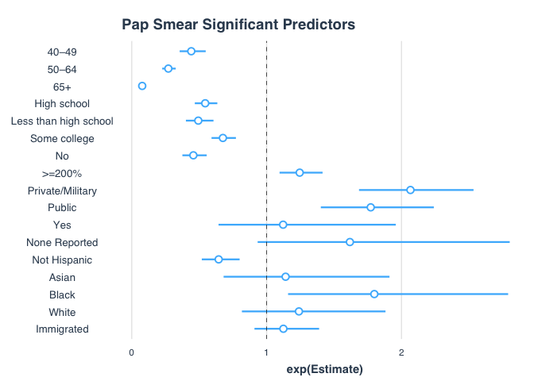

Pap Smear
================
Laura Cosgrove
11/23/2019

``` r
library(tidyverse)
library(survey)
```

# Read data

``` r
#getting pap data from cancer df
pap_dat <- read_csv("./data/cancerxx.csv") %>%
  janitor::clean_names() %>% 
  select(hhx, fmx, fpx, #identifiers
         wtfa_sa, #weights
         strat_p, psu_p, #for design
         region, 
         paphad1, # Ever had Pap smear/Pap test
         papfrst1, #Age when had first Pap test
         pap6yr1, # Number of Pap tests, last 6 years 
         rpap1_m1, #  Month of most recent Pap test 
         rpap1y1, # Year of most recent Pap test 
         rpap1n1, #  Time ago date of most recent Pap test: # of units 
         rpap1t1, # Time ago date of most recent Pap test: Time unit 
         rpap21, #  Most recent Pap test, time categories 
         rpap3a1, # Most recent Pap test, time categories (using 2005 method) 
         rpap3b1, #  Most recent Pap test, time categories (using 2000 method) 
         hpvhrd, #  Ever heard of HPV 
         hpvpap, #  Had HPV test with Pap test 
         paprea2, #  Main reason had Pap/Pap or HPV 
         papabn3, # Pap test results in last 3 years 
         papnot2, #  Most important reason never had Pap or HPV test 
         mdrecp1, #  Doctor recommended Pap test 
         paphpvpy) #Paid for Pap or HPV test out of pocket 
```

    ## Warning: 227 parsing failures.
    ##  row      col           expected actual                  file
    ## 5956 FN_AGE10 1/0/T/F/TRUE/FALSE      9 './data/cancerxx.csv'
    ## 5956 FN_AGE12 1/0/T/F/TRUE/FALSE      9 './data/cancerxx.csv'
    ## 5956 FN_AGE14 1/0/T/F/TRUE/FALSE      9 './data/cancerxx.csv'
    ## 5956 FN_AGE15 1/0/T/F/TRUE/FALSE      9 './data/cancerxx.csv'
    ## 5956 FN_AGE25 1/0/T/F/TRUE/FALSE      9 './data/cancerxx.csv'
    ## .... ........ .................. ...... .....................
    ## See problems(...) for more details.

``` r
## getting covariates
fam_dat <- read_csv("./data/familyxx/familyxx.csv") %>%
    janitor::clean_names() %>% 
  select(hhx, fmx,  #identifiers
         rat_cat4, rat_cat5) # Ratio of family income to the poverty threshold (not sure the difference)

pers_dat <- read_csv("./data/personsx/personsx.csv") %>%
   janitor::clean_names() %>% 
  select(hhx, fmx, fpx, #identifiers
         age_p, #age
         educ1, #education
         sex, #gender
         notcov, cover, cover65, cover65o,  #coverage > 65, 65+, alternate 65+
         la1ar, #limitation
         lcondrt, #limitation is chronic
         lachronr, #chronic limitation
         hiscodi3, #ethnicity recode,
         racreci3, yrsinus, plborn)#race recode
```

    ## Warning: 2523 parsing failures.
    ##  row      col           expected actual                           file
    ## 1265 LCTIME5  1/0/T/F/TRUE/FALSE     96 './data/personsx/personsx.csv'
    ## 1265 LCUNIT5  1/0/T/F/TRUE/FALSE     6  './data/personsx/personsx.csv'
    ## 1265 LCDURA5  1/0/T/F/TRUE/FALSE     10 './data/personsx/personsx.csv'
    ## 1265 LCDURB5  1/0/T/F/TRUE/FALSE     4  './data/personsx/personsx.csv'
    ## 1422 LAUNIT31 1/0/T/F/TRUE/FALSE     4  './data/personsx/personsx.csv'
    ## .... ........ .................. ...... ..............................
    ## See problems(...) for more details.

``` r
adult_dat <- read_csv("./data/samadult/samadult.csv") %>%
   janitor::clean_names() %>% 
  select(hhx, fmx, fpx, #identifiers
    ausualpl, ahcplrou, ahcplknd, #Usual source of care - different options
    fla1ar) #functional limitation
```

    ## Warning: 650 parsing failures.
    ##  row      col           expected actual                           file
    ## 1056 ALTIME34 1/0/T/F/TRUE/FALSE     6  './data/samadult/samadult.csv'
    ## 1056 ALUNIT34 1/0/T/F/TRUE/FALSE     3  './data/samadult/samadult.csv'
    ## 1056 ALDURB34 1/0/T/F/TRUE/FALSE     3  './data/samadult/samadult.csv'
    ## 1056 ALCHRC34 1/0/T/F/TRUE/FALSE     2  './data/samadult/samadult.csv'
    ## 1101 CANAGE24 1/0/T/F/TRUE/FALSE     35 './data/samadult/samadult.csv'
    ## .... ........ .................. ...... ..............................
    ## See problems(...) for more details.

# Data Manipulation / Creating Covariates

``` r
pap_dat <- pap_dat %>% 
  left_join(adult_dat, by = c("hhx", "fmx", "fpx")) %>% 
  left_join(pers_dat, by = c("hhx", "fmx", "fpx")) %>% 
  left_join(fam_dat, by = c("hhx", "fmx"))

##outcome##
#disregarding clustered structure: looking for 3 or less as recommended
pap_dat %>% 
  count(rpap21)
```

    ## # A tibble: 9 x 2
    ##   rpap21     n
    ##    <dbl> <int>
    ## 1      1   521
    ## 2      2  1113
    ## 3      3  1233
    ## 4      4   931
    ## 5      5  2960
    ## 6      7    54
    ## 7      8    11
    ## 8      9   141
    ## 9     NA 26708

``` r
pap_dat %>% 
  count(rpap3b1) #choose 2000 method of q for best comparison (also less NA)
```

    ## # A tibble: 9 x 2
    ##   rpap3b1     n
    ##     <dbl> <int>
    ## 1       1  7169
    ## 2       2  3087
    ## 3       3  1303
    ## 4       4  1094
    ## 5       5  3203
    ## 6       7    54
    ## 7       8    18
    ## 8       9   129
    ## 9      NA 17615

``` r
pap_dat <- pap_dat %>% 
  mutate(paprec_3bcat = if_else(rpap3b1 <= 3, 1, 0))

##covariates##
pap_dat %>% 
  ggplot() +
  geom_histogram(aes(x = age_p, weight = wtfa_sa), bins = 10)
```

<!-- -->

``` r
pap_dat <- pap_dat %>% 
  mutate(age_cat = case_when(age_p >= 25 & age_p < 40 ~ "25–39",
                              age_p >= 40 & age_p < 50 ~ "40–49",
                              age_p >= 50 & age_p < 65 ~ "50–64",
                              age_p >= 65 ~ "65+"))

pap_dat %>% 
  count(educ1)
```

    ## # A tibble: 24 x 2
    ##    educ1     n
    ##    <dbl> <int>
    ##  1     0   134
    ##  2     1    27
    ##  3     2    76
    ##  4     3   111
    ##  5     4   110
    ##  6     5   133
    ##  7     6   493
    ##  8     7   203
    ##  9     8   527
    ## 10     9   624
    ## # … with 14 more rows

``` r
# Less than high school: < 13
# High school graduate: 13 or 14
# Some college or AA degree 15, 16, 17
# College graduate (BA/BS) 18, 19, 20, 21

pap_dat <- pap_dat %>% 
  mutate(educ_cat = case_when(educ1 < 13 ~ "Less than high school",
                              educ1 >= 13 & educ1 < 15 ~ "High school",
                              educ1 >= 15 & educ1 < 18 ~ "Some college",
                              educ1 >= 18 & educ1 <= 21 ~ "College graduate"))

# Family income/poverty ratio   
# <200% 
# 200–299%
# 300–399%      
# 400–499%  
# ≥500%

# 01 Under 0.50 1718 4.06
# 02 0.50 - 0.74 1566 3.70
# 03 0.75 - 0.99 1953 4.62
# 04 1.00 - 1.24 1852 4.38
# 05 1.25 - 1.49 1657 3.92
# 06 1.50 - 1.74 1658 3.92
# 07 1.75 - 1.99 1500 3.55
# 08 2.00 - 2.49 3145 7.44
# 09 2.50 - 2.99 2504 5.92
# 10 3.00 - 3.49 2339 5.53
# 11 3.50 - 3.99 1746 4.13
# 12 4.00 - 4.49 1834 4.34
# 13 4.50 - 4.99 1316 3.11
# 14 5.00 and over 8318 19.67
# 15 Less than 1.00 (no further detail) 845 2.00
# 16 1.00 - 1.99 (no further detail) 1381 3.27
# 17 2.00 and over (no further detail) 3615 8.55
# 96 Undefinable 548 1.30
# 99 Unknown 2793 6.60 

pap_dat %>% count(rat_cat5)
```

    ## # A tibble: 20 x 2
    ##    rat_cat5     n
    ##       <dbl> <int>
    ##  1        1  1471
    ##  2        2  1302
    ##  3        3  1690
    ##  4        4  1585
    ##  5        5  1402
    ##  6        6  1388
    ##  7        7  1267
    ##  8        8  2637
    ##  9        9  2072
    ## 10       10  1995
    ## 11       11  1445
    ## 12       12  1517
    ## 13       13  1094
    ## 14       14  6988
    ## 15       15   606
    ## 16       16   973
    ## 17       17   911
    ## 18       18  1097
    ## 19       96   892
    ## 20       99  1340

``` r
pap_dat <- pap_dat %>% 
  mutate(finc_cat = case_when(rat_cat5 <= 7 |  rat_cat5 %in% c(15, 16) ~ "<200%",
                              rat_cat5 %in% c(8, 9) ~ "200–299%", 
                              rat_cat5 %in% c(10, 11) ~ "300–399%",
                              rat_cat5 >= 18 & educ1 <= 21 ~ "400–499%",
                              rat_cat5 == 14  ~">=500%",
                              rat_cat5 == 17  ~">=200%, no further detail",
                              rat_cat5 %in% c(96, 99) ~ "Unknown")) %>% 
  mutate(finc_cat = factor(finc_cat, levels = c("<200%", "200–299%", "300–399%", "400–499%", ">=500%", 
                                                ">=200%, no further detail", "Unknown")))

#usually go when sick
# 1 Yes 28445 84.48
# 2 There is NO place 4506 13.38
# 3 There is MORE THAN ONE place 454 1.35
# 7 Refused 7 0.02
# 8 Not ascertained 255 0.76
# 9 Don't know 5 0.01
pap_dat <- pap_dat %>% 
  mutate(ausualpl_cat  = case_when(ausualpl == 2 ~ "No",
                                 ausualpl %in% c(1, 3) ~ "Yes",
                                 ausualpl %in% c(7, 8, 9) ~ "Other"))

# Health insurance
# None
# Public
# Private/military
# NOTCOV Frequency Percent
# ------------------------------------------
# 1 Not covered 10506 10.12
# 2 Covered 92181 88.82
# 7 Refused 0 0.00
# 8 Not ascertained 0 0.00
# 9 Don't know 1102 1.06 
# cover
# 1 Private 53793 60.81
# 2 Medicaid and other public 19851 22.44
# 3 Other coverage 3413 3.86
# 4 Uninsured 10381 11.73
# 5 Don't know 1030 1.16 
# COVER65 Frequency Percent
# ---------------------------------------------------------------------
# 1 Private 6430 41.97
# 2 Dual eligible 1197 7.81
# 3 Medicare Advantage 3295 21.51
# 4 Medicare only excluding Medicare Advantage 2893 18.88
# 5 Other coverage 1290 8.42
# 6 Uninsured 125 0.82
# 7 Don't know 91 0.59 

pap_dat %>% count(cover)
```

    ## # A tibble: 6 x 2
    ##   cover     n
    ##   <dbl> <int>
    ## 1     1 16544
    ## 2     2  3763
    ## 3     3  1337
    ## 4     4  3514
    ## 5     5   136
    ## 6    NA  8378

``` r
pap_dat %>% count(!is.na(cover65))
```

    ## # A tibble: 2 x 2
    ##   `!is.na(cover65)`     n
    ##   <lgl>             <int>
    ## 1 FALSE             25294
    ## 2 TRUE               8378

``` r
pap_dat %>% count(cover65o)
```

    ## # A tibble: 7 x 2
    ##   cover65o     n
    ##      <dbl> <int>
    ## 1        1  4025
    ## 2        2   730
    ## 3        3  2819
    ## 4        4   732
    ## 5        5    53
    ## 6        6    19
    ## 7       NA 25294

``` r
pap_dat <- pap_dat %>% 
  mutate(cover_cat  = case_when(notcov == 1 | cover == 4 | cover65 == 6 ~ "None",
                                cover == 2 | cover65 %in% 2:4 ~ "Public",
                                cover %in% c(1, 3) | cover65 %in% c(1, 5) ~ "Private/Military"))

# Chronic disability
# Yes
# No
# LCONDRT Frequency
# 1 At least one condition causing limitation of activity is chronic 13835
# 2 No condition causing limitation of activity is chronic 199
# 9 Unknown if any condition causing limitation of activity is chronic 269 

pap_dat %>% count(lcondrt)
```

    ## # A tibble: 4 x 2
    ##   lcondrt     n
    ##     <dbl> <int>
    ## 1       1  6331
    ## 2       2    84
    ## 3       9    82
    ## 4      NA 27175

``` r
pap_dat <- pap_dat %>% 
  mutate(lcond_chronic_cat = if_else(lcondrt == 1, "Yes", "No"))


# Race/ethnicity
# hispanic, nonhispanic white, nonhispanic black, nonhispanic asian, nonhispanic alaska native/american indian
pap_dat %>% count(racreci3)
```

    ## # A tibble: 4 x 2
    ##   racreci3     n
    ##      <dbl> <int>
    ## 1        1 26150
    ## 2        2  4842
    ## 3        3  2065
    ## 4        4   615

``` r
pap_dat %>% count(hiscodi3)
```

    ## # A tibble: 5 x 2
    ##   hiscodi3     n
    ##      <dbl> <int>
    ## 1        1  5591
    ## 2        2 21080
    ## 3        3  4612
    ## 4        4  1960
    ## 5        5   429

``` r
# race (white, black, asian, alaska native/american indian)
# RACRECI3 Frequency Percent
# ------------------------------------------------------------------
# 1 White 79077 76.19
# 2 Black 14997 14.45
# 3 Asian 7414 7.14
# 4 All other race groups (See file layout) 2301 2.22
# HHC.200_01.000: Race/ethnicity recode
# HISCODI3 Frequency Percent
# -------------------------------------------------------------
# 1 Hispanic 23318 22.47
# 2 Non-Hispanic White 57953 55.84
# 3 Non-Hispanic Black 14039 13.53
# 4 Non-Hispanic Asian 6965 6.71
# 5 Non-Hispanic All other race groups 1514 1.46 

pap_dat <- pap_dat %>% 
  mutate(race_cat = case_when(racreci3 == 1 ~ "White",
                              racreci3 == 2 ~ "Black",
                              racreci3 == 3 ~ "Asian",
                              racreci3 == 4 ~ "AN/AI"),
         eth_cat = case_when(hiscodi3 == 1 ~ "Hispanic",
                             hiscodi3 == 2 ~ "Non-Hispanic White",
                             hiscodi3 == 3 ~ "Non-Hispanic Black",
                             hiscodi3 == 4 ~ "Non-Hispanic Asian",
                             hiscodi3 == 5 ~ "Non-Hispanic AN/AI"))


pap_dat <- pap_dat %>%
  mutate(imm_stat = case_when(yrsinus < 4 ~ "In U.S. < 10 yrs",
                              yrsinus == 4 | yrsinus == 5 ~ "In U.S. >= 10 yrs",
                              plborn == 1 ~ "Born in U.S."))


#create indicator inclusion criteria variable
##filter age less than 25 per cancer paper
##filter to only women
pap_dat %>% count(sex)
```

    ## # A tibble: 2 x 2
    ##     sex     n
    ##   <dbl> <int>
    ## 1     1 15071
    ## 2     2 18601

``` r
pap_dat <- pap_dat %>% 
  mutate(inc = if_else(age_p >= 25 & sex == 2, 1, 0))
#create indicator variable and include it in domain analysis 
```

# survey design

``` r
des <- svydesign(ids = ~psu_p, strata = ~strat_p, 
                 weights = ~wtfa_sa, nest = TRUE, data = pap_dat)
pap_dat %>% select(ends_with("cat"))  %>% names()
```

    ## [1] "paprec_3bcat"      "age_cat"           "educ_cat"         
    ## [4] "finc_cat"          "ausualpl_cat"      "cover_cat"        
    ## [7] "lcond_chronic_cat" "race_cat"          "eth_cat"

``` r
pap_dat %>% count(paprec_3bcat) #unwt
```

    ## # A tibble: 3 x 2
    ##   paprec_3bcat     n
    ##          <dbl> <int>
    ## 1            0  4498
    ## 2            1 11559
    ## 3           NA 17615

``` r
svyby(~paprec_3bcat, by = ~inc, svymean, na.rm = TRUE, design = des, vartype = "ci") %>% filter(inc == 1)
```

    ##   inc paprec_3bcat    ci_l      ci_u
    ## 1   1    0.7430262 0.73416 0.7518924

``` r
pap_dat %>% count(paprec_3bcat, inc) %>% drop_na() %>% filter(inc == 1) %>% summarize(n = sum(n))
```

    ## # A tibble: 1 x 1
    ##       n
    ##   <int>
    ## 1 15171

# descriptive stats

``` r
pct_func <- function(outcome = "paprec_3bcat", inclusion = "inc", var1 = "age_cat", var2 = NULL) {
  .outcome = reformulate(outcome)
  .by = reformulate(c(inclusion, var1, var2))
   svyby(.outcome , by = .by, svymean, na.rm = TRUE, design = des, vartype = "ci") 
  
}

##replace this function with an unweighted total 
tot_func <- function(outcome = "paprec_3bcat", inclusion = "inc", var1 = "age_cat", var2 = NULL) {
outcome_sym = rlang::sym(outcome)
inc_sym = rlang::sym(inclusion)
var1_sym = rlang::sym(var1)
var2_sym = ifelse(is.null(var2), rlang::sym(" "), rlang::sym(var2))

if (is.null(var2)) {
  pap_dat %>% 
    count(!!outcome_sym, !!inc_sym, !!var1_sym) %>% drop_na() %>% 
    group_by(!!var1_sym, !!inc_sym) %>% filter(!!inc_sym == 1) %>% 
    summarize(n = sum(n))
} else  {
  pap_dat %>% 
    count(!!outcome_sym, !!inc_sym, !!var2_sym, !!var1_sym) %>% drop_na() %>% 
    group_by(!!var2_sym, !!var1_sym, !!inc_sym) %>% filter(!!inc_sym == 1) %>% 
    summarize(n = sum(n))

}
}

tot_func(var2 = NULL, var1 = "race_cat")
```

    ## # A tibble: 4 x 3
    ## # Groups:   race_cat [4]
    ##   race_cat   inc     n
    ##   <chr>    <dbl> <int>
    ## 1 AN/AI        1   251
    ## 2 Asian        1   773
    ## 3 Black        1  2343
    ## 4 White        1 11804

``` r
pap_by <- pap_dat %>% 
  select(ends_with("cat"), imm_stat, -paprec_3bcat) %>% 
  mutate(ausualpl_cat = fct_explicit_na(ausualpl_cat)) %>% 
  names() %>% 
  tibble(var = .) %>% 
  mutate(pct = map(var, ~pct_func(var1 = .x))) %>% 
  mutate(tot = map(var, ~tot_func(var1 = .x))) %>% 
  mutate(pct_byage = map(var, ~pct_func(var2 = "age_cat", var1 = .x))) %>% 
  mutate(tot_byage = map(var, ~tot_func(var2 = "age_cat", var1 = .x)))
```

    ## Warning: Factor `finc_cat` contains implicit NA, consider using
    ## `forcats::fct_explicit_na`
    
    ## Warning: Factor `finc_cat` contains implicit NA, consider using
    ## `forcats::fct_explicit_na`

``` r
get_comp_tables <- function(tablepct, tabletot, var) {
  tabletot <- tabletot %>% filter(inc == 1) %>% rename_all(~paste0("t_", .x)) 
  tablepct %>% 
  filter(inc == 1) %>% 
  bind_cols(tabletot) %>% 
  mutate_at(vars(paprec_3bcat, ci_l, ci_u), ~round(.x*100, 1)) %>% 
  mutate(pct = paprec_3bcat) %>% 
  mutate(pct_ci = paste0("(", ci_l, ", ", ci_u, ")")) %>% 
  mutate(tot = t_n) %>% 
  select(var, tot, pct, pct_ci) %>% 
  rename(levels = var) %>% 
  as_tibble()
}

pap_by <- pap_by %>% 
  mutate(comp_tbl = pmap(list(x = pct, y = tot, z = var), function(x, y, z) 
    {get_comp_tables(tablepct = x, tabletot = y, var =  z)} ))

pap_sel <- pap_by %>% 
  select(var, comp_tbl) %>% 
  unnest_wider(comp_tbl) %>% 
  unnest(-var)
  
pap_sel %>% 
  dplyr::select(var, levels, tot, pct, pct_ci) %>% 
  filter(!levels %in% c("Unknown", "Other")) %>% 
  knitr::kable(names = c("Variable", "Levels", "Total", "Percent"))
```

| var                 | levels                     |   tot |  pct | pct\_ci      |
| :------------------ | :------------------------- | ----: | ---: | :----------- |
| age\_cat            | 25–39                      |  3980 | 91.2 | (90.1, 92.3) |
| age\_cat            | 40–49                      |  2551 | 83.6 | (81.7, 85.5) |
| age\_cat            | 50–64                      |  4256 | 75.7 | (74.1, 77.4) |
| age\_cat            | 65+                        |  4384 | 45.1 | (43, 47.3)   |
| educ\_cat           | College graduate           |  4703 | 83.9 | (82.7, 85.1) |
| educ\_cat           | High school                |  3616 | 65.4 | (63.3, 67.6) |
| educ\_cat           | Less than high school      |  1991 | 62.4 | (59.5, 65.4) |
| educ\_cat           | Some college               |  4798 | 74.8 | (73.2, 76.3) |
| finc\_cat           | \<200%                     |  5459 | 68.1 | (66.4, 69.9) |
| finc\_cat           | 200–299%                   |  2059 | 72.1 | (69.5, 74.6) |
| finc\_cat           | 300–399%                   |  1559 | 76.4 | (73.6, 79.3) |
| finc\_cat           | 400–499%                   |  1443 | 70.0 | (66.9, 73)   |
| finc\_cat           | \>=500%                    |  3109 | 83.0 | (81.2, 84.7) |
| finc\_cat           | \>=200%, no further detail |   407 | 66.1 | (59.5, 72.6) |
| ausualpl\_cat       | No                         |  1240 | 68.6 | (65.3, 71.8) |
| ausualpl\_cat       | Yes                        | 13928 | 74.8 | (73.9, 75.8) |
| cover\_cat          | None                       |  1253 | 69.6 | (66.4, 72.8) |
| cover\_cat          | Private/Military           |  9884 | 79.3 | (78.3, 80.3) |
| cover\_cat          | Public                     |  3983 | 60.2 | (57.9, 62.5) |
| lcond\_chronic\_cat | No                         |    74 | 58.5 | (44.1, 72.9) |
| lcond\_chronic\_cat | Yes                        |  3220 | 56.6 | (54.1, 59.2) |
| race\_cat           | AN/AI                      |   251 | 70.5 | (63.2, 77.8) |
| race\_cat           | Asian                      |   773 | 80.3 | (76.7, 83.9) |
| race\_cat           | Black                      |  2343 | 79.2 | (77.1, 81.2) |
| race\_cat           | White                      | 11804 | 73.2 | (72.2, 74.1) |
| eth\_cat            | Hispanic                   |  2372 | 80.1 | (78, 82.3)   |
| eth\_cat            | Non-Hispanic AN/AI         |   171 | 71.6 | (62.3, 81)   |
| eth\_cat            | Non-Hispanic Asian         |   734 | 80.1 | (76.4, 83.8) |
| eth\_cat            | Non-Hispanic Black         |  2223 | 78.9 | (76.8, 81)   |
| eth\_cat            | Non-Hispanic White         |  9671 | 71.9 | (70.8, 73)   |
| imm\_stat           | Born in U.S.               | 12532 | 73.4 | (72.5, 74.4) |
| imm\_stat           | In U.S. \< 10 yrs          |   366 | 82.2 | (77.2, 87.2) |
| imm\_stat           | In U.S. \>= 10 yrs         |  2246 | 77.8 | (75.4, 80.1) |

``` r
get_by_tables <- function(tablepct, tabletot, var) {
  tabletot <- tabletot %>% filter(inc == 1) %>% rename_all(~paste0("t_", .x)) 
  tablepct %>% 
  filter(inc == 1) %>% 
  bind_cols(tabletot) %>% 
  mutate_at(vars(paprec_3bcat, ci_l, ci_u), ~round(.x*100, 1)) %>% 
  mutate(pct = paste0(paprec_3bcat, " (", ci_l, ", ", ci_u, ")")) %>% 
  mutate(tot = t_n) %>% 
  select(age_cat, var, pct, tot) %>% 
  rename(levels = var) %>% 
  as_tibble()
}

new_ausualpl_tot <- (pap_by %>% 
    filter(var == "ausualpl_cat") %>% 
  pull(tot_byage))[[1]] %>% ungroup() %>% 
  add_case(age_cat = "65+", ausualpl_cat = "Other", inc = 1, n = 0)

pap_strat <- pap_by %>% 
  dplyr::select(var, pct_byage, tot_byage) %>% 
  mutate(tot_byage = if_else(var == "ausualpl_cat", list(new_ausualpl_tot), tot_byage)) %>% 
  mutate(comp_tbl = pmap(list(x = pct_byage, y = tot_byage, z = var), function(x, y, z) 
    {get_by_tables(tablepct = x, tabletot = y, var =  z)} )) %>% 
  dplyr::select(var, comp_tbl) %>% unnest() 
```

    ## Warning: `cols` is now required.
    ## Please use `cols = c(comp_tbl)`

``` r
pap_strat %>% 
  filter(var != "age_cat") %>% 
  rename(n = tot) %>% 
  pivot_wider(names_from = age_cat, values_from = c(n, pct), names_prefix = "Age_", names_sep = "_") %>% 
  select(var, levels, ends_with("39"), ends_with("49"), ends_with("64"), ends_with("+")) %>%
  knitr::kable()
```

| var                 | levels                     | n\_Age\_25–39 | pct\_Age\_25–39    | n\_Age\_40–49 | pct\_Age\_40–49    | n\_Age\_50–64 | pct\_Age\_50–64   | n\_Age\_65+ | pct\_Age\_65+     |
| :------------------ | :------------------------- | ------------: | :----------------- | ------------: | :----------------- | ------------: | :---------------- | ----------: | :---------------- |
| educ\_cat           | College graduate           |          1492 | 94.7 (93.2, 96.3)  |           931 | 91.4 (89.1, 93.7)  |          1307 | 82.6 (80.1, 85.1) |         973 | 54.3 (50.3, 58.3) |
| educ\_cat           | High school                |           719 | 85.4 (82.1, 88.7)  |           511 | 75.3 (70.5, 80.1)  |          1034 | 71.5 (67.7, 75.3) |        1352 | 41.5 (37.6, 45.4) |
| educ\_cat           | Less than high school      |           448 | 86.5 (82.7, 90.4)  |           298 | 71.2 (63.6, 78.7)  |           484 | 66.1 (60, 72.1)   |         761 | 37.3 (32, 42.6)   |
| educ\_cat           | Some college               |          1314 | 91 (88.9, 93.2)    |           802 | 83.1 (79.3, 86.9)  |          1417 | 74.8 (71.7, 77.8) |        1265 | 46.2 (42, 50.4)   |
| finc\_cat           | \<200%                     |          1663 | 87.7 (85.8, 89.6)  |           832 | 77.5 (73.3, 81.8)  |          1324 | 65.4 (61.6, 69.1) |        1640 | 37.6 (34.1, 41.1) |
| finc\_cat           | 200–299%                   |           587 | 88.1 (84.9, 91.3)  |           349 | 81.1 (75.1, 87.2)  |           494 | 75 (69.8, 80.2)   |         629 | 42.9 (37.7, 48.1) |
| finc\_cat           | 300–399%                   |           442 | 92.4 (89.5, 95.3)  |           289 | 81.9 (75.8, 88)    |           406 | 74.8 (68.7, 80.9) |         422 | 51.3 (44.3, 58.3) |
| finc\_cat           | 400–499%                   |           193 | 93.4 (89.7, 97.2)  |           186 | 84.7 (78.2, 91.3)  |           457 | 77.2 (72.2, 82.3) |         607 | 44.6 (39.7, 49.4) |
| finc\_cat           | \>=500%                    |           722 | 95.5 (93.6, 97.4)  |           623 | 91.7 (88.9, 94.5)  |          1137 | 82.1 (79.3, 84.9) |         627 | 56 (51.2, 60.9)   |
| finc\_cat           | \>=200%, no further detail |            63 | 90.9 (80.6, 101.2) |            51 | 75.6 (59.8, 91.4)  |           102 | 73.7 (60.9, 86.6) |         191 | 45.6 (35.7, 55.4) |
| finc\_cat           | Unknown                    |             3 | 100 (100, 100)     |             1 | 100 (100, 100)     |             5 | 100 (100, 100)    |          10 | 11 (-8.3, 30.3)   |
| ausualpl\_cat       | No                         |           593 | 85.2 (81.7, 88.6)  |           259 | 64.4 (55.9, 72.9)  |           266 | 47.1 (39, 55.3)   |         122 | 25.9 (15.5, 36.3) |
| ausualpl\_cat       | Other                      |             1 | 100 (100, 100)     |             1 | 0 (0, 0)           |             1 | 0 (0, 0)          |        4262 | 0 (0, 0)          |
| ausualpl\_cat       | Yes                        |          3386 | 92.3 (91, 93.5)    |          2291 | 85.5 (83.6, 87.4)  |          3989 | 77.5 (75.8, 79.1) |           0 | 45.6 (43.5, 47.8) |
| cover\_cat          | None                       |           584 | 82.8 (79.1, 86.6)  |           309 | 59.2 (51.8, 66.6)  |           341 | 57.6 (50.4, 64.8) |          19 | 38.6 (10.1, 67)   |
| cover\_cat          | Private/Military           |          2542 | 93.2 (92, 94.4)    |          1828 | 87.9 (86, 89.9)    |          3282 | 78.7 (77, 80.3)   |        2232 | 47.3 (44.4, 50.1) |
| cover\_cat          | Public                     |           836 | 89.7 (87.2, 92.2)  |           406 | 78.4 (72.7, 84.1)  |           617 | 65.1 (59.3, 70.8) |        2124 | 43.1 (39.9, 46.2) |
| lcond\_chronic\_cat | No                         |            15 | 90.6 (76.2, 105)   |            10 | 87.3 (67.2, 107.4) |            17 | 84.9 (64.8, 105)  |          32 | 18.4 (3.6, 33.1)  |
| lcond\_chronic\_cat | Yes                        |           285 | 88.2 (83, 93.4)    |           322 | 73.7 (66.6, 80.7)  |          1025 | 68.7 (64.7, 72.8) |        1588 | 36.4 (33.2, 39.6) |
| race\_cat           | AN/AI                      |            89 | 84.1 (74.3, 94)    |            47 | 82.9 (70.3, 95.4)  |            74 | 63.4 (47.5, 79.4) |          41 | 35.1 (12.5, 57.6) |
| race\_cat           | Asian                      |           256 | 89.2 (84.9, 93.6)  |           161 | 87.9 (81.7, 94.1)  |           200 | 79.5 (72.4, 86.6) |         156 | 47.5 (38.6, 56.4) |
| race\_cat           | Black                      |           689 | 92.8 (90.4, 95.1)  |           406 | 87.6 (83.6, 91.5)  |           680 | 78.4 (74, 82.7)   |         568 | 45.9 (40.5, 51.4) |
| race\_cat           | White                      |          2946 | 91.2 (89.9, 92.5)  |          1937 | 82.5 (80.4, 84.7)  |          3302 | 75.3 (73.4, 77.1) |        3619 | 45 (42.7, 47.4)   |
| eth\_cat            | Hispanic                   |           902 | 89.2 (87, 91.4)    |           515 | 84.7 (80.6, 88.8)  |           521 | 78.3 (73.2, 83.5) |         434 | 49.7 (42.5, 56.9) |
| eth\_cat            | Non-Hispanic AN/AI         |            57 | 85.5 (74, 97)      |            31 | 83 (66.9, 99)      |            52 | 68.9 (49.3, 88.5) |          31 | 35.6 (8.8, 62.5)  |
| eth\_cat            | Non-Hispanic Asian         |           241 | 89 (84.4, 93.5)    |           149 | 88.7 (82.5, 94.9)  |           192 | 79 (71.8, 86.2)   |         152 | 47.8 (38.9, 56.8) |
| eth\_cat            | Non-Hispanic Black         |           634 | 92.8 (90.3, 95.2)  |           376 | 87.9 (84.1, 91.8)  |           657 | 78.7 (74.5, 82.9) |         556 | 45.5 (40.1, 51)   |
| eth\_cat            | Non-Hispanic White         |          2146 | 91.8 (90.3, 93.3)  |          1480 | 81.9 (79.3, 84.5)  |          2834 | 74.7 (72.7, 76.6) |        3211 | 44.6 (42.1, 47)   |
| imm\_stat           | Born in U.S.               |          3153 | 92 (90.7, 93.2)    |          1951 | 83.5 (81.4, 85.6)  |          3620 | 74.9 (73.1, 76.7) |        3808 | 44.6 (42.3, 46.9) |
| imm\_stat           | In U.S. \< 10 yrs          |           221 | 86.6 (80.9, 92.3)  |            79 | 77.1 (64.4, 89.7)  |            40 | 81.8 (68.7, 94.8) |          26 | 52.6 (29.5, 75.8) |
| imm\_stat           | In U.S. \>= 10 yrs         |           598 | 88.8 (85.9, 91.8)  |           514 | 85.2 (80.9, 89.4)  |           590 | 80.3 (76.4, 84.3) |         544 | 48.8 (42.8, 54.7) |

# plot

``` r
p1 <- pap_by %>% 
  filter(var == "ausualpl_cat") %>% 
  select(var, pct_byage) %>% 
  unnest(pct_byage) %>% 
  filter(inc == 1) %>% 
  filter(!ausualpl_cat %in% c("Unknown", "Other")) %>% 
  ggplot(aes(x = ausualpl_cat, y = 100*paprec_3bcat, fill = ausualpl_cat)) +
  geom_col() +
  geom_errorbar(aes(ymin = 100*ci_l, ymax = 100*ci_u)) +  ylim(0, 100) + coord_flip() +
  facet_grid(~age_cat) + ggthemes::theme_few() + ggthemes::scale_fill_few() + theme(legend.position = "none") + 
  labs(y = "", x = "Usual Source of Care")
```

``` r
p2 <- pap_by %>% 
  filter(var == "cover_cat") %>% 
  select(var, pct_byage) %>% 
  unnest(pct_byage) %>% 
  filter(inc == 1) %>% 
  filter(!cover_cat %in% c("Unknown", "Other")) %>% 
  ggplot(aes(x = cover_cat, y = 100*paprec_3bcat, fill = cover_cat)) +
  geom_col() +
  geom_errorbar(aes(ymin = 100*ci_l, ymax = 100*ci_u)) +
  facet_grid(~age_cat) + 
  ggthemes::theme_few() + ggthemes::scale_fill_few() + theme(legend.position = "none") + ylim(0, 100) + coord_flip() +
  labs(y = "", x = "Insurance Coverage")
```

``` r
p3 <- pap_by %>% 
  filter(var == "educ_cat") %>% 
  select(var, pct_byage) %>% 
  unnest(pct_byage) %>% 
  filter(inc == 1) %>% 
  ggplot(aes(x = educ_cat, y = 100*paprec_3bcat, fill = educ_cat)) +
  geom_col() +
  geom_errorbar(aes(ymin = 100*ci_l, ymax = 100*ci_u)) +
  facet_grid(~age_cat) + 
  ggthemes::theme_few() + ggthemes::scale_fill_few() + theme(legend.position = "none") + ylim(0, 100) +
  coord_flip() + 
  labs(y = "Percent Had Pap Smear, Last 3 years", x = "Education")
```

``` r
p4 <- pap_by %>% 
  filter(var == "imm_stat") %>% 
  select(var, pct_byage) %>% 
  unnest(pct_byage) %>% 
  filter(inc == 1) %>% 
  ggplot(aes(x = imm_stat, y = 100*paprec_3bcat, fill = imm_stat)) +
  geom_col() +
  geom_errorbar(aes(ymin = 100*ci_l, ymax = 100*ci_u)) +
  facet_grid(~age_cat) + 
  ggthemes::theme_few() + ggthemes::scale_fill_few() + theme(legend.position = "none") + ylim(0, 100) +
  coord_flip() + 
  labs(y = "Percent Had Pap Smear, Last 3 years", x = "Immigration Status")
```

``` r
library(patchwork)
p1 / p2 / p3 
```

<!-- -->

# models

``` r
pap_formod <- pap_dat %>% 
  select(psu_p, strat_p, wtfa_sa, ends_with("cat"), imm_stat, hpvhrd, paphad1, mdrecp1, inc) %>% 
  mutate(imm_stat = if_else(imm_stat == "Born in U.S.", "Born in U.S.", "Immigrated")) %>% 
  mutate(lcond_chronic_cat = forcats::fct_explicit_na(lcond_chronic_cat, "None Reported")) %>% 
  mutate(finc_cat = case_when(finc_cat == "<200%" ~ "<200%",
                              finc_cat == "Unknown" ~ "Unkwown", 
                              TRUE ~ ">=200%"))

pap_formod <- pap_formod %>% 
  mutate_at(vars(hpvhrd, paphad1, mdrecp1), ~factor(.x)) %>% 
  mutate(ausualpl_cat = factor(ausualpl_cat, levels = c("Yes", "No"))) %>% 
  mutate(eth_cat = if_else(eth_cat == "Hispanic", "Hispanic", "Not Hispanic"))

pap_formod %>% ggplot(aes(x = paprec_3bcat)) + geom_histogram() + facet_grid(~inc)
```

    ## `stat_bin()` using `bins = 30`. Pick better value with `binwidth`.

    ## Warning: Removed 17615 rows containing non-finite values (stat_bin).

<!-- -->

``` r
vars = pap_dat %>% select(ends_with("cat"), imm_stat, inc) %>% select(-paprec_3bcat) %>% names()
vars = vars[1:9]
varssym = map(vars, ~sym(.x))

.form = reformulate(response = "paprec_3bcat", termlabels = c(vars) )

map(.x = varssym, ~count(pap_formod %>% filter(inc == 1) %>% filter(!is.na(paprec_3bcat)), !!.x))
```

    ## Warning: Factor `ausualpl_cat` contains implicit NA, consider using
    ## `forcats::fct_explicit_na`

    ## [[1]]
    ## # A tibble: 4 x 2
    ##   age_cat     n
    ##   <chr>   <int>
    ## 1 25–39    3980
    ## 2 40–49    2551
    ## 3 50–64    4256
    ## 4 65+      4384
    ## 
    ## [[2]]
    ## # A tibble: 5 x 2
    ##   educ_cat                  n
    ##   <chr>                 <int>
    ## 1 College graduate       4703
    ## 2 High school            3616
    ## 3 Less than high school  1991
    ## 4 Some college           4798
    ## 5 <NA>                     63
    ## 
    ## [[3]]
    ## # A tibble: 3 x 2
    ##   finc_cat     n
    ##   <chr>    <int>
    ## 1 <200%     5459
    ## 2 >=200%    9693
    ## 3 Unkwown     19
    ## 
    ## [[4]]
    ## # A tibble: 3 x 2
    ##   ausualpl_cat     n
    ##   <fct>        <int>
    ## 1 Yes          13928
    ## 2 No            1240
    ## 3 <NA>             3
    ## 
    ## [[5]]
    ## # A tibble: 4 x 2
    ##   cover_cat            n
    ##   <chr>            <int>
    ## 1 None              1253
    ## 2 Private/Military  9884
    ## 3 Public            3983
    ## 4 <NA>                51
    ## 
    ## [[6]]
    ## # A tibble: 3 x 2
    ##   lcond_chronic_cat     n
    ##   <fct>             <int>
    ## 1 No                   74
    ## 2 Yes                3220
    ## 3 None Reported     11877
    ## 
    ## [[7]]
    ## # A tibble: 4 x 2
    ##   race_cat     n
    ##   <chr>    <int>
    ## 1 AN/AI      251
    ## 2 Asian      773
    ## 3 Black     2343
    ## 4 White    11804
    ## 
    ## [[8]]
    ## # A tibble: 2 x 2
    ##   eth_cat          n
    ##   <chr>        <int>
    ## 1 Hispanic      2372
    ## 2 Not Hispanic 12799
    ## 
    ## [[9]]
    ## # A tibble: 3 x 2
    ##   imm_stat         n
    ##   <chr>        <int>
    ## 1 Born in U.S. 12532
    ## 2 Immigrated    2612
    ## 3 <NA>            27

``` r
des2 <- svydesign(ids = ~psu_p, strata = ~strat_p, 
                 weights = ~wtfa_sa, nest = TRUE, data = pap_formod)

mod <- svyglm(paprec_3bcat ~ age_cat + educ_cat + 
                     ausualpl_cat + finc_cat + cover_cat + lcond_chronic_cat + 
                     eth_cat + race_cat + imm_stat, design = des2, 
       family = binomial,
       subset = inc == 1) 
```

    ## Warning in eval(family$initialize): non-integer #successes in a binomial
    ## glm!

``` r
jtools::summ(mod, exp = TRUE, confint = TRUE, pvals = FALSE, digits  = 2)
```

<table class="table table-striped table-hover table-condensed table-responsive" style="width: auto !important; margin-left: auto; margin-right: auto;">

<tbody>

<tr>

<td style="text-align:left;font-weight: bold;">

Observations

</td>

<td style="text-align:right;">

15039

</td>

</tr>

<tr>

<td style="text-align:left;font-weight: bold;">

Dependent variable

</td>

<td style="text-align:right;">

paprec\_3bcat

</td>

</tr>

<tr>

<td style="text-align:left;font-weight: bold;">

Type

</td>

<td style="text-align:right;">

Survey-weighted generalized linear
model

</td>

</tr>

<tr>

<td style="text-align:left;font-weight: bold;">

Family

</td>

<td style="text-align:right;">

binomial

</td>

</tr>

<tr>

<td style="text-align:left;font-weight: bold;">

Link

</td>

<td style="text-align:right;">

logit

</td>

</tr>

</tbody>

</table>

<table class="table table-striped table-hover table-condensed table-responsive" style="width: auto !important; margin-left: auto; margin-right: auto;">

<tbody>

<tr>

<td style="text-align:left;font-weight: bold;">

Pseudo-R² (Cragg-Uhler)

</td>

<td style="text-align:right;">

0.06

</td>

</tr>

<tr>

<td style="text-align:left;font-weight: bold;">

Pseudo-R²
(McFadden)

</td>

<td style="text-align:right;">

0.18

</td>

</tr>

<tr>

<td style="text-align:left;font-weight: bold;">

AIC

</td>

<td style="text-align:right;">

13718.37

</td>

</tr>

</tbody>

</table>

<table class="table table-striped table-hover table-condensed table-responsive" style="width: auto !important; margin-left: auto; margin-right: auto;">

<thead>

<tr>

<th style="text-align:left;">

</th>

<th style="text-align:right;">

exp(Est.)

</th>

<th style="text-align:right;">

2.5%

</th>

<th style="text-align:right;">

97.5%

</th>

<th style="text-align:right;">

t val.

</th>

</tr>

</thead>

<tbody>

<tr>

<td style="text-align:left;font-weight: bold;">

(Intercept)

</td>

<td style="text-align:right;">

5.96

</td>

<td style="text-align:right;">

2.87

</td>

<td style="text-align:right;">

12.38

</td>

<td style="text-align:right;">

4.79

</td>

</tr>

<tr>

<td style="text-align:left;font-weight: bold;">

age\_cat40–49

</td>

<td style="text-align:right;">

0.44

</td>

<td style="text-align:right;">

0.36

</td>

<td style="text-align:right;">

0.55

</td>

<td style="text-align:right;">

\-7.38

</td>

</tr>

<tr>

<td style="text-align:left;font-weight: bold;">

age\_cat50–64

</td>

<td style="text-align:right;">

0.27

</td>

<td style="text-align:right;">

0.23

</td>

<td style="text-align:right;">

0.33

</td>

<td style="text-align:right;">

\-13.92

</td>

</tr>

<tr>

<td style="text-align:left;font-weight: bold;">

age\_cat65+

</td>

<td style="text-align:right;">

0.08

</td>

<td style="text-align:right;">

0.06

</td>

<td style="text-align:right;">

0.10

</td>

<td style="text-align:right;">

\-23.76

</td>

</tr>

<tr>

<td style="text-align:left;font-weight: bold;">

educ\_catHigh school

</td>

<td style="text-align:right;">

0.54

</td>

<td style="text-align:right;">

0.47

</td>

<td style="text-align:right;">

0.63

</td>

<td style="text-align:right;">

\-7.80

</td>

</tr>

<tr>

<td style="text-align:left;font-weight: bold;">

educ\_catLess than high school

</td>

<td style="text-align:right;">

0.49

</td>

<td style="text-align:right;">

0.40

</td>

<td style="text-align:right;">

0.61

</td>

<td style="text-align:right;">

\-6.73

</td>

</tr>

<tr>

<td style="text-align:left;font-weight: bold;">

educ\_catSome college

</td>

<td style="text-align:right;">

0.68

</td>

<td style="text-align:right;">

0.59

</td>

<td style="text-align:right;">

0.77

</td>

<td style="text-align:right;">

\-5.76

</td>

</tr>

<tr>

<td style="text-align:left;font-weight: bold;">

ausualpl\_catNo

</td>

<td style="text-align:right;">

0.46

</td>

<td style="text-align:right;">

0.38

</td>

<td style="text-align:right;">

0.56

</td>

<td style="text-align:right;">

\-7.84

</td>

</tr>

<tr>

<td style="text-align:left;font-weight: bold;">

finc\_cat\>=200%

</td>

<td style="text-align:right;">

1.25

</td>

<td style="text-align:right;">

1.10

</td>

<td style="text-align:right;">

1.41

</td>

<td style="text-align:right;">

3.36

</td>

</tr>

<tr>

<td style="text-align:left;font-weight: bold;">

cover\_catPrivate/Military

</td>

<td style="text-align:right;">

2.07

</td>

<td style="text-align:right;">

1.68

</td>

<td style="text-align:right;">

2.53

</td>

<td style="text-align:right;">

6.97

</td>

</tr>

<tr>

<td style="text-align:left;font-weight: bold;">

cover\_catPublic

</td>

<td style="text-align:right;">

1.77

</td>

<td style="text-align:right;">

1.40

</td>

<td style="text-align:right;">

2.24

</td>

<td style="text-align:right;">

4.79

</td>

</tr>

<tr>

<td style="text-align:left;font-weight: bold;">

lcond\_chronic\_catYes

</td>

<td style="text-align:right;">

1.12

</td>

<td style="text-align:right;">

0.64

</td>

<td style="text-align:right;">

1.96

</td>

<td style="text-align:right;">

0.41

</td>

</tr>

<tr>

<td style="text-align:left;font-weight: bold;">

lcond\_chronic\_catNone Reported

</td>

<td style="text-align:right;">

1.62

</td>

<td style="text-align:right;">

0.93

</td>

<td style="text-align:right;">

2.80

</td>

<td style="text-align:right;">

1.71

</td>

</tr>

<tr>

<td style="text-align:left;font-weight: bold;">

eth\_catNot Hispanic

</td>

<td style="text-align:right;">

0.64

</td>

<td style="text-align:right;">

0.52

</td>

<td style="text-align:right;">

0.80

</td>

<td style="text-align:right;">

\-3.99

</td>

</tr>

<tr>

<td style="text-align:left;font-weight: bold;">

race\_catAsian

</td>

<td style="text-align:right;">

1.14

</td>

<td style="text-align:right;">

0.68

</td>

<td style="text-align:right;">

1.91

</td>

<td style="text-align:right;">

0.50

</td>

</tr>

<tr>

<td style="text-align:left;font-weight: bold;">

race\_catBlack

</td>

<td style="text-align:right;">

1.80

</td>

<td style="text-align:right;">

1.16

</td>

<td style="text-align:right;">

2.79

</td>

<td style="text-align:right;">

2.62

</td>

</tr>

<tr>

<td style="text-align:left;font-weight: bold;">

race\_catWhite

</td>

<td style="text-align:right;">

1.24

</td>

<td style="text-align:right;">

0.82

</td>

<td style="text-align:right;">

1.88

</td>

<td style="text-align:right;">

1.01

</td>

</tr>

<tr>

<td style="text-align:left;font-weight: bold;">

imm\_statImmigrated

</td>

<td style="text-align:right;">

1.12

</td>

<td style="text-align:right;">

0.91

</td>

<td style="text-align:right;">

1.39

</td>

<td style="text-align:right;">

1.08

</td>

</tr>

</tbody>

<tfoot>

<tr>

<td style="padding: 0; border: 0;" colspan="100%">

<sup></sup> Standard errors: Robust

</td>

</tr>

</tfoot>

</table>

``` r
# test significance of individual terms/term groups
sig1 = tibble(vars) %>% 
  mutate(test = map(vars, ~regTermTest(mod, .x,  method = "LRT"))) %>% 
  mutate(pval = map_dbl(test, ~.x$p)) %>% 
  arrange(desc(pval)) %>% 
  mutate(sig = if_else(pval > 0.05, 0, 1))
```

    ## Warning in eval(family$initialize): non-integer #successes in a binomial
    ## glm!

    ## Warning in eval(family$initialize): non-integer #successes in a binomial
    ## glm!
    
    ## Warning in eval(family$initialize): non-integer #successes in a binomial
    ## glm!
    
    ## Warning in eval(family$initialize): non-integer #successes in a binomial
    ## glm!
    
    ## Warning in eval(family$initialize): non-integer #successes in a binomial
    ## glm!
    
    ## Warning in eval(family$initialize): non-integer #successes in a binomial
    ## glm!
    
    ## Warning in eval(family$initialize): non-integer #successes in a binomial
    ## glm!
    
    ## Warning in eval(family$initialize): non-integer #successes in a binomial
    ## glm!
    
    ## Warning in eval(family$initialize): non-integer #successes in a binomial
    ## glm!

``` r
sig1
```

    ## # A tibble: 9 x 4
    ##   vars              test           pval   sig
    ##   <chr>             <list>        <dbl> <dbl>
    ## 1 finc_cat          <rgTrTLRT> 9.54e- 4     1
    ## 2 imm_stat          <rgTrTLRT> 4.15e- 4     1
    ## 3 race_cat          <rgTrTLRT> 1.06e- 4     1
    ## 4 eth_cat           <rgTrTLRT> 7.00e- 5     1
    ## 5 lcond_chronic_cat <rgTrTLRT> 3.81e- 7     1
    ## 6 ausualpl_cat      <rgTrTLRT> 4.47e-14     1
    ## 7 cover_cat         <rgTrTLRT> 1.96e-14     1
    ## 8 educ_cat          <rgTrTLRT> 1.31e-18     1
    ## 9 age_cat           <rgTrTLRT> 4.04e-80     1

``` r
# mod2 <- svyglm(paprec_3bcat ~ age_cat + educ_cat + 
#                      ausualpl_cat + finc_cat + cover_cat + lcond_chronic_cat + 
#                      eth_cat + race_cat, design = des2, 
#        family = binomial,
#        subset = inc == 1) 
# 
# jtools::summ(mod2)
# 
# sig2 = tibble(vars) %>% 
#   filter(vars != "imm_stat") %>% 
#   mutate(test = map(vars, ~regTermTest(mod, .x,  method = "LRT"))) %>% 
#   mutate(pval = map_dbl(test, ~.x$p)) %>% 
#   arrange(desc(pval)) %>% 
#   mutate(sig = if_else(pval > 0.05, 0, 1))
# sig2
# 

new_coef <- stringr::str_remove(names(coef(mod)), "^[^_]*_cat")  #make pretty names
new_coef <- stringr::str_remove(new_coef, "^[^_]*_stat")  #make pretty names
new_coef <- stringr::str_remove(new_coef, "^[^_]*_chronic_cat")  #make pretty names
coef <- names(coef(mod)) #assign pretty names
names(coef) <- new_coef #names original coef vector with pretty names
coef <- coef[-1] #remove intercept

jtools::plot_summs(mod, ci_level = 0.95, 
                   coefs = coef,
                   exp = TRUE, robust = TRUE) + labs(title = "Pap Smear Significant Predictors")
```

<!-- -->
